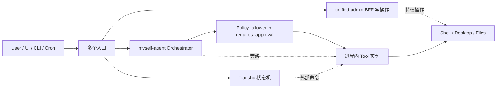
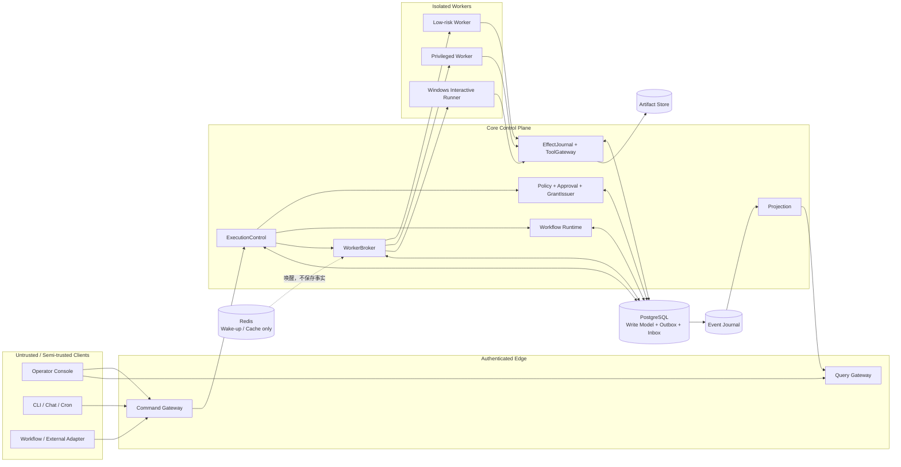
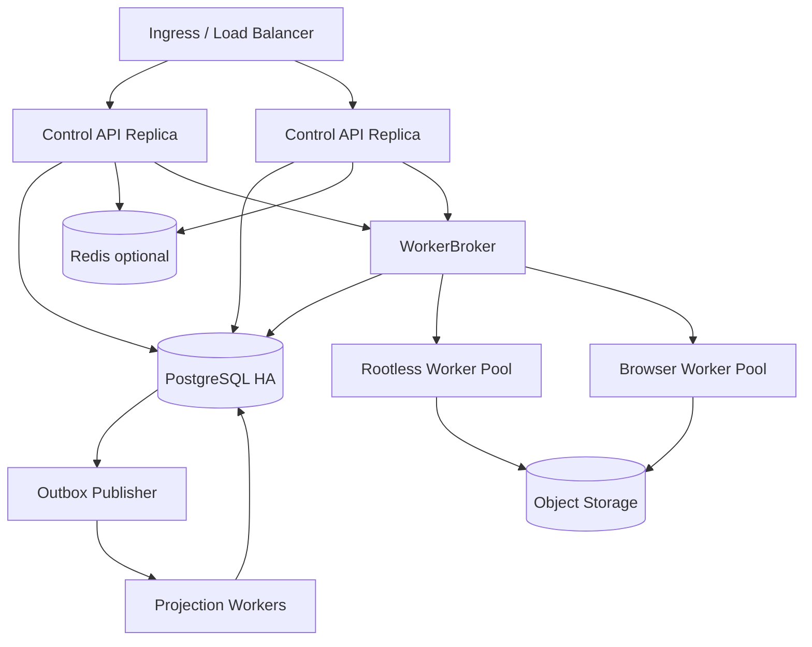
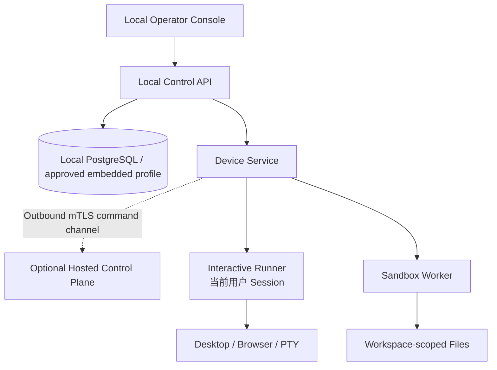

# Agent Control Center 单一控制面设计与实施方案 V3.0

创建日期：2026-07-18  
文档状态：架构评审稿，P0 决策通过后进入实施  
前一版本：`agent-control-center-design-and-fix-plan-v2.md`  
目标：将 `F:\Agents` 下现有 Agent 资产渐进收敛为一个可控、可审计、可恢复、可演进的 Agent Control Center。

## 0. 文档定位与证据边界

本文是 V2 的修订实施方案，不覆盖或修改 V2。它同时承担以下职责：

1. 固定目标架构、Module 所有权、Interface 与安全不变量。
2. 明确 Task、Run、StepRun、Command、Approval 和 Effect 的状态语义。
3. 给出 Enterprise 与 Personal Windows 两套部署 Profile。
4. 把迁移拆成可回滚的垂直切片，并为每一阶段设置退出证据。
5. 区分已观察事实、架构推断和建议设计，避免把设计目标误报为已实现能力。

### 0.1 证据快照

| 证据 | 身份或状态 | 用途 |
|---|---|---|
| V2 文档 | SHA-256 `B59341F4487315B669BA79284E8A7AB4EDD71B220EF318EAEBA3C3B19220269B`，836 行 | 本文的直接输入 |
| `myself-agent` | commit `67848f768ce13c76cb31ab40224373378f5a8d49`，检查时工作区干净 | 核心控制面现状证据 |
| `agent_tianshu` | commit `7c89f075e8158d95a74a0f15a63dc4378cd5dbb3`，检查时工作区干净 | Workflow 原型证据 |
| `more_agents/unified-admin` | commit `1581ea45977f897b94a9200ae52490b5a3f6ebd9`，检查时有 71 个变更路径 | UI 候选证据，存在显著 source drift |
| `F:\Agents` 其他目录 | 本地快照，未建立统一不可变版本身份 | 只用于当前设计判断 |

本方案没有声称任何 P0 缺陷已修复。性能、容量、RTO/RPO 数值均为设计初始目标，必须在 Phase 0 由产品、架构和运维共同确认，并在后续阶段通过测量校准。

我检查了 V2 的关键承诺以及当前代码中的任务、Policy、执行、审批和前端路径。最影响本方案取舍的事实是：控制权目前分散在多个调用方，而外部副作用的失败结果又不能仅靠幂等键推断。我们因此需要先收紧所有权和失败语义，再讨论大规模功能整合。

### 0.2 已观察到的关键事实

| 编号 | 已观察事实 | 当前影响 |
|---|---|---|
| E-01 | `myself-agent/packages/policy/policy_engine.py:117-128` 在判定需要审批时仍签发 Capability Token | 审批不能阻止执行 |
| E-02 | `myself-agent/packages/executor/executor_service.py:243-265` 未等待审批即执行工具 | 高风险工具存在审批绕过 |
| E-03 | `myself-agent/apps/api_server/routes/tasks.py:115-129` 正常执行路径使用未定义的 `task` | Task 执行入口可失败 |
| E-04 | CLI、SubAgent、Desktop route 存在直接调用 Tool 实例的路径 | Policy 和审计无法形成唯一控制点 |
| E-05 | 当前对象级租户过滤不完整，部分身份字段可由请求体提供 | 存在跨租户和身份伪造风险 |
| E-06 | Cron 未完整接入生产启动，调度状态依赖进程 | 重启后任务可能丢失或重复 |
| E-07 | 插件通过主进程动态加载，Manifest permissions 不是强制执行边界 | 恶意插件可继承宿主权限 |
| E-08 | `unified-admin/server/index.js` 超过 4,400 行，缺少有效测试脚本且工作区漂移较大 | 直接指定唯一前端的迁移风险高 |

## 1. 执行决策

### 1.1 推荐路线

在当前代码规模、迁移风险和缺少生产容量基线的约束下，我建议采用 **渐进式收敛到模块化控制面**：

> 先在 `myself-agent` 修复现有 P0，再用一个低风险工具和一个高风险工具完成持久命令、真实审批、Capability Grant、Worker Lease、EffectJournal、Projection 与最小审批 UI 的端到端切片；切片通过故障注入后，再逐步迁移其他入口、Workflow、特权能力和前端。

第一阶段不采用完整 Event Sourcing，不立即进行全仓重写，也不提前拆分微服务。控制面优先实现为模块化单体加后台 Worker；只有真实的独立扩缩容、故障域或合规需求出现后，才把 Module 映射为独立部署单元。

### 1.2 五个实施前置门

以下五项未形成 ADR、状态机或可执行验收前，不批准进入大规模功能开发：

1. 明确关系型写模型是权威事实源，Event Journal 只重建 Projection，不用于重建领域聚合。
2. 拆开 Task、Run、StepRun、Command、Approval 和 Effect 状态机。
3. 定义审批职责分离、Grant 完整绑定和内部续跑语义。
4. 定义 `UNKNOWN_OUTCOME`、工具重试分类、fencing token 和人工对账。
5. 确认 Operating Envelope、RTO/RPO、Enterprise/Personal 拓扑和切换不可逆点。

### 1.3 架构评审结论

| 评审项 | 结论 |
|---|---|
| 唯一任务写模型 | 通过，继续由 `myself-agent` 或其迁移后的 Control API 持有 |
| 唯一执行入口 | 通过，所有写操作必须进入 `ExecutionControl` |
| Workflow 归属 | 通过，`agent_tianshu` 转为版本化 WorkflowDefinition |
| 事件模型 | 有条件通过，采用关系型写模型 + Outbox/Event Journal |
| 前端选择 | 暂缓，Phase 0 通过候选切片和 ADR 决定 |
| 物理仓库 | 暂缓，先确认渐进迁移路径，再决定是否迁入 `super-agent-self` |
| 特权能力 | 暂缓，EffectJournal、Grant、隔离 Profile 通过后恢复 |
| 生产实施 | 有条件通过，完成本方案 P0 退出证据后启动 |

## 2. 方案选项与取舍

### 2.1 Option 1：原仓局部加固

保持各仓独立，仅修复审批、租户过滤、Cron、CI 和直接 Tool 调用。它的优势是改动最小、短期见效快，也适合作为迁移期战术保护。它的主要问题是契约、状态和安全控制仍可能在多个仓库漂移，无法自然形成唯一任务所有者。

该选项只适合作为 Phase 1，不应成为最终架构。

### 2.2 Option 2：渐进式模块化控制面，推荐

以现有 `myself-agent` 为起点，先形成深 Module：调用方只理解少量稳定 Interface，事务、审批、重试、审计、恢复等复杂度留在 Module 内部。外部系统通过 Adapter 接入；控制面先作为模块化单体部署，特权 Worker 和第三方 Adapter 按故障域独立。

该选项保留现有业务资产，又能建立唯一写模型和可靠执行语义。如果我们选择这条路线，迁移期间的主要成本是兼容 Adapter、数据映射和双读对账，但每一步都可以通过 write fence 保持单写并独立回滚。

### 2.3 Option 3：完整重写、完整 Event Sourcing 和单仓迁移

一次性创建新仓库、重做所有聚合、事件流、前端和 Worker。其长期一致性理论上最好，但当前没有已验证的吞吐量、团队交付能力和完整契约基线，重写会同时放大数据迁移、安全、业务兼容和交付风险。

除非未来明确要求跨区域主动主动部署、任意时间点聚合重建或超大规模事件处理，否则不选择该方案。

### 2.4 综合比较

| 维度 | Option 1 局部加固 | Option 2 渐进收敛 | Option 3 完整重写 |
|---|---|---|---|
| 安全控制集中度 | 中，仍易漂移 | 高，策略与执行形成单一 seam | 高，但迁移期攻击面最大 |
| 交付速度 | 短期最快 | 中等，可逐片交付 | 最慢 |
| 性能风险 | 低 | 中，需要测量后台队列和 Projection | 高，缺少基线 |
| 内存与资源 | 基本不变 | 增加 Worker、Journal、Projection | 增量最大 |
| 可靠性 | 修复局部故障 | 明确 Lease、Outbox、Effect 恢复 | 理论上高，初期未知多 |
| 运维复杂度 | 继续多仓多状态 | 初期模块化单体，逐步增加部署单元 | 立即引入高复杂度 |
| 迁移与回滚 | 容易，但不解决终局 | 可按垂直切片回滚 | 回滚最困难 |
| 推荐 | 仅作战术阶段 | 推荐 | 暂缓 |

若 Phase 0 发现现有核心代码无法在不大规模重写的情况下形成事务边界，或者目标吞吐量远超模块化单体能力，应重新评审 Option 3，而不是在实施中悄然改变架构。

## 3. 范围与非目标

### 3.1 本期范围

- Task、Run、StepRun、PlanVersion、Command、Approval、CapabilityGrant、Lease、Effect 和 ToolReceipt。
- HTTP、CLI、Chat、Cron、SubAgent、Workflow 和插件的统一执行入口。
- PostgreSQL 事务写模型、Outbox、Inbox、Event Journal 和 Projection。
- Enterprise、Personal Windows 和 Development 部署 Profile。
- 租户隔离、对象级授权、审批、Secret、插件和特权 Adapter 隔离。
- Operator Console 的读模型、审批队列、任务时间线和来源健康度。
- 现有数据源的只读历史导入、单写切换和旧系统退役。

### 3.2 明确非目标

- 本期不实现完整 Event Sourcing。
- 本期不为了目录整齐而强制迁入 monorepo。
- 本期不拆分 Policy、Workflow、Event Journal 等独立微服务。
- 本期不承诺任意第三方工具 exactly-once。
- 本期不恢复未经隔离的桌面、PTY、Shell、插件和自进化功能。
- 本期不把来源系统的全部原始状态暴露给 UI。
- 本期不使用双写作为长期迁移机制。

## 4. 不可妥协的系统不变量

### 4.1 身份与授权

1. `ActorScope` 只能由认证 Gateway 生成，外部请求不能提交或覆盖 tenant、workspace、principal、roles 和管理员身份。
2. 每次领域写入、缓存访问、队列消息、事件订阅、Artifact、Export 和 WebSocket 都绑定 tenant/workspace。
3. 请求者默认不能审批自己的高风险动作；例外必须走 break-glass，并产生独立告警和复核任务。
4. CapabilityGrant 只能授权一个确定的 StepRun attempt、工具版本、参数、资源、Worker audience 和 Lease epoch。
5. Policy 在最终资源身份解析后评估，审批后、执行前再次评估。

### 4.2 状态与事务

1. Task 表示稳定意图，Run 表示执行尝试，StepRun 表示步骤尝试；三者状态不得混用。
2. 领域状态与 Outbox 在同一个 PostgreSQL 事务提交。
3. 同一个 idempotency key 对相同 payload 返回原命令；对不同 payload 返回 `CONFLICT`。
4. 过期 Lease 的 Worker 不能提交状态、Receipt 或 Artifact。
5. Workflow 消费事件时，Inbox、Workflow revision 和 WorkflowAction Outbox 同事务提交。

### 4.3 副作用与恢复

1. 所有副作用在调用外部系统前先创建持久 `EffectRecord`。
2. 非幂等工具出现模糊结果时进入 `UNKNOWN_OUTCOME`，不得自动重试。
3. `cancelled` 只表示后续动作已停止，不表示已发生副作用被撤销。
4. 补偿动作是新的显式 Effect，必须单独授权、审计并允许失败。
5. HTTP、Redis、单个 Control API 或单个 Worker 中断不能丢失已接受命令。

### 4.4 事件、读模型与数据

1. 关系型领域表是权威事实源；Event Journal 是持久业务变更记录和 Projection 输入。
2. Outbox 不是可被业务调用方直接追加的第二写模型。
3. Projection 支持在固定 high-water mark 上影子重建并原子切换。
4. UI 只能通过 Query Interface 消费规范读模型；原始 Provider 诊断必须只读、受角色限制并明确标识来源。
5. Event、Audit 和 Log 不保存原始 Secret；大对象只保存 `ArtifactRef`。

### 4.5 交付与治理

1. 每个 Phase 有明确 owner、入口、退出证据、回滚点和可演示产物。
2. 质量门禁从实际执行结果生成，不使用手工维护的测试数量。
3. 生产版本、镜像、迁移、SBOM、健康响应和发布说明来自同一版本源。
4. 未通过契约、故障注入、安全和恢复测试的 Phase 不得扩大迁移范围。

## 5. Operating Envelope 与初始 SLO

以下数值是架构设计假设，不是实测承诺。Phase 0 必须确认业务目标，Phase 2 和 Phase 4 必须通过基准和长稳测试校准。

### 5.1 初始容量假设

| 指标 | Personal 初始目标 | Enterprise Pilot 初始目标 |
|---|---:|---:|
| 租户数 | 1 | 20 |
| 注册用户 | 1-5 | 500 |
| 在线 Worker | 1-8 | 200 |
| 并发 Run | 4 | 100 |
| 并发 StepRun | 8 | 500 |
| 领域事件持续速率 | 10/s | 100/s |
| 领域事件突发速率，5 分钟 | 50/s | 500/s |
| 单 Task 最大步骤 | 200 | 1,000 |
| 单次命令 payload | 1 MiB | 1 MiB |
| 单 Artifact 默认上限 | 100 MiB | 500 MiB |
| 热事件保留 | 30 天 | 90 天 |
| 审计保留 | 180 天 | 1 年，按合规调整 |

### 5.2 初始服务目标

| 指标 | Personal | Enterprise Pilot |
|---|---:|---:|
| Command 接受延迟 P95 | 1 秒 | 500 毫秒 |
| Query 延迟 P95 | 1 秒 | 300 毫秒 |
| Projection 延迟 P95 | 2 秒 | 2 秒 |
| 高风险审批创建延迟 P95 | 2 秒 | 1 秒 |
| Command 5 分钟窗口错误率 | < 1% | < 0.1% |
| 高优先级 Queue wait P95/P99 | 5 秒 / 30 秒 | 5 秒 / 20 秒 |
| 普通 Queue wait P95/P99 | 30 秒 / 2 分钟 | 30 秒 / 90 秒 |
| unknown outcome 进入人工队列 | 2 分钟内 | 1 分钟内 |
| AuditOutbox lag P95 | 5 分钟内 | 1 分钟内 |
| 可用性目标，滚动 30 天 | 99.0% | 99.9% |
| Control Plane RPO | 24 小时 | 5 分钟 |
| Control Plane RTO | 4 小时 | 60 分钟 |
| Artifact RPO / RTO | 24 小时 / 8 小时 | 15 分钟 / 2 小时 |
| Audit 外部副本 RPO / RTO | 5 分钟 / 8 小时 | 1 分钟 / 2 小时 |
| Projection 目标规模重建 | 4 小时内 | 2 小时内 |
| Worker orphan 检测 | 2 分钟内 | 30 秒内 |

Queue wait 不包含用户审批等待和外部 Provider 限流；二者分别统计。Personal 设备离线属于设备不可用，不计作服务端 Queue SLO 成功。

按当前上限推导，Personal 热窗口约有 2,592 万事件，Enterprise Pilot 热窗口约有 7.776 亿事件；若分别在 4 小时和 2 小时内重建，最低平均 replay throughput 约为 1,800/s 和 108,000/s，且尚未计入追平增量和 shadow table 写入。Phase 0 必须用真实事件大小、索引、并行度和存储吞吐验证该闭环；达不到时必须调整速率/保留目标，或设计带 checksum 的版本化 bootstrap snapshot，不能保留互相矛盾的指标。

### 5.3 资源与成本护栏

- 每个 tenant、principal、AgentProfile 和 Tool 分别设置并发、队列、token、金额和调用次数预算。
- 递归委派深度默认不超过 3，单 Run 子任务数量设置硬上限。
- 达到预算时进入 `BUDGET_EXHAUSTED` 或人工队列，不自动切换更高成本模型。
- Artifact、事件和日志按分类执行大小、保留、归档和删除策略。
- 每个 Profile 必须提供全局 kill switch、租户级暂停和 Worker 撤销。

## 6. 当前与目标架构

### 6.1 当前主要风险流



当前结构的根因不是单个路由错误，而是任务、授权和副作用控制分别被多个调用方拥有。即使逐个增加判断，未来入口仍可能再次绕过。

### 6.2 目标逻辑架构



### 6.3 关键结构变化

| 变化 | 当前 | 目标 | 安全与可靠性结果 | 成本 |
|---|---|---|---|---|
| 执行入口 | 多调用方直接执行 | 所有写命令进入 ExecutionControl | Policy 与审计不再依赖调用方自律 | 需要迁移所有旁路 |
| 审批 | 标志位与 token 同时存在 | 审批解析后内部续跑，执行前重评估 | 批准前不能获得执行能力 | 增加状态和 UI |
| 副作用 | 工具调用后记录结果 | 先写 EffectRecord，再受控调用 | 模糊失败可识别、可对账 | 增加 Journal 和 Adapter 责任 |
| 事件 | 多类推送与状态混用 | 事务 Outbox -> Event Journal -> Projection | UI 与恢复使用稳定事实 | 增加 Publisher 和重放机制 |
| 特权能力 | 可能在主进程执行 | 独立 Worker/Profile/OS 身份 | 缩小宿主失陷半径 | 增加部署和运维复杂度 |

## 7. 部署 Profile

### 7.1 Enterprise Server



Enterprise 默认不部署 shell、desktop 和交互式 PTY。Control API 可以多副本，唯一写模型表示逻辑所有权，不表示单进程。调度竞争通过数据库 CAS、租约或分区领导权解决，不能依赖单机内存锁。

### 7.2 Personal Windows



Personal Profile 的桌面控制必须运行在已登录用户会话中，不能假设 Windows Service 能穿透 Session 0。设备注册使用设备身份和 mTLS 或本机等价强认证；Grant 必须绑定 `device_id`、`user_sid`、`os_session_id` 和 `lease_epoch`。锁屏、用户切换、会话断开或设备撤销时停止新特权动作。

### 7.3 Development

- Mock Adapter 和 simulated 数据必须显式标记，不能回退成真实在线状态。
- Development Secret 与生产 Secret 完全分离。
- 未签名插件只允许在 Development Profile 和一次性沙箱中运行。
- 测试账户、调试接口和宽松网络策略不得通过普通请求头在生产启用。

## 8. Module 所有权与 Interface

每个 Module 只暴露一个面向调用方的 Interface。数据库 Session、Repository、Tool 实例、内部 Context、Memory/Skill 列表和消息中间件细节都属于 Implementation，不进入 Interface。

| Module | 唯一所有权 | 对外 Interface | 关键内部复杂度 |
|---|---|---|---|
| CommandGateway | 认证、命令接收、幂等冲突 | `accept(actor_scope, command)` | 身份注入、payload hash、限流 |
| ExecutionControl | Task/Run/StepRun 编排与跨聚合完成事务 | `handle(command_id)` | 当前授权加载、状态机、事务、取消、结果应用 |
| Policy | 最终动作风险判定 | `evaluate(subject, action, context)` | RBAC/ABAC、资源解析、风险规则 |
| Approval | ApprovalRequest、Vote、Resolution 与 Invalidation | 内部 `resolve(actor_scope, request)` | 职责分离、quorum、MFA、过期 |
| GrantIssuer | CapabilityGrant 签发和撤销 | `issue(decision, binding)` | opaque handle、nonce、audience、epoch |
| WorkerBroker | Worker、Lease、心跳、回收 | `claim/heartbeat/validate/close` | 能力匹配、CAS、fencing、公平性 |
| ToolGateway | 唯一 Tool 调用 seam | `invoke(grant, lease, request)` | Grant 验证、EffectJournal、Receipt |
| WorkflowRuntime | WorkflowDefinition/Run/Phase | `consume(event, expected_revision)` | Inbox、确定性迁移、Action Outbox |
| EventJournal | Projection 输入与游标 | 内部 `publish/read` | Outbox 发布、分区、保留、版本 |
| Projection | Snapshot、Timeline、Queue、WorldDelta | `query(scope, query)` | 去重、重放、freshness、原子切换 |
| ArtifactStore | 大对象与元数据 | `put/get/delete(scope, ref)` | 加密、checksum、扫描、生命周期 |
| AuditStore | 安全证据 | `append/query(scope, criteria)` | 独立写身份、完整性、保留 |

### 8.1 Interface 设计原则

- `ExecutionControl` 是外部写操作的唯一 seam，但不是一个暴露所有内部对象的万能对象。
- Policy 只返回 Decision，不直接执行工具；GrantIssuer 只根据已验证 Decision 签发能力。
- ToolGateway 持有 EffectJournal 和 Tool Adapter 的内部 seam，调用方不能直接获得 Adapter。
- Projection 的 Interface 是 UI 和 ClawLibrary 的测试面，来源枚举和传输协议留在 Implementation。
- 只有出现生产 Adapter 和测试 Adapter，或两个真实 Provider 时才建立新的 seam，避免空泛抽象。

## 9. 规范领域模型与状态机

### 9.1 核心实体

```text
Task
  stable user intent and business identity

Run
  one execution attempt of a Task

PlanVersion
  immutable plan digest, tool versions and expected resources

StepRun
  one attempt to execute one plan step

Command
  durable request accepted by CommandGateway

ApprovalRequest / ApprovalResolution
  immutable requested action and attributed decision

CapabilityGrant
  short-lived, audience-bound authority for one StepRun attempt

Lease
  time-bounded Worker ownership with fencing token

EffectRecord
  durable external side-effect intent and outcome

ToolReceipt
  normalized result, provider evidence and EffectRecord reference

ArtifactRef
  metadata and secure reference to large output
```

### 9.2 TaskStatus

```text
draft -> submitted -> active -> closed -> archived
                   \-> cancelled -> archived
```

Task 不使用 `running`、`waiting_approval` 或 `failed`。这些是 Run 或 StepRun 的执行状态。Task 的 `cancelled` 表示意图被撤回且禁止创建新 Run，不表示已发生副作用被回滚。

### 9.3 RunStatus

```text
created -> queued -> running
running -> completed | failed | needs_attention | completed_with_unknown
created | queued | running -> cancel_requested -> cancelled
```

- `RunStatus` 不用单一 `waiting_approval` 表示阻塞；Projection 通过 `runnable_steps`、`waiting_approvals` 和 `unknown_effects` 计算阻塞原因。
- `needs_attention` 表示至少一个 Effect 结果不确定或需要人工处置，不能自动宣告失败或完成。
- 任一非终态 Run 都可以进入 `cancel_requested`；排队中的 Run 取消后不得再领取新 StepRun。
- 对账形成结果后，`needs_attention` 可以进入 `running`、`completed`、`failed`、`cancelled` 或 `completed_with_unknown`，但必须由持久结果命令驱动。`completed_with_unknown` 不计作成功。
- 重试创建新的 Run 或 StepRun attempt，不覆盖原记录。

### 9.4 StepRunStatus

```text
planned -> ready
ready -> waiting_approval | leased
waiting_approval -> ready | failed | cancelled
leased -> running | ready
running -> succeeded | failed | unknown_outcome | cancel_requested
running -> ready  [only when Effect is prepared and no dispatch attempt exists]
unknown_outcome -> needs_reconciliation
needs_reconciliation -> succeeded | failed | unknown_accepted | cancelled
cancel_requested -> cancelled | needs_reconciliation
```

只允许一个活动 Lease 与某个 `step_run_id + attempt` 绑定。批准、拒绝、过期、取消和 Lease 过期都必须使用 expected revision 做 CAS。只有证明没有任何 dispatch attempt 的 pre-dispatch orphan 才能回到 ready；其余超时必须进入 unknown outcome 或对账。

默认同一个 Task 最多存在一个非终态 Run，由部分唯一索引强制；确需并行 Run 的业务必须单独 ADR，并定义结果归并和取消语义。

### 9.5 Command 状态

命令接收与命令处理是两个维度：

```text
CommandAcceptance
  accepted | rejected | conflict

CommandProcessing
  pending | processing | completed | failed
```

`waiting_approval`、`cancelled` 和工具执行结果属于领域状态，不属于同步 HTTP 接收结果。Gateway 接受命令后立即返回 `command_id`、acceptance、accepted_at 和查询位置。

### 9.6 ApprovalStatus

```text
ApprovalRequestStatus
  pending -> resolved | expired | cancelled | superseded

ApprovalResolutionDecision
  approved | rejected
```

ApprovalRequest 只能解析一次，且每个 Request 最多一个不可变 Resolution。未解析请求发生绑定变化时可进入 `superseded`；已批准结果保持不可变，后续变化追加 ApprovalInvalidation、撤销 Grant，并要求创建新请求。

### 9.7 EffectStatus

```text
prepared -> dispatching
dispatching -> confirmed | failed_definite | unknown_outcome
failed_definite -> retry_scheduled | terminal_failed
unknown_outcome -> retry_scheduled | reconciling
reconciling -> confirmed | failed_definite | retry_scheduled | manual_review
retry_scheduled -> dispatching
manual_review -> confirmed | failed_definite | accepted_unknown
```

`unknown_outcome` 是一等状态，不得折叠到 `failed_definite`。只有 ToolEffectContract 明确允许的状态才能创建下一条 dispatch attempt；`read_only` 或已验证 provider-idempotent 操作可以从 unknown 进入 retry，reconcilable 必须先对账。

人工选择 `accepted_unknown` 后 StepRun 进入 `unknown_accepted`，Run 进入 `completed_with_unknown` 或按 Workflow 失败。补偿不能改写原 Effect，而是创建带 `compensates_effect_id` 的新 EffectRecord；“已补偿”由 Projection 派生。

### 9.8 状态机实现要求

- 所有状态迁移集中在所属 Module，Repository 不接受任意字符串更新。
- 迁移使用 expected revision，数据库唯一约束防止双 Lease、双 ApprovalResolution 和重复 Effect。
- 每个迁移产生 DomainEvent 和同事务 AuditIntent/AuditOutbox；高风险副作用在审计准入失败或外部 Audit backlog 超阈值时不得继续。
- 状态机行为测试覆盖所有允许和禁止边，测试只跨 Module Interface。

## 10. Command、身份与执行 Interface

### 10.1 外部命令 DTO

外部请求不得携带身份或授权结论：

```ts
type ExternalCommand<T> = {
  envelopeVersion: '1.0'
  commandType: string
  idempotencyKey: string
  target: {
    kind: string
    id?: string
    expectedRevision?: number
  }
  deadline?: string
  correlationId?: string
  data: T
}
```

禁止接受 `tenantId`、`workspaceId`、`userId`、`roles`、`permissions`、`approvedBy` 或 edition/profile 等可改变权限的字段。若兼容旧客户端暂时仍发送这些字段，Gateway 必须拒绝或丢弃，并记录迁移遥测，不能把它们复制进可信上下文。

### 10.2 服务端 ActorScope

```text
ActorScope
  tenant_id
  workspace_id
  principal_id
  principal_type: user | service | agent
  auth_session_id
  auth_issuer
  auth_audience
  auth_time
  auth_assurance_level
  roles
  permissions_version
  delegation_chain
  issued_at
  expires_at
```

ActorScope 由 Gateway 根据认证结果、当前成员关系和权限版本生成。Command 中保存身份快照用于审计，但异步执行仍要检查当前撤销状态、成员关系和 permissions version。

后台消费者不复用原登录 Session，也不从快照恢复授权。它只取得 `command_id`，由 Authority Module 根据持久 principal reference、tenant/workspace 和 permissions version 加载当前 `AuthorityContext`；无法取得当前上下文时，高风险命令 fail closed。

### 10.3 内部持久命令

```ts
type InternalCommand<T> = {
  envelopeVersion: '1.0'
  payloadVersion: number
  commandId: string
  commandType: string
  idempotencyKey: string
  requestHash: string
  actorScope: ActorScopeSnapshot
  target: {
    kind: string
    id: string
    expectedRevision?: number
  }
  sourceProfile: 'enterprise' | 'personal' | 'development'
  correlationId: string
  causationId?: string
  receivedAt: string
  deadline?: string
  data: T
}
```

命令唯一键为：

```text
(tenant_id, workspace_id, command_type, idempotency_key)
```

- 同一键、同一 request hash：返回原 `command_id` 和原接收结果。
- 同一键、不同 request hash：返回 `IDEMPOTENCY_CONFLICT`。
- `accepted` 只表示命令已经持久化，不表示 Run 或副作用成功。
- 命令最终处理结果通过 Query/Projection 获取，不让 HTTP 连接承担任务生命周期。

### 10.4 唯一外部写入 Interface

```text
CommandGateway.accept(actor_scope, external_command)
  -> CommandReceipt

ExecutionControl.handle(command_id)
  -> CommandApplyReceipt
```

`CommandReceipt` 至少包含：

```text
command_id
acceptance: accepted | rejected | conflict
accepted_at
request_hash
correlation_id
status_query_ref
```

CommandGateway 在接受事务中持久化 Command 和 ActorScopeSnapshot，再投递 `command_id`。ExecutionControl 重新加载当前 AuthorityContext 后处理命令。

HTTP、CLI、Chat、Cron、SubAgent、Workflow 和插件只能调用 CommandGateway。即使调用发生在同一进程，也不能直接调用 Repository、Policy、ToolGateway 或 Tool Adapter。

### 10.5 ExecutionControl 支持的类型化命令

```text
SubmitTask
StartRun
RetryRun
CancelRun
ResolveApproval
InternalApplyApprovalResolution
ReportWorkerOutcome
ReconcileEffect
CompensateEffect
```

`InternalApplyApprovalResolution` 只能由 Approval 事务写入内部 Outbox，不能通过 HTTP、CLI 或 UI 提交。它对 approved、rejected、expired、cancelled、superseded 分别驱动 StepRun 进入 ready、failed 或 cancelled。公开 `resume(actor_scope, approval_id)` 被删除，以免 Approval.resolve 与客户端各续跑一次。

标准错误：

```text
INVALID_TRANSITION
REVISION_CONFLICT
IDEMPOTENCY_CONFLICT
POLICY_DENIED
APPROVAL_REQUIRED
APPROVAL_SUPERSEDED
GRANT_INVALID
LEASE_FENCED
UNKNOWN_OUTCOME
SECURITY_DEPENDENCY_UNAVAILABLE
```

## 11. Policy、审批与 CapabilityGrant

### 11.1 Policy Decision

```text
PolicyDecision
  decision_id
  tenant_id / workspace_id
  actor_scope_digest
  run_id / step_run_id / attempt
  plan_version / plan_digest
  tool_name / tool_version
  canonical_args_hash
  resource_scope_digest
  data_egress_scope
  side_effect_class
  security_context_digest
  execution_supply_chain_digest?
  policy_version / policy_digest
  outcome: DENY | WAIT_APPROVAL | GRANT
  reason_codes
  evaluated_at
```

Policy 只返回不可变 Decision。Policy 不执行 Tool，也不接受模型输出的 risk level 作为最终结论。

```text
Policy.evaluate(actor_scope, normalized_action, runtime_context)
  -> DENY(reason)
   | WAIT_APPROVAL(approval_spec)
   | GRANT(grant_candidate)
```

资源路径、URL、Provider、目标窗口和数据外发目的地必须先规范化，再做 Policy 评估。重定向、符号链接、窗口焦点或资源 revision 变化后重新评估。

### 11.2 ApprovalRequest 与 ApprovalVote

```text
ApprovalRequest
  approval_id
  tenant_id / workspace_id
  run_id / step_run_id / attempt
  action_id
  plan_version / plan_digest
  tool_name / tool_version
  canonical_args_hash
  resource_scope / resource_scope_digest
  data_egress_scope
  side_effect_class
  security_context_digest
  execution_supply_chain_digest?
  policy_decision_id / policy_digest
  requested_by_principal_id
  approver_rule_version
  allowed_roles
  prohibited_principals
  no_self_approval
  quorum
  required_auth_assurance
  requested_at / expires_at
  status / revision

ApprovalVote
  vote_id
  approval_id / approval_revision
  decision: approve | reject
  approver_principal_id
  auth_session_id / auth_assurance_level
  delegation_reference?
  reason
  decided_at

ApprovalResolution
  resolution_id
  approval_id / approval_revision
  decision: approved | rejected
  vote_digest
  terminal_event_id
  resolved_at

ApprovalInvalidation
  invalidation_id
  approval_id / resolution_id
  reason: binding_changed | policy_changed | membership_changed | profile_changed
  invalidated_at
  causation_id
```

审批不变量：

1. 审批人身份只来自当前认证上下文，API 不接受 `approved_by`、`requested_by` 等身份归因字段。
2. 高风险动作默认禁止请求人、发起 Agent 和执行 Worker 自审。
3. quorum、审批角色、MFA 等级、委托和 break-glass 都由版本化 ApprovalPolicy 决定。
4. 审批 UI 显示规范化工具、参数差异、资源、外发目的地和副作用，不以模型摘要作为批准对象。
5. 未解析请求的 Plan、参数、工具版本、资源 revision、Policy、Profile 或成员资格变化时，请求变成 `superseded`。
6. 已批准的 Resolution 永久保留；后续变化追加 ApprovalInvalidation 并撤销相关 Grant，不覆盖原审批证据。
7. 高风险批量审批默认禁止；允许的批量审批必须逐项产生 Vote 和审计证据。

### 11.3 审批后的内部续跑

```mermaid
sequenceDiagram
  participant U as Approver
  participant G as CommandGateway
  participant E as ExecutionControl
  participant A as Approval Module
  participant D as PostgreSQL UoW
  participant P as Policy
  participant I as GrantIssuer
  participant W as WorkerBroker

  U->>G: ResolveApproval command
  G->>E: durable command_id
  E->>A: resolve(expected_revision)
  A->>D: Vote + Resolution + ApplyResolutionCommand + Outbox
  D-->>A: atomic commit
  A-->>E: resolution receipt
  Note over D,E: InternalApplyApprovalResolution is durable
  E->>E: approved -> Step ready; other result -> terminal
  W->>E: claim creates Lease + fencing token
  E->>P: re-evaluate final action
  P-->>E: GRANT candidate or DENY
  E->>I: issue bound grant
  I-->>W: Grant bound to worker, lease and fencing token
```

持久化任一终态、写对应 DomainEvent、`InternalApplyApprovalResolution` 和 Outbox 必须在同一事务完成。内部命令直接使用该唯一终态事件的 `event_id` 作为幂等键；approved Resolution 保存 `terminal_event_id`，expired/cancelled/superseded 使用各自终态事件。

approved 先把 StepRun 迁移到 ready；WorkerBroker 随后创建 Lease，Policy 再对最终资源和当前权限复核，GrantIssuer 最后签发绑定该 Worker、Lease 和 fencing token 的 Grant。

rejected、expired、cancelled、superseded 和 invalidated 同样写持久内部结果命令，由 ExecutionControl 终结对应等待状态，不能留下永久卡住的 StepRun。

### 11.4 CapabilityGrant

```text
CapabilityGrant
  grant_id
  grant_handle_digest
  issuer
  audience_worker_id
  audience_adapter
  subject_principal_id
  tenant_id / workspace_id
  run_id / step_run_id / attempt
  action_id
  plan_version / plan_digest
  approval_id? / approval_revision?
  authorization_basis: direct_policy | approval_resolution | break_glass
  resolution_id?
  approval_vote_digest?
  policy_decision_id / policy_digest
  tool_name / tool_version
  canonical_args_hash
  resource_scope_digest
  data_egress_scope
  side_effect_class
  security_context_digest
  execution_supply_chain_digest?
  deployment_profile
  lease_id / fencing_token
  device_id?
  user_sid?
  os_session_id?
  interactive_runner_build_digest?
  desktop_target_digest?
  ui_state_digest?
  nonce
  issued_at / not_before / expires_at
  revocation_epoch
  key_id
  status: issued | consumed | expired | revoked
  consumed_by_effect_id?
  consumed_by_authorization_attempt_id?
```

Grant 不变量：

- V3 选择 256-bit opaque Grant handle，而不是让 Worker 提交可变 Grant JSON。数据库只保存 handle digest；ToolGateway 根据 handle 回表加载权威记录，并同时验证 workload identity、audience、撤销和 nonce 状态。
- Grant 短期、单次、不可转授，目标 audience 和 Profile 必须精确匹配。
- nonce 由 ToolGateway 原子消费；并发消费只允许一次成功。
- PREPARE 后 Grant 状态变为 `consumed` 并绑定唯一 `effect_id`；恢复器只能继续该 Effect，不能再次授权新的 Effect。
- 高风险 Grant 的 `authorization_basis` 必须是未失效的 approval resolution 或 break-glass，并由数据库 CHECK/触发器约束；低风险 direct policy Grant 也必须引用当前 PolicyDecision。
- 执行时重新检查 ApprovalResolution 没有 Invalidation、Policy 仍有效、成员关系有效、资源 revision 未变化。
- 任何 Plan、参数、工具、资源、Profile、Lease epoch 或 audience 不匹配都返回 `GRANT_INVALID`。
- key rotation 和 revocation epoch 必须支持在不等待 Grant 自然过期的情况下紧急撤销。
- break-glass 使用短期专用 Grant，强制理由、告警和事后双人复核。

## 12. Worker、Lease 与外部副作用

### 12.1 WorkloadIdentity

```text
WorkloadIdentity
  service_id
  instance_id
  deployment_profile
  worker_id
  device_id?
  user_sid?
  os_session_id?
  worker_build_digest
  interactive_runner_build_digest?
  certificate_thumbprint
  registered_capabilities_version
  issued_at / expires_at
```

Worker 必须注册、认证、可撤销。`claim` 不接受 Worker 自报 capabilities 作为授权依据；调度能力来自服务端登记，并最多与 Worker 自报运行能力取交集。

Personal Desktop 的 WorkloadIdentity、Grant 和 Lease 必须同时匹配 device、user SID、OS Session 和 Interactive Runner build；ToolGateway 在消费授权以及发送首个桌面输入前各验证一次。窗口或 UI 状态摘要变化时返回 `STALE_UI_STATE`。

### 12.2 Lease Interface

```text
WorkerBroker.claim(workload_identity, pool_id)
  -> Lease | none

WorkerBroker.heartbeat(workload_identity, lease_id, fencing_token)
  -> LeaseStatus

WorkerBroker.validate_active(
  workload_identity,
  lease_id,
  fencing_token,
  expected_step_revision
) -> LeaseValidation

WorkerBroker.close(
  lease_id,
  fencing_token,
  outcome_ref
) -> LeaseCloseReceipt

WorkerBroker.reclaim_expired(lease_id, expected_lease_revision)
  -> ReclaimReceipt
```

Lease 包含单调递增的 `fencing_token`、StepRun attempt、到期时间和 workload audience。Lease 过期重新分配后，旧 Worker 的 heartbeat、ToolGateway 调用和结果上报全部被拒绝。WorkerBroker 只拥有 Lease，不直接迁移 StepRun，也不接受 Worker 构造的完整 ToolReceipt。

Worker 或 ToolGateway 的执行结果通过类型化 `ReportWorkerOutcome` 命令进入 ExecutionControl。ExecutionControl 在一个 PostgreSQL Unit of Work 中协调：验证活动 Lease、让 ToolGateway 终结 Effect/Receipt、迁移 StepRun、让 WorkerBroker 关闭 Lease，并写 Event/AuditOutbox。

三个 Module 各自保留聚合规则，StepRun 只有 ExecutionControl 一个写所有者。

### 12.3 ToolEffectContract

每个 Tool Adapter 必须注册不可变执行契约：

```text
ToolEffectContract
  tool_name / tool_version
  effect_class: read_only | provider_idempotent | reconcilable | non_retryable
  provider_idempotency_supported
  reconciliation_supported
  safe_retry_states
  compensation_tool?
  max_dispatch_attempts
  receipt_schema_version
  plugin_package_digest?
  manifest_permissions_digest?
  sandbox_profile_digest?
  rpc_contract_version?
```

未注册 EffectContract 的 Tool 不能进入生产 Profile。`browser.click`、Shell、桌面输入等不能因名称固定而永久标记为低风险，风险必须根据规范化目标和实际副作用计算。

### 12.4 EffectRecord

```text
EffectRecord
  effect_id
  compensates_effect_id?
  tenant_id / workspace_id
  run_id / step_run_id / business_attempt
  action_id
  tool_name / tool_version / adapter_id
  effect_class
  canonical_request_hash
  resource_scope_digest
  security_context_digest
  execution_supply_chain_digest?
  provider_idempotency_key?
  status
  request_evidence_hash
  final_receipt_id?
  prepared_at / finalized_at?
  last_error?
  reconciliation_status?
  revision

EffectAuthorizationAttempt
  authorization_attempt_id
  effect_id / ordinal
  capability_grant_id
  worker_id / workload_identity_digest
  lease_id / fencing_token
  security_context_digest
  execution_supply_chain_digest?
  authorized_at / expires_at
  status: active | consumed | expired | revoked

EffectDispatchAttempt
  dispatch_attempt_id
  effect_id / authorization_attempt_id / ordinal
  adapter_id / provider_account_id?
  provider_idempotency_key?
  status: dispatching | confirmed | failed_definite | unknown_outcome
  request_evidence_hash
  response_evidence_hash?
  provider_operation_id?
  provider_receipt_ref?
  dispatch_started_at / finished_at?
  fencing_token

ToolReceipt
  receipt_id
  effect_id / dispatch_attempt_id
  outcome
  provider_reference?
  structured_result
  artifact_refs
  evidence_hash
  adapter_version
  started_at / finished_at
```

EffectRecord 只保存一个逻辑副作用和汇总终态；授权与网络投递尝试均为 append-only，不覆盖旧 Grant、Lease、请求或 Receipt 证据。晚到 Receipt 必须匹配具体 dispatch attempt、fencing token 和 provider operation，不能覆盖当前尝试。

### 12.5 副作用提交协议

```text
1. PREPARE
   ExecutionControl 协调同一事务：消费 Grant nonce，创建或复用唯一
   EffectRecord(PREPARED)，追加 EffectAuthorizationAttempt，把 StepRun
   迁移到 running，并写 DomainEvent、Outbox 和 AuditOutbox。

2. ACQUIRE_DISPATCH
   ToolGateway 先加载并验证 AuthorizationAttempt、Lease、fencing token、
   Profile、参数、资源、security context 和已持久化的 Audit admission。
   随后在独立事务中通过 CAS 创建 append-only
   EffectDispatchAttempt(DISPATCHING)，更新汇总状态并提交。

3. CALL_ADAPTER
   只有 DISPATCHING 状态的 Effect 可以发送第一个外部字节。

4. FINALIZE
   Adapter 结果形成 ReportWorkerOutcome。ExecutionControl 在同一
   Unit of Work 中让 ToolGateway 写 ToolReceipt/终结 Effect，
   自身迁移 StepRun，让 WorkerBroker 关闭 Lease，并写
   DomainEvent、Outbox 和 AuditOutbox。
```

任何已提交为 `dispatching` 且没有可信 Receipt 的 dispatch attempt，在恢复时必须进入 `unknown_outcome`。进程在网络字节可能已发送、可信 Receipt 尚未持久化时崩溃，系统不能以“异常”推断外部动作失败。

Grant nonce 在 PREPARE 成功后保持 consumed。若尚未提交任何 dispatch attempt，而 Worker、Lease 或 Grant 已过期，orphan recovery 可以让同一个 StepRun 重新取得 Lease、重评 Policy、签发新 Grant，并向同一个 `effect_id` 追加新的 EffectAuthorizationAttempt；禁止创建第二个逻辑 Effect。

只要存在 `dispatching` 或 `unknown_outcome` attempt，就必须先对账，不能靠新授权盲目重投。

### 12.6 重试与对账矩阵

| Effect class | 模糊失败后的自动动作 | 允许重投条件 | 最终人工处理 |
|---|---|---|---|
| `read_only` | 可按退避重试 | 无外部写入，且资源预算允许 | 多次失败进入人工队列 |
| `provider_idempotent` | 使用同一 provider key 重投 | 下游幂等契约已通过故障测试 | 下游契约失效时暂停 Adapter |
| `reconcilable` | 先查询 provider operation | 查询证明未执行后才可重投 | 无法确认则 manual review |
| `non_retryable` | 禁止自动重投 | 只有人工证明未执行并重新授权 | 默认 manual review |

“重复外部副作用为 0”的指标只适用于已验证的 provider-idempotent 工具。全局不变量改为：非幂等模糊结果自动再次调用次数为 0，且所有未知结果进入可观察的对账队列。

### 12.7 取消与补偿

- 取消只阻止尚未 dispatch 的 Effect 和尚未开始的 StepRun。
- 已 dispatch 的 Effect 必须走确认、对账或补偿，不能因 Run 被取消而丢弃结果。
- 补偿是新的显式 Effect，重新经过 Policy、可能的审批、Grant、Lease 和审计。
- UI 必须区分 `cancel_requested`、`cancelled`、`unknown_outcome`、`needs_reconciliation` 和 `compensation_failed`。

## 13. 关系写模型、Event Journal 与 Projection

### 13.1 事实源决策

V3 明确采用：

```text
PostgreSQL 关系写模型
  + 同事务 DomainEvent
  + Transactional Outbox
  + Durable Event Journal
  + 可重放 Projection
```

这不是完整 Event Sourcing：

- Task、Run、StepRun、Approval、Grant、Lease 和 Effect 关系表是业务事实源。
- DomainEvent 用于集成、时间线、审计关联和重建 Projection。
- Durable Event Journal 在初始实现中就是 PostgreSQL 的 append-only `domain_events` 表及其完整性校验冷归档，不是另一套业务写入服务。
- DomainEvent 不承诺重建领域聚合。
- Redis、消息队列、SSE 和 WebSocket 都不是事实源。
- 不提供公开的 `EventLog.append`；领域事件只能由所属 Module 的 Unit of Work 提交。

### 13.2 核心持久表

```text
tasks
plan_versions
runs
step_runs
commands
policy_decisions
approval_requests
approval_votes
approval_resolutions
approval_invalidations
capability_grants
workers
worker_leases
effect_journal
effect_authorization_attempts
effect_dispatch_attempts
tool_receipts
artifacts
workflow_definitions
workflow_runs
domain_events
outbox_deliveries
consumer_inbox
projection_checkpoints
audit_records
audit_outbox
```

所有可变聚合包含 `tenant_id`、`workspace_id` 和 `revision bigint`。核心关联、授权和查询字段使用关系列；`jsonb` 仅存不可变定义、规范化参数、证据或扩展元数据。

关键安全约束必须落入数据库，而不是只写在代码约定中：

```text
UNIQUE active Lease:
  (tenant_id, step_run_id, business_attempt) WHERE status = 'active'

UNIQUE ApprovalResolution:
  (approval_id)

UNIQUE ApprovalVote per approver:
  (approval_id, approval_revision, approver_principal_id)

UNIQUE Grant material:
  (grant_handle_digest)
  (nonce)

UNIQUE Grant consumption:
  effect_authorization_attempts(capability_grant_id)

UNIQUE logical Effect:
  (tenant_id, workspace_id, step_run_id, business_attempt, action_id)

UNIQUE attempt ordinals:
  (effect_id, ordinal) on authorization and dispatch attempt tables

UNIQUE provider idempotency scope:
  (adapter_id, provider_account_id, provider_idempotency_key)
  WHERE provider_idempotency_key IS NOT NULL

CHECK high-risk Grant basis:
  authorization_basis IN ('approval_resolution', 'break_glass')
  AND resolution_id IS NOT NULL when approval-based
```

所有外键包含 tenant/workspace 或通过不可绕过的 RLS 验证同域。并发和故障注入测试必须证明约束实际阻止双 Lease、双 Resolution、重复逻辑 Effect 和 nonce 二次消费。

### 13.3 DomainEvent Envelope

```ts
type DomainEvent<T> = {
  envelopeVersion: '1.0'
  payloadVersion: number
  eventId: string
  eventType: string
  globalPosition: number
  tenantId: string
  workspaceId: string
  aggregate: {
    kind: string
    id: string
    revision: number
  }
  occurredAt: string
  ingestedAt: string
  actorSnapshot?: ActorSnapshot
  correlationId: string
  causationId?: string
  traceId?: string
  classification: 'public' | 'internal' | 'confidential'
  data: T
}
```

`secret` 不作为事件 payload 分类；事件只保存 Secret reference 或脱敏事实。`envelopeVersion` 与每个 event type 的 `payloadVersion` 分开管理。破坏兼容性的语义使用新 event type 或 upcaster，不能静默改变旧 payload。

数据库约束至少包括：

```text
UNIQUE(event_id)
UNIQUE(tenant_id, aggregate_kind, aggregate_id, aggregate_revision)
```

### 13.4 Unit of Work

每个领域写事务原子完成：

1. 校验 ActorScope、资源、状态和 expected revision。
2. 修改关系写模型。
3. 插入 `domain_events`。
4. 插入对应 `outbox_deliveries`。
5. 写必要的 AuditIntent/AuditOutbox；外部硬化 Audit Store 由独立 Publisher 投递。
6. 提交事务。

Publisher 使用数据库租约或 `FOR UPDATE SKIP LOCKED` 领取投递。投递语义为 at-least-once，消费者用 Inbox 去重。

### 13.5 Workflow 事务语义

```text
WorkflowRuntime.consume(event_id, expected_workflow_revision)
  -> WorkflowCommitReceipt
```

同一事务内写 `consumer_inbox`、WorkflowRun revision、WorkflowAction Command 和 Outbox。Action ID 由 `event_id + transition_id` 确定，重复事件不会重复调度。重放只验证阶段历史，不重新执行外部动作。

### 13.6 Projection 重建

1. 读取固定 high-water mark。
2. 在带版本的 shadow table 中从 Event Journal 重建。
3. 追平 high-water mark 之后的增量。
4. 比对数量、状态分布、checksum 和业务不变量。
5. 原子切换 active projection version。
6. 保留上一版本直到观察期结束。

Projection 必须记录 `last_global_position`、`source_status`、`observed_at`、`projected_at`、`source_errors` 和 `projection_version`。重建期间不能把新旧表混读。

### 13.7 兼容与保留政策

- Command、Event、Read Model 和设备协议至少支持当前版本与 N-1。
- 兼容性新增允许在同一 payload version 内进行；删除、重命名、类型或语义变化必须升版。
- 每个 event type 有 owner、schema、样例、敏感字段、保留期、upcaster 和弃用日期。
- 发布新 Projection 前必须先影子重放并比对。
- Event、Audit、Artifact 和备份分别定义保留、legal hold、删除和密钥销毁规则。
- 热事件过期后进入完整性校验的冷归档；Projection 全量重建必须能读取热 Journal 与冷归档，不能因热保留期结束失去历史。
- 删除合规与不可变审计冲突时，事件保存最小事实和不可逆引用，敏感正文使用可销毁加密键保护。

### 13.8 Artifact Store

```text
ArtifactRef
  artifact_id
  tenant_id / workspace_id
  storage_key
  content_type / size / checksum
  classification
  encryption_key_id
  scan_status
  created_by_effect_id?
  retention_until
  deletion_status
```

大模型输出、截图、文件、归档和工具大响应不得写入 Event Journal。Artifact 上传先进入隔离区，验证大小、MIME、checksum 和恶意内容后才可发布引用。对象存储 key 不接受调用方拼接，所有访问使用受 scope 约束的短期句柄。

## 14. 安全模型与 Agent 特有威胁

### 14.1 信任域

| 信任域 | 可以做什么 | 明确不能做什么 |
|---|---|---|
| Operator/BFF | 发起请求、终止会话、展示数据 | 拥有任务、审批、队列或执行状态 |
| CommandGateway | 认证、生成 ActorScope、接受命令 | 执行 Tool、信任客户端 roles |
| Model/Planner | 生成候选 Plan 和 Action | 授权、审批或签发 Grant |
| Core Control Plane | 唯一领域写模型和安全决策点 | 直接继承插件或页面指令 |
| Worker | 持有短期 Lease、执行受限工作 | 直接访问控制面数据库或 Secret Store |
| ToolGateway/Adapter | 产生受 Grant 限制的副作用 | 扩大资源范围或转授 Grant |
| Projection/UI | 观察和诊断 | 参与授权判断 |
| Secret Broker | 最后一跳注入短期凭据 | 把 Secret 暴露给模型或 Event |
| Audit Store | 保存和查询安全证据 | 接受 Worker 直接任意写入 |

### 14.2 多租户纵深防御

- PostgreSQL 优先使用 RLS，或至少使用 tenant-qualified 复合主键、外键和唯一约束。
- Repository Interface 显式接收受约束 scope；无 scope 查询仅限迁移和系统任务，并使用独立身份。
- 缓存、队列、Event、WebSocket、搜索、向量库、Artifact、Export 和备份恢复全部进入 scope matrix。
- Query 和订阅在建立连接、订阅主题和发送每条敏感消息时验证作用域。
- 每次异步执行检查成员撤销和 permissions version；身份快照只用于审计。
- 跨租户测试必须覆盖直接 ID、批量接口、搜索、时间线、导出、备份和错误信息侧信道。

### 14.3 ContentProvenance 与提示注入

```text
ContentProvenance
  content_id
  tenant_id / workspace_id
  source_type: user | web | file | email | tool | memory | skill | model
  source_reference_hash
  parent_content_ids
  observed_at
  content_digest
  classification
  trust_level: trusted_system | authenticated_user | external_untrusted
  taint_labels
```

`security_context_digest` 是以下规范值的稳定 hash：输入 provenance 与 taint、模型/Provider account、system prompt、Tool schema、数据 classification、外发目的地、Secret reference scope、预算和 delegation chain。

`execution_supply_chain_digest` 覆盖 plugin package、Manifest permissions、SandboxProfile、RPC contract 和 Worker/Interactive Runner build。

PolicyDecision、ApprovalRequest、CapabilityGrant、EffectRecord 和 EffectAuthorizationAttempt 必须贯穿保存这些 digest。任一输入、凭据范围、Provider account、Tool schema、插件包、SandboxProfile、RPC 或 Worker build 变化，都使旧 Approval/Grant 无法用于新 dispatch，并触发 Policy 重评估。

网页、邮件、PDF、文件、Tool 输出、Memory、Skill 描述和模型输出默认是不可信数据。它们不能修改 system instruction、Policy、ActorScope、Grant 或部署 Profile，也不能把自己声明为 trusted。

高风险 Action 必须保存模型版本、system prompt digest、Tool schema 版本、输入 provenance、taint、Plan digest、数据分类、外发目的地和预算估计。带高风险 taint 的 Proposal 只能提高风险等级，不能由模型自行降低。

### 14.4 Memory、Skill 与自进化

- 新 Memory 默认 `quarantined`，保存来源、tenant、TTL、置信度和内容 digest。
- Memory 经过评估和晋升后才能进入高信任检索；跨租户召回固定为 0。
- SkillVersion 不可变，绑定 package digest、签名者、来源证据、评估集和 Policy compatibility。
- Tool schema、Prompt、Skill 或依赖 digest 改变时，相关旧 Approval 和 Grant 全部失效。
- 自进化只能提出候选 Skill/Policy 变更，不能自行晋升、修改安全门槛或扩大权限。

### 14.5 Secret 与数据外发

- Auth Token、opaque Grant handle、Webhook 验证和数据加密使用不同密钥域及 `key_id`，分别轮换和撤销。
- 原始 Grant handle 只在受 mTLS 保护的授权链中短暂出现，不进入数据库、Event、Audit、日志或 UI；数据库只存 digest。
- 系统只传递 Secret reference；凭据由 Secret Broker 在目标 Adapter 最后一跳注入。
- Secret 不进入模型上下文、Command payload、Event、ToolReceipt、日志和错误正文。
- 使用短期凭据、workload identity、KMS/Vault/DPAPI 等符合 Profile 的托管机制。
- Provider 配置明确数据保留、训练使用、地域、classification 和允许的外发目的地。
- 持久化前使用结构化 allowlist 和 DLP；仅靠正则脱敏不能作为唯一控制。
- Secret Broker 不可用时返回 `WAIT_SECRET_DEPENDENCY`，高风险动作 fail closed。

### 14.6 插件隔离与供应链

```text
SandboxProfile
  profile_id / version / digest
  operating_system / process_identity
  filesystem_read_roots / filesystem_write_roots
  network_allowlist
  allowed_secret_references
  cpu_limit / memory_limit / process_limit
  execution_timeout / output_limit
  syscall_or_module_policy
  read_only_code
  deployment_profile
```

- 插件默认无文件、网络、Secret、进程和宿主模块权限。
- Linux 使用独立非 root 身份、rootless 容器、只读根和系统调用限制；禁止 host mount、privileged 和 Docker socket。
- Windows 使用独立低权限身份、Job Object/AppContainer 或经验证的等价边界。
- Manifest permissions 编译为 SandboxProfile 和 capability RPC allowlist，不作为展示字段。
- 插件不得 import 宿主内部包或持有数据库连接，全部能力通过版本化 RPC。
- 插件包 hash 固定、签名验证，记录 provenance、SBOM、依赖锁、扫描、撤销和回滚信息。
- Policy、Approval、Grant 和 Effect 绑定 plugin package、Manifest permissions、SandboxProfile、RPC contract 与 Worker build 的组合 digest；审批后替换包或放宽沙箱会使原授权失效。
- Sandbox 不可用时返回 `SANDBOX_UNAVAILABLE`，绝不回退到主进程执行。

### 14.7 Browser 与 Desktop

Browser：

- 每 tenant/workspace/run 使用隔离且可销毁的 Browser Context，不共享 Cookie、Storage、下载目录或认证状态。
- 每次 DNS、请求、重定向、导航和表单提交都经过 egress policy。
- 阻止 IPv4/IPv6 私网、localhost、保留地址、云元数据、DNS rebinding 和代理绕过。
- 表单提交、消息发送、支付、上传和下载必须生成 EffectRecord。
- 下载进入隔离区，完成大小、MIME、扩展名和恶意内容检查，禁止自动执行。

Desktop：

- Desktop Worker 是独立注册的 Windows 设备和用户会话，不是普通容器 Worker。
- 动作绑定目标进程、窗口身份、可执行文件、UI 状态摘要和短期 Lease。
- 审批后页面、窗口或焦点变化时返回 `STALE_UI_STATE`，重新规划和审批。
- 锁屏、用户切换、会话断开和设备撤销时停止新动作。
- 截图、剪贴板、键盘输入和文件对话框按 confidential 数据处理。

### 14.8 审计完整性

- Audit Store 使用独立写身份、append-only/WORM 或签名链，并监控序列缺口和时钟偏差。
- 领域事务先原子提交最小 AuditIntent/AuditOutbox，再由独立身份写入硬化 Audit Store，避免跨数据库分布式事务。
- Personal/低风险动作只有在 AuditIntent 已持久化后才能 dispatch，外部 Audit Store 积压超过 Profile 阈值时 fail closed。
- Enterprise 高风险动作使用 `external_ack_required`：PREPARE 可以提交，但 ACQUIRE_DISPATCH 必须看到对应 WORM admission receipt；Audit Store 不可用时进入 `WAIT_AUDIT_DEPENDENCY`，不得外发。
- 审计查询本身也记录审计；高权限导出需要单独 Policy 和审批。
- 每个副作用记录 `command_id`、`policy_decision_id`、`approval_id`、`grant_id`、`lease_id`、`effect_id` 和 `receipt_id`。
- 高风险 Audit 写入不可用时停止动作，不能仅记录普通应用日志后继续。
- 分类矩阵强制决定访问、加密、保留、删除、legal hold、备份和密钥销毁。

### 14.9 滥用与成本控制

- 每 tenant、principal、AgentProfile、Run 和 Tool 设置 token、金额、并发、队列和外部调用预算。
- 子 Agent 权限、数据范围、预算和期限必须是父授权、当前 Policy 与 Worker 能力的交集，只能收缩。
- 递归委派深度、子任务数、计划步骤数和重规划次数都有硬上限。
- 预算耗尽进入 `BUDGET_EXHAUSTED`，保存 checkpoint，不自动换更昂贵模型。
- 提供租户暂停、Provider 熔断、Worker pool 隔离和全局 kill switch。

## 15. Operator Console 与 BFF

### 15.1 前端选择门

V3 不预先指定 `unified-admin`。Phase 0 使用 Command/Query contract simulator 完成暂定比较；Phase 2 的真实垂直切片完成后复核并形成最终 ADR，作为 Phase 4 的入口门：

1. `more_agents/unified-admin`。
2. `myself-agent` 现有管理端。

评分维度：

| 维度 | 权重建议 | 必须证据 |
|---|---:|---|
| Command/Query 契约适配 | 25% | 生成客户端、错误模型、断线行为 |
| 测试与 CI 基线 | 20% | unit、contract、Playwright、可重复 build |
| 安全面 | 20% | XSS、CSRF、会话、特权依赖、mock 行为 |
| 维护与迁移成本 | 20% | 模块规模、重复功能、待迁移页面 |
| 性能与可访问性 | 10% | 真实 bundle、关键交互和可访问性检查 |
| 许可证与资产 | 5% | 依赖、字体、视觉资产和 Attribution |

暂定选型前必须建立干净 commit、可运行 CI 和基于 simulator 的关键审批流程。最终选型必须再通过真实 PostgreSQL、Control API、Worker 和审批 E2E。若候选都未达门槛，允许构建最小 Operator Shell，但不得同时创建新任务后端。

### 15.2 BFF 的“无状态”定义

BFF 不持有 Task、Run、Approval、Queue、Workflow 或 Worker 等持久领域状态。它可以持有或外置以下短期安全状态：

- OAuth/OIDC 回调、PKCE、CSRF nonce。
- 短期 Session、速率限制和 WebSocket fan-out。
- 上传暂存、连接恢复 token 和请求关联信息。

这些状态必须有 TTL、scope 和失效策略，且不能成为领域事实源。BFF 不加载 `node-pty`，不执行宿主文件、备份、Shell 或 Desktop 操作。

### 15.3 Query 与 Provider 诊断

- 默认所有页面通过规范 Projection/Query Interface。
- Provider 专属诊断若确有价值，只能作为管理员只读 passthrough，标明 source schema/version 和 freshness。
- 诊断视图不能承载领域判断、写操作或授权决定。
- 后端不可用时 UI 显示最后已知状态及 `stale/unavailable`，禁止静默返回 mock online/idle。
- ClawLibrary 只消费 `WorldDelta` 和 Snapshot，不直接理解来源系统内部状态或调用写接口。

### 15.4 首批页面

1. Task/Run/StepRun Timeline。
2. Approval Queue 与规范 Action 差异。
3. Effect/Receipt/Reconciliation 详情。
4. Worker、Lease、fencing epoch 状态和来源健康度；不向 UI 暴露可重放的原始 token。
5. Audit Evidence Chain。
6. live/stale/unavailable/simulated 数据状态。

## 16. 仓库、Adapter 与数据迁移策略

### 16.1 逻辑结构不等于立即迁仓

以下结构描述 Module 所有权，Phase 0 ADR 通过前不要求在 `super-agent-self` 物理创建全部目录：

```text
agent-control-center/
  apps/
    control-api/
    operator-web/
    background-worker/
    adapter-host/
    privileged-worker/
    windows-device-agent/
  modules/
    contracts/
    execution-control/
    policy-approval/
    workflow/
    worker-broker/
    tool-gateway/
    event-journal/
    projection/
    artifact-store/
    audit-store/
  adapters/
    openclaw/
    hermes/
    tianshu/
    browser/
    windows-desktop/
    plugin-host/
  migrations/
  docs/
    adr/
    threat-model/
    operations/
    runbooks/
  tests/
    contract/
    integration/
    security/
    failure-injection/
    e2e/
```

Phase 0 必须比较三种物理策略：

1. 在 `myself-agent` 原地加固，其他仓通过版本化契约接入。
2. 以 strangler 方式逐步迁入 `super-agent-self`，推荐候选。
3. 完整 monorepo 合并，当前不推荐。

无论采用哪种策略，旧仓在迁移后进入只读状态，不能继续双线开发。跨仓契约使用固定版本包或生成客户端，不复制源码。

### 16.2 资产最终归属

| 资产 | 最终角色 | 迁移方式 |
|---|---|---|
| `myself-agent` | Core Control Plane 起点 | 先修复 P0，再原地加固或 strangler 迁移 |
| `agent_tianshu` | Workflow Catalog | 提取版本化定义、路由、审核门和停滞策略 |
| `more_agents/unified-admin` | Operator Console 候选 | Phase 0 评分后决定，Express 收缩 |
| `more_agents/backend` | Reference Only | 只提取 Worker、容量和 Snapshot 概念 |
| `more_agents/clawlibrary` | Visualization Package | 固定版本接入，只消费 Projection |
| `more_agents/frontend` | UI Component Source | 迁移有价值视图后退役 |
| `agent_contorl` | Archive | 记录来源、许可证和补丁后只读 |
| `super-agent-self` | Migration Target 候选 | ADR 通过后初始化，不创建第四后端 |

### 16.3 ExternalReference

旧系统实体映射键必须包含租户和实体类型：

```text
ExternalReference
  tenant_id
  workspace_id
  entity_kind
  source_system
  source_id
  source_revision?
  canonical_id
  import_batch_id
  source_checksum
  imported_at
  status: resolved | unresolved | conflict | tombstoned
```

唯一键：

```text
(tenant_id, workspace_id, entity_kind, source_system, source_id)
```

迁移器必须可重复执行。相同来源 revision 和 checksum 不重复写入；变化数据生成新的迁移记录。无法确定语义的数据进入 quarantine，不猜测映射。

### 16.4 数据迁移顺序

1. tenant/workspace/principal 与权限映射。
2. AgentProfile、Tool、SkillVersion 和 WorkflowDefinition。
3. Task、PlanVersion、Run、StepRun。
4. Approval、PolicyDecision、Grant 历史和 Audit。
5. Memory、Artifact metadata 和 external references。
6. Provider 状态、Snapshot 和只读历史。

运行中的 Lease、短期 Grant、Session 和进程内队列不直接迁移。切换前必须排空、过期或明确转入人工队列。

### 16.5 数据保留与许可证

- 数据库文件不直接复制成最终生产数据库；通过可版本化迁移器导入。
- 原始时间戳、来源、批次、checksum 和 unresolved 原因全部保留。
- Secret、`.env`、截图原文件、备份、`node_modules` 和 `dist` 不进入主仓。
- ClawLibrary 代码保留 MIT Attribution；CC BY-NC-SA 视觉资产在商业发布前替换或取得授权。
- 上游包记录 commit/tag、许可证、本地补丁和升级策略。

## 17. 迁移阶段、退出证据与回滚

估时是当前复杂度下的初始区间，不是交付承诺。Phase 0 确认团队规模和依赖后更新。

### 17.1 标准执行路径停用协议

任何 feature flag、入口、Adapter、Worker pool 或新执行路径都不能直接关闭。统一顺序为：

```text
close_admission
  -> stop_new_claims
  -> drain_or_cancel_commands
  -> revoke_unused_grants
  -> reconcile_dispatched_effects
  -> verify_zero_in_flight
  -> disable_path
```

停用证据必须记录剩余 Command、Run、Lease、Grant、Effect 和 unknown outcome 的数量及处置结果。旧路径不得接管已被新路径接受的幂等键，避免同一逻辑动作在两个执行面重复。

### Phase 0：决策、基线与交付边界，1-2 周

Owner：Chief Architect；协作：Control Plane、Security、SRE、Frontend、Data。

任务：

- 冻结新增终端、桌面、插件、自进化和重复 Orchestrator 功能。
- 盘点仓库、数据源、Secret、运行入口、许可证和来源版本。
- 完成事实源、仓库、部署 Profile、前端和 Event 模型 ADR。
- 固化 Command/Event/Read Model v0 和兼容政策。
- 确认 Operating Envelope、SLI/SLO、RTO/RPO 和成本上限。
- 两个前端候选基于 contract simulator 完成同一只读页面和审批薄切片。
- 建立可重复 build、lint、typecheck、unit 和基础集成测试。
- 完成 Agent 威胁模型和 P0 abuse case。

退出证据：

- 五个实施前置门均有签署产物，前端 ADR 明确标记为 provisional。
- 主分支基础检查可在干净环境重复执行。
- 每个资产有保留、迁移、替换或退役决定。
- 每个生产指标有数值、口径、owner 和测量方式。
- 选定逻辑唯一写模型，但不要求旧系统已退役。

回滚：仅有文档、测试和 spike 变化，可撤销 ADR 或关闭 spike 分支。

### Phase 1：现有 P0 战术修复，1-2 周

Owner：Control Plane Lead；协作：Security、QA。

任务：

- 修复 `POST /tasks/{id}/execute` 未定义 Task 和二次创建 Task。
- Policy 改为 `DENY/WAIT_APPROVAL/GRANT`，WAIT 时不签 Grant。
- 删除 CLI、SubAgent、Desktop route 的直接 Tool 调用旁路。
- 请求体移除可伪造身份字段，补关键对象级租户过滤。
- 修复生产 Cron 启动和调度持久化。
- 修复 PostgreSQL 下 SQLite 专用查询和备份行为。
- 在旧路径加入临时 feature flag、旁路遥测和高风险 kill switch。

退出证据：

- 当前高风险工具在批准前执行次数为 0。
- 已知直接 Tool 旁路不可达，静态扫描和运行时测试均通过。
- 已知跨租户关键路径成功访问次数为 0。
- Task 执行正常路径和 PostgreSQL 集成测试通过。

回滚：按战术修复提交独立回退；安全阻断和旁路遥测在迁移完成前不得回退。

### Phase 2：最小可信垂直切片，2-4 周

Owner：Control Plane Lead；协作：Frontend、Security、Data。

范围只覆盖一个 Task 类型、一个 read-only Tool、一个高风险 Tool、一个 Worker pool 和一个审批页面。

任务：

- 实现 ActorScope、CommandGateway、ExecutionControl 和拆分状态机。
- 实现 PolicyDecision、ApprovalVote、内部续跑和完整 Grant。
- 建立 PostgreSQL 关系写模型、DomainEvent、Outbox/Inbox。
- 实现 Lease/fencing、EffectJournal、ToolReceipt 和最小 Projection。
- 使用 expand-only migration 和测试 tenant feature flag。

退出证据：

- 高风险 Tool 批准前执行为 0。
- 参数、Plan、资源、Policy 和 Profile 变化使旧 Approval/Grant 失效。
- 同一 Grant 并发消费只有一个成功。
- 每个副作用可追溯到 Command、Decision、Approval/Grant、Lease、Effect 和 Receipt。
- 真实 PostgreSQL 环境的端到端流程通过。
- 基于真实切片完成最终前端 ADR，作为 Phase 4 入口证据。

回滚：按 17.1 关闭接纳、排空或取消、撤销未用 Grant、完成 Effect 对账并证明 zero in-flight 后，再关闭新执行路径；旧生产路径仍为权威，新表保持向后兼容。

### Phase 3：持久执行与模糊结果恢复，2-4 周

Owner：Reliability Lead；协作：Control Plane、Adapter Owners、SRE。

任务：

- 完成 Worker heartbeat、Lease 回收、CAS、dead-letter 和 orphan recovery。
- 为所有进入范围的 Tool 建立 ToolEffectContract。
- 完成 `unknown_outcome`、provider 对账、manual review 和补偿流程。
- 注入 Control API、Worker、Redis、数据库连接和 Provider 故障。
- 建立 Reconciliation Queue、告警和 Runbook。

退出证据：

- 在规划、审批、PREPARE、DISPATCH、Provider 成功和 FINALIZE 各点杀进程均可恢复。
- Redis 清空不丢 Task、Approval、Lease 事实或 Event。
- 已验证 provider-idempotent Adapter 的重复副作用为 0。
- non-retryable 模糊结果自动重投次数为 0。
- 所有 unknown outcome 在 SLO 内进入确定结果或人工队列。
- PREPARE 后崩溃、Lease 过期和 Worker 撤销时，只能为同一 effect_id 追加新 AuthorizationAttempt，不创建第二个逻辑 Effect。
- 多次授权、dispatch 和晚到 Receipt 均保留 append-only 证据，stale attempt 不改变当前终态。

回滚：执行 17.1 标准停用协议；数据库保持 expand 兼容。

### Phase 4：Projection 与 Operator Console 收敛，2-4 周

Owner：Frontend Lead；协作：Projection、QA、Security。

入口：Phase 2 的真实垂直切片和最终前端 ADR 已完成，Phase 3 的持久执行协议稳定。

任务：

- 固化 Event/Read Model v1、upcaster 和弃用政策。
- 实现版本化 Projection、checkpoint、shadow replay 和原子切换。
- 根据 Phase 2 最终 ADR 收敛唯一前端。
- 接入 Timeline、Approval、Effect、Worker、Audit 和 Source Health。
- BFF 删除领域写模型和特权执行，只保留短期安全状态。

退出证据：

- 指定数据规模的重放满足 SLO，影子结果对账一致。
- UI 正确显示 live/stale/unavailable/simulated 和 unknown outcome。
- UI 不理解来源系统私有状态，也不直接调用 Provider 写接口。
- Command、审批、取消、Worker 离线、对账的关键 Playwright 流程通过。
- 被选前端具备真实 unit、contract、typecheck 和 E2E 门禁。

回滚：路由切回旧 UI；新 Projection 保持只读，不影响执行事实。

### Phase 5：入口与 Provider Adapter 扩展，2-6 周

Owner：Integration Lead；每个 Adapter 设独立 owner。

任务：

- 按 CLI、Cron、Chat、SubAgent、Workflow 和插件逐个迁移入口。
- 每个入口独立 feature flag、契约测试和旁路检测。
- 接入 OpenClaw、Hermes、Tianshu Adapter。
- 扩展对象级授权、租户配额、优先级、背压和公平调度。

退出证据：

- 所有已启用入口最终进入 ExecutionControl。
- 直接 `Tool.execute` 旁路扫描和运行时成功次数为 0。
- Adapter 重复、乱序、超时、断线和 schema 演进测试通过。
- 负载、突发和长稳覆盖批准的 Operating Envelope。

回滚：每个入口独立执行 17.1 标准停用协议，不影响已经稳定的其他入口。

### Phase 6：Workflow 与可视化，2-4 周

Owner：Workflow Lead；协作：Visualization、Projection。

任务：

- 将天枢角色、审核门、路由和停滞策略转为 WorkflowDefinition。
- WorkflowRuntime 使用 Inbox + revision + Action Outbox 推进。
- ClawLibrary 消费 Snapshot/WorldDelta。
- 建立房间、角色和资源到规范实体的稳定映射。

退出证据：

- Workflow 重放得到一致阶段历史，但不重新执行外部动作。
- WorkflowPhase 不修改 Task/Run/StepRun 状态所有权。
- 同一 Task 只有一个 canonical ID。
- ClawLibrary 没有来源系统写调用。

回滚：关闭 Workflow/Visualization Module；核心 Task 执行不受影响。

### Phase 7：Personal Windows 与特权能力独立发布轨，3-8 周

Owner：Device Security Lead；协作：Windows、Release、Security。

这是可在 Phase 3 后并行启动的独立发布轨，不阻断 Enterprise 的迁移演练和 Cutover。只有 Personal Profile 上线及“全产品完成”验收依赖本阶段。

任务：

- 实现 Device Service、Interactive Runner 和 Sandbox Worker。
- 完成设备注册、mTLS、本地 IPC ACL、签名升级和撤销。
- Shell、Desktop、PTY、Browser 和 Plugin 按能力逐个启用。
- 完成插件签名、SBOM、SandboxProfile 和 capability RPC。

退出证据：

- 锁屏、用户切换、设备离线、旧版本设备和紧急停止测试通过。
- 恶意插件访问未授权文件、网络、进程和 Secret 的成功次数为 0。
- 桌面状态调包、stale Lease 和错误 Session 动作成功次数为 0。
- 安装、升级、N-1 回退和卸载包均通过签名验证。

回滚：关闭设备接纳，停止新 Lease，排空或撤销运行任务，完成 Effect 对账后撤销设备 Grant，再回退签名 N-1 客户端；Enterprise 不受影响。

### Phase 8：数据迁移演练、切换与退役，3-6 周

Owner：Migration Lead；协作：Release Manager、SRE、Security、Product。

Enterprise Profile 在 Phase 0-6 达标后可以进入本阶段，不依赖 Phase 7。Personal Profile 进入生产切换前必须额外满足 Phase 7。

任务：

- 使用生产数据脱敏副本完成至少两次全量迁移演练。
- 演练 final delta、对账、备份恢复、Projection 重放和 Artifact 校验。
- 排空或分类处理运行中的 Run、Lease、Approval、Grant 和 unknown outcome。
- 执行 write freeze、write fence、canary cutover 和稳定观察。
- 归档旧 Orchestrator、队列、前端和数据库。

退出证据：

- 连续两次迁移演练的数量、状态分布、checksum 和时长均通过。
- 恢复演练满足 RTO/RPO。
- 生产中不存在第二个 Task 写模型。
- 稳定期无未解释状态漂移、审计缺失或失控副作用。
- 旧系统归档可验证、可读取且禁止新写入。

回滚规则见下一节；启用新写后默认使用 forward recovery。

## 18. 切换状态机与数据回滚边界

### 18.1 切换状态机

```text
shadow_read
  -> drain
  -> write_freeze
  -> final_delta
  -> write_fence_verified
  -> cutover_ready
  -> new_write_active
  -> stabilization
  -> retired
```

1. `shadow_read`：新系统只读比对，不产生外部副作用。
2. `drain`：停止接收长任务，等待可完成 Run，撤销 Lease 和短期 Grant。
3. `write_freeze`：旧系统写入口返回明确维护状态；初始最大冻结时间为 Enterprise 15 分钟、Personal 30 分钟，Phase 0 必须确认。
4. `final_delta`：导入最后增量，生成 source/target checksum 与状态分布报告。
5. `write_fence_verified`：在数据库事务边界强制 fence。撤销旧 Writer DB Role 和凭据、终止旧连接、隔离旧网络路径，并让写事务校验 active writer epoch；实例清单和旧路径负向写入测试必须全部通过。
6. `cutover_ready`：完成健康、容量、审批、Audit、Artifact 和 replay 检查。
7. `new_write_active`：目标系统立即成为全部迁移数据的唯一 writer。Canary 只控制功能、命令接纳或 Worker pool；非 Canary 请求明确返回 maintenance，或进入目标系统的持久等待队列，绝不能继续写旧系统。
8. `stabilization`：旧系统保持只读，持续对账和观察。
9. `retired`：备份、归档和 legal hold 验证后移除旧写组件。

状态超时规则：

| 状态 | 初始最大时间 | 超时动作 |
|---|---:|---|
| `drain` | 最长批准 Tool 时限 + 2 个 Lease TTL | 取消未 dispatch 动作，已 dispatch 动作进入对账 |
| `write_freeze + final_delta` | Enterprise 15 分钟；Personal 30 分钟 | 新写启用前恢复旧 Writer，并取消本次切换 |
| `cutover_ready` | 5 分钟 | 健康证据过期，重新验证 |
| `new_write_active` | 不允许双 Writer 过渡 | 保持目标为唯一 Writer，停止功能扩量并 forward recover |
| `stabilization` | 由 Phase 0 定义，至少覆盖一个峰值窗口 | 未通过则保持旧系统只读并延长观察 |

### 18.2 回滚边界

- `new_write_active` 之前允许直接回滚到旧系统。
- `new_write_active` 之后默认执行 forward recovery，不能简单切回旧系统。
- 停止 Canary 扩大只暂停新功能或新命令接纳，不改变目标系统的唯一 Writer 身份。
- 只有实现并演练“新到旧反向变换 + 增量日志 + 对账”的实体类型，才允许受控反向切换。
- 不支持反向变换的数据产生新写后，恢复目标是修复新控制面，而不是恢复旧写模型。
- 禁止应用层双写；迁移使用写冻结、fence、Migration Journal 和可核对的 final delta。

### 18.3 自动中止条件

不同触发条件必须执行不同强度的动作，安全不变量破坏不能只停止扩大流量：

| 触发 | 强制动作 |
|---|---|
| 批准前高风险执行、跨租户成功访问、Grant/Lease fencing 绕过、Audit 证据缺失 | 立即关闭受影响范围及必要时全局 Command admission 和 ToolGateway dispatch；撤销未用 Grant/Lease，隔离相关 Worker/Adapter，冻结证据并启动安全事件响应 |
| unknown outcome 无法进入人工队列 | 立即停止对应 Tool/Adapter dispatch，保留目标系统唯一 Writer，修复队列后逐项对账 |
| 数量、状态分布或 checksum 超容差 | 停止 Command admission，只允许恢复/对账命令；目标仍是唯一 Writer，启动数据事件响应 |
| RTO/RPO、Artifact 恢复或备份完整性失败 | 中止 Cutover 或发布；若已启用新写，进入 forward recovery，不扩大功能 |
| Projection lag、Queue wait、错误率或容量超阈值 | 停止扩量，限流或拒绝低优先级命令；安全不变量仍成立时不强制撤销全部 Grant |

安全不变量触发后，Incident Commander 必须执行对应停止和隔离动作，不是可选授权。已 dispatch Effect 仍进入确认或对账，不能通过粗暴终止丢失证据。切换角色至少包括 Release Manager、Migration Lead、Control Plane Owner、Platform/SRE、Security Approver 和 Incident Commander；任何恢复都需要新的事件结论和 Go/No-Go 记录。

## 19. 测试、CI 与发布门禁

### 19.1 PR 必需检查

- format、lint、typecheck、unit test。
- Command/Event/Read Model 向后兼容检查。
- OpenAPI 客户端重新生成且工作树无漂移。
- 数据库 fresh install、upgrade-from-current 和 expand-contract 测试。
- Secret scan、SAST、依赖漏洞、许可证和供应链策略。
- ActorScope、审批、Grant、参数 hash、Lease fencing 和对象级授权测试。
- 关键不变量测试，不以手工维护测试数量作为证据。

### 19.2 Nightly 与集成环境

- 真实 PostgreSQL/Redis 集成测试。
- Outbox/Inbox 重复、乱序、延迟和断线测试。
- Worker crash、Redis 中断、Provider timeout 和网络分区故障注入。
- Projection 全量与增量重放比对。
- Artifact 上传、checksum、扫描、保留和恢复。
- 间接提示注入、Memory/Skill 污染和子 Agent 权限放大对抗集。
- opaque Grant 伪造、未回表 JSON、重复 nonce、错误 audience 和撤销状态测试。
- PREPARE 后 Lease 过期重授权、并发 dispatch ordinal、晚到 Receipt 和数据库唯一约束测试。
- security context 或 supply-chain digest 改变后旧 Approval/Grant 失效测试。
- Windows runner 上执行 Personal IPC、锁屏、用户切换和升级测试。
- Personal Grant 的 device、user SID、OS Session、Runner build、desktop target 和 UI digest 逐项错配测试。
- 关键 Operator Console Playwright 流程。

### 19.3 Release Candidate

- 从干净 commit 生成可重复构建。
- 按目标 Profile 生成 SBOM 和 provenance 并签名适用产物：Enterprise 要求镜像与契约包，Personal 额外要求 Windows 安装包和更新包。
- 容器、依赖、Secret、许可证和 DAST 扫描通过。
- 目标 Operating Envelope 的负载、突发和长稳测试通过。
- 备份恢复、Projection replay 和 Artifact 恢复满足 RTO/RPO。
- 新版本与 N-1 API、Event、数据库和设备客户端兼容。
- 数据库破坏性 contract migration 在后续独立版本执行。

### 19.4 Canary 与部署

- Staging 使用生产同构拓扑完成 migration 和 smoke test。
- Canary 只开放批准的租户、命令类型或 Worker pool。
- 自动监控错误率、Queue wait、Projection lag、Audit 完整率、Lease fencing 和 unknown outcome。
- 超阈值自动停止扩大流量；是否自动回退由数据兼容窗口决定。
- 发布生成不可变 Gate Record，包含 commit、image digest、schema version、测试报告、SBOM、签名、批准人和回滚点。

### 19.5 Flaky Test 政策

Flaky test 不能静默重试后视为通过。临时隔离必须记录 owner、原因、到期日和关联问题；租户隔离、审批、Audit、迁移、Effect 恢复和备份恢复测试不得隔离。

### 19.6 Profile 与 Gate 绑定

Release Candidate 必须引用同一 commit、同一 schema 和同一构建配置的有效 Gate Record。没有同 commit Nightly 时，必须手工触发完整 Nightly，不能借用其他 commit 的绿色结果。

| Profile | Gate | Trigger | Blocking | Owner | Evidence TTL |
|---|---|---|---|---|---|
| All | contract、tenant、approval、Grant、fencing | 每个 PR/RC | 所有发布 | Control + Security | exact commit |
| All | 故障注入与 Effect 恢复 | RC exact commit | 所有执行面发布 | Reliability | exact commit，24 小时内 |
| Enterprise | 目标负载 + 24 小时长稳 | Enterprise RC | Enterprise | SRE | exact commit，7 天内 |
| Personal | Windows IPC、锁屏、升级 + 8 小时长稳 | Personal RC | Personal | Device Security | exact commit，7 天内 |
| Enterprise | PostgreSQL/Audit/Artifact DR | Cutover | Enterprise Cutover | SRE + Data | 30 天内且 schema 未变 |
| Personal | Local DB、设备撤销、Artifact DR | Cutover | Personal Cutover | Device + Data | 30 天内且 schema 未变 |
| All | N-1 API/Event/DB compatibility | RC | 对应 Profile | Release Manager | exact commit |
| All | SAST/DAST/dependency/license/SBOM | PR/RC | 对应 Profile | Security | exact commit |

Critical 漏洞没有发布 waiver。High 只允许 Security Approver 与业务 owner 共同签署、最长 7 天且必须有补偿控制；Medium waiver 最长 30 天。Windows runner 不可用只阻断 Personal，不无期限阻断无 Windows 能力的 Enterprise 发布。

### 19.7 核心安全与可靠性门禁

| 不变量或 SLI | 阻断目标 |
|---|---:|
| 批准前高风险执行 | 0 |
| 跨租户成功访问 | 0 |
| Grant nonce 二次消费 | 0 |
| stale fencing token 成功完成或执行 | 0 |
| non-retryable unknown outcome 自动重投 | 0 |
| 应审计副作用完整率 | 100% |
| Projection 重放一致率 | 100% |
| mock 数据伪装 live | 0 |
| 主进程加载生产插件 | 0 |

## 20. 可观测性与运行手册

### 20.1 必须关联的标识

日志、Trace、Event、Audit 和 UI Timeline 使用同一组标识：

```text
tenant_id / workspace_id
command_id
task_id / run_id / step_run_id / attempt
policy_decision_id
approval_id
grant_id
worker_id / lease_id / fencing_token
effect_id / dispatch_attempt_id
receipt_id
correlation_id / causation_id / trace_id
```

### 20.2 核心指标

- Command acceptance rate 和 latency。
- Run/StepRun 各状态停留时间和卡死数量。
- Queue wait，区分系统排队、用户审批和 Provider 限流。
- Lease 获取、过期、fenced completion 和 orphan recovery。
- Effect 各分类的 confirmed、failed、unknown 和 reconciliation backlog。
- Outbox backlog、publish retry、Inbox duplicate 和 Projection lag。
- Audit write failure、序列缺口和查询异常。
- 租户、模型、Tool、Provider 的 token、金额和调用预算。
- Artifact 大小、扫描失败、读取拒绝和生命周期删除。

### 20.3 必需 Runbook

1. Approval/Grant 撤销与 break-glass 复核。
2. Worker orphan、stale Lease 和重复 completion。
3. unknown outcome 对账和补偿。
4. Outbox backlog、Projection gap 和全量重建。
5. 跨租户疑似事件和 scope kill switch。
6. Secret 泄漏、key rotation 和 revocation epoch 提升。
7. Provider 故障、预算异常和 denial-of-wallet。
8. Windows 设备撤销、Interactive Runner 停止和版本回退。
9. 数据库 PITR、Artifact 恢复和 Audit 连续性验证。
10. Cutover 自动中止和 forward recovery。

## 21. 首批有序工作包

| ID | 工作包 | 依赖 | 完成证据 |
|---|---|---|---|
| WP-00 | 冻结、资产和入口盘点 | 无 | 资产/入口/数据/Secret/许可证清单 |
| WP-01 | ADR：事实源、仓库、Profile、前端 provisional | WP-00 | 签署 ADR 与 simulator 候选评分 |
| WP-02 | 状态机与 Command v0 | WP-01 | schema、迁移图、行为测试 |
| WP-03 | 当前 Task/Policy P0 修复 | WP-00 | 现有路径回归和安全测试 |
| WP-04 | ActorScope 与租户纵深 | WP-02 | API/DB/缓存/事件 scope matrix 测试 |
| WP-05 | ApprovalVote 与内部续跑 | WP-02, WP-04 | crash-safe 审批 E2E |
| WP-06 | GrantIssuer 与 nonce | WP-05 | 并发、撤销、audience、epoch 测试 |
| WP-07 | Lease/fencing 与 Worker identity | WP-04 | stale Worker 成功次数为 0 |
| WP-08 | EffectJournal 与 ToolGateway | WP-06, WP-07 | 故障点矩阵和 retry contract |
| WP-09 | Outbox/Inbox/Event Journal | WP-02 | 双写不一致成功次数为 0 |
| WP-10 | 最小 Projection 与审批 UI | WP-05, WP-09 | 真实 DB 端到端演示 |
| WP-11 | Reconciliation Queue 与 Runbook | WP-08 | unknown outcome 全部可处置 |
| WP-12 | 前端最终 ADR 实证与收敛 | WP-08, WP-10 | 真实 Worker/Effect E2E、unit/contract/Playwright 门禁 |
| WP-13 | 入口逐个迁移 | WP-08, WP-09 | 每入口 feature flag 和旁路测试 |
| WP-14 | Workflow/ClawLibrary Adapter | WP-09, WP-10 | 重放和只读契约测试 |
| WP-15 | Windows/Plugin 隔离发布轨 | WP-08 | 签名、sandbox、设备场景测试 |
| WP-16 | Enterprise 数据迁移与 Cutover 演练 | WP-09-WP-14 | 两次迁移和 DR 证据 |
| WP-17 | Personal Profile Cutover 演练 | WP-15, WP-16 | 设备、数据、DR 和回退证据 |

WP-03 的战术修复不能因为后续 Module 重构而推迟；迁移期间仍需要直接保护现有生产路径。

## 22. 风险登记

| 风险 | 触发信号 | 缓解 | Owner |
|---|---|---|---|
| 继续存在多套 Orchestrator | 出现第二个 Task writer | write fence、部署检查、ADR | Chief Architect |
| 审批后动作调包 | Plan/resource digest 改变 | supersede + Policy 重评估 | Security Lead |
| 外部副作用重复 | unknown 后自动重投 | Effect contract + reconciliation | Adapter Owner |
| Worker 晚到结果覆盖 | fenced completion 出现 | lease epoch + CAS | Reliability Lead |
| 事件模型漂移 | replay 或 N-1 失败 | schema owner + upcaster | Data Lead |
| 前端迁移扩大范围 | CI/E2E 未建立仍新增页面 | Phase 0 评分和页面冻结 | Frontend Lead |
| 多租户数据泄漏 | scope 缺失或 RLS bypass | scope matrix + DB 纵深 | Security Lead |
| 插件逃逸 | 主进程加载或宽权限 Profile | 签名、sandbox、RPC | Device Security Lead |
| 提示注入驱动合法危险命令 | tainted 内容触发高风险动作 | provenance + canonical approval | AI Safety Owner |
| 成本失控 | token/费用/递归持续上升 | 配额、熔断、kill switch | Product/SRE |
| Cutover 后无法回退数据 | 新写已产生 | forward recovery + 演练 | Migration Lead |
| Artifact 拖垮 DB/Event | payload 或备份快速增长 | 独立 Artifact Store | Data Lead |

## 23. 开放决策

以下决策必须在指定阶段关闭，不能长期保留无 owner 的 TBD：

| 决策 | Owner | 截止 | 阻断 |
|---|---|---|---|
| Enterprise 真实并发、事件率和数据保留 | Product + SRE | Phase 0 | Phase 2 |
| RTO/RPO 与备份等级 | SRE + Business Owner | Phase 0 | Phase 2 |
| 前端 provisional 候选 | Frontend Lead + Architect | Phase 0 | contract simulator spike |
| 前端最终选择 | Frontend Lead + Architect | Phase 2 | Phase 4 |
| 原地加固或迁入 `super-agent-self` | Chief Architect | Phase 0 | 新仓初始化 |
| PostgreSQL RLS 或复合键策略 | Security + Data | Phase 0 | Phase 2 |
| Audit tamper-evident 等级和保留 | Security + Compliance | Phase 0 | Enterprise Pilot |
| Artifact Store 实现与病毒扫描 | Data + Security | Phase 1 | Phase 2 |
| Windows sandbox 与本地 IPC 技术 | Device Security | Phase 5 | Phase 7 |
| Provider 数据地域和保留政策 | Security + Legal | Phase 1 | Provider 上线 |
| 哪些 Tool 支持 provider idempotency/reconciliation | Adapter Owners | Phase 2 前 | Tool 上线 |

## 24. 最终验收定义

系统只有在以下条件全部成立时，才可以宣称“单一 Agent Control Center 已完成”：

1. 生产部署中只有一个逻辑 Task/Run 写模型和一个 ExecutionControl seam。
2. HTTP、CLI、Chat、Cron、SubAgent、Workflow 和插件均无法绕过 CommandGateway、Policy 和 ToolGateway。
3. Task、Run、StepRun、Command、Approval 和 Effect 状态语义独立且可审计。
4. 每个高风险动作在执行前有当前有效的 PolicyDecision、ApprovalResolution/Vote、Grant、Lease 和 EffectRecord。
5. provider-idempotent 工具故障测试中重复副作用为 0；其他模糊结果不自动重试且全部可对账。
6. 跨租户访问、客户端身份伪造、审批自审和 stale Lease 成功次数为 0。
7. PostgreSQL 和 Event Journal 可以在 Redis、消息传输和单进程丢失后恢复任务与 Projection。
8. Projection 在目标数据规模下可影子重建、比对并原子切换。
9. Enterprise 和 Personal 使用独立签名 Profile，Enterprise 不含桌面特权能力。
10. Operator Console 只消费规范 Query，明确展示 freshness、unknown outcome 和审计证据。
11. 插件不能在主进程加载，未授权文件、网络、Secret 和宿主模块访问成功次数为 0。
12. 间接提示注入、Memory/Skill 污染、子 Agent 权限放大和成本滥用测试通过。
13. 负载、长稳、故障注入、备份恢复和 Cutover 演练满足批准的 SLO、RTO/RPO。
14. 旧 Orchestrator、队列、重复前端和写数据库已退役或进入只读归档。
15. 所有发布产物具有版本、SBOM、provenance、签名、Gate Record 和验证过的代码回退路径。

## 25. 架构团队下一次评审输入

下一次架构评审不再只讨论愿景，需要提交以下六份具体材料：

1. 状态机和数据库约束图。
2. ExternalCommand、InternalCommand、DomainEvent、Read Model v0 schema。
3. ApprovalPolicy、CapabilityGrant 和 EffectContract 字段及验证顺序。
4. Enterprise/Personal 物理部署、身份和 Secret 流程图。
5. Operating Envelope、SLO、RTO/RPO、容量基准和成本预算。
6. Phase 0 ADR、前端评分、最小垂直切片演示与回滚证据。

建议评审结论格式：

> 目标方向通过；只有在五个实施前置门和 Phase 0 退出证据全部完成后，才批准进入最小可信垂直切片。任何扩大范围都必须由上一阶段的测量、故障注入和安全证据驱动。
