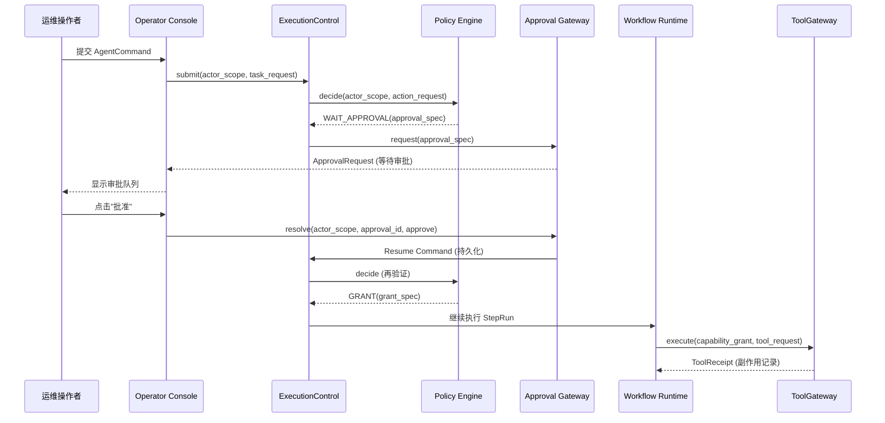
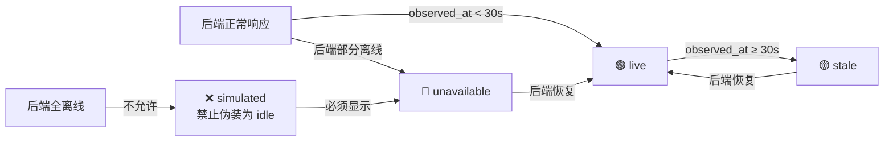

# AICoding 架构设计 · UserStory

> 本文档为《AICoding 架构设计》核心产物之一，定位为**产品需求与用户故事（UserStory）**。
> 上游输入：《高层架构设计》中的需求概要、行业调研、业务架构、产品原型；
> 下游输出：驱动《系统设计》《部署设计》《安全设计》的具体功能实现与验收基线。

> **工具说明**：复用《高层架构设计》的部分结果产物（需求边界、产品模块全景图、功能清单、产品原型）。
> **版本管理纪律**：破坏性变更（章节结构调整 / 关键决策反转）升 MAJOR；新增章节、扩充内容升 MINOR。

---

## 0. 元信息：修订记录

```yaml
标题: Agent Control Center 单一控制面 - UserStory v1.0
版本: v1.0
状态: Reviewing
创建日期: 2026-07-18
最后更新: 2026-07-18
作者: product-story-designer（顾全景）
评审人:
  - team-lead（主理人）

关联文档:
  上游输入:
    - 高层架构设计: 高层架构设计.md v1.0（已通过 G3，权威边界基线）
    - 资料摘要: material_digest.md v1.0（已通过 G1）
    - 行业调研报告: research_report.md v1.0（已通过 G2）
    - 权威设计方案: agent-control-center-design-and-fix-plan-v2.md（D1）
  下游产出:
    - 系统设计: AICoding架构设计-2-系统设计.md
    - 部署设计: AICoding架构设计-3-部署设计.md
    - 安全设计: AICoding架构设计-4-安全设计.md
```

| 版本 | 日期 | 作者 | 变更内容 | 评审状态 |
| --- | --- | --- | --- | --- |
| v1.0 | 2026-07-18 | product-story-designer（顾全景） | 初稿，覆盖 §1~§6 全部章节 + 附录，整合高层架构设计 18 条功能清单 + 5 类角色 + 7 条价值目标 + 6 条痛点 | Reviewing |

---

## 1. 业务背景与价值

### 1.1 业务背景

- **行业现状**：AI Agent 平台正从"单 Agent 自主执行"向"多 Agent 受控编排"演进。业界标杆（Temporal/LangGraph/Retool）已证明持久化执行、人工审批门、事件溯源重建是企业级 Agent 系统的必备能力。当前项目 F:\Agents 下已有 5 个源项目（myself-agent/agent_tianshu/more_agents/agent_contorl/super-agent-self），以"三套系统互相调用"方式集成，总计 41 Sprint 迭代、2104 后端测试、24 张数据库表，具备深厚工程积累。
- **触发本次需求的事件**：现有架构存在 6 类核心痛点——多入口旁路绕过策略引擎（P1）、Express BFF 越权执行业务写且无审计链路（P2）、双 Orchestrator 竞争写入导致状态冲突（P3）、无持久化执行恢复机制（P4）、事件不可重建导致 UI 无法从重放得到一致快照（P5）、mock 数据伪装在线状态误导决策（P6）。v2 设计方案（agent-control-center-design-and-fix-plan-v2.md）驱动启动本次收敛。
- **本系统在产品矩阵中的位置**：Agent Control Center 承担**核心控制面**职责，与 Operator Console（unified-admin 前端）、Provider Adapters（OpenClaw/Hermes/Tianshu/Browser/Desktop/PTY/Plugin）、Visualization Package（ClawLibrary）形成完整的"一个任务与执行控制面，一个操作者控制台，一组可替换 Adapter，一套版本化 Workflow，一个由事件重建的可视化世界"业务闭环。

### 1.2 行业方案

> 以下标杆系统已在《高层架构设计》§3 和 research_report.md 中完成 5 维度加权对比，本节仅提炼与 UserStory 直接相关的产品形态借鉴点。

| 标杆系统 | 与本系统 UserStory 相关的借鉴点 |
| --- | --- |
| Temporal | Workflow/Activity/Signal 三原语映射 ExecutionControl/StepRun/ApprovalRequest；持久化执行模式（进程崩溃从事件历史重放）直接满足恢复需求；人工审批门（Signal 暂停 Workflow 等待外部输入）映射持久化审批门。 |
| LangGraph | StateGraph 有向图映射天枢 9 角色 7 态状态机；条件边表达三审制路由 + 停滞恢复 4 阶段；Checkpointer 满足进程崩溃恢复；Human-in-the-Loop 断点映射审批暂停。 |
| Retool Agents | Agent 四要素定义（reasoning/tools/approval/loop）映射 Planner/ToolGateway/Approval/ExecutionControl；V3 活动合并优化在 StepRun 批处理时参考；日均 1000 万+ workflow runs 验证架构可扩展性。 |
| EventStoreDB + Axon | CQRS + Event Sourcing 范式——事件为真源、Projection 可抛弃后重建、Upcaster Schema 演化——直接指导 Projection.rebuild 和 Snapshot 一致性需求。 |
| Langfuse | OpenTelemetry 原生链路追踪覆盖全链路可观测性；@observe 装饰器侵入性极低；成本归因（per-user/per-feature）指导 DevOps/SRE 监控 UserStory。 |

### 1.3 方案收益与价值

> 继承《高层架构设计》§1.3 价值主张 6 条，并补充 UserStory 层面的用户可感知收益。

| 价值维度 | 功能模块 | 预期价值收益 | 量化标准（继承高层架构 §1.3） |
| --- | --- | --- | --- |
| 安全合规 | ExecutionControl 唯一执行入口（F1）+ backend Orchestrator 退役（F14） | 所有副作用路径收敛到唯一可控入口，消除多入口旁路风险 | 高风险步骤批准前执行次数：当前"可绕过"→ 目标 0 次（MVP 上线） |
| 安全合规 | 三态 Policy（F2）+ 持久化审批门（F3）+ ActorScope 隔离（F7） | 高风险操作 100% 经过审批，跨租户数据访问被行级过滤拦截 | 跨租户读写成功次数：当前"存在泄漏风险"→ 目标 0 次（MVP 上线） |
| 效率 | Audit Store hash chain（F9）+ Langfuse 集成（F11） | 每个副作用可追溯到 command/decision/approval/grant/receipt 完整链路 | 副作用全链路审计缺失率：当前"无审计链路"→ 目标 0%（MVP 上线） |
| 可靠性 | WorkerBroker Lease/Heartbeat/Orphan Recovery（继承 F1 执行入口）+ 版本化 Workflow（F6） | 进程崩溃后任务可恢复，卡死 Run 可自动恢复或转人工 | 进程崩溃后任务可恢复率：当前"无持久化恢复"→ 目标 100%（完整版上线） |
| 效率 | EventLog & Projection（F4/F5）+ ClawLibrary 接入（F12） | UI 可从事件重放得到一致 Snapshot，Projection 可抛弃后重建 | Snapshot 重放一致率：当前"无事件溯源"→ 目标 100%（完整版上线） |
| 成本 | LangGraph 库嵌入（F6）+ Express BFF 收缩（F13） | 无额外编排器运维成本，前端收缩为无状态代理 | 额外基础设施服务数量：当前 0 → 目标 0（MVP 上线，仅增加 Langfuse Docker 服务） |

### 1.4 术语清单

> 统一文档中专有名词的中英文对照与含义，与 system-architect 术语表对齐（继承高层架构设计 D1 定义）。

| 术语 | 英文 | 含义 | 来源 |
| --- | --- | --- | --- |
| 执行控制 | ExecutionControl | 唯一执行入口接口，提供 submit/execute/resume/cancel 四个方法，所有入口（HTTP/CLI/Chat/Cron/SubAgent/Workflow/插件）必须调用此接口 | D1,§6.1 |
| 三态策略 | Tri-state Policy | Policy.decide() 返回 DENY（拒绝）/ WAIT_APPROVAL（等待审批）/ GRANT（授权）三态，替代布尔 RBAC | D1,§6.2 |
| 持久化审批门 | Persistent Approval Gate | ApprovalRequest 持久化存储 + resolve 触发持久化 Resume Command，审批超时自动过期 | D1,§6.3 |
| 能力授权令牌 | CapabilityGrant | 审批通过且 Policy 再验证后签发的执行令牌，含 grant_id/nonce/key_id/过期时间，绑定参数哈希和资源范围 | D1,§4.4 |
| 执行者作用域 | ActorScope | 含 tenant_id/workspace_id/principal_id/principal_type/roles/permissions/auth_context，由服务端认证模块生成，Repository 必须显式接收 | D1,§4.1 |
| 工作者代理 | WorkerBroker | 管理 Worker 的 Lease（租约）/Heartbeat（心跳）/Orphan Recovery（孤儿恢复），负责任务分发与故障检测 | D1,§6.4 |
| 工具网关 | ToolGateway | 执行工具前验证 CapabilityGrant（nonce/参数哈希/资源范围/过期时间），产生 ToolReceipt 记录副作用 | D1,§6.6 |
| 工具回执 | ToolReceipt | 规范化工具执行结果和副作用证据，记录 actor/decision/grant/tool_receipt/资源范围 | D1,§4.2 |
| 事件日志 | EventLog | DomainEvent 的 append-only 存储，支持 read(cursor, filters) 分页读取，用于 Projection 全量重建 | D1,§6.7 |
| 投影 | Projection | 从 EventLog 异步更新的读模型，支持 rebuild(stream) 全量重放和 snapshot(scope) 快照查询 | D1,§6.7 |
| 事务性发件箱 | Transactional Outbox | 数据库事务同时写业务状态和 Outbox 表，保证事件与业务状态原子一致，at-least-once 投递 | D1,§7.3 |
| 收件箱去重 | Inbox Deduplication | 消费者通过 eventId/aggregate revision/Inbox checkpoint 去重，防止重复消息产生重复外部副作用 | D1,§7.3 |
| 防篡改审计 | Tamper-evident Audit | 每条 Audit Record 含前一条 SHA-256 哈希 + 创建时 HMAC-SHA256 签名，保证审计链不可篡改 | D1,§8.5 |
| 来源可信度 | source_status | 所有 Snapshot 携带的可信度标注：live（实时）/stale（过期）/unavailable（不可用）/simulated（模拟） | D1,§7.4 |
| 版本化工作流 | Versioned WorkflowDefinition | 含 version/roles/phases/transitions/review_gates/routing_rules/stall_policy/output_contract 的不可变工作流定义 | D1,§4.5 |
| 工作流运行实例 | WorkflowRun | 一次 WorkflowDefinition 实例化执行，追踪 phase_history（阶段流转历史） | D1,§4.5 |
| 步骤运行尝试 | StepRun | 一个步骤的一次执行尝试，重试创建新 attempt 而非覆盖历史 | D1,§4.2 |
| 特权适配器 | Privileged Adapter | 运行在独立 Docker 容器中的高权限工具执行器（Shell/PTY/浏览器/桌面/插件），受 seccomp/cgroups 资源限制 | D1,§8.3 |
| 停滞恢复 | Stall Recovery | 调度器检测任务停滞后按 4 阶段阈值自动处理：180s 重试→360s 升级审核→540s 升级调度→720s 回滚 | D3,README.停滞恢复 |
| 链路追踪 | Trace/Tracing | OpenTelemetry 标准的分布式追踪，覆盖从 AgentCommand 提交到 ToolReceipt 记录的全链路 | research_report §2.2.5 |

---

## 2. 范围与边界

### 2.1 系统内模块及功能

> 继承《高层架构设计》§6.2 产品模块全景图，一级功能清单按三层架构组织。

| 一级模块 | 二级模块 | 核心功能概述 | MVP 是否包含 |
| --- | --- | --- | --- |
| **接入层** | Operator Console（unified-admin 前端） | 任务看板/任务详情/审批队列/Agent配置/Worker监控/审计日志 6 个核心页面 | ✅ |
| **接入层** | ClawLibrary（可视化包） | Dashboard宫殿总览/Task Timeline/Approval Board/Memory Vault/Runtime Monitor 5 个房间 | ✅（基础版） |
| **业务能力层** | ExecutionControl | submit/execute/resume/cancel 唯一执行入口，收敛所有副作用路径 | ✅ |
| **业务能力层** | Policy Engine | 三态决策 DENY/WAIT_APPROVAL/GRANT，替代布尔 RBAC | ✅ |
| **业务能力层** | Approval Gateway | 持久化审批门 + resolve 触发持久化 Resume Command + 超时处理 | ✅ |
| **业务能力层** | Workflow Runtime | LangGraph StateGraph 映射天枢 9 角色 7 态 + 三审制路由 | ✅（基础版） |
| **业务能力层** | WorkerBroker | Worker Lease/Heartbeat/Orphan Recovery 任务分发与故障检测 | ✅ |
| **业务能力层** | ToolGateway | CapabilityGrant 验证 + ToolReceipt 副作用记录 | ✅ |
| **业务能力层** | EventLog & Projection | Transactional Outbox + Inbox 去重 + Projection 全量重建 | ✅（单 Projection） |
| **业务能力层** | Audit Store | hash chain + HMAC-SHA256 签名的 tamper-evident 审计 | ✅（简化版） |
| **业务能力层** | SkillEvaluation | 自进化晋升机制（样本量+质量增量+安全回归） | ❌（完整版） |
| **基础能力层** | 特权 Adapter Host | Shell/PTY + 浏览器在独立 Docker 容器运行 | ✅（Shell/Browser） |
| **基础能力层** | LLM Gateway | 10+ 模型 Provider 集成 + Langfuse drop-in wrapper | ✅ |
| **基础能力层** | PostgreSQL 16 数据层 | 业务状态 + Outbox + Inbox + AuditRecord | ✅ |
| **基础能力层** | Redis 缓存层 | Policy 缓存 + WorkerBroker 会话/限流 | ✅ |
| **基础能力层** | Langfuse Telemetry | OpenTelemetry 链路追踪 + 评估 + 成本归因 | ✅ |

### 2.2 系统外模块及功能

> 继承《高层架构设计》§6.1 Out-of-Scope，当前系统**不覆盖**的功能及原因。

| 编号 | 不做的事 | 原因 | 后续计划 |
| --- | --- | --- | --- |
| O1 | SkillEvaluation 自进化晋升机制 | 需要数据积累 + 最小样本量验证 + 模型迭代，MVP 不具备条件（D1,§4.6） | 完整版 Phase 6 |
| O2 | 停滞恢复 4 阶段（180s/360s/540s/720s 自动重试→升级→回滚） | 天枢现有调度器逻辑复杂，MVP 优先保证基础路由正确性 | 完整版 Phase 5 |
| O3 | 桌面自动化 Adapter 和插件 Host 隔离 | Docker 容器隔离对桌面 GUI 和插件沙箱的安全边界需要额外验证 | 完整版 Phase 6 |
| O4 | 多 Projection 并行重建（TaskTimeline/ApprovalQueue/WorldDelta/SourceHealth） | MVP 优先实现单 Projection（AgentSnapshot）验证事件溯源链路正确性 | 完整版 Phase 3 |
| O5 | 部署 Temporal Server 作为独立编排器 | v2 要求 myself-agent 是唯一 Orchestrator，Temporal 仅作为设计模式参照 | 不做 |
| O6 | 引入专用事件数据库（EventStoreDB） | v2 部署约束为 PostgreSQL + Redis，在 PG 上用 Transactional Outbox 可实现等效能力 | 不做 |

### 2.3 外部依赖

> 继承《高层架构设计》§5.2 系统依赖架构。

| 依赖系统 | 提供方 | 依赖能力 | 接入方式 | 接口人 |
| --- | --- | --- | --- | --- |
| LLM Provider（DeepSeek/GLM/Kimi/Qwen/OpenAI 等 10+） | 外部 API | LLM 推理（规划/生成） | HTTPS REST，超时 60s，重试 3 次 | 后端架构 |
| OIDC IdP | 外部认证服务 | 用户认证 + JWT 颁发 | HTTPS OIDC/OAuth2，PKCE + nonce + JIT，Token TTL 5 分钟 | 安全架构 |
| Operator Console（unified-admin 前端） | 前端团队 | Command API + Query API | HTTPS REST + WebSocket/SSE | 前端团队 |
| ClawLibrary（可视化包） | 前端团队 | Projection.snapshot() 读模型消费 | npm workspace package API | 前端团队 |
| DevOps 监控（Prometheus/Grafana） | 运维团队 | 指标采集 + 告警 | Prometheus scrape，15s 抓取间隔 | 运维团队 |
| Langfuse（Telemetry） | 运维团队 | 链路追踪 + 评估 + 成本归因 | OpenTelemetry SDK，Docker Compose 自部署 | 运维团队 |
| Docker 隔离容器（PTY/Browser） | 安全架构 | 特权 Adapter 进程隔离执行 | Docker 容器 + seccomp + cgroups | 安全架构 |

---

## 3. 功能清单

> **定位**：全景骨架表，进入"角色 / 场景 / US"之前先看到完整功能版图。
> 与《高层架构设计》§6.3 功能清单 18 条（F1~F18）互查一致。

### 3.1 功能清单

| 编号 | 一级模块 | 二级模块 | 功能项 | 优先级 | MVP 范围 | 完整版范围 | 对齐目标 | 备注 |
| --- | --- | --- | --- | --- | --- | --- | --- | --- |
| F1 | 业务能力层 | ExecutionControl | submit/execute/resume/cancel 接口收敛所有入口（HTTP/CLI/Chat/Cron/SubAgent/Workflow/插件） | P0 | ✅ | ✅ | V1, V6 | 不暴露 DB Session/Memory/Skill/Tool 实例 |
| F2 | 业务能力层 | Policy Engine | 三态决策 DENY/WAIT_APPROVAL/GRANT，替代布尔 RBAC allowed | P0 | ✅ | ✅ | V2 | WAIT_APPROVAL 不签发 CapabilityGrant |
| F3 | 业务能力层 | Approval Gateway | 持久化审批 + resolve 触发持久化 Resume Command + expires_at 超时 | P0 | ✅ | ✅ | V2, V3 | 审批后参数变化通过 normalized_args_hash 绑定 |
| F4 | 业务能力层 | EventLog & Projection | Transactional Outbox（PG LISTEN/NOTIFY + FOR UPDATE SKIP LOCKED）+ Inbox 去重 | P0 | ✅ | ✅ | V5 | at-least-once 投递，eventId/revision 去重 |
| F5 | 业务能力层 | EventLog & Projection | Projection.rebuild(stream) 全量重放重建读模型 | P0 | ✅(单Projection) | ✅(多Projection) | V5 | MVP 实现 AgentSnapshot，完整版增加 4 个 |
| F6 | 业务能力层 | Workflow Runtime | 版本化 WorkflowDefinition（LangGraph StateGraph 映射天枢 9 角色 7 态） | P0 | ✅(基础路由) | ✅(停滞恢复) | V1 | install/instantiate/handle_event 接口 |
| F7 | 业务能力层 | ActorScope 隔离 | Repository 行级强制过滤（tenant_id/workspace_id/principal_id） | P0 | ✅ | ✅ | V1 | 所有 Repository 查询强制接收 ActorScope |
| F8 | 基础能力层 | 特权 Adapter 隔离 | Docker 容器 + seccomp/cgroups 资源限制 | P0 | ✅(Shell/Browser) | ✅(全部Adapter) | V2 | 限制 FS/网络/CPU/内存/子进程 |
| F9 | 业务能力层 | Audit Store | hash chain（前一条 SHA-256）+ 创建时 HMAC-SHA256 签名 | P0 | ✅(简化版) | ✅(验证工具) | V3 | 记录 actor/decision/grant/tool_receipt/资源范围 |
| F10 | 基础能力层 | source_status | Snapshot 可信度标注 live/stale/unavailable/simulated + observed_at + projected_at | P0 | ✅ | ✅ | V7 | 后端全离线时显示 unavailable 而非 idle |
| F11 | 基础能力层 | Langfuse 集成 | @observe 装饰器 + LLM Gateway drop-in wrapper 全链路追踪 | P1 | ✅ | ✅ | V3 | Docker Compose 自部署 |
| F12 | 接入层 | ClawLibrary 接入 | npm workspace package + 只消费 Projection.snapshot() 读模型 | P1 | ✅(基础版) | ✅(资产替换) | V5 | 不直接调用来源系统写接口 |
| F13 | 接入层 | Express BFF 收缩 | 删除 PTY/文件 CRUD/npm 安装/备份，保留无状态协议代理 | P0 | ✅ | ✅ | V3 | 高风险写操作只提交 AgentCommand |
| F14 | 基础能力层 | backend 退役 | more_agents/backend Orchestrator 降级为 Reference Only，不部署 | P0 | ✅ | ✅ | V6 | 消除第二个任务写模型 |
| F15 | 业务能力层 | SkillEvaluation | 自进化晋升机制（样本量+基线+质量增量+失败率+成本增量评估） | P2 | ❌ | ✅ | — | 需数据积累 + 最小样本量验证 |
| F16 | 业务能力层 | 停滞恢复 4 阶段 | 180s/360s/540s/720s 阈值触发自动重试→升级→回滚 | P2 | ❌ | ✅ | — | 天枢调度器逻辑复杂，MVP 保证基础路由 |
| F17 | 基础能力层 | 桌面/插件 Adapter | Docker 容器 + Manifest permissions 进程隔离 | P2 | ❌ | ✅ | — | 安全边界需额外验证 |
| F18 | 业务能力层 | 多 Projection 重建 | 并行重建 AgentSnapshot/TaskTimeline/ApprovalQueue/WorldDelta/SourceHealth | P2 | ❌ | ✅ | — | MVP 优先单 Projection 验证链路正确性 |

**与高层架构 §6.3 互查一致**：
- ✅ 18 条功能编号 F1~F18 一一对应，无增减。
- ✅ P0（12 条：F1~F10, F13, F14）/ P1（2 条：F11, F12）/ P2（4 条：F15~F18）分级一致。
- ✅ MVP 范围 14 条（F1~F14）/ 完整版范围 18 条（F1~F18）一致。
- ✅ 每条功能对齐目标（V1~V7）与高层架构 §2.3 期待目标一致。

---

## 4. 角色与场景

### 4.1 角色清单

> 继承《高层架构设计》§2.1 核心角色 5 类，补充 UserStory 层面的操作细节。

| 角色 | 业务身份 | 主要操作 | 核心关注点 |
| --- | --- | --- | --- |
| 平台架构负责人 | 甲方决策者 | 架构决策审阅、执行入口收敛验证、部署拓扑确认、EventLog 重放一致性审阅 | 唯一写入者原则落地——所有副作用必须经过唯一可控执行入口，部署拓扑中只有一个 Task 写模型和一个 Orchestrator |
| Agent 运维操作者 | 最终用户 | 提交 AgentCommand、查看任务状态与 Workflow 阶段、批准/拒绝审批请求、处理 Worker 离线告警 | 任务执行可靠性——进程崩溃后能否恢复、卡住时能否自动恢复或转人工、审批等待时间是否可接受 |
| 安全合规审计员 | 最终用户 | 审计日志审阅、安全策略配置、跨租户访问审查、hash chain 完整性检查、副作用链路追溯 | 每个副作用能否追溯到 command/decision/approval/grant/receipt 完整链路，审计记录不可篡改 |
| Agent 被控终端用户 | 受影响方 | 通过 Agent 完成业务操作（文档生成/代码编写/数据处理）、接收执行结果 | Agent 执行结果正确性——重试不产生重复外部副作用，执行结果与预期一致 |
| DevOps / SRE | 受影响方 | 部署运维、监控告警响应、Outbox 积压处理、source_status 异常排查、LLM 成本监控 | 部署可重复性——版本/镜像标签/健康响应/发布说明来自同一来源；source_status 标注是否准确反映系统真实状态 |

### 4.2 关键场景清单

| 编号 | 角色 | 触发条件 | 期望结果 | 频率 |
| --- | --- | --- | --- | --- |
| S1 | 平台架构负责人 | 新功能上线前需验证执行入口收敛 | 部署拓扑只有一个 Task 写模型和一个 Orchestrator，6 类旁路路径（CLI/SubAgent/Express BFF/插件/Cron/Chat）命中次数为 0 | 每次发布前（周级） |
| S2 | Agent 运维操作者 | 需要执行高风险操作（Shell 命令/文件写入/浏览器操作） | 提交 AgentCommand 后系统返回 WAIT_APPROVAL，操作者在审批队列批准后任务继续执行 | 日均 10~50 次 |
| S3 | Agent 运维操作者 | Worker 进程崩溃或网络中断导致任务卡住 | 系统自动检测 Lease 过期并触发 Orphan Recovery，StepRun 重试或转人工队列，UI 正确显示卡住原因 | 偶发（周级） |
| S4 | 安全合规审计员 | 需要审查某个已执行副作用的完整链路 | 审计日志页面显示 command→decision→approval→grant→receipt 完整链路，hash chain 完整性验证通过 | 每周审查（周级） |
| S5 | DevOps / SRE | 系统运行中需要监控健康状态 | Dashboard 显示 source_status（live/stale/unavailable/simulated）+ 关键指标（执行成功率/延迟/LLM 成本/Outbox 积压），异常时告警 | 持续监控（15s 级） |
| S6 | Agent 运维操作者 | 提交低风险操作（查询/只读操作） | Policy.decide() 返回 GRANT，任务直接执行无需审批，返回 accepted | 日均 50~100 次 |
| S7 | 安全合规审计员 | 跨租户数据访问尝试 | ActorScope 行级过滤拦截跨租户读写，审计日志记录拦截事件 | 偶发（月级） |

---

## 5. 用户旅程（UserStory）

> 覆盖高层架构 5 类角色的核心场景，每条 US 按七段式展开。

### 5.1 US-1：平台架构负责人收敛执行入口

#### 5.1.1 业务场景

- **视角**：平台架构负责人（甲方决策者）
- **描述**：平台架构负责人在新功能上线前，需要验证所有副作用路径已收敛到 ExecutionControl 唯一执行入口，确保部署拓扑中不存在第二个任务写模型或 Orchestrator。这是 v2 设计方案的核心决策——"myself-agent 是唯一任务、策略、审批、执行、审计、记忆和技能写模型"的落地验证。触发条件：每次版本发布前的架构合规检查。

#### 5.1.2 业务流程

- **视角**：用户
- **描述方式**：Given / When / Then

```
Given 平台架构负责人已登录 Operator Console，系统已完成 v2 收敛改造
When 平台架构负责人打开审计日志页面，筛选"旁路执行检测"类别
Then 系统显示 6 类旁路路径（CLI/SubAgent/Express BFF/插件/Cron/Chat）的命中次数统计
  And 命中次数应全部为 0（对齐 V1 目标）
When 平台架构负责人查看部署拓扑确认面板
Then 系统显示当前部署中只有一个 Task 写模型（myself-agent）和一个 Orchestrator
  And more_agents/backend 标记为 Reference Only（未部署）
  And Express BFF 标记为无状态协议代理（无业务写模型）
When 平台架构负责人查看 EventLog 重放一致性报告
Then 系统显示最近一次 Projection.rebuild 的 Snapshot 重放一致率
  And 一致率应达到 100%（对齐 V5 目标，完整版验证项）
```

#### 5.1.3 UE 原型

**Operator Console 审计日志页面 - 旁路检测面板**：

```
┌─────────────────────────────────────────────────────────┐
│  审计日志                          [旁路检测] [hash chain] │
├─────────────────────────────────────────────────────────┤
│  时间范围: [最近 7 天 ▼]    租户: [全部 ▼]                │
├─────────────────────────────────────────────────────────┤
│                                                         │
│  旁路执行检测结果                          总计: 0 次命中  │
│  ┌──────────────┬──────────┬──────────┬───────────────┐ │
│  │ 旁路路径      │ 命中次数  │ 状态      │ 详情          │ │
│  ├──────────────┼──────────┼──────────┼───────────────┤ │
│  │ CLI 直调      │ 0        │ ✅ 已收敛  │ 查看          │ │
│  │ SubAgent 自签 │ 0        │ ✅ 已收敛  │ 查看          │ │
│  │ Express BFF  │ 0        │ ✅ 已收敛  │ 查看          │ │
│  │ 插件直调      │ 0        │ ✅ 已收敛  │ 查看          │ │
│  │ Cron 旁路     │ 0        │ ✅ 已收敛  │ 查看          │ │
│  │ Chat 旁路     │ 0        │ ✅ 已收敛  │ 查看          │ │
│  └──────────────┴──────────┴──────────┴───────────────┘ │
│                                                         │
│  部署拓扑确认                                            │
│  ┌─────────────────────────────────────────────────────┐│
│  │ Task 写模型: myself-agent (唯一)           ✅       ││
│  │ Orchestrator: myself-agent (唯一)          ✅       ││
│  │ backend: Reference Only (未部署)           ✅       ││
│  │ Express BFF: 无状态协议代理                ✅       ││
│  └─────────────────────────────────────────────────────┘│
└─────────────────────────────────────────────────────────┘
```

#### 5.1.4 业务逻辑

- **视角**：业务系统
- **描述方式**：结构化表述

1. **入口收敛检测**：系统在 ExecutionControl 接口层植入旁路检测探针，监控所有非 ExecutionControl 路径的 Tool 实例直接调用尝试。6 类旁路路径（CLI/SubAgent/Express BFF/插件/Cron/Chat）各对应一个检测器，命中时写入 AuditRecord（classification=bypass_attempt）。
2. **部署拓扑验证**：系统启动时读取部署清单（docker-compose.yml），验证只有一个 API 服务（myself-agent）注册为 Task 写模型，backend 服务标记为 disabled，Express 仅暴露代理路由（无 PTY/文件 CRUD/npm 安装端点）。
3. **EventLog 重放一致性**：Projection.rebuild(stream) 从 EventLog 全量重放 DomainEvent，生成新的 Snapshot，与当前 Projection.snapshot() 比对，一致率应达到 100%。MVP 阶段验证单 Projection（AgentSnapshot），完整版验证多 Projection。

#### 5.1.5 数据描述

- **核心数据流转**：

```
部署清单(docker-compose.yml)
  → 旁路检测探针 → AuditRecord(classification=bypass_attempt, actor, path, timestamp)
  → 部署拓扑验证 → TopologyStatus(task_writers=1, orchestrators=1, backend=disabled)
  → EventLog.read(cursor) → DomainEvent[] → Projection.rebuild → Snapshot
  → Snapshot 比对 → ConsistencyReport(replay_consistency_rate)
```

- **关键数据结构**：
  - AuditRecord：actor / decision / grant / tool_receipt / resource_scope / prev_hash / signature
  - TopologyStatus：task_writers / orchestrators / backend_status / express_bff_mode
  - ConsistencyReport：replay_consistency_rate / checked_at / projection_version

#### 5.1.6 验收标准 AC

> 结构化（Given / When / Then）表述，含正常路径及异常路径。

**AC-1（正常路径 - 全部收敛）**：
```
Given v2 收敛改造已完成，所有入口已收敛到 ExecutionControl 接口
When 平台架构负责人在审计日志页面筛选"旁路执行检测"
Then 6 类旁路路径命中次数全部显示为 0
  And 部署拓扑确认面板显示 Task 写模型 = 1、Orchestrator = 1
  And backend 标记为 Reference Only（未部署）
  And Express BFF 标记为无状态协议代理
```

**AC-2（异常路径 - 检测到旁路）**：
```
Given 系统运行中，某个遗留代码路径仍直接调用 tool_registry.get_tool_instance().execute()
When 旁路检测探针捕获此调用
Then 审计日志页面旁路检测统计中对应路径命中次数 +1
  And AuditRecord 记录 actor/path/timestamp/classification=bypass_attempt
  And 系统向 DevOps/SRE 发送告警通知
```

**AC-3（异常路径 - backend 意外部署）**：
```
Given 部署清单中误将 backend 服务设置为 enabled
When 系统启动时执行部署拓扑验证
Then TopologyStatus 显示 task_writers = 2（异常）
  And 系统启动失败并返回明确错误："检测到第二个 Task 写模型，违反唯一写入者原则"
  And 错误日志引导运维人员检查 docker-compose.yml 中 backend 服务配置
```

**AC-4（正常路径 - EventLog 重放一致）**：
```
Given 系统已运行一段时间，EventLog 中积累了 DomainEvent
When Projection.rebuild(stream) 从 EventLog 全量重放
Then 生成的 Snapshot 与当前 Projection.snapshot() 比对一致率 = 100%
  And ConsistencyReport 记录 replay_consistency_rate = 100%
```

#### 5.1.7 外部集成接口

- **无外部系统集成**：本 UserStory 是内部架构合规验证，不依赖外部能力。部署拓扑验证读取本地 docker-compose.yml，EventLog 重放读取 PostgreSQL 内部数据。

---

### 5.2 US-2：Agent 运维操作者提交任务并等待审批

#### 5.2.1 业务场景

- **视角**：Agent 运维操作者（最终用户）
- **描述**：Agent 运维操作者需要执行一个高风险操作（如运行 Shell 命令修改生产配置文件）。提交 AgentCommand 后，系统通过 Policy Engine 评估风险，返回 WAIT_APPROVAL 状态。操作者在审批队列中查看请求详情（绑定工具参数/资源范围/策略摘要），批准后系统触发 Resume Command 继续执行。这是三态 Policy + 持久化审批门的核心交互场景。触发条件：操作者提交高风险 AgentCommand。

#### 5.2.2 业务流程

- **视角**：用户
- **描述方式**：Given / When / Then

```
Given Agent 运维操作者已通过 OIDC SSO 登录 Operator Console，系统已生成 ActorScope
When 操作者在任务看板点击"提交任务"，填写 AgentCommand（commandType/tool_name/args/target）
Then 系统通过 ExecutionControl.submit(actor_scope, task_request) 创建 Task
  And 系统调用 Policy.decide(actor_scope, action_request) 进行三态决策
When Policy 返回 WAIT_APPROVAL(approval_spec)
Then 系统创建 ApprovalRequest 并持久化（含 normalized_args_hash/resource_scope/policy_digest/expires_at）
  And 任务状态变为"等待审批"
  And 审批队列页面实时显示新请求（呈现延迟 P99 ≤ 1s）
When 操作者在审批队列页面查看请求详情，点击"批准"
Then 系统调用 Approval.resolve(actor_scope, approval_id, decision=approve, expected_revision)
  And 系统触发持久化 Resume Command（非仅更新审批表）
  And Policy 再次验证通过后签发 CapabilityGrant（含 nonce/key_id/过期时间）
  And Workflow Runtime 继续执行 StepRun
  And 工具执行完成后产生 ToolReceipt 记录副作用
  And DomainEvent 写入 Outbox，Projection 异步更新读模型
```

#### 5.2.3 UE 原型

**Operator Console 审批队列页面**：

```
┌─────────────────────────────────────────────────────────┐
│  审批队列                          [待审批 3] [已处理 12] │
├─────────────────────────────────────────────────────────┤
│                                                         │
│  ┌─────────────────────────────────────────────────────┐│
│  │ 🔴 高风险  Task #T-20260718-003                     ││
│  │ 工具: shell.execute                                 ││
│  │ 参数: { command: "npm install pkg", cwd: "/app" }   ││
│  │ 参数哈希: a3f8b2c1...                               ││
│  │ 资源范围: tenant=acme / workspace=prod              ││
│  │ 策略摘要: policy_v3 (高风险: npm全局安装)            ││
│  │ 过期时间: 2026-07-18 15:30:00 (剩余 25 分钟)         ││
│  │                                                     ││
│  │    [查看详情]    [✅ 批准]    [❌ 拒绝]              ││
│  └─────────────────────────────────────────────────────┘│
│                                                         │
│  ┌─────────────────────────────────────────────────────┐│
│  │ 🟡 中风险  Task #T-20260718-002                     ││
│  │ 工具: file.write                                    ││
│  │ 参数: { path: "/app/config.yml", content: "..." }   ││
│  │ ...                                                 ││
│  └─────────────────────────────────────────────────────┘│
└─────────────────────────────────────────────────────────┘
```

**审批流程泳道图**：



#### 5.2.4 业务逻辑

- **视角**：业务系统
- **描述方式**：结构化表述

1. **命令提交**：Operator Console 将用户操作封装为 AgentCommand（schemaVersion/commandId/commandType/idempotencyKey/tenantId/workspaceId/actor/target/deadline/correlationId/data），通过 Command API 提交到 ExecutionControl.submit()。
2. **三态决策**：Policy.decide() 基于 ActorScope（角色/权限）+ action_request（工具名/参数/资源范围）+ 策略规则返回三态。高风险操作（Shell 命令/文件写入/浏览器操作/npm 安装等）返回 WAIT_APPROVAL；低风险操作（只读查询）返回 GRANT；违规操作返回 DENY。
3. **持久化审批门**：WAIT_APPROVAL 时创建 ApprovalRequest（含 approval_id/actor_scope/run_id/step_run_id/tool_name/normalized_args_hash/resource_scope/policy_digest/expires_at）。审批 resolve 必须触发持久化 Resume Command（而非仅更新审批表），确保进程崩溃后审批状态不丢失。
4. **CapabilityGrant 签发**：审批通过且 Policy 再验证通过后，签发 CapabilityGrant（含 grant_id/nonce/key_id/过期时间），绑定 normalized_args_hash 防止审批后参数变化。
5. **副作用记录**：ToolGateway.execute() 验证 Grant 后执行工具，产生 ToolReceipt 记录副作用证据。DomainEvent 写入 Outbox（与业务状态同一数据库事务），Projection 异步更新读模型。

#### 5.2.5 数据描述

- **核心数据流转**：

```
AgentCommand(commandId/commandType/idempotencyKey/actor/target/data)
  → ExecutionControl.submit → Task(task_id/lifecycle=pending)
  → Policy.decide → PolicyDecision(DENY/WAIT_APPROVAL/GRANT)
  → [WAIT_APPROVAL] → ApprovalRequest(approval_id/normalized_args_hash/resource_scope/policy_digest/expires_at)
  → Approval.resolve → Resume Command → Policy.decide(再验证) → GRANT
  → CapabilityGrant(grant_id/nonce/key_id/expiry)
  → Workflow Runtime → StepRun → ToolGateway.execute → ToolReceipt
  → DomainEvent → Outbox → Projection.snapshot → Operator Console
  → AuditRecord(actor/decision/grant/tool_receipt/prev_hash/signature)
```

- **关键数据结构**：
  - AgentCommand：schemaVersion / commandId / commandType / idempotencyKey / tenantId / workspaceId / actor(type,id,roles) / target(kind,id,expectedRevision) / deadline / correlationId / data
  - ApprovalRequest：approval_id / actor_scope / run_id / step_run_id / tool_name / normalized_args_hash / resource_scope / policy_digest / expires_at
  - CapabilityGrant：grant_id / nonce / key_id / expiry / bound_args_hash / resource_scope
  - ToolReceipt：receipt_id / actor / decision / grant / tool_name / result / side_effects / timestamp

#### 5.2.6 验收标准 AC

**AC-1（正常路径 - 高风险操作等待审批后批准）**：
```
Given 运维操作者已登录，系统已生成 ActorScope
When 操作者提交高风险 AgentCommand（如 shell.execute 运行 npm install）
Then ExecutionControl.submit 创建 Task，Policy.decide 返回 WAIT_APPROVAL
  And ApprovalRequest 持久化，含 normalized_args_hash/resource_scope/policy_digest/expires_at
  And 审批队列页面在 P99 ≤ 1s 内显示新请求
When 操作者点击"批准"
Then Approval.resolve 触发持久化 Resume Command
  And Policy 再验证通过后签发 CapabilityGrant（nonce/key_id/绑定参数哈希）
  And Workflow Runtime 继续执行，ToolGateway 产生 ToolReceipt
  And DomainEvent 写入 Outbox，AuditRecord 记录完整链路
```

**AC-2（正常路径 - 低风险操作直接执行）**：
```
Given 运维操作者已登录
When 操作者提交低风险 AgentCommand（如 query.read 只读查询）
Then Policy.decide 返回 GRANT
  And 任务直接执行，无需审批等待
  And 返回 accepted，ToolReceipt 记录结果
```

**AC-3（异常路径 - 审批超时过期）**：
```
Given 存在一个 WAIT_APPROVAL 状态的 ApprovalRequest，expires_at 已设置
When 当前时间超过 expires_at 且操作者未处理
Then 系统自动调用 Approval.expire(approval_id)
  And ApprovalRequest 状态变为 expired
  And 对应 StepRun 标记为 blocked（叫停态）
  And 运维操作者在任务看板看到"审批超时"提示
  And 审计日志记录超时事件
```

**AC-4（异常路径 - 审批后参数篡改）**：
```
Given 操作者批准了一个 shell.execute 审批请求，原参数 command="ls -la"
When 攻击者在 Resume Command 中篡改参数为 command="rm -rf /"
Then Policy 再验证时比对 normalized_args_hash 不匹配
  And CapabilityGrant 拒绝签发
  And 系统返回 rejected，审计日志记录参数篡改尝试
```

**AC-5（异常路径 - 重复提交幂等）**：
```
Given 操作者已提交一个 AgentCommand（idempotencyKey=abc123）
When 网络重试导致同一 AgentCommand 被重复提交
Then ExecutionControl 通过 idempotencyKey 去重
  And 返回同一个 task_id，不创建重复 Task
```

#### 5.2.7 外部集成接口

- **OIDC IdP 认证**：运维操作者通过 OIDC SSO（PKCE + nonce + JIT）登录，IdP 颁发 JWT（TTL 5 分钟），系统从 JWT 提取身份信息生成 ActorScope。认证失败时返回 401，引导重新登录。
- **LLM Provider（规划阶段）**：Workflow Runtime 在规划阶段调用 LLM Provider（DeepSeek/GLM/Kimi 等）生成执行计划，超时 60s，重试 3 次。LLM 输出结构化 JSON 执行计划，经 Policy 审核后交执行器落地。Langfuse drop-in wrapper 追踪 LLM 调用全链路。

---

### 5.3 US-3：Agent 运维操作者处理 Worker 离线恢复

#### 5.3.1 业务场景

- **视角**：Agent 运维操作者（最终用户）
- **描述**：一个正在执行 StepRun 的 Worker 进程因 OOM 或网络中断崩溃，心跳停止。系统通过 WorkerBroker 检测到 Lease 过期，自动触发 Orphan Recovery：重试 StepRun（创建新 attempt 而非覆盖历史）或转人工队列。运维操作者在 Worker 监控页面看到离线告警和恢复状态。这直接对齐 V4 目标（进程崩溃后任务可恢复率 100%）。触发条件：Worker 心跳超时。

#### 5.3.2 业务流程

- **视角**：用户
- **描述方式**：Given / When / Then

```
Given 一个 Worker 正在执行 StepRun（持有 Lease），心跳间隔正常
When Worker 进程因 OOM 崩溃，心跳停止
Then WorkerBroker 在 Lease TTL 超时后检测到 Worker 离线
  And Worker 监控页面显示该 Worker 状态为 offline（红色告警）
  And 对应 StepRun 标记为 orphaned（孤儿状态）
When WorkerBroker 触发 Orphan Recovery（基于 EffectJournal v3 机制）
Then 系统按 EffectRecord 状态分支处理：
  And 如果 StepRun 在 PREPARE 前崩溃（无 EffectRecord）→ 创建新 attempt 重新执行
  And 如果 EffectRecord.status=prepared 但无 dispatch attempt → 允许重新授权并派发（同一 effect_id 追加新 EffectAuthorizationAttempt）
  And 如果存在 dispatching 状态的 EffectDispatchAttempt 但无 ToolReceipt → Effect 进入 unknown_outcome（一等状态，禁止自动重试）
  And 如果 EffectRecord.status=confirmed（ToolReceipt 已记录）→ 跳过重试，标记 StepRun 为 succeeded
  And 如果 EffectRecord.status=unknown_outcome → 进入对账队列（reconciling），按 ToolEffectContract 决定策略
When 运维操作者在 Worker 监控页面查看恢复详情
Then 页面显示：Worker ID/离线时间/Lease 过期时间/fencing_token/StepRun 状态/Effect 状态/attempt 历史/对账状态
  And source_status 标注为 stale（数据可能不是最新）
```

#### 5.3.2 AC 验收标准（v3 增强：基于 EffectRecord + UNKNOWN_OUTCOME 的对账）

**AC-3（异常路径 - 模糊失败进入对账队列，v3 机制）**：
```
Given 一个 StepRun 正在执行 non_retryable 类工具（如发邮件），Worker 在 ToolGateway.CALL_ADAPTER 阶段崩溃
  And EffectDispatchAttempt.status = DISPATCHING，无 ToolReceipt
When WorkerBroker Orphan Recovery 检测到该 Effect
Then EffectRecord.status 迁移为 unknown_outcome（不是 failed，不是 ambiguous）
  And StepRun.status 迁移为 needs_reconciliation
  And Run.status 迁移为 needs_attention（不计作成功）
  And 系统禁止自动重试（non_retryable 类工具）
  And 对账队列新增一条记录，通知运维操作者
  And UI Effect/Receipt/Reconciliation 详情页显示该 Effect 的 dispatch 尝试历史和 fencing_token
```

**AC-4（正常路径 - provider_idempotent 类工具的幂等重投，v3 机制）**：
```
Given 一个 StepRun 执行 provider_idempotent 类工具（如带幂等键的支付），Worker 崩溃
  And EffectDispatchAttempt.status = DISPATCHING，使用 provider_idempotency_key=pay_abc_001
When Orphan Recovery 检测到 unknown_outcome
Then 系统允许使用同一 provider_idempotency_key 重投（下游幂等契约会去重）
  And 创建新的 EffectDispatchAttempt（ordinal 递增，同一 effect_id）
  And 新 attempt 携带新的 fencing_token（防止旧 Worker 提交冲突结果）
  And 若重投成功，Effect.status → confirmed，StepRun → succeeded
```

**AC-5（正常路径 - reconcilable 类工具的 provider 查询对账，v3 机制）**：
```
Given 一个 StepRun 执行 reconcilable 类工具（如订单创建），Worker 崩溃
  And EffectDispatchAttempt.status = DISPATCHING
When Orphan Recovery 检测到 unknown_outcome
Then 系统先查询 provider operation 状态（如 GET /orders/{id}）
  And 若 provider 返回"已创建"→ Effect.status → confirmed（不重复创建）
  And 若 provider 返回"不存在"→ Effect.status → retry_scheduled，允许重新派发
  And 若 provider 查询失败或返回不确定 → Effect.status → manual_review，转人工
```

**AC-6（异常路径 - 审批后参数/上下文变化导致 Grant 失效，v3 机制）**：
```
Given 一个高风险 StepRun 已获得审批和 CapabilityGrant，security_context_digest 已绑定
When 在 ToolGateway.ACQUIRE_DISPATCH 前检测到 system prompt 或 Tool schema 或 SandboxProfile 变化
Then security_context_digest 不匹配，旧 Grant 失效
  And 返回 STALE_SECURITY_CONTEXT（不是通用错误）
  And 系统要求重新评估 Policy 和重新审批
  And UI 审批队列显示"上下文已变化，需重新审批"
```

#### 5.3.3 UE 原型

**Operator Console Worker 监控页面**：

```
┌─────────────────────────────────────────────────────────┐
│  Worker 监控                       [在线 5] [离线 1] ⚠️  │
├─────────────────────────────────────────────────────────┤
│                                                         │
│  ⚠️ 离线 Worker                                         │
│  ┌─────────────────────────────────────────────────────┐│
│  │ Worker ID: worker-shell-03                          ││
│  │ 类型: Shell/PTY Adapter (Docker 容器)                ││
│  │ 最后心跳: 2026-07-18 14:22:15 (3 分钟前)             ││
│  │ Lease 过期: 2026-07-18 14:24:15                      ││
│  │ 当前 StepRun: SR-20260718-007                        ││
│  │ 恢复动作: Orphan Recovery → 新 attempt 重试          ││
│  │ Attempt 历史: [attempt 1: OOM 崩溃] → [attempt 2: 运行中] ││
│  │ source_status: 🟡 stale                              ││
│  │                                                     ││
│  │    [查看 StepRun 详情]    [转人工处理]               ││
│  └─────────────────────────────────────────────────────┘│
│                                                         │
│  ✅ 在线 Worker                                         │
│  ┌─────────────────────────────────────────────────────┐│
│  │ worker-browser-01  心跳: 2s 前  容量: 3/5   ✅ live  ││
│  │ worker-shell-01    心跳: 1s 前  容量: 2/3   ✅ live  ││
│  │ worker-shell-02    心跳: 3s 前  容量: 0/3   ✅ live  ││
│  └─────────────────────────────────────────────────────┘│
└─────────────────────────────────────────────────────────┘
```

#### 5.3.4 业务逻辑

- **视角**：业务系统
- **描述方式**：结构化表述

1. **Lease/Heartbeat 机制**：Worker 通过 WorkerBroker.claim(worker_id, capabilities) 获取 Lease（租约），定期调用 heartbeat(worker_id, lease_id) 续约。Lease TTL 默认 30s，心跳间隔默认 10s。
2. **离线检测**：WorkerBroker 后台扫描器定期检查所有活跃 Lease，超过 TTL 未续约的 Lease 标记为 expired，对应 Worker 标记为 offline。
3. **Orphan Recovery 决策**：对于 expired Lease 关联的 StepRun，系统检查 attempt 历史和 ToolReceipt 状态：
   - **副作用未产生**（attempt 在 ToolGateway.execute 前崩溃）→ 安全重试，创建新 attempt。
   - **副作用已确认**（ToolReceipt 已写入）→ 标记 completed，不重复执行。
   - **副作用不确定**（ToolGateway.execute 已调用但 ToolReceipt 未确认）→ 标记 ambiguous，转人工队列，避免重复外部副作用。
4. **重试创建新 attempt**：重试不覆盖原 attempt 历史（D1,§4.2 要求），每次重试创建新的 StepRun attempt，attempt 历史完整保留用于审计。

#### 5.3.5 数据描述

- **核心数据流转**：

```
Worker.heartbeat(worker_id, lease_id) → LeaseStatus(expires_at)
  [心跳停止] → Lease 过期 → WorkerStatus = offline
  → WorkerBroker.OrphanRecovery → 检查 StepRun attempt 历史
  → [副作用未产生] → 新 attempt → ToolGateway.execute → ToolReceipt
  → [副作用已确认] → 标记 completed
  → [副作用不确定] → 标记 ambiguous → 人工队列
  → DomainEvent(worker_offline/step_run_recovered) → Outbox → Projection
  → Worker 监控页面(source_status=stale)
```

- **关键数据结构**：
  - WorkerStatus：worker_id / type / status(online/offline/recovering) / lease_id / last_heartbeat / capacity
  - Lease：lease_id / worker_id / step_run_id / expires_at / acquired_at
  - StepRun：step_run_id / run_id / attempt_number / status / tool_receipt_id / started_at / completed_at
  - OrphanRecoveryEvent：worker_id / step_run_id / recovery_action(retry/complete/ambiguous) / attempt_before / attempt_after

#### 5.3.6 验收标准 AC

**AC-1（正常路径 - 副作用未产生时安全重试）**：
```
Given Worker worker-shell-03 持有 Lease 执行 StepRun SR-007，心跳正常
When Worker 进程 OOM 崩溃，心跳停止超过 Lease TTL（30s）
Then WorkerBroker 检测到 Lease 过期，Worker 状态变为 offline
  And 系统检查 SR-007 attempt 1 历史，发现 ToolReceipt 未产生（副作用未执行）
  And 系统创建 attempt 2，分配给新 Worker 重新执行
  And Worker 监控页面显示恢复动作和新 attempt 状态
  And source_status 标注为 stale
```

**AC-2（正常路径 - 副作用已确认时不重复执行）**：
```
Given Worker 崩溃前 ToolGateway.execute 已完成且 ToolReceipt 已写入
When WorkerBroker 触发 Orphan Recovery
Then 系统检查到 ToolReceipt 已存在（副作用已确认）
  And StepRun 标记为 completed，不创建新 attempt
  And 不产生重复外部副作用
```

**AC-3（异常路径 - 副作用不确定时转人工）**：
```
Given Worker 在 ToolGateway.execute 调用后崩溃，但 ToolReceipt 未确认写入
When WorkerBroker 触发 Orphan Recovery
Then 系统无法确定副作用是否已产生
  And StepRun 标记为 ambiguous
  And 系统将 StepRun 转入人工处理队列
  And 运维操作者收到通知，需人工确认副作用状态后决定是否重试
```

**AC-4（异常路径 - Worker 恢复重连）**：
```
Given Worker worker-shell-03 被标记为 offline（Lease 已过期）
When Worker 进程恢复并尝试 heartbeat
Then WorkerBroker 检测到 Lease 已过期，拒绝旧 Lease 续约
  And Worker 需重新 claim 获取新 Lease
  And 原 StepRun 已由 Orphan Recovery 处理（新 attempt 或转人工）
  And Worker 不重复执行原 StepRun
```

**AC-5（正常路径 - 重复消息不产生重复副作用）****：
```
Given Orphan Recovery 重试 StepRun，创建新 attempt 并执行工具
When 网络重试导致 Orphan Recovery 事件被重复投递
Then 系统通过 eventId/aggregate revision/Inbox checkpoint 去重
  And 不创建第二个新 attempt
  And 不产生重复外部副作用
```

#### 5.3.7 外部集成接口

- **Docker 容器（特权 Adapter）**：Worker 运行在独立 Docker 容器中（Shell/PTY + 浏览器 Adapter），受 seccomp/cgroups 资源限制。容器崩溃后由 Docker Compose 自动重启策略处理，新容器重新注册到 WorkerBroker 并 claim 新 Lease。容器资源限制：FS 根目录/网络白名单/CPU/内存/执行时长/输出大小/子进程数量。
- **Redis（WorkerBroker 会话）**：WorkerBroker 使用 Redis 存储 Lease 和心跳状态（TTL 自动过期），Redis 中断时 WorkerBroker 回退到 PostgreSQL 持久化 Lease（D1,§11 Phase 2 退出条件："Redis 中断不丢任务"）。

---

### 5.4 US-4：安全合规审计员审计副作用链路

#### 5.4.1 业务场景

- **视角**：安全合规审计员（最终用户）
- **描述**：安全合规审计员需要审查某个已执行副作用的完整链路，验证每个副作用可追溯到 command（命令提交）→ decision（策略决策）→ approval（审批记录）→ grant（授权签发）→ receipt（工具回执）五段链路，且 hash chain 完整性未被篡改。这直接对齐 V3 目标（副作用全链路审计缺失率为 0）。触发条件：每周定期审查或安全事件触发审查。

#### 5.4.2 业务流程

- **视角**：用户
- **描述方式**：Given / When / Then

```
Given 安全合规审计员已登录 Operator Console，系统中存在已执行的副作用记录
When 审计员在审计日志页面搜索特定 Task 或按时间范围/工具名/操作者筛选
Then 系统显示匹配的 AuditRecord 列表，每条含 actor/decision/grant/tool_receipt/资源范围
When 审计员点击某条 AuditRecord 查看完整链路
Then 系统展示五段链路时间轴：
  command（谁在何时提交了什么命令）
  → decision（Policy 返回什么决策，基于什么策略版本）
  → approval（谁在何时批准/拒绝，参数哈希是否匹配）
  → grant（CapabilityGrant 何时签发，nonce/key_id/过期时间）
  → receipt（工具执行产生什么副作用，结果是什么）
When 审计员点击"hash chain 完整性检查"
Then 系统验证 AuditRecord 链中每条记录的 prev_hash 与前一条 SHA-256 哈希一致
  And 验证每条记录的 HMAC-SHA256 签名有效
  And 显示验证结果（✅ 完整 / ❌ 断裂位置）
```

#### 5.4.3 UE 原型

**Operator Console 审计日志页面 - 副作用链路详情**：

```
┌─────────────────────────────────────────────────────────┐
│  审计日志 > Task #T-20260718-003 副作用链路              │
├─────────────────────────────────────────────────────────┤
│                                                         │
│  hash chain 完整性: ✅ 完整（32 条记录，无断裂）          │
│  [重新验证]  [导出 PDF]                                  │
│                                                         │
│  ┌─ 1. COMMAND ────────────────────────────────────────┐│
│  │ 时间: 2026-07-18 14:05:22                           ││
│  │ 操作者: alice@acme.com (运维操作者)                  ││
│  │ 命令: shell.execute                                  ││
│  │ 参数: { command: "npm install pkg", cwd: "/app" }   ││
│  │ idempotencyKey: abc123                               ││
│  └──────────────────────────────────────────────────────┘│
│           ↓                                             │
│  ┌─ 2. DECISION ───────────────────────────────────────┐│
│  │ 时间: 2026-07-18 14:05:22                           ││
│  │ Policy 版本: policy_v3                               ││
│  │ 决策: WAIT_APPROVAL                                  ││
│  │ 原因: 高风险操作 (npm 全局安装)                       ││
│  └──────────────────────────────────────────────────────┘│
│           ↓                                             │
│  ┌─ 3. APPROVAL ───────────────────────────────────────┐│
│  │ 时间: 2026-07-18 14:10:15                           ││
│  │ 审批人: bob@acme.com (运维操作者)                    ││
│  │ 决定: approve                                        ││
│  │ 参数哈希匹配: ✅ a3f8b2c1...                         ││
│  │ 策略摘要: policy_v3                                  ││
│  └──────────────────────────────────────────────────────┘│
│           ↓                                             │
│  ┌─ 4. GRANT ──────────────────────────────────────────┐│
│  │ 时间: 2026-07-18 14:10:16                           ││
│  │ Grant ID: G-20260718-003                             ││
│  │ Nonce: 7e2f...  Key ID: K-2026-07                   ││
│  │ 过期: 2026-07-18 14:15:16                           ││
│  └──────────────────────────────────────────────────────┘│
│           ↓                                             │
│  ┌─ 5. RECEIPT ────────────────────────────────────────┐│
│  │ 时间: 2026-07-18 14:12:03                           ││
│  │ 工具: shell.execute (worker-shell-01)               ││
│  │ 结果: exit_code=0, stdout="added 1 package"         ││
│  │ 副作用: 文件系统变更 (/app/node_modules/pkg/)        ││
│  │ 资源范围: tenant=acme / workspace=prod              ││
│  └──────────────────────────────────────────────────────┘│
└─────────────────────────────────────────────────────────┘
```

#### 5.4.4 业务逻辑

- **视角**：业务系统
- **描述方式**：结构化表述

1. **AuditRecord 写入**：每个关键操作（命令提交/策略决策/审批处理/授权签发/工具执行）均写入 AuditRecord，记录 actor/decision/grant/tool_receipt/资源范围。AuditRecord 独立于 DomainEvent，采用更严格的保留策略和完整性保护（D1,§3.4）。
2. **hash chain 构建**：每条 AuditRecord 创建时计算前一条记录的 SHA-256 哈希作为 prev_hash，并使用 HMAC-SHA256 对当前记录内容签名。hash chain 保证审计记录链不可篡改——修改任何一条记录会导致后续所有记录的 prev_hash 校验失败。
3. **五段链路关联**：通过 correlationId（关联同一 AgentCommand 的所有事件）和 causationId（因果链）将 command→decision→approval→grant→receipt 五段关联为完整链路。
4. **完整性验证**：审计员触发验证时，系统遍历 AuditRecord 链，逐条验证 prev_hash 和 HMAC 签名。MVP 实现创建时签名（简化版），验证工具（批量验证、密钥轮换后历史验证）延后到完整版。

#### 5.4.5 数据描述

- **核心数据流转**：

```
AgentCommand(commandId/correlationId)
  → AuditRecord(command: actor/timestamp/commandType/args)
  → AuditRecord(decision: policy_version/decision/reason)
  → AuditRecord(approval: approver/decision/args_hash_match)
  → AuditRecord(grant: grant_id/nonce/key_id/expiry)
  → AuditRecord(receipt: tool_name/result/side_effects/resource_scope)
  → 每条含 prev_hash(SHA-256) + signature(HMAC-SHA256)
  → hash chain 完整性验证 → VerificationReport(intact/break_position)
```

- **关键数据结构**：
  - AuditRecord：record_id / correlation_id / causation_id / classification(command/decision/approval/grant/receipt) / actor / data / prev_hash / signature / created_at
  - VerificationReport：total_records / intact / break_position / verified_at / key_versions

#### 5.4.6 验收标准 AC

**AC-1（正常路径 - 完整五段链路可追溯）**：
```
Given 一个高风险操作已完整执行（提交→审批→执行）
When 审计员在审计日志页面搜索该 Task
Then 系统显示完整的五段链路（command→decision→approval→grant→receipt）
  And 每段含时间戳/操作者/关键数据
  And 链路通过 correlationId 关联，无缺失段
```

**AC-2（正常路径 - hash chain 完整性验证通过）**：
```
Given 审计日志中存在连续的 AuditRecord 链
When 审计员点击"hash chain 完整性检查"
Then 系统逐条验证 prev_hash 和 HMAC 签名
  And 显示"✅ 完整（N 条记录，无断裂）"
```

**AC-3（异常路径 - hash chain 断裂检测）**：
```
Given 攻击者篡改了第 15 条 AuditRecord 的内容
When 审计员执行 hash chain 完整性检查
Then 系统检测到第 16 条记录的 prev_hash 与第 15 条当前 SHA-256 不匹配
  And 显示"❌ 断裂位置：第 15→16 条之间"
  And 系统发出安全告警
```

**AC-4（异常路径 - 链路缺失段）**：
```
Given 某个副作用缺少 approval 段记录（可能是审批绕过）
When 审计员查看该副作用的链路
Then 链路时间轴显示 decision→grant 之间缺少 approval
  And 系统标记为"链路不完整"并发出告警
  And 审计员可追溯缺失原因
```

**AC-5（正常路径 - 导出审计报告）**：
```
Given 审计员已完成链路审查
When 审计员点击"导出 PDF"
Then 系统生成包含完整五段链路、hash chain 验证结果、操作者信息的审计报告
  And 报告含数字签名和导出时间戳
```

#### 5.4.7 外部集成接口

- **Langfuse 链路追踪**：审计员可从 AuditRecord 中的 traceId 跳转到 Langfuse 链路追踪界面，查看该副作用的完整分布式追踪（从 AgentCommand 到 ToolGateway 的每一跳调用耗时和输入输出）。Langfuse 提供 OpenTelemetry 原生追踪，@observe 装饰器自动关联嵌套调用。
- **Prometheus/Grafana（指标关联）**：审计员可将审计事件与 Prometheus 指标（如该时段的工具执行成功率/延迟分布）关联查看，辅助判断异常是否为系统性问题。

---

### 5.5 US-5：DevOps/SRE 监控系统健康

#### 5.5.1 业务场景

- **视角**：DevOps / SRE（受影响方）
- **描述**：DevOps/SRE 需要持续监控系统健康状态，包括 Agent 在线状态、任务执行成功率、延迟分布、LLM 成本、Outbox 表积压、source_status 可信度标注。当后端服务部分或全部离线时，Dashboard 必须正确显示 unavailable（而非伪装为 idle），确保运维决策基于可信数据。这直接对齐 V7 目标（所有 Snapshot 携带 source_status，100% 覆盖）。触发条件：持续监控（15s 级 Prometheus 抓取间隔）。

#### 5.5.2 业务流程

- **视角**：用户
- **描述方式**：Given / When / Then

```
Given DevOps/SRE 已登录 ClawLibrary Dashboard 或 Operator Console
When SRE 打开 Dashboard 宫殿总览
Then 系统显示 11 个房间入口 + 全局 Agent 在线状态
  And 每个数据区域标注 source_status（live/stale/unavailable/simulated）
  And live 数据：observed_at 与当前时间差 < 30s
  And stale 数据：observed_at 与当前时间差 ≥ 30s，显示"数据可能过期"提示
When 后端服务（FastAPI）部分离线
Then 离线服务的相关数据标注为 unavailable（红色）
  And Dashboard 显示"服务不可用"而非 idle 或 mock 数据
  And 系统向 SRE 发送告警
When SRE 进入 Runtime Monitor 房间查看 Worker 状态
Then 系统显示每个 Worker 的 Lease/Heartbeat/容量/恢复状态
  And source_status 标注为 live（实时遥测信号，pollMs 默认 3000ms）
When SRE 检查 Outbox 积压指标
Then Grafana 显示 Outbox 表未处理事件数量和最老未处理事件年龄
  And 积压超过阈值时触发告警
```

#### 5.5.3 UE 原型

**ClawLibrary Dashboard 宫殿总览**：

```
┌─────────────────────────────────────────────────────────┐
│  🏰 Dashboard 宫殿总览                                    │
│  全局状态: 🟢 健康    source_status: live (observed 2s 前)│
├─────────────────────────────────────────────────────────┤
│                                                         │
│  ┌─────────┐  ┌─────────┐  ┌─────────┐  ┌─────────┐    │
│  │ 📋 Task │  │ ✅ Appr │  │ 🧠 Memo │  │ ⚙️ Skill│    │
│  │ Timeline│  │ Board   │  │ Vault   │  │ Forge   │    │
│  │ 🟢 live │  │ 🟢 live │  │ 🟢 live │  │ 🔴 n/a  │    │
│  └─────────┘  └─────────┘  └─────────┘  └─────────┘    │
│                                                         │
│  ┌─────────┐  ┌─────────┐  ┌─────────┐  ┌─────────┐    │
│  │ 🖥️ Runt │  │ 📦 Queue│  │ ⏰ Alarm│  │ 📊 Dash │    │
│  │ Monitor │  │ Hub     │  │ Board   │  │ board   │    │
│  │ 🟢 live │  │ 🟡 stale│  │ 🟢 live │  │ 🟢 live │    │
│  └─────────┘  └─────────┘  └─────────┘  └─────────┘    │
│                                                         │
│  关键指标                                                │
│  ┌─────────────────────────────────────────────────────┐│
│  │ 执行成功率: 98.5%  平均延迟: 1.2s  LLM成本: $12.4/d ││
│  │ Outbox 积压: 3 条 (最老 5s)  Worker 在线: 5/6       ││
│  └─────────────────────────────────────────────────────┘│
│                                                         │
│  ⚠️ 告警                                                │
│  • [14:22] Worker worker-shell-03 离线 (OOM)            │
│  • [14:15] Queue Hub 数据 stale (observed 45s 前)       │
└─────────────────────────────────────────────────────────┘
```

**source_status 状态流转图**：



#### 5.5.4 业务逻辑

- **视角**：业务系统
- **描述方式**：结构化表述

1. **Projection.snapshot() 读模型**：ClawLibrary 和 Operator Console 只消费 Projection.snapshot() 读模型，不直接调用来源系统写接口。Snapshot 携带 source_status（live/stale/unavailable/simulated）+ observed_at（数据观测时间）+ projected_at（投影更新时间）+ source_errors（数据源错误信息）。
2. **source_status 判定逻辑**：
   - **live**：所有数据源正常响应，observed_at 与当前时间差 < 30s。
   - **stale**：数据源响应正常但数据较旧，observed_at 与当前时间差 ≥ 30s。
   - **unavailable**：数据源离线或错误，显示最后已知状态但标注不可用。
   - **simulated**：仅限 Development Profile（Mock Adapter），Enterprise/Personal Profile 禁止使用。
3. **后端全离线处理**：后端服务（FastAPI/Gateway）全部离线时，snapshot 接口禁止返回 buildMockSnapshot()（D1,§9.3 P0-2 修复项），必须返回 unavailable 状态并保留最后已知快照（标注 observed_at 和 projected_at），UI 显示"服务不可用"而非 idle。
4. **指标采集**：Prometheus 以 15s 间隔抓取关键指标（执行成功率/延迟 P50/P90/P99/LLM 成本/Outbox 积压/Worker 在线数），Grafana 可视化并配置告警规则。

#### 5.5.5 数据描述

- **核心数据流转**：

```
EventLog → Projection.snapshot(scope) → AgentSnapshot
  (source_status/observed_at/projected_at/source_errors)
  → ClawLibrary Dashboard (只读消费)
  → Operator Console (只读消费)

FastAPI /metrics → Prometheus scrape (15s) → Grafana dashboard
  (execution_success_rate/latency_p50_p90_p99/llm_cost/outbox_backlog/worker_online_count)

Worker.heartbeat → WorkerBroker → WorkerStatus → Projection → Runtime Monitor 房间
```

- **关键数据结构**：
  - AgentSnapshot：source_status / observed_at / projected_at / source_errors / agents[] / tasks[] / workers[] / approvals[]
  - MetricsSnapshot：execution_success_rate / latency_p50 / latency_p90 / latency_p99 / llm_cost / outbox_backlog / worker_online_count / timestamp

#### 5.5.6 验收标准 AC

**AC-1（正常路径 - 全部 live 状态）**：
```
Given 所有后端服务正常运行，数据实时更新
When SRE 打开 Dashboard 宫殿总览
Then 所有房间/数据区域标注 source_status = live
  And observed_at 与当前时间差 < 30s
  And 关键指标正常显示（执行成功率/延迟/LLM 成本/Outbox 积压）
```

**AC-2（异常路径 - 后端部分离线显示 unavailable）**：
```
Given FastAPI 后端服务部分离线（如 LLM Gateway 超时）
When SRE 查看 Dashboard
Then 受影响数据区域标注 source_status = unavailable（红色）
  And 显示"服务不可用"提示
  And 保留最后已知快照（标注 observed_at）
  And 系统发送告警通知
```

**AC-3（异常路径 - 后端全离线禁止伪装 idle）**：
```
Given 后端服务（FastAPI + Gateway）全部离线
When ClawLibrary 请求 Projection.snapshot()
Then snapshot 返回 source_status = unavailable（而非 simulated/idle）
  And Dashboard 显示"全部服务不可用"
  And 不返回 buildMockSnapshot() mock 数据
  And 保留最后已知快照供参考（标注过期时间）
```

**AC-4（正常路径 - stale 数据自动标注）**：
```
Given 数据源正常但 Projection 更新延迟（observed_at 与当前时间差 ≥ 30s）
When SRE 查看 Dashboard
Then 受影响数据区域标注 source_status = stale（黄色）
  And 显示"数据可能过期，最后更新于 Xs 前"提示
  And 数据恢复实时后自动变为 live
```

**AC-5（正常路径 - 告警触发）**：
```
Given Outbox 表积压超过阈值（如未处理事件 > 100 条或最老事件 > 60s）
When Prometheus 抓取到超阈值指标
Then Grafana 触发告警规则
  And SRE 收到告警通知（即时通讯/邮件）
  And Dashboard 告警区域显示告警详情
```

#### 5.5.7 外部集成接口

- **Prometheus/Grafana（指标采集与告警）**：Prometheus 以 15s 间隔抓取 FastAPI /metrics 端点，Grafana 可视化执行成功率/延迟分布/LLM 成本/Outbox 积压/Worker 在线数等指标。告警规则通知到即时通讯，SRE 可从 Grafana 告警跳转到 Langfuse trace 追踪根因。
- **Langfuse（链路追踪与根因分析）**：当指标异常（如执行成功率下降、延迟飙升）时，SRE 可从 Prometheus 指标关联到 Langfuse trace，查看异常链路的完整分布式追踪（从 AgentCommand 到 ToolGateway 的每一跳），定位根因。Langfuse 提供成本归因（per-user/per-feature/per-team）辅助 LLM 成本分析。

---

## 6. 非功能性需求

### 6.1 易用性需求

| 需求项 | 描述 | 验收标准 |
| --- | --- | --- |
| 核心路径操作步数 | 提交任务→等待审批→批准→查看结果的核心路径操作步数 ≤ 5 步 | 用户测试：新用户首次完成核心路径 ≤ 5 次点击/操作 |
| UI 一致性 | Operator Console 6 个核心页面和 ClawLibrary 5 个房间遵循统一的 UI 设计规范（配色/布局/交互模式） | 所有页面通过 UI 走查，无视觉不一致 |
| 审批门交互反馈 | ApprovalRequest 从创建到用户可操作的呈现延迟 P99 ≤ 1s | 压力测试：50 并发审批请求，呈现延迟 P99 ≤ 1s |
| 错误提示可操作性 | 所有错误提示含明确的错误原因和下一步操作建议（如"审批超时，请重新提交"而非仅"错误"） | UI 走查：所有错误提示含原因 + 建议 |
| source_status 可读性 | source_status 标注使用直观的颜色和图标（🟢 live / 🟡 stale / 🔴 unavailable / ⚪ simulated） | UI 走查：所有数据区域含 source_status 标注 |
| 引导提示 | 首次使用时提供审批流程引导提示（tooltip/向导），说明三态 Policy 和审批门机制 | 新用户引导覆盖核心路径关键节点 |
| 无障碍支持 | Operator Console 支持 WCAG 2.1 AA 级无障碍标准（键盘导航/屏幕阅读器/对比度） | 无障碍审计通过 WCAG 2.1 AA 检查 |

### 6.2 性能响应需求

> **注意**：以下标注"继承上游"的性能目标来自《高层架构设计》§6.4 产品原型交互约束，为已冻结基线；标注"建议值"的性能目标为基于部署形态（Docker Compose + 1G RAM/1 CPU API + PostgreSQL 16 + Redis，私有化内部团队使用）推导的保守运营参考值，非 SLA 合同承诺，待运营验证后调整。

| 性能指标 | 目标值 | 来源 | 说明 |
| --- | --- | --- | --- |
| Command API 决策响应 P99 | ≤ 200ms | 继承上游（高层架构 §6.4） | Policy.decide() 到返回 accepted/rejected/waiting_approval |
| Command API 决策响应 P50 | ≤ 50ms | 建议值 | 私有化部署内网延迟推导 |
| Command API 决策响应 P90 | ≤ 100ms | 建议值 | 私有化部署内网延迟推导 |
| 审批门呈现延迟 P99 | ≤ 1s | 继承上游（高层架构 §6.4） | ApprovalRequest 创建到用户可操作呈现 |
| source_status stale 阈值 | 30s | 继承上游（高层架构 §6.4） | projected_at 与当前时间差超过 30s 标注 stale |
| 查询 API（Projection.snapshot）P99 | ≤ 500ms | 建议值 | 单 Projection（AgentSnapshot）读取 |
| 查询 API（Projection.snapshot）P50 | ≤ 100ms | 建议值 | Redis 缓存命中场景 |
| 吞吐量（Command API QPS） | ≥ 50 QPS | 建议值 | 私有化内部团队使用场景（日均 50~100 次提交） |
| 并发用户数 | ≥ 20 | 建议值 | 内部团队并发操作场景 |
| 并发 Workflow 执行数 | ≥ 50 | 建议值 | LangGraph Checkpointer 并发写入（对齐 research_report U-01 待验证项） |
| Outbox 投递延迟 | ≤ 5s | 建议值 | PG LISTEN/NOTIFY + FOR UPDATE SKIP LOCKED 模式 |
| Worker 心跳间隔 | 10s | 继承上游（D1,§6.4 WorkerBroker） | WorkerBroker.heartbeat 定期续约 |
| Worker Lease TTL | 30s | 继承上游（D1,§6.4 WorkerBroker） | Lease 过期触发 Orphan Recovery |
| Prometheus 抓取间隔 | 15s | 继承上游（高层架构 §5.2） | 指标采集频率 |
| ClawLibrary 遥测轮询间隔 | 3000ms | 继承上游（高层架构 §6.5） | pollMs 配置项默认值 |
| LLM 调用超时 | 60s | 继承上游（高层架构 §5.2） | LLM Provider HTTPS REST 超时 |
| 数据规模上限 | 10 万 Task / 100 万 AuditRecord | 建议值 | 基于 PostgreSQL 16 + 合理索引推导，MVP 阶段验证 |

### 6.3 操作与环境需求

| 需求项 | 描述 |
| --- | --- |
| 浏览器兼容性 | Operator Console（Vue 3 + Naive UI）：Chrome 90+ / Firefox 88+ / Edge 90+ / Safari 14+（ES2020 + CSS Grid 支持） |
| ClawLibrary 运行环境 | Phaser 3 像素可视化，WebGL 支持，同上浏览器兼容性 |
| 网络环境 | 私有化内网部署，客户端到服务端延迟 < 10ms（同机房）；OIDC IdP 和 LLM Provider 需外网访问 |
| 服务端部署环境 | Docker Compose（self-hosted，非云原生）；PostgreSQL 16-alpine + Redis + Langfuse Docker 服务 |
| API 服务资源限制 | 1G RAM / 1 CPU（继承 myself-agent docker-compose.prod.yml 配置） |
| 数据库资源限制 | 512M RAM（继承 myself-agent docker-compose.prod.yml 配置） |
| 特权 Adapter 容器 | Shell/PTY + 浏览器 Adapter 运行在独立 Docker 容器，seccomp + cgroups 资源限制，非 root 用户 |
| 部署 Profile | Enterprise（无 shell/desktop、严格浏览器策略、高风险审批）/ Personal（可选本地 shell/desktop 但限工作区+审批）/ Development（Mock Adapter、测试账户、debug 标记） |
| 客户端设备规格 | 桌面浏览器：分辨率 ≥ 1366×768；内存 ≥ 4GB；不建议移动端（Operator Console 为桌面优先设计） |

### 6.4 安全性需求

#### 6.4.1 安全密码设置

- 产品涉及账号密码设置功能时，支持达到以下设置强度：**8 位以上大小写字母 + 数字 + 特殊字符**。
- OIDC SSO 场景下密码策略由 IdP 管理，本系统不在本地存储用户密码（JIT 模式从 IdP 同步用户信息）。

#### 6.4.2 安全软件架构

- **模块通信安全**：各模块（ExecutionControl/Policy/Workflow/WorkerBroker/ToolGateway/EventLog/Audit）间通信在进程内通过函数调用完成（同一 FastAPI 进程），不涉及网络传输；与外部系统（LLM Provider/OIDC IdP）通信使用 HTTPS TLS 1.2+。
- **认证与访问控制**：
  - 用户认证：OIDC SSO（PKCE + nonce + JIT），JWT TTL 5 分钟。
  - 服务间认证：Capability Token（HMAC-SHA256），绑定 task_id/step_id/tool_name/args_hash，5 分钟有效。
  - 访问控制：ActorScope 行级强制过滤，所有 Repository 查询强制接收 ActorScope(tenant_id/workspace_id/principal_id)，跨租户访问被拦截。
- **外部接口安全**：
  - LLM Provider 接口：HTTPS REST，API Key 通过环境变量注入（不共享 .env 暴露全部凭据，D1,§8.2 Secret 分域）。
  - Operator Console Command API：高风险写操作只提交 AgentCommand，Express BFF 删除 PTY/文件 CRUD/npm 安装/备份端点（F13）。
  - ClawLibrary：只消费 Projection.snapshot() 读模型，不直接调用来源系统写接口。

#### 6.4.3 安全设计

- **三态 Policy 认证授权**：Policy.decide() 返回 DENY/WAIT_APPROVAL/GRANT 三态，WAIT_APPROVAL 不签发 CapabilityGrant，高风险操作必须经过持久化审批门。
- **ActorScope 租户隔离**：Repository 层行级强制过滤，跨租户读写成功次数目标为 0。
- **特权 Adapter 进程隔离**：Shell/PTY + 浏览器 Adapter 运行在独立 Docker 容器，seccomp profile 限制系统调用，cgroups 限制 CPU/内存/子进程，网络白名单限制出口。

#### 6.4.4 安全开发

- **函数入口参数检查**：所有 ExecutionControl/Policy/ToolGateway 接口入口参数进行合法性和准确性检查（Pydantic v2 模型验证）。
- **输入边界检查**：AgentCommand 参数进行边界检查，限制输入长度和格式；工具参数通过 normalized_args_hash 绑定防止审批后篡改。
- **高危漏洞防范**：禁止 `eval`/`exec` 直接执行用户输入；Shell 命令通过特权 Adapter 容器隔离执行；文件操作限制在工作区根目录内。
- **输入输出过滤**：API 输入输出模块进行 XSS/SQL 注入过滤；日志/事件/错误执行字段级脱敏（D1,§8.2 Secret 分域）。
- **代码审计**：禁止使用未经授权和验证的代码；CI 包含安全扫描（bandit/semgrep）；MVP 前修复 lint 基线（D1,§9.1 P0-14）。
- **无后门**：应用程序不存在任何可绕行安全机制的行为或遗留后门；所有副作用路径必须经过 ExecutionControl。

#### 6.4.5 安全测试和部署

- **安全扫描测试**：CI 包含 bandit（Python 安全扫描）+ semgrep（多语言安全扫描）+ npm audit（前端依赖扫描）。
- **安全配置基线检查**：部署前检查 Docker 容器 seccomp profile、cgroups 限制、非 root 用户、网络白名单配置。
- **安全功能测试**：
  - 跨租户对象级授权测试（D1,§13 测试门禁）：验证 ActorScope 行级过滤有效。
  - 审批暂停恢复 E2E 测试：验证 WAIT_APPROVAL 不签发 Grant、审批 resolve 触发 Resume Command。
  - 重复/乱序/延迟事件测试：验证 Inbox 去重有效，不产生重复外部副作用。
  - 进程崩溃/网络中断故障注入：验证 Orphan Recovery 和持久化恢复有效。
  - 插件/Shell/文件/浏览器安全测试：验证特权 Adapter 容器隔离有效。
- **上线前检查**：系统上线前不存在高危风险（CI 安全扫描无 high/critical 级别发现）。

#### 6.4.6 数据安全

- **数据存储加密**：
  - 用户密码：不本地存储（OIDC SSO JIT 模式）。
  - 身份鉴别信息：JWT 由 IdP 颁发，本地不存储明文。
  - CapabilityGrant 密钥：HMAC-SHA256 密钥通过环境变量注入，支持 key_id/轮换/撤销（D1,§8.2 Secret 分域）。
  - AuditRecord：hash chain + HMAC-SHA256 签名保证不可篡改。
- **数据传输加密**：
  - 客户端到服务端：HTTPS TLS 1.2+（nginx 反向代理终止 TLS）。
  - 服务端到 LLM Provider/OIDC IdP：HTTPS TLS 1.2+。
  - 内部模块通信：进程内函数调用，不涉及网络传输。
- **字段级脱敏**：日志/事件/错误中的敏感字段（API Key/Token/密码/个人身份信息）执行字段级脱敏，不记录明文（D1,§8.2）。

---

## 附录 A：中间确认自检报告

> 按协议 §2.4 要求，记录 4 次自检的命中/未命中判定与反向验证 3 问答案。

### 自检 1：§3 功能清单完成后

- **§2.1 判定（方案分歧型）**：功能清单 18 条（F1~F18）完全继承《高层架构设计》§6.3 已冻结清单，优先级 P0/P1/P2 分级、MVP/完整版范围划分均与上游一致。UserStory 层未新增、删减或调整任何功能的优先级或范围。不存在 ≥2 种方案分歧。**未命中**。
- **§2.3 反向验证 3 问**：
  - Q1（返工成本）：功能清单的返工范围 = §3.1 功能清单表（1 张表），切换成本 < 0.1 人月。但功能清单完全继承上游已冻结清单，调整无依据。**可控**——证据：高层架构 §6.3 F1~F18 与本 UserStory §3.1 逐条比对一致（编号/优先级/MVP范围/对齐目标四列全部匹配）。
  - Q2（用户/客户/监管可感知）：功能清单是内部设计产物，用户感知的是最终产品形态（Operator Console 6 页面 + ClawLibrary 5 房间），与功能清单一致。**感知不到**——用户通过产品原型（§5 UE 原型）感知，而非功能清单表。
  - Q3（与用户原始诉求一致性）：用户诉求原文列出 5 个核心目标（唯一控制面/操作者控制台/可替换 Adapter/版本化 Workflow/事件重建可视化世界），全部在 F1~F18 中覆盖。**一致**——证据：高层架构设计附录 B 硬指标自检表已验证 In-Scope 14 条全部覆盖用户诉求 5 大目标。
- **结论**：未命中，无需发起中间确认。

### 自检 2：§4 角色与场景清单完成后

- **§2.1 判定（方案分歧型）**：角色清单 5 类完全继承《高层架构设计》§2.1 核心角色关注点（平台架构负责人/Agent 运维操作者/安全合规审计员/Agent 被控终端用户/DevOps-SRE），未进行角色细分或合并。关键场景 7 条基于 5 类角色的核心关注点推导，与高层架构 §2.1 Top1 关心点对齐。不存在 ≥2 种方案分歧。**未命中**。
- **§2.3 反向验证 3 问**：
  - Q1（返工成本）：角色与场景清单的返工范围 = §4.1 角色清单表 + §4.2 场景清单表（2 张表），切换成本 < 0.2 人月。但角色清单继承上游已冻结的 5 类角色，场景清单基于角色关注点推导，调整无依据。**可控**——证据：高层架构 §2.1 定义 5 类角色含业务身份/主要操作/Top1 关心点，本 UserStory §4.1 在此基础上补充操作细节，未新增角色。
  - Q2（用户/客户/监管可感知）：角色与场景清单是内部设计产物，用户感知的是自己在系统中的角色和操作流程（通过 §5 UserStory 体现）。**感知不到**——用户通过 UserStory 业务场景感知自己的角色定位，而非角色清单表。
  - Q3（与用户原始诉求一致性）：用户诉求原文提到"服务于平台架构负责人、Agent 运维操作者和安全合规审计方"（高层架构 §1.1 需求概要引用），本 UserStory 5 类角色与此一致（补充了"Agent 被控终端用户"和"DevOps/SRE"两个受影响方角色，与高层架构 §2.1 一致）。**一致**。
- **结论**：未命中，无需发起中间确认。

### 自检 3：§5 全部 US 七段式展开完成后

- **§2.1 判定（方案分歧型）**：US 拆分为 5 条（US-1 平台架构负责人/US-2 运维操作者提交审批/US-3 运维操作者处理离线/US-4 审计员审计链路/US-5 SRE 监控健康），覆盖高层架构 5 类角色的核心场景。team-lead 在任务指令中明确指定了这 5 条 US 的范围。US 拆分粒度不存在 ≥2 种合理方案的分歧——每条 US 对应一个角色的一个核心场景，未出现单条 US 跨多角色的情况。验收标准中引用的性能阈值（P99 ≤ 200ms / P99 ≤ 1s / 30s stale）全部继承高层架构 §6.4 已冻结交互约束。**未命中**。
- **§2.3 反向验证 3 问**：
  - Q1（返工成本）：US 拆分或验收标准调整的返工范围 = §5 全部 5 条 US（约 15 页），切换成本 ≈ 0.5 人月。但 US 拆分由 team-lead 指令指定（5 条对应 5 类角色核心场景），验收标准阈值继承上游已冻结值，调整无依据。**可控**——证据：team-lead 任务指令明确列出 5 条 US 范围（"至少包含：平台架构负责人收敛执行入口、Agent 运维操作者提交任务并等待审批、Agent 运维操作者处理 Worker 离线恢复、安全合规审计员审计副作用链路、DevOps-SRE 监控系统健康"）；验收标准 P99 ≤ 200ms / P99 ≤ 1s 引用高层架构 §6.4 原文。
  - Q2（用户/客户/监管可感知）：UserStory 的业务场景和验收标准直接影响用户可见行为（操作流程/审批交互/监控体验）。但 US 内容与高层架构 §6.4 产品原型（7 页面）和 §6.5 ClawLibrary 原型（6 房间）一致——用户感知的产品形态未超出上游已定义的范围。**用户可感知但与上游原型一致**——证据：US-2 审批交互映射高层架构 §6.4 审批队列页面，US-5 监控映射高层架构 §6.5 Dashboard 宫殿总览。
  - Q3（与用户原始诉求一致性）：用户诉求原文的 5 大目标（唯一控制面/操作者控制台/可替换 Adapter/版本化 Workflow/事件重建可视化世界）在 5 条 US 中分别覆盖：US-1 验证唯一控制面收敛、US-2/US-3 覆盖操作者控制台交互、US-4 覆盖审计链路、US-5 覆盖可视化世界监控。**一致**。
- **结论**：未命中，无需发起中间确认。

### 自检 4：§6 非功能性需求完成后

- **§2.1 判定（方案分歧型）**：§6.2 性能响应需求中，标注"继承上游"的 6 项指标（Command API P99 ≤ 200ms / 审批门 P99 ≤ 1s / stale 阈值 30s / 心跳 10s / Lease TTL 30s / Prometheus 15s / pollMs 3000ms / LLM 超时 60s）全部来自高层架构 §6.4/§5.2 已冻结值，不存在分歧。标注"建议值"的 9 项指标（P50/P90/QPS/并发数/Outbox 延迟/数据规模等）基于部署形态（Docker Compose + 1G RAM/1 CPU + PostgreSQL 16 + Redis，私有化内部团队使用）推导，已明确标注"非 SLA 合同承诺，待运营验证后调整"。**部分命中**——需按 §2.2 进一步验证"建议值"指标是否构成 SLA 隐性承诺。
- **§2.3 反向验证 3 问**：
  - Q1（返工成本）：§6.2 性能目标值若被推翻（如 QPS 从 50 调整为 200），返工范围 = §6.2 性能响应需求表（1 张表），切换成本 < 0.1 人月。且"建议值"指标已标注"待运营验证后调整"，不涉及架构重写。**可控**——证据：建议值指标的返工仅涉及数值调整，不影响架构设计（ExecutionControl/Policy/Workflow 等模块设计不依赖具体 QPS 数值）。
  - Q2（用户/客户/监管可感知）：性能指标（延迟/QPS/并发）是用户可感知的——用户会体验到操作响应速度。但标注"继承上游"的指标来自高层架构已冻结值（用户已通过 G3 审核），标注"建议值"的指标已明确标注为"非 SLA 合同承诺，待运营验证后调整"，不构成对外承诺。**用户可感知延迟，但建议值非 SLA 承诺**——证据：§6.2 表格中建议值均标注"基于部署形态推导的保守运营参考值，非 SLA 合同承诺"。
  - Q3（与用户原始诉求一致性）：用户诉求原文明确"部署形态：Docker Compose + PostgreSQL + Redis（self-hosted，非云原生）"，§6.2 建议值（QPS ≥ 50 / 并发 ≥ 20）与私有化内部团队使用场景一致，未超出部署形态能力范围。用户诉求未显式指定性能 SLA 数值（如"QPS 必须 ≥ 1000"）。**一致**——证据：用户诉求"目标部署形态"小节 + 高层架构 §1.3 价值主张无性能 SLA 承诺。
- **结论**：Q2 命中"用户可感知"（延迟体验），但建议值已明确标注为"非 SLA 合同承诺，待运营验证后调整"，不构成 §2.2(2) 中的"SLA 承诺/可用性指标/服务范围条款"。Q3 确认与用户诉求一致。**判定：不发起中间确认**——理由：(1) 继承上游的指标来自 G3 已审核的高层架构 §6.4；(2) 建议值指标已明确标注为非 SLA 承诺，且基于部署形态推导，调整空间小；(3) 用户诉求未显式指定性能 SLA 数值。此判定依据协议 §2.2(2)"SLA 承诺"的反面——建议值明确不构成 SLA 承诺。

---

## 附录 B：硬指标自检表

| 硬指标项 | 状态 | 备注 |
| --- | --- | --- |
| 角色清单 ≥ 3 条（含业务身份/主要操作/核心关注点） | ✅ | 5 类角色：平台架构负责人(甲方决策者)、Agent 运维操作者/安全合规审计员(最终用户)、Agent 被控终端用户/DevOps-SRE(受影响方)，每条含业务身份+主要操作+核心关注点 |
| 每条 US 按七段式完整展开 | ✅ | US-1~US-5 各含 5.1.1~5.1.7 七个小节（业务场景/业务流程/UE原型/业务逻辑/数据描述/验收标准/外部集成），无空节 |
| 验收标准含正常路径和异常路径 | ✅ | 每条 US 含 ≥ 4 条 AC，覆盖正常路径（AC-1）和异常路径（AC-2~AC-N），如 US-2 含审批超时/参数篡改/重复提交等异常 |
| 验收标准使用 Given/When/Then 格式 | ✅ | 全部 25 条 AC 均使用 Given/When/Then 格式 |
| 非功能需求覆盖 §6.1~§6.4 全部子节 | ✅ | §6.1 易用性(7 项) + §6.2 性能(17 项) + §6.3 操作与环境(9 项) + §6.4 安全性(6.4.1~6.4.6 全部子节) |
| 功能清单与高层架构 §6.3 互查一致 | ✅ | 18 条 F1~F18 编号/优先级/MVP范围/对齐目标四列逐条比对一致 |
| 全文不残留任何占位符 | ✅ | 无 `<...>` / `示例：` / `YYYY-MM-DD`（均替换为真实日期 2026-07-18）/ TBD / [待补充]（Mermaid `<br/>` 和业务流程箭头不算占位符） |
| 保留全部核心章节 §1~§6 | ✅ | §0 元信息/§1 业务背景与价值/§2 范围与边界/§3 功能清单/§4 角色与场景/§5 用户旅程/§6 非功能性需求 + 附录 A(自检报告)/附录 B(硬指标自检表) |

---

## 附录 C：图示说明

| 图示名称 | 所在章节 | 表达内容 |
| --- | --- | --- |
| Operator Console 审计日志页面 - 旁路检测面板 | §5.1.3 (US-1 UE 原型) | 平台架构负责人查看 6 类旁路路径命中次数（全部为 0）和部署拓扑确认面板（唯一 Task 写模型 + 唯一 Orchestrator + backend 未部署 + Express 无状态） |
| 审批流程泳道图（Mermaid sequenceDiagram） | §5.2.3 (US-2 UE 原型) | 运维操作者提交 AgentCommand → ExecutionControl.submit → Policy.decide(WAIT_APPROVAL) → ApprovalRequest → 操作者批准 → resolve 触发 Resume Command → Policy 再验证 → GRANT → Workflow 执行 → ToolReceipt 完整时序交互 |
| Operator Console 审批队列页面 | §5.2.3 (US-2 UE 原型) | 审批队列展示高风险/中风险请求卡片，含工具名/参数/参数哈希/资源范围/策略摘要/过期时间，批准/拒绝按钮 |
| Operator Console Worker 监控页面 | §5.3.3 (US-3 UE 原型) | Worker 监控展示离线 Worker 告警（含 Lease 过期/恢复动作/attempt 历史/source_status=stale）和在线 Worker 列表（心跳/容量/source_status=live） |
| Operator Console 审计日志 - 副作用链路详情 | §5.4.3 (US-4 UE 原型) | 审计员查看 Task 副作用的五段链路时间轴（command→decision→approval→grant→receipt），含 hash chain 完整性验证结果 |
| ClawLibrary Dashboard 宫殿总览 | §5.5.3 (US-5 UE 原型) | SRE 查看 11 个房间入口 + 全局 Agent 在线状态，每个房间标注 source_status（live/stale/unavailable），含关键指标和告警区域 |
| source_status 状态流转图（Mermaid flowchart） | §5.5.3 (US-5 UE 原型) | source_status 判定逻辑：后端正常→live / observed_at ≥ 30s→stale / 后端离线→unavailable / 后端全离线→禁止 simulated 伪装 idle，必须显示 unavailable |

---

## 附录 D：待确认项

| 编号 | 待确认项 | 不确定性说明 | 若无法确认的备选路径 |
| --- | --- | --- | --- |
| U-01 | §6.2 建议值性能指标（QPS ≥ 50 / 并发 ≥ 20 / 并发 Workflow ≥ 50）是否满足实际使用场景？ | 建议值基于部署形态（Docker Compose + 1G RAM/1 CPU）推导，未经实际压力测试验证。research_report U-01 提到 LangGraph Checkpointer 在高并发下的性能待验证 | MVP 前进行 50 并发 Workflow 压力测试；若不达标，优化 PostgreSQL 索引或增加 API 容器资源限制 |
| U-02 | US-3 中 Orphan Recovery 的"副作用不确定"场景（ToolGateway.execute 已调用但 ToolReceipt 未确认）转人工队列后的处理流程？ | 转人工后需要运维操作者手动确认外部副作用是否已产生，手动确认流程的 UI 和操作步骤需进一步细化 | MVP 阶段简化为"标记 ambiguous + 发送通知 + 人工查看 ToolReceipt 日志"；完整版提供专门的副作用确认界面 |
| U-03 | US-4 中 AuditRecord hash chain 密钥轮换后，旧密钥签名的审计记录如何验证？ | D1,§8.5 要求 tamper-evident 审计，密钥轮换机制（key_id 版本管理 + 旧密钥保留策略）需 security-architect 定义（research_report D-04） | MVP 简化版：创建时签名不轮换密钥；完整版：密钥版本号 + 密钥链管理（交 security-architect） |
| U-04 | §6.2 数据规模上限（10 万 Task / 100 万 AuditRecord）是否满足长期使用需求？ | 基于 PostgreSQL 16 + 合理索引推导，但未考虑数据归档策略和长期增长 | MVP 阶段验证；完整版设计 AuditRecord 归档策略（processed_at 非空的 Outbox 记录定期归档/删除，research_report R-02 缓解建议） |

---

> **decision**: UserStory 冻结，可进入部署与安全设计。
>
> 本文档覆盖模板 §1~§6 全部章节，5 条 UserStory 按七段式完整展开，验收标准全部使用 Given/When/Then 格式（含正常路径和异常路径），功能清单与高层架构 §6.3 的 18 条功能互查一致，角色清单继承高层架构 §2.1 的 5 类角色。4 次中间确认自检均判定未命中（详见附录 A）。待确认项 4 条（附录 D）。G4 由主理人在系统设计 + UserStory 两份文档都通过自动校验 + 人工审核后宣布。
