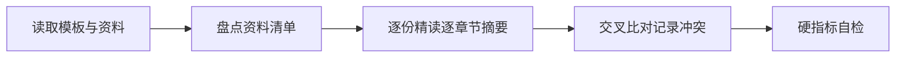

# Agent Control Center 单一控制面迁移 — 资料摘要

> 本文档做一件事：**精读主理人转交的全部原始资料，逐份、逐章节做出摘要**——后面任何人拿到这份摘要，都能通过章节号快速定位回原始文件的对应位置。

> 上游输入：主理人转交的 1 份 v2 设计方案 + 5 个源项目代码盘点；
> 产出者：`knowledge-ingest-engineer`（知识摄入工程师 - 闻资料），经 G1 校验与人工审核通过后交付。

---

## 0. 元信息

```yaml
标题: Agent Control Center 单一控制面迁移 - 资料摘要 v1.0
版本: v1.0
状态: Draft
创建日期: 2026-07-18
整理人: knowledge-ingest-engineer
审核人:
  - team-lead（主理人）

原始资料清单:
  - D1: C:\Users\Administrator\Desktop\agent-control-center-design-and-fix-plan-v2.md — 用户上传的 v2 设计方案，16 章节，定义收敛架构目标
  - D2: F:\Agents\myself-agent\ — Core Control Plane 候选，FastAPI/Python，41 Sprint 迭代
  - D3: F:\Agents\agent_tianshu\ — 天枢院多 Agent 协作系统，Workflow 原型
  - D4: F:\Agents\more_agents\ — 含 unified-admin/backend/frontend/clawlibrary 四个子项目
  - D5: F:\Agents\agent_contorl\ — 归档快照（ClawLibrary-main + OpenClaw-Admin-main）
  - D6: F:\Agents\super-agent-self\ — 迁移目标仓，当前仅含设计方案副本
```

| 版本 | 日期 | 作者 | 变更内容 |
| --- | --- | --- | --- |
| v1.0 | 2026-07-18 | knowledge-ingest-engineer | 初稿，覆盖 D1~D6 全部资料 |

---

## 1. 资料清单

> 列出全部原始资料，每份标注解析状态。解析失败或跳过的必须注明原因。

| 编号 | 文件名 | 类型 | 来源 | 解析状态 | 说明 |
| --- | --- | --- | --- | --- | --- |
| D1 | `agent-control-center-design-and-fix-plan-v2.md` | md | 用户上传（桌面） | 已解析 | 26682 字节，16 章节，权威设计方案 |
| D2 | `F:\Agents\myself-agent\` | 源代码项目 | 本地仓库 | 已解析 | Core Control Plane 候选，读取 README/pyproject.toml/DEVELOPMENT_PLAN.md/docker-compose.prod.yml + apps/packages/alembic/docs 目录结构 |
| D3 | `F:\Agents\agent_tianshu\` | 源代码项目 | 本地仓库 | 已解析 | 天枢院 Workflow 原型，读取 README.md + agents/dashboard/data/docs/memory/scripts/skills/subagents/workspaces 目录结构 |
| D4 | `F:\Agents\more_agents\` | 多子项目集合 | 本地仓库 | 已解析 | 4 个子项目，分别读取 unified-admin/(package.json+README+server/src 目录结构)、backend/(pyproject.toml+requirements.txt+main.py+app 目录结构)、frontend/(package.json+README)、clawlibrary/(package.json+README+LICENSE-ASSETS) |
| D5 | `F:\Agents\agent_contorl\` | 归档快照 | 本地仓库 | 已解析 | 读取 ClawLibrary-main/ 和 OpenClaw-Admin-main/ 顶层目录结构，确认来源 |
| D6 | `F:\Agents\super-agent-self\` | 空仓库 | 本地仓库 | 已解析 | 确认当前仅含 .git/agent-control-center-design-and-fix-plan-v2.md/.agents/.workbuddy/bin/delivery/skills，为空状态 |

**类型枚举**：`docx` / `pdf` / `pptx` / `xlsx` / `md` / `源代码项目` / `多子项目集合` / `归档快照` / `空仓库`

---

## 2. 资料内容摘要

> 逐份文档按自身章节结构做摘要。每条摘要标注章节号（`D编号，§章节`），后面任何人想核实某个点，直接定位回原文对应位置即可。

### D1：`agent-control-center-design-and-fix-plan-v2.md`

> 用户上传的 v2 设计方案，定义将 F:\Agents 下现有 Agent 资产收敛为单一可控控制面的完整架构目标 — 来源：用户上传（桌面）

| 章节 | 内容摘要 |
| --- | --- |
| D1,§1 执行摘要 | 现有项目不应继续以"三套系统互相调用"集成，推荐目标：一个任务与执行控制面、一个操作者控制台、一组可替换 Adapter、一套版本化 Workflow、一个由事件重建的可视化世界 |
| D1,§1 核心决策1 | myself-agent 是唯一任务、策略、审批、执行、审计、记忆和技能写模型 |
| D1,§1 核心决策2 | agent_tianshu 不再拥有独立任务生命周期，转为版本化 Workflow Definition |
| D1,§1 核心决策3 | more_agents/unified-admin 是唯一前端候选，Express 仅保留无状态 BFF 和协议代理职责 |
| D1,§1 核心决策4 | ClawLibrary 作为可视化包接入，UI 只消费稳定的读模型，不直接解释各后端原始事件 |
| D1,§1 核心决策5 | agent_contorl 作为上游源码快照归档，不再成为新的开发主线 |
| D1,§1 核心决策6 | more_agents/backend 只提取 AgentProfile、Worker 心跳、容量、Snapshot 等概念，不部署第二套 Orchestrator |
| D1,§1 核心决策7 | super-agent-self 可作为最终迁移仓库，但不得创建第四套任务后端 |
| D1,§1 冻结条件 | 在完成唯一执行入口、真实审批、租户隔离、持久任务和幂等副作用之前，冻结新增终端、桌面、插件和自进化功能 |
| D1,§2 现有资产归属表 | 8 项资产逐一指定最终角色：myself-agent→Core Control Plane、agent_tianshu→Workflow Catalog、unified-admin→Operator Console、backend→Reference Only、clawlibrary→Visualization Package、frontend→UI Component Source（迁移后退役）、agent_contorl→Archive、super-agent-self→Migration Target |
| D1,§2.1 明确不做 | 7 条禁令：不新建独立 Orchestrator、不让天枢与 myself-agent 双向创建任务、不让 Express BFF 保存状态、不复制 ClawLibrary 源码、不让 CLI/Cron/SubAgent/插件直接调用 Tool 实例、不共享 .env 暴露全部凭据、不把 mock 数据伪装成在线遥测 |
| D1,§3.1 唯一写入者 | 每类状态只能有一个权威写入者：Task/Run/StepRun→Core Control Plane、ApprovalRequest/CapabilityGrant→Policy/Approval 模块、WorkflowRun/WorkflowPhase→Workflow 模块、Worker/Lease/Heartbeat→WorkerBroker、DomainEvent→EventLog/Outbox、UI Snapshot→Projection 模块、外部状态→对应 Adapter |
| D1,§3.2 副作用同一 Interface | HTTP、CLI、Chat、Cron、SubAgent、Workflow、插件必须调用同一个 ExecutionControl interface；禁止 tool_registry.get_tool_instance().execute()、CLI 直接 tool.execute()、SubAgent 自行签发上下文、BFF 直接执行文件操作等旁路 |
| D1,§3.3 观察与控制分离 | Control Center 分三类 Module：Query/Telemetry（只读）、Command Gateway（转 ExecutionControl）、Privileged Adapter（PTY/文件/桌面/浏览器/备份，隔离进程或容器）；UI 风险提示不能替代服务端 Policy |
| D1,§3.4 Audit/Event/Telemetry 分离 | Domain Event 用于重建读模型、Audit Record 采用更严格保留和完整性保护、Metric/Log 不作为业务事实源 |
| D1,§4.1 身份与作用域 | ActorScope 含 tenant_id/workspace_id/principal_id/principal_type/roles/permissions/auth_context；只能由服务端认证模块生成，请求体不得接受可伪造身份，Repository 必须显式接收 ActorScope |
| D1,§4.2 任务与执行 | Task（稳定意图身份）、Run（一次执行尝试）、PlanVersion（不可变计划版本）、StepRun（步骤执行尝试）、ToolReceipt（规范结果和副作用证据）；重试创建新 Run 或 StepRun attempt，不得覆盖历史 |
| D1,§4.3 状态拆分 | 禁止合并成单一 task.state 字符串；TaskLifecycle（7 态）、WorkflowPhase（7 态）、WorkerStatus（5 态）、SessionState（4 态）各自独立 |
| D1,§4.4 审批与授权 | ApprovalRequest 含 approval_id/actor_scope/run_id/step_run_id/tool_name/normalized_args_hash/resource_scope/policy_digest/expires_at 等字段；CapabilityGrant 含 grant_id/nonce/key_id 等；只有审批完成且 Policy 再验证通过后才能创建 CapabilityGrant |
| D1,§4.5 Workflow 与 Agent | WorkflowDefinition 含 version/roles/phases/transitions/review_gates/routing_rules/stall_policy/output_contract；WorkflowRun 追踪 phase_history；AgentProfile 定义 role/capabilities/allowed_tools/model_profile/concurrency_limit；Worker 对 StepRun 持有 Lease；天枢部门名称属于 WorkflowPhase/Role 而非 TaskLifecycle |
| D1,§4.6 自进化模型 | MemoryRecord（scope+source+retention+confidence+content）、SkillVersion（不可变定义+来源证据+策略兼容）、SkillEvaluation（样本量+基线+质量增量+失败率+成本增量）；Skill 只有在达到最小样本量、质量提升和安全回归门槛后才能晋升 |
| D1,§5 目标架构 | Operator Console（unified-admin）通过 Query API→Projection、Command API→ExecutionControl、Provider Views→Adapters；Core Control Plane（myself-agent）含 ExecutionControl/Policy+Approval/Workflow Runtime/WorkerBroker/ToolGateway/Memory+Skill Eval/EventLog+Outbox/Audit Store；Adapters 含 OpenClaw/Hermes/Tianshu/Browser/Desktop/PTY/Plugin Host；Projection 含 AgentSnapshot/TaskTimeline/ApprovalQueue/WorldDelta/SourceHealth |
| D1,§6.1 ExecutionControl 接口 | submit(actor_scope, task_request)→task_id；execute(actor_scope, task_id, idempotency_key)→command_receipt；resume(actor_scope, approval_id, idempotency_key)→command_receipt；cancel(actor_scope, task_id, expected_revision)→command_receipt；不暴露 DB Session/Memory/Skill/Tool 实例或内部 Context |
| D1,§6.2 Policy 接口 | decide(actor_scope, action_request)→DENY(reason) / WAIT_APPROVAL(approval_spec) / GRANT(grant_spec)；不允许用 allowed=true + requires_approval=true 表达等待审批 |
| D1,§6.3 Approval 接口 | request(approval_spec)→approval_id；resolve(actor_scope, approval_id, decision, expected_revision)→resolution；expire(approval_id)→resolution；批准动作必须触发持久化 Resume Command 而非只更新审批表 |
| D1,§6.4 WorkerBroker 接口 | claim(worker_id, capabilities)→lease / none；heartbeat(worker_id, lease_id)→lease_status；complete(worker_id, lease_id, tool_receipt)→completion；fail(worker_id, lease_id, failure)→retry_decision |
| D1,§6.5 Workflow 接口 | install(definition)→workflow_version；instantiate(task_id, workflow_version)→workflow_run_id；handle_event(workflow_run_id, domain_event)→workflow_actions |
| D1,§6.6 ToolGateway 接口 | execute(capability_grant, tool_request)→tool_receipt；必须验证 Grant、nonce、参数哈希、资源范围和过期时间 |
| D1,§6.7 EventLog 与 Projection | EventLog.append(events)→append_receipt；EventLog.read(cursor, filters)→event_page；Projection.rebuild(stream)→projection_version；Projection.snapshot(scope)→control_center_snapshot |
| D1,§7.1 AgentCommand 协议 | TypeScript 定义：schemaVersion/commandId/commandType/idempotencyKey/tenantId/workspaceId/actor(type,id,roles)/target(kind,id,expectedRevision)/deadline/correlationId/data；命令结果区分 accepted/rejected/waiting_approval/completed/failed/cancelled |
| D1,§7.2 DomainEvent 协议 | TypeScript 定义：schemaVersion/eventId/eventType/source(system,instanceId)/tenantId/workspaceId/aggregate(kind,id,revision)/sequence/occurredAt/ingestedAt/correlationId/causationId/traceId/classification/actor/data；payload 应含 runId/stepRunId/attempt/policyDecisionId/approvalId/toolReceiptId |
| D1,§7.3 投递语义 | 数据库事务同时写业务状态和 Outbox；发布语义 at-least-once；消费者通过 eventId/aggregate revision/Inbox checkpoint 去重；不宣称 exactly-once，通过幂等副作用实现业务等价；SSE/WebSocket 只是传输 Adapter 不是事件事实源；Projection 必须支持从 EventLog 全量重建 |
| D1,§7.4 UI 数据可信度 | 所有 Snapshot 必须携带 source_status(live/stale/unavailable/simulated)+observed_at+projected_at+source_errors；后端失败时禁止把 mock 数据展示为真实 idle 状态 |
| D1,§8.1 部署 Profile 隔离 | Enterprise（无 shell/desktop、严格浏览器策略、高风险审批）、Personal（可选本地 shell/desktop 但限工作区+审批）、Development（Mock Adapter、测试账户、debug 标记）；不得允许普通请求通过 X-Edition 改变安全能力集 |
| D1,§8.2 Secret 分域 | Auth Token/Capability Grant/Webhook/数据加密使用不同密钥；支持 key_id、轮换和撤销；每个进程只获得自身需要 Secret；不共享全部 Provider Key 的 .env；日志/事件/错误执行字段级脱敏 |
| D1,§8.3 特权 Adapter 隔离 | Shell/PTY/桌面/插件/浏览器运行在独立进程或容器，限制文件系统根目录/网络目标/CPU/内存/执行时长/输出大小/子进程数量/环境变量/可加载模块；插件 Manifest permissions 必须成为运行时强制约束 |
| D1,§8.4 浏览器安全 | 每次请求/重定向/点击导航重新检查目标；阻止 localhost/私网/云元数据地址/DNS rebinding；表单提交/消息发送/支付/上传下载按真实副作用评估风险；browser.click 不得永久标记为固定 low risk |
| D1,§8.5 审计完整性 | 每个副作用记录 actor/decision/grant/tool receipt/资源范围；审计记录独立保留策略；如需 tamper-evident 必须加入 hash chain/签名/外部不可变存储 |
| D1,§9.1 myself-agent P0 修复清单 | 14 项：修复 execute 正常路径引用未定义 task、创建与执行分离、Policy 改三态、WAIT_APPROVAL 不签 Grant、Approval resolve 持久化 Resume、所有入口收敛 ExecutionControl、删除 SubAgent/CLI 旁路、租户和对象级过滤、移除可伪造身份、修复生产 Cron、修复 PostgreSQL SQLite 查询、Docker 按 Profile 安装依赖、CI 加前端/PG/Redis/Docker/安全测试、修 lint 基线 |
| D1,§9.2 agent_tianshu P0 修复清单 | 7 项（仅维持迁移期可用）：修复 /api/reports 缺 query 参数、修复双重 send_json、替换 shell=True、修复写死调度路径、JSON 文件写入加锁、明确三种运行模式、提取 WorkflowDefinition 后冻结旧状态机；不把迁移到 FastAPI 作为必做目标 |
| D1,§9.3 unified-admin P0 修复清单 | 7 项：以 OpenAPI 生成 myself-agent 客户端删除手写模型、明确 mock 数据不伪装在线、Express 删除业务写模型、高风险写操作只提交 AgentCommand、拆出只读 Query/Command Gateway/Privileged Adapter、拆分 4000+ 行单文件按行为 Module、清理 gitlink 和缺失 .gitmodules |
| D1,§9.4 ClawLibrary P0 修复清单 | 4 项：作为 workspace package 或固定版本依赖接入不复制源码、只消费 Projection 读模型、保留 MIT 来源和 Attribution、商业发布前替换 CC BY-NC-SA 视觉资产或取得授权 |
| D1,§10 推荐仓库结构 | agent-control-center/ 下含 apps/(control-api/operator-web/adapter-host/privileged-worker) + packages/(contracts/execution-control/policy/workflow/worker-broker/event-log/projection/provider-adapters/visualization) + migrations + docs/(adr/threat-model/domain-language/migration-plan/operations) + tests/(contract/integration/security/failure-injection/e2e)；不预先创建 shared-auth/shared-config/shared-ui 等无明确所有权的杂物包 |
| D1,§11 Phase 0 退出条件 | 部署拓扑只有一个 Task 写模型和一个 Orchestrator；每个资产有保留/迁移/退役决定；主分支 lint/基础测试/构建可重复执行；版本/镜像标签/健康响应/发布说明来自同一来源 |
| D1,§11 Phase 1 退出条件 | 高风险步骤批准前执行次数为 0；CLI/SubAgent/插件/Workflow 无法绕过 Policy；跨租户读写成功次数为 0；每个副作用可追溯到 command/decision/approval/grant/receipt |
| D1,§11 Phase 2 退出条件 | 在规划/审批/工具执行/结果提交时杀进程均可恢复；Redis 中断不丢任务；重复消息不产生重复外部副作用；nginx/HTTP 超时不影响后台 Run |
| D1,§11 Phase 3 退出条件 | 重复/乱序/断线重连测试通过；EventLog 重放生成相同 Snapshot；UI 不需要理解来源系统内部状态枚举；Adapter 替换不要求修改 Projection 或 UI 业务逻辑 |
| D1,§11 Phase 4 退出条件 | 所有写操作最终进入 ExecutionControl；控制台能明确显示 live/stale/unavailable/simulated；后端全离线时 UI 显示最后已知状态但不能显示为实时；端到端覆盖提交/等待审批/批准恢复/取消/Worker 离线 |
| D1,§11 Phase 5 退出条件 | 同一 Task 只有一个规范 task_id；WorkflowPhase 不修改 TaskLifecycle 所有权规则；Workflow 重放得到相同阶段历史；ClawLibrary 不直接调用来源系统写接口 |
| D1,§11 Phase 6 退出条件 | Skill 晋升可解释/可复现/可回滚；恶意插件无法访问宿主未授权文件/网络/凭据；特权动作全部具有审批和审计证据 |
| D1,§11 Phase 7 退出条件 | 连续观察期无状态漂移；数据总数/状态分布/关键审计对账通过；回滚演练满足 RTO/RPO；生产部署中不存在第二个任务写模型 |
| D1,§12 数据迁移策略 | 6 个数据源（myself-agent SQLite/PG/Alembic、agent_tianshu data json、天枢 memory SQLite、more_agents/backend 数据库、unified-admin wizard.db、本地备份）；7 条原则：不直接复制 DB 文件、建 external_reference、先只读后切换、保留原始时间戳/来源/批次、分别定义映射、无法确定标 unresolved、运行时产物不进主仓 |
| D1,§13 测试门禁 | 11 层测试覆盖：Module interface 行为/Adapter 契约/PG+Redis 集成/Command-Event schema 兼容/审批暂停恢复 E2E/跨租户对象级授权/重复乱序延迟事件/进程崩溃网络中断故障注入/插件 Shell 文件浏览器安全/前端 build+typecheck+Playwright/Docker 镜像启动迁移 |
| D1,§13.2 核心指标 | 批准前高风险执行=0、跨租户成功访问=0、重复外部副作用=0、审计缺失率=0、Snapshot 重放一致率=100%、卡死 Run 数=0 或自动入人工队列 |
| D1,§14 仓库治理 | 建立真实增量 Git 历史；每阶段独立可回滚提交；签名/保护版本标签；Python 锁文件 + Node npm ci + lockfile；生成 SBOM 记录上游包/许可证/本地修改；版本由一个源生成；CI 不手工维护测试数量；旧仓库只读后禁双线开发 |
| D1,§15 风险与缓解 | 10 项风险：继续维护多套 Orchestrator→唯一写模型 ADR+部署检查；UI/BFF 直接执行高权限→Command Gateway+Privileged Adapter；事件乱序重复→sequence+revision+Inbox 去重；Worker 崩溃→Lease+heartbeat+orphan recovery；审批后参数变化→绑定参数哈希+策略版本；插件主进程执行→独立进程+权限 RPC；多租户数据泄漏→ActorScope+Repository 强制过滤；mock 伪装在线→source_status+freshness 强制显示；上游复制漂移→固定来源版本+Adapter/Package 接入；ClawLibrary 资产许可证→替换资产或取得授权 |
| D1,§16 最终产品形态 | 用户打开控制中心可看到：AgentProfile 配置状态/Worker 在线状态/Task 生命周期+Workflow 阶段+具体 Run/StepRun/等待审批步骤及绑定工具参数资源范围/Worker Lease+心跳+恢复/调用的工具+产生的 Artifact/Memory/SkillVersion/数据实时性/来源状态/高风险命令全链路/任务卡住原因+自动恢复状态；最终关键：所有 Agent 行为只有一个可信执行入口、所有状态有唯一所有者、所有副作用可授权可审计可恢复 |

### D2：`F:\Agents\myself-agent\` — Controlled Agent Platform

> 功能最完整的 Agent 平台，v3.13.0，41 Sprint 迭代，2104 后端测试 + 231 前端测试，定位为 Core Control Plane — 来源：本地仓库

| 章节 | 内容摘要 |
| --- | --- |
| D2,README.项目介绍 | Controlled Agent Platform 是面向企业与个人场景的可控自进化 Agent 平台，LLM 严格限制在规划角色，输出结构化 JSON 执行计划，由策略引擎审核授权后交执行器落地 |
| D2,README.设计哲学 | 6 条原则：LLM 只规划不执行、策略引擎是唯一闸门、执行需授权令牌、记忆可参考不可越权、技能经审批方可复用、双版本共享核心 |
| D2,README.系统架构 | 用户层（Enterprise Web Vue 3 / Personal Jarvis 语音+桌面）→ FastAPI API Layer（REST/GraphQL/WebSocket/SSE）→ Agent Core（Planner/Policy/Executor/Memory/Skills/Audit/Eval/LLM GW）→ 数据层（SQLAlchemy ORM 24 表 Alembic，SQLite→PostgreSQL）→ 基础设施（限流/缓存/Prometheus/Docker/nginx） |
| D2,README.技术栈 | 后端 Python 3.11+/FastAPI/SQLAlchemy 2.x/Pydantic v2；数据库 SQLite→PostgreSQL+Alembic；LLM DeepSeek/GLM/Kimi/Doubao/Qwen/OpenRouter/OpenAI/Anthropic/Gemini/Ollama/llama.cpp；前端 Vue 3+Vite+Element Plus+Pinia+vue-i18n+ECharts；监控 Prometheus+Grafana；缓存 MemoryCache+Redis；测试 pytest+Vitest；部署 Docker Compose+nginx |
| D2,README.目录结构-packages | 23 个 packages：agent_core/db/llm_gateway/planner/policy/executor/memory/skills/evaluation/observability/cron/mcp/middleware/cache/auth/notification/graphql/vision/voice/personal_context/plugins/config + admin/messaging_gateway |
| D2,README.目录结构-apps | 3 个 apps：api_server（FastAPI 后端 29 路由模块）、enterprise_admin_web（Vue 3+Element Plus 21 视图+i18n+暗色主题+typed API+双后端）、personal_shell |
| D2,README.API 模块 | 29 路由模块覆盖：auth/rbac/vision/desktop/agents/plugins/tasks/memory/skills/audit/approvals/personal/editions/chat/conversations/cron/voice/export/health/analytics/admin/graphql/notifications/metrics + 3 个 WebSocket（tasks/chat/notifications） |
| D2,README.安全特性 | RBAC（4 角色+52权限+22资源+TTL缓存）、OIDC SSO（PKCE+nonce+JIT）、Capability Token（HMAC-SHA256）、7项安全策略检查、全局异常处理、IP限流、审计追踪、危险命令正则（22+模式）、ECharts XSS防护、生产API文档禁用、SECRET_KEY强制检查、MCP子进程环境变量过滤、Docker资源限制、监控镜像版本锁定、Python依赖版本上限约束 |
| D2,README.开发历程 | 41 Sprint：从 Sprint 1-3 骨架搭建（281 测试）到 Sprint 41 插件系统（2104+231 测试），历经核心能力→个人版→多模态→生产化→安全加固→企业级→功能完善→架构扩展→质量提升→前端优化→智能对话→企业安全→高级分析→语音视觉→桌面自动化→多Agent协作→插件系统 |
| D2,pyproject.toml.项目元信息 | name=controlled-agent-platform，version=3.11.0，requires-python>=3.11，核心依赖 fastapi/sqlalchemy2/alembic/pydantic2/psycopg2-binary/strawberry-graphql/structlog，optional 依赖 browser(playwright)/docx(python-docx)/dev(pytest/ruff/bandit) |
| D2,DEVELOPMENT_PLAN.产品定义 | 一套 Agent Core 底座 + 两个产品版本：Enterprise Edition（企业安全可控 Agent，网页自动化+文档生成+技能审批，Phase 1 优先交付）、Personal Jarvis Edition（个人智能助手，语音+桌面控制+长期记忆，Phase 2+） |
| D2,DEVELOPMENT_PLAN.数据库设计 | 8 张表：tasks/task_steps/audit_events/memories/skills/skill_runs/approvals/edition_profiles（注：README 中提到 24 表，开发计划中 8 表为初始设计，后续扩展到 24 表） |
| D2,DEVELOPMENT_PLAN.安全模型 | 7 条默认禁止行为（任意 shell/删除文件/写入 workspace 外/访问 localhost/自动提交表单/Cron/下载执行/修改系统设置）；Capability Token 机制（HMAC-SHA256+5分钟有效+绑定 task_id+step_id+tool_name+args_hash）；6 层 Prompt Injection 防护 |
| D2,alembic 迁移 | 14 个迁移版本：initial_schema_10_tables → users → task_templates_and_dependencies → notifications → messaging_and_marketplace → rbac → llm_cost_records → missing_indexes → remaining_indexes → skill_benchmark → production_critical_indexes → composite_index → unique_constraint_sso_id → round5_audit_indexes |
| D2,docker-compose.prod.yml | 生产部署含 init-frontend/migrate/api/db(postgres:16-alpine)/nginx 五个服务；API 资源限制 1G 内存 1 CPU，DB 限制 512M；健康检查通过 /api/v1/health/ready |
| D2,docs 目录 | 9 个文档：api_reference/architecture/deployment/editions/memory_design/security_model/skill_lifecycle/roadmap + 2 个 bugfix plan（2026-05-21/2026-05-22） |
| D2,目录结构概览与 D1 对应 | packages/ 中 agent_core=编排器/状态机，policy=安全策略引擎+Capability Token，executor=工具执行器，对应 D1,§5 的 Core Control Plane 角色；apps/api_server 对应 D1,§10 的 apps/control-api；apps/enterprise_admin_web 将被 unified-admin 替代 |

### D3：`F:\Agents\agent_tianshu\` — 天枢院多 Agent 协作系统

> 以宋代枢密院制为灵感的主题化多 Agent 流程原型，转为版本化 WorkflowDefinition — 来源：本地仓库

| 章节 | 内容摘要 |
| --- | --- |
| D3,README.架构概览 | 皇帝(用户)→承旨司(Receiver,消息接入/意图识别/任务创建)→中书局(Planning,需求分析/任务拆解/方案设计)→审核院(Review,三审制:初审+复审+终审)→调度监(Dispatch,智能路由/负载均衡)→编修馆(Doc)/工艺局(Eng)/质检司(QA)→汇总阁(Aggregation,结果汇总/回奏) |
| D3,README.状态流转 | 7 态：Pending→Receiving→Planning→Reviewing→Assigned→Doing→Done，另有 Cancelled(终态)/Blocked(叫停态) |
| D3,README.核心特性 | 三审制质量把关、智能路由基于技能自动匹配、30秒调度更快响应+4阶段停滞自动恢复、HTMX零构建暗色主题看板、23个技能6大类、宫殿记忆 SQLite FTS5 全文搜索+知识图谱、Webhook通知6种事件类型 |
| D3,README.目录结构 | agents/(9个Agent配置JSON: receiver/planning/review/dispatch/doc/eng/qa/aggregation)、workspaces/(Agent workspace含SOUL.md+记忆+身份)、scripts/(server.py FastAPI:7892/scheduler_scan.py 30s扫描/auto_dispatch.py/notifications.py)、dashboard/(HTMX看板index.html)、skills/(registry.json 23技能+tianshu_api.py SDK)、data/(tasks.json/comments.json/templates.json)、docs/、memory/(palace_memory.py)、subagents/(subagent_manager.py)、openclaw-agents-config.json |
| D3,README.技能系统 | 23 个技能分 6 大类：输入处理(message-classify/intent-recognition/priority-detection/task-create)、规划(requirement-analysis/task-decomposition/solution-design/effort-estimation)、审核(completeness-check/feasibility-review/quality-audit/risk-assessment)、调度(skill-matching/load-balancing/parallel-optimization/progress-tracking)、执行(technical-writing/documentation/coding/test-design/security-scan)、输出(result-aggregation/summarization/report-merge) |
| D3,README.停滞恢复 | 调度器每 30 秒扫描，4 阶段：≥180s 自动重试、≥360s 升级审核院协调、≥540s 升级调度监协调、≥720s 自动回滚上一状态 |
| D3,README.权限链 | Agent 间通过 subagents.allowAgents 实现严格单向调用链：receiver→planning→review→dispatch→[doc/eng/qa]，aggregation→receiver(闭环) |
| D3,README.模型支持 | 每个 Agent 有独立 models.json，支持 Qwen Portal(OAuth免费)/百炼平台(API Key)/本地模型(llamacpp) |
| D3,README.技术栈 | Python 3.10+/FastAPI/uvicorn，依赖 OpenClaw(三省六部制/myself-agent)运行环境，数据存储为 JSON 文件 |
| D3,README.与 D1 对应 | D1,§2 将 agent_tianshu 定位为 Workflow Catalog，提取角色/阶段/审核门/路由与停滞策略转为 WorkflowDefinition；D1,§4.5 明确天枢部门名称属于 WorkflowPhase/Role 而非 TaskLifecycle；D1,§9.2 列出 7 项 P0 修复仅为维持迁移期可用性 |

### D4：`F:\Agents\more_agents\` — 4 个子项目集合

> 含 unified-admin（唯一前端候选）、backend（第二套原型 Reference Only）、frontend（Next.js 原型，迁移后退役）、clawlibrary（可视化包） — 来源：本地仓库

| 章节 | 内容摘要 |
| --- | --- |
| D4,unified-admin/package.json | name=claw-admin, version=1.0.2, license=MIT, Vue 3+Naive UI+Express 5+Phaser 3+xterm.js+node-pty+better-sqlite3；scripts 含 dev(vite)/dev:server(node express)/dev:all(concurrently)/build(vue-tsc+vite build) |
| D4,unified-admin/README.项目简介 | Claw Admin 是基于 Vue 3 的 AI 智能体管理平台，同时支持 OpenClaw Gateway 和 Hermes Agent 两大网关，核心亮点：双网关支持、Web CLI 终端(xterm.js)、多智能体协作、实时监控、国际化、Naive UI 暗色主题 |
| D4,unified-admin/src 目录结构 | views/(28个视图目录: agents/backup/channels/chat/config/cron/evidence/files/hermes/memory/models/monitor/myself-agent/myworld/nodes/office/remote-desktop/sessions/settings/skills/system/terminal/tools + Dashboard.vue/BreakRoom.vue/Login.vue)、api/(connect.ts/http-client.ts/rpc-client.ts/websocket.ts/myself-agent.ts/evidence.ts/hermes//types/)、adapters/(museum)、museum/(adapters/core/data/runtime/ui + main.ts/clawlibrary.config.json/remap.ts)、stores/components/composables/layouts/i18n/router/utils/assets |
| D4,unified-admin/server 目录 | 4 个文件：index.js(Express主服务,约2000行含Gateway/SSE/终端/Hermes CLI/文件管理/系统监控/snapshot聚合)、gateway.js(OpenClaw Gateway WebSocket客户端)、database.js(better-sqlite3,含备份记录CRUD)、hermes-proxy.js(Hermes API代理) |
| D4,unified-admin/server/index.js.关键行为 | Express 服务端直接管理 PTY 终端会话(terminalSessions)、Hermes CLI 会话(hermesCliSessions)、桌面会话(desktopSessions)；通过 SSE 广播 Gateway 事件；实现 /api/openclaw/snapshot 聚合 FastAPI+Gateway+系统指标(含 buildMockSnapshot 兜底)；代理 /api/myself-agent/* 到 FastAPI 后端；实现文件 CRUD(list/get/set/mkdir/delete/rename/upload)；npm 全局更新 OpenClaw |
| D4,backend/pyproject.toml | name=agent-command-center, version=0.1.0, description=Multi-Agent Collaboration Framework with Pixel-Art Dashboard, requires-python>=3.11 |
| D4,backend/requirements.txt | fastapi/uvicorn/pydantic2/pydantic-settings/sqlalchemy[asyncio]/aiosqlite/asyncpg/alembic/redis[hiredis]/sse-starlette/websockets/httpx/python-dotenv/aiofiles/psutil |
| D4,backend/app 目录结构 | agents/(base/codegen/data_analysis/domain/general/runtime)、api/(compat/+v1/+router.py)、config.py、core/(redis)、database.py、llm/(gateway)、models/(agent/audit_event/base/chat/monitoring/scenario/task/task_step/user)、schemas、services/(orchestrator/agent_registry/event_bus/health_monitor/task_queue)、workers/(空 __init__.py) |
| D4,backend/app/main.py | FastAPI lifespan 初始化：init_db→ensure_default_admin→init_llm_gateway→orchestrator.start()→health_monitor.start()；包含 CORS 中间件、api_router(compat events/rpc/health/auth/system/config/files/backup 路由)；第二套 Orchestrator，与 myself-agent 形成竞争 |
| D4,backend/与 D1 对应 | D1,§2 将 more_agents/backend 定位为 Reference Only，只提取 AgentProfile/Worker 心跳/容量/Snapshot 概念，不部署第二套 Orchestrator |
| D4,frontend/package.json | name=frontend, version=0.1.0, Next.js 16.2.6+React 19.2.4+TailwindCSS 4+lucide-react+class-variance-authority |
| D4,frontend/README | 标准 create-next-app 项目，独立 Next.js 控制中心原型 |
| D4,frontend/与 D1 对应 | D1,§2 将 more_agents/frontend 定位为 UI Component Source，迁移少量有价值视图后退役 |
| D4,clawlibrary/package.json | name=claw-library, version=0.1.0, description=2D pixel-game museum UI for OpenClaw, license=MIT, 仅依赖 phaser^3.90.0；scripts 含 dev/build/validate/test:security/qa:movement/qa:visual |
| D4,clawlibrary/README.定位 | ClawLibrary 是 OpenClaw 的 2D 像素游戏风格控制界面，将生成资产/运行时活动/工作状态变为可浏览、预览和实时监控的可视化库界面 |
| D4,clawlibrary/README.房间映射 | 11 个房间：document archive/image atelier/memory vault/skill forge/interface gateway/code lab/scheduler/alarm board/runtime monitor/queue hub/break room；回答两个问题：已存在哪些资产、OpenClaw 正在对它们做什么 |
| D4,clawlibrary/README.运行时模型 | 由协议式数据+实时遥测驱动：map.logic.json(房间布局/锚点/行走图/工作区)、asset.manifest.json(逻辑资产定义)、scene-art.manifest.json(演员和场景美术绑定)、work-output.protocol.json(工作状态映射)、openclaw-telemetry.mjs(OpenClaw 状态到实时信号桥接) |
| D4,clawlibrary/README.配置 | clawlibrary.config.json 含 openclaw(home/workspace)/server(host/port)/auth(password/sessionTtlHours)/ui(locale/debug/actor variant)/telemetry(pollMs)；环境变量覆盖支持 CLAWLIBRARY_SERVER_HOST/PORT/ACCESS_PASSWORD/SESSION_TTL_HOURS |
| D4,clawlibrary/LICENSE-ASSETS | 视觉资产采用 CC BY-NC-SA 4.0：可分享/改编/非商业使用，需 attribution 为「龙虾图书馆/ClawLibrary」，商业使用须替换资产或取得单独授权 |
| D4,clawlibrary/与 D1 对应 | D1,§2 将 ClawLibrary 定位为 Visualization Package，打包接入建立 Telemetry Adapter；D1,§9.4 要求作为 workspace package 接入不复制源码、只消费 Projection 读模型、保留 MIT+Attribution、商业发布前替换 CC BY-NC-SA 资产 |

### D5：`F:\Agents\agent_contorl\` — 归档快照

> OpenClaw Admin 与 ClawLibrary 下载快照，只读归档，不再开发 — 来源：本地仓库

| 章节 | 内容摘要 |
| --- | --- |
| D5,ClawLibrary-main | ClawLibrary 的原始下载快照，目录结构与 D4/clawlibrary 一致（clawlibrary.config.json/docs/index.html/LICENSE/LICENSE-ASSETS.md/package.json/public/README.md/README_cn.md/remap.html/scripts/src/start_clawlibrary.command/tsconfig.json/vite.config.ts），是 ClawLibrary 的上游来源 |
| D5,OpenClaw-Admin-main | OpenClaw Admin（即 unified-admin 的上游来源）的原始下载快照，目录结构含 AGENTS.md/CHANGELOG.md/CONTRIBUTING.md/data/docs/DYNAMIC_AGENTS_*.md/index.html/LICENSE/package.json/public/README.md/README.en.md/server/src/tsconfig.*/vite.config.ts/wolai-config.yaml，是 unified-admin 的上游来源 |
| D5,与 D1 对应 | D1,§2 将 agent_contorl 定位为 Archive，记录上游来源 commit/许可证/本地补丁后只读归档，不再成为新的开发主线 |

### D6：`F:\Agents\super-agent-self\` — 迁移目标仓

> 当前空状态，仅含设计方案副本 — 来源：本地仓库

| 章节 | 内容摘要 |
| --- | --- |
| D6,目录结构 | 当前仅含 .git/.agents/.workbuddy/agent-control-center-design-and-fix-plan-v2.md/bin/delivery/skills/，无实际业务代码 |
| D6,与 D1 对应 | D1,§2 将 super-agent-self 定位为 Migration Target，仅在迁移 ADR 批准后初始化，不得创建第四套任务后端；D1,§10 推荐的 agent-control-center/ 目录结构是迁移后的目标形态 |

---

## 3. 冲突记录

> 不同资料对同一事实描述矛盾时，**并列保留两个版本**，不做裁决。

| 编号 | 冲突主题 | 版本 A | 出处 A | 版本 B | 出处 B | 差异说明 |
| --- | --- | --- | --- | --- | --- | --- |
| X1 | 数据库表数量 | 24 表 | D2,README.系统架构 | 8 表（初始设计） | D2,DEVELOPMENT_PLAN.数据库设计 | README 记录的是最终状态（41 Sprint 后），开发计划记录的是 Sprint 1 初始设计（8 张表），后续扩展至 24 张表，非真正冲突而是时间线差异 |
| X2 | 系统编排者数量 | 唯一写模型（myself-agent 是唯一 Orchestrator） | D1,§1 核心决策1 | 存在第二套 Orchestrator（backend/app/services/orchestrator.py） | D4,backend/app/main.py + app/services | more_agents/backend 当前有自己的 Orchestrator 实现（orchestrator.start()），与 D1 要求的"唯一写模型"冲突；D1,§2 已明确 backend 为 Reference Only 不部署，但当前代码中仍存在 |
| X3 | Express BFF 职责 | Express 仅保留无状态 BFF 和协议代理 | D1,§1 核心决策3 + §9.3 | Express 直接管理 PTY 终端/文件 CRUD/npm 更新/备份/SQLite 业务写 | D4,unified-admin/server/index.js | unified-admin 的 Express server 当前直接执行高权限操作（PTY 终端会话、文件增删改、npm 全局安装），违反 D1 要求的无状态 BFF 定位 |
| X4 | ClawLibrary 接入方式 | 作为 workspace package 或固定版本依赖接入，不复制源码 | D1,§9.4 P0-1 | ClawLibrary 源码被复制到 3 处（D4/clawlibrary + D5/ClawLibrary-main + D4/unified-admin/src/museum） | D4,clawlibrary + D5 + D4,unified-admin/src/museum | 当前 ClawLibrary 源码存在于多个位置（独立项目+归档快照+unified-admin 内嵌 museum），D1 要求统一为单一包依赖 |
| X5 | mock 数据处理 | 禁止把 mock 数据展示为真实 idle 状态 | D1,§2.1 + §7.4 + §9.3 P0-2 | snapshot 接口在所有后端离线时返回 buildMockSnapshot()（mode=mock 但资源显示 idle） | D4,unified-admin/server/index.js | /api/openclaw/snapshot 接口在 FastAPI+Gateway 全离线时返回 mock snapshot，资源状态标记为 idle 而非 unavailable，违反 D1 的 source_status 要求 |
| X6 | agent_tianshu 框架 | 不把"迁移到 FastAPI"作为必做目标 | D1,§9.2 | agent_tianshu 已使用 FastAPI (scripts/server.py FastAPI :7892) | D3,README.技术栈 | 天枢当前已基于 FastAPI 运行，D1 的表述意为不强制框架迁移（保持现状即可），非真正冲突 |
| X7 | 前端技术栈选择 | unified-admin（Vue 3+Naive UI）是唯一前端候选 | D1,§1 核心决策3 | 存在独立的 Next.js 前端原型（frontend/） | D4,frontend/package.json | more_agents/frontend 是独立的 Next.js 控制中心原型，D1,§2 已明确迁移少量有价值视图后退役，当前两套前端并存 |

---

## 4. 硬指标清单

| 章节 | 硬指标 | 状态 |
| --- | --- | --- |
| §1 | 每份资料有解析状态，失败/跳过注明原因 | ✅ |
| §2 | 每份文档按章节逐条摘要，每条标注了 `D编号，§章节` | ✅ |
| §3 | 冲突信息并列保留，不做裁决 | ✅ |
| §0 | 全文不残留任何模板占位符、示例前缀、待填日期或事实缺口标记 | ✅ |
| §0 | 保留全部核心章节：§0 元信息、§1 资料清单、§2 资料内容摘要、§3 冲突记录、§4 硬指标清单 + 附录A + 附录B | ✅ |

---

## 附录 A：生成流程

### 流程总览

| 步骤 | 动作 | 落入章节 |
| --- | --- | --- |
| Step0 | 读取模板 + 全部原始资料（D1 v2 设计方案 + D2~D6 源项目 README/依赖清单/目录结构） | — |
| Step1 | 盘点资料清单，标注解析状态（6 份全部已解析） | §1 |
| Step2 | 逐份打开资料，按自身章节结构逐条摘要（D1 16 章节 48 条、D2 16 条、D3 10 条、D4 17 条、D5 2 条、D6 2 条） | §2 |
| Step3 | 交叉比对不同资料，发现并记录 7 条冲突/差异 | §3 |
| Step4 | 逐项核验硬指标（5 项全 ✅） | §4 |



### 整理原则

1. **逐份精读，不跨文档归并**：摘要按文档自身章节结构组织，不做跨文档的主题重组（那是下游的事）
2. **出处即章节号**：每条摘要标注 `D编号，§章节`，直接映射回原文位置
3. **冲突保留**：矛盾信息并列保留两个版本，不擅自裁决
4. **事实驱动**：以原始资料中的事实为准，不添加主观推断

### 引用定位汇总

| 资料 | 章节摘要条数 | 定位粒度 |
| --- | --- | --- |
| D1 v2 设计方案 | 48 条 | §章节级（16 个顶层章节 + 子章节） |
| D2 myself-agent | 16 条 | README/pyproject.toml/DEVELOPMENT_PLAN/alembic/docker-compose/docs 目录级 |
| D3 agent_tianshu | 10 条 | README 各功能区块级 |
| D4 more_agents | 17 条 | 各子项目 package.json/README/main.py/目录结构级 |
| D5 agent_contorl | 2 条 | 归档快照顶层目录级 |
| D6 super-agent-self | 2 条 | 目录结构级 |
| **合计** | **95 条** | — |

---

## 附录 B：解析 Skill

- `docx`：Word 类产品/业务文档
- `pdf`：PDF 类规范、手册、报告
- `pptx`：PPT 类方案/汇报
- `xlsx`：Excel 类数据清单、指标表
- `md`：Markdown 设计方案、开发计划、技术文档（本次 D1 使用）
- `源代码项目`：Python/Node.js 项目，通过 README + 依赖清单（pyproject.toml/requirements.txt/package.json）+ 目录结构 + 入口文件解析（本次 D2/D3 使用）
- `多子项目集合`：Monorepo 或多项目目录，逐个子项目独立解析（本次 D4 使用）
- `归档快照`：只读快照，记录来源和目录结构即可（本次 D5 使用）
- `空仓库`：确认空状态，记录当前内容（本次 D6 使用）
