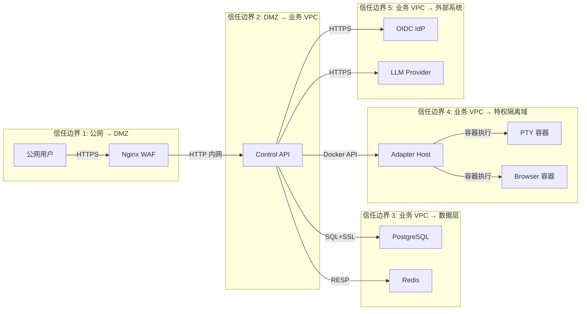
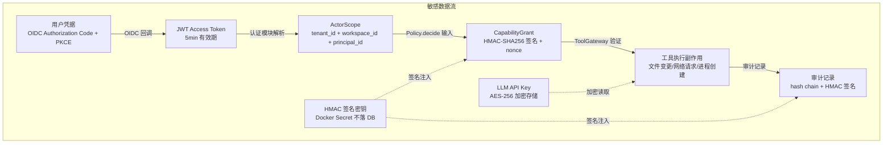

# AICoding 架构设计 · 安全设计

> 本文档为《AICoding 架构设计》核心产物之一，对应**《安全架构设计模版》**。
>
> **上游输入**：《系统设计》（G4 通过）定义的 8 核心模块（M1~M8）、数据流、接口契约、身份边界、外部依赖和运行形态；
> `material_digest.md` 中 D1 §8 安全模型与 D2 myself-agent 安全特性。
>
> **本系统特有安全要求**（来自 D1 v2 设计方案）：
> 1. Profile 隔离：Enterprise / Personal / Development 三态，不得通过 X-Edition 改变安全能力集
> 2. Secret 分域：Auth Token / Capability Grant / Webhook / 数据加密使用不同密钥
> 3. 特权 Adapter 隔离：Shell/PTY/浏览器在独立容器，9 项资源限制
> 4. 浏览器安全：阻 SSRF / DNS rebinding
> 5. 审计完整性：hash chain + HMAC 签名 + 密钥版本号管理
>
> **部署形态说明**：本系统为 self-hosted Docker Compose 单机部署（非公有云），因此部分云安全产品（DDoS 高防、云 WAF、云防火墙、堡垒机、KMS 云服务、SOC）的适用性需根据实际部署环境裁剪，在对应章节中逐项说明。

---

## 1. 安全总体架构

### 1.1 安全总体架构图

```mermaid
flowchart TB
    subgraph 用户
        U1[平台架构负责人]
        U2[Agent 运维操作者]
        U3[安全合规审计员]
        U4[DevOps/SRE]
    end

    subgraph 公网入口信任域
        DNS[DNS 解析]
        NG[Nginx 反向代理<br/>TLS 1.3 终结 + 路由 + 限流<br/>基础 WAF 规则: SQLi/XSS/CC 防护]
    end

    subgraph 业务 VPC 信任域
        API[Control API<br/>FastAPI 应用<br/>OIDC JWT 校验 + RBAC + 三态 Policy]
        OW[Outbox Worker<br/>后台任务]
        AH[Adapter Host<br/>Docker 容器生命周期管理]
    end

    subgraph 数据信任域
        PG[PostgreSQL 16<br/>业务主数据 + Outbox + Audit<br/>SSL 连接 + 行级 ActorScope 过滤]
        RD[Redis 7<br/>会话 + 缓存 + 限流<br/>AUTH 密码 + 网络隔离]
    end

    subgraph 特权隔离信任域
        PT[PTY Adapter 容器<br/>seccomp + cgroups<br/>非 root + 资源限制]
        BR[Browser Adapter 容器<br/>SSRF 防护 + DNS rebinding 阻断]
    end

    subgraph 可观测信任域
        LF[Langfuse<br/>OTel 链路追踪]
        PR[Prometheus<br/>指标采集]
        GR[Grafana<br/>告警 + Dashboard]
    end

    subgraph 外部系统
        OIDC[OIDC IdP<br/>认证 + JWT 颁发]
        LLM[LLM Provider<br/>10+ 模型]
    end

    subgraph 安全控制点
        AUTH[身份认证<br/>OIDC SSO + PKCE + JWT]
        POLICY[策略引擎<br/>三态 DENY/WAIT_APPROVAL/GRANT]
        AUDIT[审计链<br/>hash chain + HMAC-SHA256]
        SECRET[密钥管理<br/>Docker Secret + .env gitignored]
    end

    U1 & U2 & U3 & U4 -->|HTTPS| DNS --> NG
    NG --> API
    API <-->|OAuth/OIDC| OIDC
    API -->|REST HTTPS| LLM
    API --> PG & RD
    OW --> PG
    API --> AH
    AH --> PT & BR
    API -.OTel.-> LF
    API -.Metrics.-> PR --> GR

    AUTH -.拦截.-> API
    POLICY -.决策.-> API
    AUDIT -.记录.-> PG
    SECRET -.注入.-> API & AH
```



**安全组件清单**：

| 组件 | 选型 / 机制 | 作用范围 | 适用性说明 |
| --- | --- | --- | --- |
| TLS 终结 | Nginx（TLS 1.3） | 公网入口 | 全链路 HTTPS；禁用 SSLv3、TLS 1.0/1.1 |
| 基础 WAF | Nginx limit_req + OWASP ModSecurity 规则集 | Web 应用层 | SQL 注入 / XSS / CC / 路径遍历基础防护；self-hosted 环境不使用云 WAF |
| 防火墙 | Docker 网络隔离 + iptables | 容器间 / 主机 | 三级网络隔离（DMZ / 业务 / 数据 / 特权隔离） |
| 主机安全 | 非 root 用户运行 + 最小化镜像 | 全部容器 | alpine 基础镜像；定期安全补丁 |
| 容器隔离 | Docker seccomp + cgroups + capabilities drop | 特权 Adapter 容器 | PTY/Browser Adapter 9 项资源限制 |
| 数据安全审计 | t_audit_record hash chain + HMAC-SHA256 签名 | 审计表 | 篡改证明审计链；密钥版本号管理 |
| 密钥管理 | Docker Secret + .env（git ignored） | 全部密钥 | 5 类密钥分级；禁止硬编码；CI 红线扫描 |
| 身份认证 | OIDC SSO（PKCE + nonce + JIT）+ JWT | 全部用户接口 | 外部 OIDC IdP 颁发 JWT；本系统校验 + ActorScope 生成 |
| 策略引擎 | 三态 Policy（DENY / WAIT_APPROVAL / GRANT） | 执行控制域 | 替代布尔 RBAC；高风险操作强制审批 |
| 入侵检测 | Prometheus 告警 + 异常登录检测 | 安全事件监控 | self-hosted 环境不使用云 IDS/IPS；应用层异常行为检测 |
| 运维审计 | SSH 操作日志 + Docker 事件日志 | 运维通道 | self-hosted 环境不使用堡垒机；SSH 密钥登录 + 操作记录 |

> **裁剪说明**：本系统为 self-hosted Docker Compose 单机部署，不涉及公有云 DDoS 高防、云 WAF、云防火墙、堡垒机、SOC 等云安全产品。对应的防护能力由 Nginx WAF 规则 + Docker 网络隔离 + iptables + 应用层安全控制替代。若后续迁移至公有云，需按云安全产品矩阵补充对应组件。

### 1.2 威胁模型（STRIDE）

基于《系统设计》§3.2 模块边界、数据流、接口契约、身份边界和外部依赖，采用 **STRIDE** 方法识别威胁。每条威胁映射到后续章节的缓解措施，形成"威胁—缓解措施映射表"。

#### 1.2.1 信任边界图



**信任边界说明**：

| 边界编号 | 边界名称 | 跨边界数据 | 主要威胁 |
| --- | --- | --- | --- |
| TB-1 | 公网 → DMZ | 用户 HTTP 请求 | 仿冒（身份伪造）、DoS（DDoS/CC）、篡改（请求注入） |
| TB-2 | DMZ → 业务 VPC | Nginx 转发请求 | 权限提升（绕过鉴权）、信息泄露（调试信息） |
| TB-3 | 业务 VPC → 数据层 | SQL 查询、缓存读写 | 篡改（SQL 注入）、信息泄露（数据泄露）、否认（缺少审计） |
| TB-4 | 业务 VPC → 特权隔离域 | Docker API 调用 | 权限提升（容器逃逸）、篡改（命令注入）、信息泄露（宿主文件） |
| TB-5 | 业务 VPC → 外部系统 | OIDC 认证、LLM API 调用 | 仿冒（Token 伪造）、信息泄露（API Key 泄露）、否认（外部操作无审计） |

#### 1.2.2 敏感数据流图



#### 1.2.3 STRIDE 威胁清单

##### S — 仿冒（Spoofing）

| 编号 | 威胁 | 攻击路径 | 暴露面 | 严重度 |
| --- | --- | --- | --- | --- |
| S-01 | OIDC JWT 伪造或篡改 | 攻击者构造伪造 JWT 冒充合法用户 | API 认证入口（TB-1/2） | 高 |
| S-02 | CapabilityGrant 伪造或重放 | 攻击者窃取或构造 Grant 令牌执行未授权工具 | ToolGateway 接口（TB-3） | 高 |
| S-03 | LLM API Key 泄露后冒用 | API Key 从代码/配置/日志泄露，被外部调用 LLM | 外部系统调用（TB-5） | 高 |
| S-04 | Worker 伪造身份认领 StepRun | 恶意 Worker 注册并认领不属于自身的 StepRun | WorkerBroker 接口（TB-3） | 中 |
| S-05 | OIDC Authorization Code 截获 | 中间人截获 Authorization Code 重放（非 PKCE 场景） | OIDC 回调（TB-5） | 中 |

##### T — 篡改（Tampering）

| 编号 | 威胁 | 攻击路径 | 暴露面 | 严重度 |
| --- | --- | --- | --- | --- |
| T-01 | 审批后参数篡改 | 审批通过后，工具执行参数被修改，绕过审批约束 | Policy → ToolGateway（TB-3） | 高 |
| T-02 | 审计记录篡改 | 攻击者修改 t_audit_record 记录，消除操作痕迹 | 数据层（TB-3） | 高 |
| T-03 | SQL 注入篡改业务数据 | 恶意输入通过 SQL 注入修改任务状态/审批结果 | API 数据层（TB-3） | 高 |
| T-04 | 请求参数篡改 | 攻击者修改 AgentCommand 中的 actor/target/data 字段 | API 入口（TB-1/2） | 中 |
| T-05 | 配置文件篡改 | 攻击者修改 .env 或 Docker Compose 配置注入恶意密钥 | 运维通道 | 中 |
| T-06 | DomainEvent 篡改 | 攻击者修改事件数据导致 Projection 重建出错误读模型 | 数据层（TB-3） | 中 |

##### R — 否认（Repudiation）

| 编号 | 威胁 | 攻击路径 | 暴露面 | 严重度 |
| --- | --- | --- | --- | --- |
| R-01 | 副作用执行后否认 | 工具执行产生副作用（文件删除/网络请求），操作者否认发起 | ToolGateway（TB-4） | 高 |
| R-02 | 审批操作否认 | 审批者否认批准/拒绝过某审批请求 | Approval Gateway（TB-3） | 高 |
| R-03 | 策略决策否认 | 系统管理员修改策略规则后否认，导致历史决策无法追溯 | Policy Engine（TB-3） | 中 |
| R-04 | 外部 LLM 调用无审计 | 调用 LLM Provider 的请求/响应未记录，无法追溯 | 外部系统（TB-5） | 中 |

##### I — 信息泄露（Information Disclosure）

| 编号 | 威胁 | 攻击路径 | 暴露面 | 严重度 |
| --- | --- | --- | --- | --- |
| I-01 | 跨租户数据泄露 | 查询未带 tenant_id 过滤，返回其他租户数据 | Repository 层（TB-3） | 高 |
| I-02 | 敏感字段明文泄露 | LLM API Key / HMAC 密钥在日志/错误堆栈/响应中泄露 | 全链路 | 高 |
| I-03 | SSRF 通过浏览器 Adapter | 浏览器 Adapter 访问内网/localhost/云元数据地址 | 特权隔离域（TB-4） | 高 |
| I-04 | 错误响应泄露内部信息 | 异常堆栈/SQL/文件路径在 HTTP 响应中返回 | API 入口（TB-2） | 中 |
| I-05 | 日志中泄露敏感数据 | 结构化日志打印 Token/API Key/用户隐私 | 全链路 | 中 |
| I-06 | Docker 容器逃逸读取宿主文件 | 特权容器逃逸读取宿主 .env 文件中的密钥 | 特权隔离域（TB-4） | 高 |

##### D — 拒绝服务（DoS）

| 编号 | 威胁 | 攻击路径 | 暴露面 | 严重度 |
| --- | --- | --- | --- | --- |
| D-01 | API 接口高频请求耗尽资源 | 攻击者高频调用 submit/execute 接口 | API 入口（TB-1） | 中 |
| D-02 | LLM Provider 慢响应拖垮 Worker | LLM 调用超时占满 Worker 连接池 | 编排执行域（TB-5） | 中 |
| D-03 | Outbox 表积压导致 PG 磁盘满 | 事件积压不消费，PG 磁盘写满 | 数据层（TB-3） | 中 |
| D-04 | 大量并发 Workflow Checkpoint 写入 PG 锁竞争 | 50+ 并发 Workflow Checkpoint 导致 PG 行锁竞争 | 数据层（TB-3） | 低 |
| D-05 | 恶意大文件上传/大体量输出耗尽磁盘 | 工具执行输出过大或上传大文件 | 特权隔离域（TB-4） | 中 |

##### E — 权限提升（Elevation of Privilege）

| 编号 | 威胁 | 攻击路径 | 暴露面 | 严重度 |
| --- | --- | --- | --- | --- |
| E-01 | 水平越权（IDOR）访问其他用户资源 | 通过修改 URL 中的 taskId/approvalId 访问他人资源 | API 接口（TB-2/3） | 高 |
| E-02 | 垂直越权执行高权限操作 | 低权限角色调用仅限高权限角色的接口 | API 接口（TB-2） | 高 |
| E-03 | Docker 容器逃逸获取宿主 root | 特权 Adapter 容器通过内核漏洞逃逸获取宿主权限 | 特权隔离域（TB-4） | 高 |
| E-04 | 绕过 Policy 直接调用 Tool | CLI/SubAgent/插件绕过 ExecutionControl 直接调用 Tool 实例 | 执行控制域（TB-3） | 高 |
| E-05 | 策略规则被恶意修改提权 | 攻击者修改 t_policy_rule 为自身授予 GRANT 权限 | Policy Engine（TB-3） | 高 |
| E-06 | MCP 子进程环境变量泄露提权 | MCP 子进程继承全部环境变量，读取宿主密钥后提权 | 特权隔离域（TB-4） | 中 |

#### 1.2.4 威胁—缓解措施映射表

| 威胁编号 | 威胁描述 | 缓解措施编号 | 缓解措施 | 落实章节 |
| --- | --- | --- | --- | --- |
| S-01 | OIDC JWT 伪造 | M-S01 | OIDC IdP 颁发 JWT，本系统使用 RS256 公钥验证签名；PKCE + nonce 防截获；JWT 过期 5min | §2.1.1, §3.2.1 |
| S-02 | CapabilityGrant 伪造/重放 | M-S02 | HMAC-SHA256 签名验证 + nonce 一次性消费 + 5min 过期 + 参数哈希绑定 | §3.2.4, §3.3.2 |
| S-03 | LLM API Key 泄露 | M-S03 | AES-256 加密存储 + Docker Secret 注入 + 禁止日志打印 + CI 硬编码扫描 | §3.3.1, §6.1 |
| S-04 | Worker 伪造身份 | M-S04 | Worker 注册需携带服务端签发的注册 Token + capability 匹配校验 | §2.2.2, §4.3.4 |
| S-05 | OIDC Code 截获 | M-S05 | PKCE（S256 方法）+ nonce 绑定 Session + HTTPS 全链路 | §2.1.1, §3.2.1 |
| T-01 | 审批后参数篡改 | M-T01 | normalized_args_hash（SHA-256）绑定审批记录；ToolGateway 执行前重新校验哈希 | §3.2.4, §4.3.4 |
| T-02 | 审计记录篡改 | M-T02 | hash chain（每条含前一条 SHA-256）+ HMAC-SHA256 签名 + 密钥版本号管理（D-04 方案） | §3.3.1, §6.1, §7.2 |
| T-03 | SQL 注入 | M-T03 | SQLAlchemy 2.x 参数化查询（ORM 绑定）；动态字段白名单校验；输入验证 | §4.1 |
| T-04 | 请求参数篡改 | M-T04 | ActorScope 仅由服务端认证模块生成，禁止请求体携带；AgentCommand 数字签名校验 | §2.2.4, §3.2.4 |
| T-05 | 配置文件篡改 | M-T05 | .env 文件权限 600 + Docker Secret + 配置变更审计日志 | §6.1, §6.3 |
| T-06 | DomainEvent 篡改 | M-T06 | 事件追加只写（append-only）；PG 权限控制（业务账号无 UPDATE/DELETE 权限） | §3.3.3, §4.1 |
| R-01 | 副作用执行否认 | M-R01 | 每个工具执行生成 ToolReceipt（含 side_effects 清单）+ AuditRecord（hash chain） | §7.2 |
| R-02 | 审批操作否认 | M-R02 | 审批操作持久化（approver + decision + timestamp + revision）+ AuditRecord | §7.2 |
| R-03 | 策略决策否认 | M-R03 | PolicyDecision 持久化（policy_digest 版本绑定）+ 策略变更审计日志 | §7.2 |
| R-04 | 外部调用无审计 | M-R04 | LLM 调用记录 Langfuse trace + 审计日志记录调用元数据（不含完整 Prompt） | §7.2 |
| I-01 | 跨租户数据泄露 | M-I01 | ActorScope 强制行级过滤（SQLAlchemy Query 事件）+ Repository 层拦截器 | §2.2.3, §2.2.4 |
| I-02 | 敏感字段明文泄露 | M-I02 | 日志脱敏中间件（正则匹配 Token/Key/密码）+ 统一异常处理不暴露堆栈 | §3.3.5, §4.2 |
| I-03 | SSRF 浏览器 Adapter | M-I03 | 每次请求重新检查目标 URL；阻断 localhost/私网/云元数据；DNS rebinding 检测 | §4.1, §5.3.2 |
| I-04 | 错误响应泄露内部信息 | M-I04 | 全局异常处理器（FastAPI exception_handler）统一返回错误码+消息；禁止堆栈 | §4.2 |
| I-05 | 日志泄露敏感数据 | M-I05 | 结构化日志规范（禁止打印 Token/Key/密码）+ structlog 处理器自动脱敏 | §3.3.5, §7.2 |
| I-06 | 容器逃逸读取宿主文件 | M-I06 | seccomp 限制系统调用 + 非 root 用户 + 只读根文件系统 + 9 项资源限制（U-02 裁决） | §5.3.2 |
| D-01 | API 高频请求 | M-D01 | Nginx 限流（单 IP 100 QPS）+ Redis 限流器（单用户/单租户/重保接口三维度） | §4.3.2, §5.2 |
| D-02 | LLM 慢响应拖垮 Worker | M-D02 | LLM 调用超时 60s + 重试 3 次（指数退避）+ Worker 连接池隔离 | §3.5.4（系统设计） |
| D-03 | Outbox 积压 | M-D03 | Outbox 表积压 > 10 万条告警（AL-05）+ 定期清理 DEAD 事件 + PG VACUUM | §7.1 |
| D-04 | Checkpoint 锁竞争 | M-D04 | thread_id 分区 + PG 连接池优化 + 监控锁等待（AL-10） | §7.1 |
| D-05 | 大文件/大体量输出 | M-D05 | 工具执行输出大小限制（10MB）+ 容器磁盘配额 + 超限自动截断 | §5.3.2 |
| E-01 | 水平越权（IDOR） | M-E01 | 每个查询/修改接口校验资源归属（tenant_id + workspace_id + owner_id） | §2.2.4, §4.3.1 |
| E-02 | 垂直越权 | M-E02 | RBAC 角色权限矩阵（4 角色 52 权限）+ 接口级 @require_role 注解 | §2.2.1, §2.2.2 |
| E-03 | Docker 容器逃逸 | M-E03 | seccomp + capabilities drop + 非 root + 只读 FS + 资源限制；定期内核补丁（U-02 裁决） | §5.3.2 |
| E-04 | 绕过 Policy 直接调 Tool | M-E04 | 唯一执行入口收敛——所有入口经 ExecutionControl；删除 SubAgent/CLI 旁路 | §4.3.4 |
| E-05 | 策略规则恶意修改 | M-E05 | 策略管理接口 RBAC 限制（仅 architect 角色）+ 策略变更审计 + Policy 版本摘要绑定 | §2.2.2, §7.2 |
| E-06 | MCP 子进程环境变量泄露 | M-E06 | MCP 子进程启动时环境变量白名单过滤（仅传递必要变量） | §5.3.2 |

> **STRIDE 覆盖度**：仿冒 5 条（S-01~S-05）、篡改 6 条（T-01~T-06）、否认 4 条（R-01~R-04）、信息泄露 6 条（I-01~I-06）、DoS 5 条（D-01~D-05）、权限提升 6 条（E-01~E-06），合计 32 条威胁，全部映射到 §2~§7 的具体缓解措施。

---

## 2. 身份与访问管理（IAM）

### 2.1 身份认证（Authentication）

#### 2.1.1 用户登录

本系统采用外部 OIDC IdP 作为唯一认证源，不在本系统内维护用户密码。

| 维度 | 取值 | 落实机制 |
| --- | --- | --- |
| **登录方式 1：OIDC SSO** | OAuth 2.0 Authorization Code Flow + PKCE | 前端跳转 OIDC IdP → 回调获取 Authorization Code → 后端交换 Token → 验证 JWT |
| **登录方式 2：API Key（程序化访问）** | 长效 API Key + HMAC-SHA256 签名验证 | 面向 CI/CD 和自动化脚本；Key 绑定 tenant_id + 角色；可撤销；有效期 ≤ 90 天 |
| 图形验证 | OIDC IdP 侧管理（不在本系统范围） | — |
| MFA / 2FA | OIDC IdP 侧管理（不在本系统范围）；本系统高敏操作（策略变更/审计导出/密钥轮换）要求二次确认 | 高敏操作 MFA 确认码（OTP，通过 OIDC IdP 或独立 TOTP） |

**认证方式 ≥ 2 种**：OIDC SSO（交互式）+ API Key（程序化）。

#### 2.1.2 密码策略（量化阈值）

> 本系统用户密码由 OIDC IdP 管理，不在本系统存储。以下策略适用于 API Key 和系统内 Service Account 密码。

| 项 | 基线值 | 说明 |
| --- | --- | --- |
| API Key 最小长度 | ≥ 32 位 | UUID v4 或随机字节 Base64 编码 |
| API Key 复杂度 | 包含大小写字母 + 数字 + 特殊字符 | 或使用足够长度的随机字节 |
| API Key 加密存储 | bcrypt 加盐哈希（不可逆）；仅存摘要 | 明文仅在生成时展示一次 |
| API Key 更换周期 | 默认 90 天（可配置） | 到期前 7 天提醒 |
| API Key 重复限制 | 不允许复用最近 5 个 Key | — |
| API Key 失败锁定 | 连续签名验证失败 5 次锁定 Key 1 小时 | 防暴力枚举 |
| 自动过期 | API Key 有效期 ≤ 90 天 | 到期自动失效 |
| Service Account 密码 | ≥ 12 位（PG / Redis / Docker Registry） | bcrypt 加盐哈希 |
| Service Account 密码更换 | 默认 90 天提醒（可配置） | — |

#### 2.1.3 会话管理

| 维度 | 取值 | 落实机制 |
| --- | --- | --- |
| Token 类型 | JWT（Access Token）+ Refresh Token | **禁止 URL 携带 Token**；Token 通过 HTTP-Only + Secure Cookie 或 Authorization Header 传递 |
| Access Token 有效期 | 5 分钟（OIDC JWT） | 短有效期降低泄露风险 |
| Refresh Token 有效期 | 7 天 | 支持续期与主动注销 |
| 互踢机制 | 同一 principal_id 仅允许一个活跃 Session | 新登录踢掉旧 Session（Redis Session DEL）；异地登录触发安全告警 |
| 风险登录检测 | 异地登录（IP 地理位置变化）/ 异常时段（02:00-06:00）/ 连续 401 失败 5 次 | 连续 401 失败 5 次锁定 IP 15min；异地登录要求 OIDC IdP 侧 MFA |
| 注销机制 | Redis Session DEL + JWT 黑名单（TTL = Token 剩余有效期） | 主动注销接口 |
| Session 存储 | Redis（key: `acc:session:{principal_id}`，TTL = Refresh Token 有效期） | Session 外置；无状态服务 |

### 2.2 授权与权限控制（Authorization）

#### 2.2.1 权限模型

| 维度 | 取值 | 说明 |
| --- | --- | --- |
| 基础权限模型 | **RBAC1**（用户—角色—权限 + 角色层级） | 复用 myself-agent 4 角色 52 权限 22 资源体系 |
| 高敏场景增强 | **ABAC**（属性条件访问）叠加于 RBAC1 | 三态 Policy 引擎根据 actor_roles × tool_name × resource_scope × args_hash 动态决策 |
| 权限缓存 | Redis（key: `acc:rbac:{principal_id}`，TTL 300s） | TTL 缓存 + 角色变更主动 DEL |

**角色矩阵**（映射系统设计 §2.3 用例图 4 角色）：

| 角色 | 角色层级 | 核心权限 | 典型操作 |
| --- | --- | --- | --- |
| architect（平台架构负责人） | L0（最高） | 全部资源的配置权 + AgentProfile 管理 + 策略管理 | 配置 AgentProfile、安装 Workflow、管理策略规则 |
| operator（Agent 运维操作者） | L1 | 任务提交/执行/取消 + 审批操作 + 状态查看 | 提交 AgentCommand、批准/拒绝审批、查看任务看板 |
| auditor（安全合规审计员） | L1（独立域） | 审计日志只读 + 审计验证 + 审计导出（需审批） | 查看审计记录、验证 hash chain、导出审计报告 |
| sre（DevOps/SRE） | L1 | Worker 监控 + 系统健康 + 运维操作 | 查看 Worker 状态、健康检查、容量监控 |

> RBAC1 角色层级：architect 可继承 operator / auditor / sre 的权限（用于跨域管理场景），但 operator / auditor / sre 之间互相独立不可继承。

#### 2.2.2 权限维度

| 维度 | 机制 | 落实方式 |
| --- | --- | --- |
| **接口级** | FastAPI Dependency 注入 `@require_role("architect")` + API 网关统一鉴权 | 每个路由声明所需角色；未匹配返回 C403001 |
| **数据级（行级）** | ActorScope 行级强制过滤（SQLAlchemy Query 事件 `before_compile`） | 所有 Repository 查询自动注入 `WHERE tenant_id = ? AND workspace_id = ?` |
| **数据级（列级）** | Pydantic VO 字段脱敏注解 `@sensitive(L4)` | 敏感字段在序列化时自动脱敏 |
| **功能级** | 前端路由守卫 `meta.roles` + 后端接口 RBAC 双层校验 | 前端隐藏无权限菜单/按钮；后端拒绝无权限请求 |
| **工具级（三态 Policy）** | Policy.decide(actor_scope, action_request) → DENY / WAIT_APPROVAL / GRANT | 替代布尔 RBAC allowed；高风险工具强制 WAIT_APPROVAL |

#### 2.2.3 多租户隔离

| 维度 | 取值 | 说明 |
| --- | --- | --- |
| 隔离方式 | **逻辑隔离** | tenant_id + workspace_id 字段隔离；Repository 层 ActorScope 强制过滤 |
| 隔离强度 | 行级强制过滤（不可绕过） | SQLAlchemy `before_compile` 事件自动注入租户条件；绕过将导致查询无结果 |
| Profile 隔离 | Enterprise / Personal / Development 三态 | 不得通过 X-Edition Header 改变安全能力集；Profile 由服务端根据租户配置决定 |
| 隔离验证 | 跨租户访问成功次数 = 0（D1 §11 Phase 1 退出条件） | CI/CD 自动化测试覆盖跨租户读写场景 |

**Profile 安全能力矩阵**（D1 §8.1 落实）：

| Profile | Shell/PTY | 桌面 | 浏览器 | 审批要求 |
| --- | --- | --- | --- | --- |
| Enterprise | 禁止 | 禁止 | 严格策略（阻 SSRF/私网/云元数据） | 高风险操作强制审批 |
| Personal | 可选（限工作区 + 审批） | 可选（限工作区 + 审批） | 允许（阻 SSRF/私网/云元数据） | 中风险操作审批 |
| Development | Mock Adapter | Mock Adapter | Mock Adapter | 测试账户免审批（debug 标记） |

> **关键约束**：Profile 不可通过请求参数（如 `X-Edition` Header）切换。Profile 由服务端根据 `tenant_id` 配置决定，防止用户自行提升安全能力。

#### 2.2.4 越权防护

| 越权类型 | 防护机制 | 落实方式 |
| --- | --- | --- |
| **水平越权（IDOR）** | 每个查询/修改接口校验资源归属 | 接口层校验 `resource.tenant_id == actor.tenant_id AND resource.workspace_id == actor.workspace_id`；不匹配返回 A010001 |
| **垂直越权** | RBAC 角色权限矩阵 + 接口拦截器双层校验 | FastAPI Dependency 校验角色；Policy.decide 校验操作权限 |
| **跨 workspace 越权** | ActorScope 中的 workspace_id 强制过滤 | Repository 层自动注入 workspace_id 条件 |
| **审批者越权** | 审批者只能审批自己被授权的 ApprovalRequest | ApprovalRequest 携带 approvers 列表；校验当前用户在列表中 |

### 2.3 云账号与云资源访问

> 本系统为 self-hosted Docker Compose 部署，不涉及公有云子账号管理。以下为本地部署环境中的账号与访问控制策略。

#### 2.3.1 账号策略

| 维度 | 取值 |
| --- | --- |
| PostgreSQL 账号 | 业务读写账号（acc_app）+ 运维只读账号（acc_ops）+ 管理员账号（acc_admin）；**禁止业务直连 postgres 超级用户** |
| Redis 账号 | 开启 AUTH 密码验证；业务账号 + 运维账号分离 |
| Docker Registry | 如使用私有 Registry，使用 Service Account + 定期轮换 Token |
| 宿主机 OS | **严禁 root 远程 SSH 登录**；运维使用独立账号 + SSH 密钥对 |

#### 2.3.2 权限分离

| 权限类型 | 账号 | 用途 |
| --- | --- | --- |
| 业务读写 | acc_app（PG）/ acc_redis_app（Redis） | 应用正常运行所需的 CRUD |
| 运维只读 | acc_ops（PG）/ acc_redis_ops（Redis） | 排查问题、慢查询分析、数据对账 |
| 管理员 | acc_admin（PG）/ acc_redis_admin（Redis） | DDL 变更、备份恢复、权限授予；**仅通过受控运维通道使用** |

#### 2.3.3 高敏权限分离

| 高敏操作 | 限制措施 |
| --- | --- |
| PG DDL 变更（ALTER TABLE / DROP TABLE） | 仅 acc_admin 账号 + Alembic 迁移脚本执行；禁止手动 SQL |
| 密钥轮换（HMAC 签名密钥 / LLM API Key） | 需 architect 角色审批 + 操作审计 |
| 审计记录导出 | 需 auditor 角色审批 + 水印 + 行数限制 |
| 策略规则修改 | 仅 architect 角色 + 策略变更审计 + 版本摘要更新 |

---

## 3. 数据安全

### 3.1 数据分级

| 等级 | 类别 | 本系统示例 | 处理策略 |
| --- | --- | --- | --- |
| L1（公开） | 公开 | API 文档（OpenAPI）、产品介绍、Workflow 角色定义 | 无特殊管控 |
| L2（内部） | 内部 | 任务元数据（task_type/lifecycle）、Worker 状态、Projection 读模型、审计操作者标识 | 需认证 + RBAC 访问；内部可见 |
| L3（敏感） | 敏感 | 用户 Token、AgentCommand 参数、工具执行输出（ToolReceipt.output）、LLM 调用日志 | 加密传输 + 脱敏展示 + 审计记录；日志中部分脱敏 |
| L4（高敏） | 高敏 | LLM API Key、HMAC-SHA256 签名密钥、OIDC Client Secret、PostgreSQL/Redis 密码、Docker Secret | AES-256 加密存储或 Docker Secret（不落 DB）；完全屏蔽展示；禁止导出；严格审计 |

**数据分级映射到系统设计对象**：

| 系统设计对象 | 分级 | 依据 |
| --- | --- | --- |
| t_task（任务元数据） | L2 | 内部业务数据 |
| t_capability_grant.signature（HMAC 签名） | L4 | 签名密钥安全核心 |
| t_audit_record（审计记录内容） | L3 | 含操作者 + 决策 + 副作用，敏感但非密钥 |
| ToolReceipt.output（工具执行输出） | L3 | 可能含用户数据/文件内容 |
| LLM API Key | L4 | 第三方凭据 |
| ActorScope.principal_id | L3 | 用户标识，需防关联泄露 |

### 3.2 数据传输安全

#### 3.2.1 公网访问

| 维度 | 取值 |
| --- | --- |
| 协议 | HTTPS / TLS 1.3（优先）/ TLS 1.2（兼容） |
| 禁用协议 | SSLv3、TLS 1.0、TLS 1.1 |
| 证书管理 | Let's Encrypt 或组织内部 CA 签发；自动续期 |
| HSTS | 启用 Strict-Transport-Security Header |

#### 3.2.2 服务内部访问

| 场景 | 协议 | 说明 |
| --- | --- | --- |
| Nginx → Control API | HTTP（内网信任） | TLS 在 Nginx 终结；内网 Docker Compose 网络隔离 |
| Control API → PostgreSQL | SSL 连接 | `sslmode=verify-full`；PG 服务端证书验证 |
| Control API → Redis | Redis AUTH + 内网 | Redis 6+ 支持 TLS（完整版启用）；MVP 使用 AUTH 密码 + 网络隔离 |
| Control API → OIDC IdP | HTTPS | OIDC 回调 + Token 交换全程 TLS |
| Control API → LLM Provider | HTTPS | LLM API 调用全程 TLS |
| Control API → Adapter Host | Docker API over Unix Socket | 本机容器间通信；不暴露 TCP |

> **mTLS 评估**：系统设计 §6.3 明确 MVP 不启用内部 mTLS（内网信任），完整版评估启用。安全设计认可此决策——Docker Compose 单机部署下，容器间通信通过 Docker 网络隔离 + Unix Socket 已满足隔离要求。

#### 3.2.3 数据库连接

| 维度 | 取值 |
| --- | --- |
| 连接加密 | PostgreSQL SSL（`sslmode=verify-full`） |
| 连接池 | SQLAlchemy 连接池（max_size=20）|
| 账号隔离 | 业务账号（acc_app）无 DDL 权限；管理员账号（acc_admin）仅运维通道使用 |
| 审计 | PG 慢查询日志（log_min_duration_statement=500ms）+ 审计日志 |

#### 3.2.4 接口签名

| 接口类型 | 签名机制 | 防重放 |
| --- | --- | --- |
| 用户请求（OIDC JWT） | OIDC JWT 签名（RS256） | JWT exp（5min）+ nonce |
| API Key 请求 | HMAC-SHA256(api_key_secret, canonical_request) | timestamp（±5min 容差）+ nonce（Redis 去重 60s） |
| 内部模块间调用 | HTTP Header 透传 traceId + tenantId + JWT | 无独立签名（内网信任） |
| CapabilityGrant 验证 | HMAC-SHA256(key_id, grant_payload) | nonce 一次性消费（DB 标记 consumed）+ expires_at（5min） |

**HMAC-SHA256 签名规范**：

```
canonical_request = HTTP_METHOD + "\n"
                  + REQUEST_PATH + "\n"
                  + SORTED_QUERY_PARAMS + "\n"
                  + SORTED_HEADERS + "\n"
                  + SHA256(BODY)

signature = HMAC-SHA256(api_key_secret, canonical_request)
```

#### 3.2.5 传参禁忌

| 禁忌 | 说明 |
| --- | --- |
| **禁止 URL 携带 Token** | JWT / API Key / Refresh Token 不可出现在 URL 参数中 |
| **禁止 URL 携带密码** | 用户密码、API Key Secret 不可出现在 URL 中 |
| **禁止 GET 请求携带敏感参数** | 敏感参数必须通过 POST Body 传递 |
| **禁止日志打印完整 Token** | Token 在日志中脱敏为前 8 位 + `***` |
| **禁止错误响应包含敏感信息** | 错误消息不可包含 Token / Key / SQL / 文件路径 |

### 3.3 数据存储安全

#### 3.3.1 加密存储

| 数据 | 加密算法 | 加密层级 | 密钥管理 |
| --- | --- | --- | --- |
| LLM API Key | AES-256-GCM | 应用层加密（CSE） | Docker Secret 注入主密钥；加密后存 DB |
| HMAC-SHA256 签名密钥 | 不落 DB | Docker Secret | 运行时内存使用；密钥版本号管理（D-04 方案） |
| OIDC Client Secret | Docker Secret | 不落 DB | 运行时内存使用 |
| PostgreSQL 密码 | bcrypt 加盐哈希 | 不可逆 | — |
| Redis 密码 | bcrypt 加盐哈希 | 不可逆 | — |
| Docker Volume（备份） | 磁盘级加密（LUKS 或 dm-crypt） | 落盘加密 | 宿主机磁盘加密 |
| t_audit_record（审计数据） | hash chain + HMAC 签名 | 完整性保护 | 防篡改而非加密；密钥版本号管理 |

#### 3.3.2 敏感字段单向哈希加盐

| 字段 | 哈希算法 | 用途 |
| --- | --- | --- |
| API Key 摘要 | bcrypt（cost=12） | API Key 验证（不可逆） |
| idempotency_key | SHA-256 | 幂等去重（需快速比对） |
| nonce | SHA-256 | Grant nonce 去重（需快速比对） |

#### 3.3.3 数据库安全

| 维度 | 取值 |
| --- | --- |
| 账号最小权限 | 业务账号（acc_app）：仅 DML（INSERT/UPDATE/DELETE/SELECT），无 DDL 权限；运维账号（acc_ops）：只读 SELECT |
| 禁止业务直连 root | **禁止使用 postgres 超级用户运行业务**；超级用户仅用于初始化和恢复 |
| 慢查询日志 | log_min_duration_statement=500ms；日志输出到 Docker 日志驱动 |
| 审计日志 | pgaudit 扩展（如可用）；记录 DDL 操作 + 敏感 DML |
| 连接加密 | SSL（sslmode=verify-full） |
| 备份加密 | 备份文件加密存储（pg_dump + GPG 对称加密） |
| Outbox 表保护 | t_domain_event / t_outbox 表设置为 append-only（REVOKE UPDATE/DELETE 权限 from acc_app） |

#### 3.3.4 文件存储安全

| 维度 | 取值 |
| --- | --- |
| 文件存储 | Docker Volume（本地卷） |
| 加密 | 宿主机磁盘级加密（LUKS） |
| 访问控制 | 仅对应容器可读写指定 Volume；跨容器 Volume 隔离 |
| 上传文件校验 | 类型校验（魔数 + 扩展名白名单）+ 大小限制（≤ 100MB）+ 病毒扫描（ClamAV 集成，完整版） |
| 工具执行输出 | 输出大小限制（≤ 10MB）+ 超限自动截断 + 审计记录 |

#### 3.3.5 数据使用安全

**展示脱敏**：

| 字段 | 脱敏规则 | 示例 |
| --- | --- | --- |
| API Key | 前 4 位 + `****` + 后 4 位 | `abcd****wxyz` |
| JWT Token | 前 8 位 + `***` | `eyJhbGci***` |
| 用户 ID（principal_id） | 前 4 位 + `****` + 后 4 位 | `a1b2****c3d4` |
| LLM API Key | 完全屏蔽 | `****` |
| HMAC 密钥 | 完全屏蔽 | `****` |
| OIDC Client Secret | 完全屏蔽 | `****` |
| 工具执行输出（含敏感数据） | 正则脱敏（手机号/邮箱/Token 模式） | `138****8888` / `u***@example.com` |

**数据导出管控**：

| 维度 | 取值 |
| --- | --- |
| 导出审批 | 审计记录导出需 auditor 角色审批（ApprovalRequest 流程） |
| 导出水印 | 导出文件含水印（操作者 principal_id + 导出时间 + traceId） |
| 行数限制 | 单次导出 ≤ 10000 行；超过需分批 |
| 操作审计 | 导出操作记录 AuditRecord（hash chain） |
| 格式限制 | 仅支持 CSV/JSON 导出；禁止直接导出数据库备份文件 |

**数据销毁**：

| 数据类型 | 销毁策略 |
| --- | --- |
| COMPLETED/FAILED/CANCELLED 任务 | 软删除（deleted_at）+ 90 天后归档至 t_task_archive |
| 审计记录（t_audit_record） | **不删除**——保留 ≥ 1 年（合规要求） |
| DomainEvent / Outbox | 已处理事件 7 天后清理；保留 Inbox 去重记录 7 天 |
| Redis 缓存 | TTL 自动过期 |
| Checkpoint | 已完成 Workflow Checkpoint 7 天后清理 |
| 备份 | 全量保留 30 天；增量 WAL 保留 7 天 |

#### 3.3.6 数据备份与异地容灾

| 存储类型 | 备份策略 | RPO | RTO |
| --- | --- | --- | --- |
| PostgreSQL 16 | 全量每日 + 增量 WAL 每 5min；归档至物理隔离 Docker Volume | ≤ 5min | ≤ 30min |
| Redis 7 | RDB 每 15min + AOF 持久化 | ≤ 15min | < 1min |
| Docker Volume（文件） | 每日快照 | ≤ 24h | < 30min |
| 审计数据（t_audit_record） | 全量每日 + WAL 每 5min；独立保留 ≥ 1 年 | ≤ 5min | ≤ 30min |

#### 3.3.7 隐私合规

| 维度 | 取值 | 说明 |
| --- | --- | --- |
| 适用法规 | 《个人信息保护法》、《数据安全法》 | 本系统不涉及跨境业务，不适用 GDPR 数据出境条款 |
| 用户同意机制 | OIDC IdP 侧管理隐私政策 + 用户明示同意 | 本系统不在注册流程中采集个人信息 |
| 数据最小化 | 仅采集业务必需数据（principal_id / tenant_id / workspace_id / 操作日志） | 不采集手机号/身份证/银行卡 |
| 可被遗忘权 | 用户在 OIDC IdP 注销后，本系统按数据销毁策略清理关联数据 | principal_id 关联数据按保留期清理 |
| 数据驻留 | 全部数据存储在 self-hosted 本地服务器 | 不出境、不上云 |
| 审计数据保留 | t_audit_record 保留 ≥ 1 年 | 合规要求 |

> **隐私合规评估**：本系统作为 Agent 控制面，不直接采集用户手机号/身份证/银行卡等高敏个人信息。系统存储的数据（任务元数据/审计日志/工具执行输出）属于内部业务数据，按 L2/L3 分级管控。若工具执行输出中包含用户隐私数据（如 Agent 处理用户文档时），按 L3 脱敏规则处理。

---

## 4. 应用安全

### 4.1 输入安全（OWASP Top 10 防护）

> 基于 OWASP Top 10（2021）逐项设计防护措施。每项措施落实到具体机制、框架或控制点，非泛化描述。

| OWASP 风险 | 本系统暴露面 | 防护措施 | 落实机制 |
| --- | --- | --- | --- |
| **A01 权限控制失效**（原 IDOR/越权） | 任务查询/审批操作/审计导出接口 | 水平越权：每个接口校验 `resource.tenant_id + workspace_id` 归属；垂直越权：RBAC 角色矩阵 + `@require_role` 注解；三态 Policy 动态授权 | §2.2.4 ActorScope 强制过滤 + §2.2.1 RBAC1 + Policy Engine |
| **A02 加密失败** | TLS 传输 / 敏感字段存储 / 密钥管理 | 公网 TLS 1.3；PG SSL 连接；AES-256-GCM 加密 API Key；Docker Secret 管理签名密钥；禁用弱算法 MD5/SHA1（密码哈希） | §3.2.1 + §3.3.1 + §6.1 |
| **A03 注入**（SQL/命令/XXE） | AgentCommand 参数 / 工具执行 / 数据库查询 | SQL 注入：SQLAlchemy 2.x ORM 参数化查询（全部使用 bind parameters），动态字段（order by）使用白名单校验枚举值；命令注入：特权 Adapter 在隔离容器内执行，seccomp 限制系统调用，参数白名单数组传递（禁止 `shell=True`）；XXE：本系统不解析 XML（JSON-only API），不适用 | §5.3.2 容器隔离 + SQLAlchemy ORM |
| **A04 不安全设计** | 业务逻辑安全 | 唯一执行入口收敛（所有操作经 ExecutionControl）；审批后参数哈希绑定防篡改；幂等键防重复提交；关键操作二次确认 | §4.3 业务逻辑安全 |
| **A05 安全配置错误** | Docker 配置 / Nginx 配置 / .env | 非 root 用户运行容器；Docker capabilities drop（仅保留必要能力）；Nginx 隐藏版本号；生产环境关闭 FastAPI docs（/docs）；.env 文件权限 600 | §5.3 主机与容器安全 |
| **A06 脆弱过时组件** | Python 依赖 / Docker 镜像 / npm 包 | pip-licenses 审查 + pip-audit 漏洞扫描 + Docker 镜像 Trivy 扫描；Python 依赖版本上限约束；CI/CD 强制门禁（发现高危 CVE 阻断部署） | §4.4 第三方与供应链安全 |
| **A07 身份认证失败** | OIDC 认证 / JWT 验证 / Session 管理 | OIDC PKCE + nonce；JWT RS256 签名验证 + exp 校验 + aud 校验；连续 401 失败 5 次锁定 IP；Session 互踢 | §2.1 身份认证 |
| **A08 软件与数据完整性失败** | CI/CD 管道 / 镜像来源 / 审计链完整性 | CI/CD 管道签名校验；Docker 镜像来源白名单（官方/alpine）；审计 hash chain + HMAC 签名验证 | §4.4 + §7.2 |
| **A09 日志与监控失败** | 安全事件 / 审计日志 / 告警 | 安全事件监控（异常登录/越权/敏感操作）；审计 hash chain 完整性；10 条 P0~P3 告警规则 | §7 运行时安全 |
| **A10 SSRF** | 浏览器 Adapter / LLM API 调用 | 浏览器 Adapter 每次请求重新检查目标 URL；阻断 localhost（127.0.0.0/8）/ 私网（10.0.0.0/8, 172.16.0.0/12, 192.168.0.0/16）/ 云元数据（169.254.169.254）；DNS rebinding 检测（解析 IP 与请求 IP 一致性校验） | §5.3.2 + §4.1 SSRF 防护 |

**补充防护（非 OWASP Top 10 但本系统特有）**：

| 风险 | 防护措施 |
| --- | --- |
| **反序列化攻击** | 本系统使用 Pydantic v2 进行 JSON 反序列化（安全），不使用 pickle/marshal/eval；禁用 fastjson autoType（Java 生态不适用） |
| **文件上传** | 类型校验（魔数检测 python-magic + 扩展名白名单）；大小限制（≤ 100MB）；随机重命名（UUID）；隔离存储桶（Docker Volume 隔离） |
| **XSS** | Vue 3 默认 HTML 转义（`{{ }}` 自动编码）；CSP 策略 Header（Content-Security-Policy: default-src 'self'）；Cookie HttpOnly + Secure + SameSite=Strict |
| **CSRF** | SameSite Cookie + 关键操作（submit/execute/resume/approve）要求自定义 Header（X-Requested-With）+ Origin 校验 |
| **开放重定向** | 本系统无开放重定向功能（OIDC 回调 URL 白名单校验） |

### 4.2 输出安全

#### 4.2.1 统一异常处理

| 维度 | 取值 |
| --- | --- |
| 全局异常处理器 | FastAPI `@app.exception_handler(Exception)` 统一捕获 |
| 错误响应格式 | 统一 JSON：`{code, msg, msgI18n, data: null, traceId, timestamp}` |
| **禁止暴露** | 堆栈信息、SQL 语句、内部文件路径、数据库表名、ORM 内部错误 |
| 错误码体系 | 系统设计 §3.5.1 定义的全局错误码（A/B/C 三类） |
| 敏感字段屏蔽 | 异常处理中自动过滤 Token / Key / 密码等敏感字段 |

#### 4.2.2 调试信息

| 维度 | 取值 |
| --- | --- |
| 生产环境 | **关闭** FastAPI docs（`/docs`、`/redoc`）；`debug=False` |
| 开发环境 | 开启 docs + `debug=True`；仅 dev/int 环境 |
| stacktrace | 仅写入日志（ERROR 级），**严禁出现在 HTTP 响应中** |
| 环境标识 | 响应 Header 不暴露环境信息（如 `X-Environment`） |

### 4.3 业务逻辑安全

#### 4.3.1 越权防护

| 维度 | 机制 |
| --- | --- |
| 水平越权 | ActorScope 强制过滤（Repository 层）+ 接口层资源归属校验 |
| 垂直越权 | RBAC1 角色矩阵 + `@require_role` + Policy Engine 三态决策 |
| 跨 workspace | workspace_id 强制过滤 |
| 审批者越权 | approvers 列表校验 |

#### 4.3.2 防刷防爬

| 维度 | 机制 |
| --- | --- |
| 限流（IP 维度） | Nginx limit_req（单 IP 100 QPS） |
| 限流（用户维度） | Redis 限流器（单用户 50 QPS） |
| 限流（租户维度） | Redis 限流器（单租户 500 QPS） |
| 重保接口限流 | submit/execute/resume 单用户 10 次/分钟 |
| 全局限流 | 2000 QPS（Nginx 配置） |
| 触发动作 | 返回 C429001 + `Retry-After` Header |

#### 4.3.3 防薅羊毛

| 维度 | 机制 |
| --- | --- |
| 幂等去重 | idempotency_key（UUID，7 天 Redis TTL）+ DB 唯一索引兜底 |
| 重复提交防护 | 前端 Token + 后端唯一键 |
| 异常行为检测 | Prometheus 告警（单用户高频提交/异常审批模式） |

#### 4.3.4 幂等性

| 接口类型 | 幂等键 | 有效期 |
| --- | --- | --- |
| 任务提交（POST /tasks/submit） | `idempotency_key`（AgentCommand 字段） | 7 天（Redis TTL） |
| 任务执行（POST /tasks/{id}/execute） | `idempotency_key` | 7 天 |
| 审批恢复（POST /tasks/{id}/resume） | `idempotency_key` | 7 天 |
| 任务取消（POST /tasks/{id}/cancel） | `id + expectedRevision` | 乐观锁 |
| 审批操作（POST /approvals/{id}/resolve） | `id + expectedRevision` | 乐观锁 |
| 工具执行（POST /tools/execute） | `grant_id + nonce`（一次性） | nonce 消费后不可重用 |
| 事件追加（POST /events/append） | `eventId`（UUID） | Inbox 去重 7 天 |

#### 4.3.5 关键业务二次验证

| 操作 | 二次验证方式 |
| --- | --- |
| 密钥轮换（HMAC 签名密钥） | architect 角色 + MFA OTP |
| 策略规则修改 | architect 角色 + 策略变更审批 |
| 审计记录导出 | auditor 角色 + 审批流程 |
| AgentProfile 配置变更 | architect 角色 + 配置变更审计 |
| Worker 注册注销 | sre 角色 + 操作审计 |
| 高风险工具执行 | Policy WAIT_APPROVAL → 审批者批准 |

### 4.4 第三方与供应链安全

| 维度 | 机制 |
| --- | --- |
| Python 依赖漏洞扫描 | `pip-audit`（CI/CD 强制门禁）；发现高危 CVE 阻断部署 |
| Docker 镜像扫描 | `Trivy`（CI/CD 强制门禁）；扫描基础镜像 + 应用镜像 |
| npm 包扫描 | `npm audit`（CI/CD 强制门禁） |
| 开源协议合规 | `pip-licenses` 审查；GPL/AGPL 商业风险评估；ClawLibrary CC BY-NC-SA 资产替换（D1 §9.4） |
| 镜像源白名单 | PyPI 官方源 + npm 官方源 + Docker Hub 官方镜像；禁止使用非可信源 |
| 依赖版本上限 | Python 依赖使用 `>=X.Y,<X+1.0` 上限约束（防止主版本破坏性变更） |
| SBOM | 生成 SBOM（CycloneDX 格式）记录上游包/许可证/本地修改 |
| 镜像版本锁定 | Docker 镜像使用 digest 锁定（`postgres:16-alpine@sha256:...`） |

---

## 4A. Agent 特有威胁：供应链安全与内容来源（v3 增强）

> **本章为 v3 增强新增**。传统 Web 应用的 OWASP Top 10 不覆盖 Agent 系统特有的两类威胁：(1) 模型输出、网页内容、工具返回值作为不可信数据污染 Policy 决策；(2) 审批后调包 Tool schema、插件包、SandboxProfile 或 system prompt 导致旧授权失效。v3 §14.3 和 §14.6 给出了完整机制，本章落地为具体控制点。

### 4A.1 ContentProvenance（内容来源追踪）

Agent 系统中所有内容按来源分为三类信任级别：

| trust_level | source_type | 处理规则 |
| --- | --- | --- |
| `trusted_system` | system instruction、Policy 规则、配置 | 可影响授权决策 |
| `authenticated_user` | 用户直接输入 | 经 Policy 评估后可执行 |
| `external_untrusted` | web、file、email、tool 输出、memory、skill 描述、**model 输出** | 默认不可信，不能修改 system instruction / Policy / ActorScope / Grant / Profile，不能自声明 trusted |

**ContentProvenance 数据结构**（持久化到 t_content_provenance 表）：

```text
ContentProvenance
  content_id
  tenant_id / workspace_id
  source_type: user | web | file | email | tool | memory | skill | model
  source_reference_hash        # 来源引用 hash
  parent_content_ids           # 内容生成链（如模型基于网页生成）
  observed_at
  content_digest               # 内容本身 hash
  classification               # L1~L4
  trust_level                  # trusted_system / authenticated_user / external_untrusted
  taint_labels                 # 污染标签（如 prompt_injection_suspected）
```

**控制点**：
- 高风险 Action 必须保存模型版本、system prompt digest、Tool schema 版本、输入 provenance、taint、Plan digest
- 带高风险 taint 的 Proposal 只能提高风险等级，不能由模型自行降低
- 跨租户 Memory 召回固定为 0
- 新 Memory 默认 `quarantined`，经评估晋升后才能进入高信任检索

### 4A.2 security_context_digest（执行上下文指纹）

**定义**：对以下规范值的稳定 hash（SHA-256）：

| 输入项 | 说明 |
| --- | --- |
| 输入 provenance 与 taint | ContentProvenance 摘要 |
| 模型 / Provider account | LLM 调用目标 |
| system prompt | 系统提示词 digest |
| Tool schema | 工具定义版本 |
| 数据 classification | L1~L4 |
| 外发目的地 | 资源范围 |
| Secret reference scope | 凭据范围 |
| 预算估计 | token / 金额 / 调用次数 |
| delegation chain | 委托链 |

**绑定点**：PolicyDecision、ApprovalRequest、CapabilityGrant、EffectRecord、EffectAuthorizationAttempt 必须贯穿保存 `security_context_digest`。

**失效规则**：任一输入项变化（system prompt 改了、Tool schema 升级了、Provider account 换了、预算变了），旧 Approval/Grant 无法用于新 dispatch，必须重新评估 Policy 和审批。

### 4A.3 execution_supply_chain_digest（执行供应链指纹）

**定义**：对以下组件组合的稳定 hash：

| 组件 | 说明 |
| --- | --- |
| plugin package | 插件包（hash + 签名 + SBOM） |
| Manifest permissions | 插件权限声明 |
| SandboxProfile | 沙箱配置（FS/网络/Secret/进程/CPU/内存/系统调用） |
| RPC contract | 插件与宿主的 RPC 契约 |
| Worker / Interactive Runner build | 执行环境构建版本 |

**绑定点**：EffectAuthorizationAttempt 必须保存 `execution_supply_chain_digest`。

**失效规则**：审批后替换插件包、放宽 SandboxProfile、升级 RPC contract 或更换 Worker build，会使原授权失效，必须重新审批。

### 4A.4 SandboxProfile（完整沙箱定义）

v2 时代的 Docker seccomp/cgroups 是粗粒度隔离。v3 要求每个特权 Adapter 和插件必须有完整的 SandboxProfile 定义：

```text
SandboxProfile
  profile_id / version / digest
  operating_system / process_identity
  filesystem_read_roots / filesystem_write_roots
  network_allowlist
  allowed_secret_references
  cpu_limit / memory_limit / process_limit
  execution_timeout / output_limit
  syscall_or_module_policy
  read_only_code
  deployment_profile
```

**强制约束**：
- 插件默认无文件、网络、Secret、进程和宿主模块权限（零权限起步，按需授予）
- Linux：独立非 root 身份、rootless 容器、只读根、系统调用限制；禁止 host mount / privileged / Docker socket
- Windows：独立低权限身份、Job Object/AppContainer
- Manifest permissions 编译为 SandboxProfile + capability RPC allowlist，不是展示字段
- 插件不得 import 宿主内部包或持有数据库连接，全部能力通过版本化 RPC
- SandboxProfile.digest 绑进 execution_supply_chain_digest，审批后修改 SandboxProfile 使旧 Grant 失效
- Sandbox 不可用时返回 `SANDBOX_UNAVAILABLE`，**绝不回退到主进程执行**

### 4A.5 WorkloadIdentity（Worker 身份注册）

Worker 的 capabilities 来自服务端登记，而非自报：

- Worker 注册时分配 WorkloadIdentity（含 worker_id、build_digest、capabilities、profile）
- WorkerBroker claim 时验证 WorkloadIdentity 与 build_digest 一致
- build_digest 变化（重新构建 Worker）需要重新注册和验证
- 未注册或 build_digest 不匹配的 Worker 不能 claim StepRun

### 4A.6 Browser 与 Desktop 的内容来源控制

**Browser**（Agent 特有威胁，传统 SSRF 防护不够）：
- 每 tenant/workspace/run 使用隔离且可销毁的 Browser Context（不共享 Cookie/Storage/下载目录/认证状态）
- 每次 DNS、请求、重定向、导航、表单提交经 egress policy（阻私网/localhost/云元数据/DNS rebinding）
- 表单提交、消息发送、支付、上传、下载**必须生成 EffectRecord**（v3 §14.7）
- 下载进入隔离区，完成大小/MIME/扩展名/恶意内容检查，禁止自动执行

**Desktop**（审批后 UI 状态变化）：
- 动作绑定目标进程、窗口身份、可执行文件、UI 状态摘要、短期 Lease
- 审批后页面/窗口/焦点变化时返回 `STALE_UI_STATE`，重新规划和审批
- 锁屏/用户切换/会话断开/设备撤销时停止新动作
- 截图、剪贴板、键盘输入、文件对话框按 confidential 数据处理

---

## 5. 网络与基础设施安全

### 5.1 网络分区

> **Step S 交接说明**：以下网络分区为安全侧初步设计，VPC / 子网命名待 platform-architect 回传实际拓扑后回填。

本系统为 self-hosted Docker Compose 单机部署，通过 Docker 网络实现信任域隔离。

| 信任域 | Docker 网络 | 部署组件 | 入站策略 | 出站策略 |
| --- | --- | --- | --- | --- |
| **DMZ（公网入口缓冲区）** | `dmz-net` | Nginx 反向代理 | 仅允许公网 443/80 入站 | 仅允许转发到 `app-net` 的 8000 端口 |
| **业务 VPC（应用层）** | `app-net` | Control API + Outbox Worker + Adapter Host | 仅允许从 `dmz-net`（Nginx）入站 8000 | 允许到 `data-net`（PG 5432/Redis 6379）、`iso-net`（Docker Socket）、外部 HTTPS（OIDC/LLM） |
| **数据层** | `data-net` | PostgreSQL + Redis | 仅允许从 `app-net` 入站 5432/6379 | 无出站（封闭） |
| **特权隔离域** | `iso-net` | PTY Adapter 容器 + Browser Adapter 容器 | 仅允许从 `app-net`（Adapter Host）入站 | 出站受 seccomp + iptables 限制；禁止访问 `data-net` 和宿主网络 |
| **可观测域** | `obs-net` | Langfuse + Prometheus + Grafana | 仅允许从 `app-net` 入站 | 无外部出站 |

**网络隔离规则**：

| 规则 | 说明 |
| --- | --- |
| Docker 网络隔离 | 每个信任域使用独立 Docker 网络；跨网络通信需显式配置 |
| iptables 补充 | 宿主机 iptables 补充 Docker 网络无法覆盖的边界（如特权容器禁止访问宿主 .env 文件路径） |
| CIDR 不冲突 | Docker 默认网络 CIDR（172.17.0.0/16, 172.18.0.0/16...）不与宿主内网冲突 |
| 端口暴露最小化 | 仅 Nginx 暴露 443/80 到公网；PG/Redis/Adapter 容器不暴露端口到宿主机 |

> **待 platform-architect 回传**：VPC / 子网实际 CIDR 规划、Docker 网络具体配置、外部访问 NAT 规则。收到后将回填到本节并同步 §5.2 流量管控规则。

### 5.2 流量管控（南北向 + 东西向）

#### 5.2.1 公网入口防护

| 层次 | 机制 | 配置 |
| --- | --- | --- |
| TLS 终结 | Nginx TLS 1.3 | 仅暴露 443（HTTPS）；80 强制跳转 443 |
| 基础 WAF | Nginx + OWASP ModSecurity 规则集（或 Nginx 原生 limit_req + 地理 IP 黑名单） | SQL 注入 / XSS / 路径遍历 / CC 攻击防护 |
| 限流 | Nginx limit_req | 单 IP 100 QPS；全局 2000 QPS |
| DDoS 防护 | 不适用（self-hosted 内网部署） | 若部署在公网，需接入组织级 DDoS 防护 |

> **WAF 规则（安全侧权威定义，platform-architect 按此配置）**：
> - SQL 注入规则：ModSecurity CRS Rule Set 3.x（或等价 Nginx 规则）
> - XSS 规则：ModSecurity CRS Rule Set 3.x
> - CC 防护：单 IP 60 秒内超过 100 次请求触发拦截
> - 路径遍历：阻断 `../` `%2e%2e/` 等路径遍历模式
> - 命令注入：阻断 `;` `|` `` ` `` `$()` 等 shell 元字符（针对已知攻击模式）

#### 5.2.2 网络边界防护

| 边界 | 机制 |
| --- | --- |
| 公网 → DMZ | Nginx TLS 终结 + WAF 规则 + 限流 |
| DMZ → 业务 VPC | Docker 网络隔离 + Nginx 仅转发到 app-net:8000 |
| 业务 VPC → 数据层 | Docker 网络隔离 + 仅 app-net 可访问 data-net |
| 业务 VPC → 特权隔离域 | Docker 网络隔离 + Adapter Host 通过 Docker Socket 管理容器 |
| 特权隔离域 → 外部 | seccomp + iptables 限制；禁止访问 data-net 和宿主网络 |

#### 5.2.3 主机流量防护

| 维度 | 机制 |
| --- | --- |
| 安全组 / ACL | Docker 网络隔离（默认拒绝跨网络通信）+ iptables 补充规则 |
| 敏感端口保护 | **禁止 0.0.0.0/0 开放 22/5432/6379 等端口**；PG/Redis 仅在 Docker 内网可达 |
| 宿主机 SSH | SSH 密钥登录（禁止密码登录）；非默认端口；fail2ban 防暴力破解 |

#### 5.2.4 运维通道防护

| 维度 | 机制 |
| --- | --- |
| SSH 登录 | SSH 密钥对（禁止密码登录）；非 root 登录（使用独立运维账号 + sudo） |
| 操作审计 | SSH 操作日志（`~/.bash_history` + auditd）；Docker 事件日志（`docker events`） |
| 文件传输 | SCP/SFTP（使用 SSH 密钥）；传输日志 |
| 数据库运维 | 通过 `psql` / `pgAdmin` 连接（受网络隔离限制，仅宿主机本地可达） |

> **堡垒机适用性**：self-hosted 本地部署环境不使用堡垒机（系统设计 §7.1 明确）。如后续迁移至多主机/公有云环境，需引入堡垒机统一管控运维通道。

### 5.3 主机与容器安全

#### 5.3.1 主机安全

| 维度 | 取值 |
| --- | --- |
| 最小化安装 | 宿主机 OS 使用最小化安装（无 GUI、无非必要包） |
| 服务关闭 | 关闭非必要服务（如 avahi、cups、bluetooth） |
| 定期补丁 | 宿主机 OS + Docker Engine 定期安全补丁（月度） |
| 账号管控 | **严禁 root 远程 SSH 登录**；运维使用独立账号 + sudo |
| SSH 密钥 | 优先 SSH 密钥登录（Ed25519 密钥对）；密码登录禁用 |
| 主机安全组件 | 安装 auditd（操作审计）+ fail2ban（SSH 防暴力） |

#### 5.3.2 容器安全

##### 特权 Adapter 隔离（U-02 裁决）

> **U-02 待确认项**：Docker 容器 + seccomp 隔离是否满足 D1 §8.3 的安全要求？不足则升级 gVisor/Firecracker。

**裁决结论：Docker + seccomp + cgroups + capabilities drop 满足 MVP 阶段安全要求，完整版评估升级 gVisor。**

**裁决依据**：

| 评估维度 | Docker + seccomp | gVisor | Firecracker |
| --- | --- | --- | --- |
| 内核攻击面 | 共享宿主内核（seccomp 减少系统调用） | 用户态内核拦截系统调用（更强隔离） | 独立微 VM（最强隔离） |
| 性能开销 | 极低（< 1%） | 中（5-15%） | 低-中（启动开销） |
| Docker Compose 兼容性 | 原生支持 | 需 `runtime = runsc` 配置 | 不兼容 Docker Compose（需额外编排） |
| 运维复杂度 | 低 | 中 | 高 |
| MVP 适用性 | ✅ 满足 | 可选（如安全要求更高） | ❌ 不适用（破坏单机 Compose 部署形态） |

**Docker 容器隔离方案（9 项资源限制，落实 D1 §8.3）**：

| 资源限制 | Docker 配置 | 说明 |
| --- | --- | --- |
| 1. 文件系统根目录 | `--read-only` + `--tmpfs /tmp` | 只读根文件系统；仅 /tmp 可写（tmpfs） |
| 2. 网络目标 | `--network iso-net` + iptables 规则 | 独立网络；阻断 localhost/私网/云元数据（落实 D1 §8.4） |
| 3. CPU | `--cpus="1"` + `--cpu-shares=512` | CPU 限制 1 核 |
| 4. 内存 | `--memory="512m"` + `--memory-swap="512m"` | 内存限制 512MB（禁止 swap） |
| 5. 执行时长 | 超时 120s（应用层 Lease 过期控制） | Lease expires_at = 120s（系统设计 §3.2.M5） |
| 6. 输出大小 | 应用层限制 10MB + `--log-size=10m` | 工具执行输出超限截断 |
| 7. 子进程数量 | `--pids-limit="50"` | 限制子进程数 |
| 8. 环境变量 | 环境变量白名单过滤（仅注入必要变量） | 落实 D2 MCP 子进程环境变量过滤 |
| 9. 可加载模块 / 系统调用 | `--security-opt seccomp=profile.json` + `--cap-drop ALL` + `--cap-add CHOWN,SETUID,SETGID` | seccomp 限制系统调用；仅保留必要 capabilities |

**安全加固措施**：

| 措施 | 说明 |
| --- | --- |
| 非 root 用户 | 容器以非 root 用户（UID 1000）运行 |
| 镜像扫描 | Trivy 扫描特权 Adapter 镜像 |
| 镜像最小化 | alpine 基础镜像 + 多阶段构建（减小攻击面） |
| 临时容器 | 每次 StepRun 执行创建新容器，执行完毕销毁 |
| 禁止特权容器 | **禁止 `--privileged`** |

> **完整版升级路径**：若 MVP 阶段安全测试发现 Docker + seccomp 无法满足隔离要求（如内核漏洞利用），则在完整版阶段升级到 gVisor（`runtime = runsc`），无需改变 Docker Compose 部署形态。

##### 浏览器 Adapter SSRF 防护（落实 D1 §8.4）

| 防护措施 | 说明 |
| --- | --- |
| 目标 URL 重新检查 | 每次请求/重定向/点击导航重新检查目标 URL |
| 阻断 localhost | 阻断 127.0.0.0/8、::1 |
| 阻断私网 | 阻断 10.0.0.0/8、172.16.0.0/12、192.168.0.0/16 |
| 阻断云元数据 | 阻断 169.254.169.254（AWS/GCP 元数据）、100.100.100.200（阿里云元数据） |
| DNS rebinding 检测 | DNS 解析结果与实际请求 IP 一致性校验（解析后锁定 IP，防止 DNS rebinding） |
| 风险评估 | browser.click / 表单提交 / 消息发送 / 支付 / 上传下载按真实副作用评估风险等级（不永久标记为 low risk） |

##### MCP 子进程环境变量过滤

| 措施 | 说明 |
| --- | --- |
| 环境变量白名单 | MCP 子进程启动时仅传递白名单变量（PATH / HOME / LANG） |
| 密钥隔离 | 宿主密钥（LLM API Key / HMAC 密钥）不传递给子进程 |

#### 5.3.3 中间件安全

##### 网络隔离

| 中间件 | 网络策略 |
| --- | --- |
| PostgreSQL | 仅 `app-net` 网络可达；**禁止公网暴露** |
| Redis | 仅 `app-net` 网络可达；**禁止公网暴露** |
| Langfuse | 仅 `app-net` 和 `obs-net` 可达；**禁止公网暴露** |

##### 强制鉴权

| 中间件 | 鉴权 |
| --- | --- |
| PostgreSQL | 业务账号（acc_app）+ 运维账号（acc_ops）+ 管理员账号（acc_admin）分离；密码认证 |
| Redis | AUTH 密码验证；MVP 不启用 ACL（完整版评估） |
| Langfuse | 基础认证 + API Key |

##### 审计

| 中间件 | 审计 |
| --- | --- |
| PostgreSQL | pgaudit 扩展（DDL + 敏感 DML 审计）+ 慢查询日志 |
| Redis | slowlog（慢命令日志） |
| Langfuse | 内置审计日志 |

---

## 6. 密钥与凭证管理

### 6.1 密钥分级与存储

| 密钥类型 | 密钥示例 | 存储/管理方式 | 轮换周期 |
| --- | --- | --- | --- |
| **数据库密码**（PostgreSQL/Redis） | acc_app 密码 / acc_admin 密码 | Docker Secret + .env（git ignored）；bcrypt 加盐哈希存储于 PG pg_shadow | 90 天（可配置） |
| **云 AKSK**（不适用） | — | 本系统 self-hosted 不涉及云 AKSK | — |
| **服务间密钥**（HMAC 签名密钥） | CapabilityGrant 签名密钥 / Audit hash chain 签名密钥 | Docker Secret（**不落 DB**）；运行时内存使用；密钥版本号管理（D-04 方案） | 90 天（完整版实现轮换；MVP 固定密钥） |
| **用户密码** | — | 本系统不自管用户密码（OIDC IdP 管理） | — |
| **API Key / Token**（LLM API Key / OIDC Client Secret） | LLM Provider API Key / OIDC Client Secret | AES-256-GCM 加密后存储 DB（LLM Key）；Docker Secret（OIDC Secret） | API Key 90 天；OIDC Secret 随 IdP 轮换 |

> **密钥分级覆盖 5 类**：数据库密码、服务间密钥、用户密码（OIDC 管理）、API Key / Token、以及替代云 AKSK 的外部服务凭据（LLM API Key / OIDC Client Secret）。

### 6.2 Secret 分域（D1 §8.2 落实）

| Secret 域 | 用途 | 密钥隔离 | 轮换/撤销 |
| --- | --- | --- | --- |
| **Auth Token 域** | OIDC JWT 验证密钥（RS256 公钥） | 与其他域完全隔离；公钥从 OIDC IdP JWKS endpoint 获取 | OIDC IdP 侧轮换 |
| **Capability Grant 域** | HMAC-SHA256 签名密钥（CapabilityGrant + Audit hash chain） | 独立密钥；key_id 标识版本；不与其他域共用 | 90 天轮换；密钥版本号管理（D-04 方案） |
| **Webhook 域** | Webhook 回调签名密钥（如需） | 独立密钥 | 按需轮换 |
| **数据加密域** | LLM API Key AES-256 加密主密钥 | 独立主密钥；Docker Secret 注入 | 180 天轮换 |

> **每个进程只获得自身需要的 Secret**：Control API 获取 Auth Token 域 + Capability Grant 域 + 数据加密域密钥；Adapter Host 仅获取 Capability Grant 域密钥（Grant 验证用）；不共享全部 Provider Key 的 .env。

### 6.3 D-04 密钥轮换方案（审计签名密钥版本号管理）

> **D-04 待确认项**：密钥轮换后旧密钥签名的审计记录如何验证？需定义密钥版本号管理 + 旧密钥保留策略。

**方案：密钥版本号 + 旧密钥保留 + 验证链**

**密钥版本号管理**：

| 维度 | 取值 |
| --- | --- |
| 密钥标识 | 每个 HMAC 签名密钥分配 `key_id`（格式：`audit-hmac-v{N}`，如 `audit-hmac-v1`、`audit-hmac-v2`） |
| 当前密钥 | 始终有一个 `current_key_id`，新审计记录使用当前密钥签名 |
| 密钥存储 | 当前密钥 + 历史密钥均存储于 Docker Secret（文件名：`audit_hmac_v1`、`audit_hmac_v2`...） |
| 密钥配置表 | PG 表 `t_key_registry`（key_id / created_at / retired_at / status），记录密钥生命周期 |

**AuditRecord 密钥版本绑定**：

```python
class AuditRecord:
    key_id: str  # 签名时使用的密钥版本号（如 "audit-hmac-v1"）
    signature: str  # HMAC-SHA256(key_id 对应的密钥, record_hash)
```

**验证流程（旧密钥签名的审计记录验证）**：

```
Step 1: 读取 AuditRecord.key_id
Step 2: 从密钥配置表查询 key_id 对应的密钥（当前密钥或历史密钥）
Step 3: 使用对应密钥验证 HMAC-SHA256(key, record_hash) == signature
Step 4: 验证 hash chain 连续性（record_hash = SHA-256(prev_hash + record_data)）
```

**旧密钥保留策略**：

| 密钥状态 | 保留策略 |
| --- | --- |
| 当前密钥（current） | Docker Secret 注入到运行时 |
| 历史密钥（retired） | 保留 ≥ 审计数据保留期（1 年）；存储于加密备份（GPG 加密）；**不可从运行时环境直接访问**（仅在验证工具中使用） |
| 过期密钥（expired） | 超过审计保留期后可安全销毁 |

**轮换流程**：

```
Step 1: 生成新密钥（audit-hmac-v{N+1}），写入 Docker Secret
Step 2: 更新 t_key_registry：新密钥 status=active，旧密钥 status=retired
Step 3: 更新应用配置：current_key_id = "audit-hmac-v{N+1}"
Step 4: 重启容器（使新密钥生效）
Step 5: 旧密钥归档到加密备份（GPG 加密 + 物理隔离存储）
Step 6: 验证历史审计记录可使用旧密钥验证通过
```

> **MVP 简化版**：使用固定密钥（key_id = "audit-hmac-v1"），不实现轮换。完整版实现上述密钥版本号管理 + 轮换流程。

### 6.4 AKSK 泄露防护

> 本系统 self-hosted 部署不涉及云 AKSK。以下为外部服务凭据（LLM API Key）泄露防护方案。

| 维度 | 机制 |
| --- | --- |
| 加密存储 | LLM API Key 使用 AES-256-GCM 加密后存储 DB；主密钥通过 Docker Secret 注入 |
| 运行时解密 | 应用启动时解密 API Key 到内存；**不落盘、不入日志** |
| 访问控制 | API Key 管理接口仅 architect 角色 + 审批 |
| 泄露检测 | CI/CD 硬编码扫描（detect-secrets / truffleHog）+ 日志扫描（正则匹配 API Key 模式） |
| 泄露响应 | 立即在 LLM Provider 控制台禁用 Key → 生成新 Key → 更新 DB 加密记录 → 审查访问日志确认影响面 |

### 6.5 密钥使用红线

| 红线 | 说明 |
| --- | --- |
| **严禁** AKSK / 数据库密码 / Token / HMAC 密钥出现在源码、Git 仓库、前端代码、日志、错误堆栈、URL、配置明文 | CI/CD `detect-secrets` 扫描红线拦截 |
| **禁止**多业务共用同一对密钥 | 按业务/环境/密钥域隔离签发 |
| 上线前必须通过代码扫描 + 镜像扫描 | CI/CD pipeline 红线门禁；发现硬编码密钥阻断部署 |
| AKSK / API Key 一旦疑似泄露 | 立即在对应平台禁用并轮换；事后排查访问日志确认影响面 |
| 每一对密钥明确所有人、用途、存储位置、轮换日期 | 上线 checklist 包含"密钥扫描通过"项 |
| **禁止**在 Docker 镜像中打包密钥 | 密钥通过 Docker Secret / .env 运行时注入 |

---

## 7. 运行时安全：监控、审计、应急

### 7.1 安全事件监控

| 监控类别 | 监控项 | 检测机制 | 告警级别 | 响应动作 |
| --- | --- | --- | --- | --- |
| **入侵检测** | 异常 IP 高频请求 | Nginx 日志 + Prometheus（单 IP QPS > 100 持续 1min） | P1 | WAF 自动拦截 + 通知 SRE |
| **入侵检测** | SSH 暴力破解 | fail2ban（5 次失败封禁 1h） | P2 | 自动封禁 + 通知 SRE |
| **入侵检测** | 容器异常进程 | Docker events + cAdvisor（异常进程/内存飙升） | P1 | 隔离容器 + 通知 SRE |
| **敏感操作** | 数据导出 | 审计日志检测导出操作 | P2 | 审批流程 + 审计记录 |
| **敏感操作** | 批量删除 | 审计日志检测批量 DELETE（单次 > 100 行） | P1 | 确认操作合法性 + 审计记录 |
| **敏感操作** | 密钥变更 | 审计日志检测密钥轮换操作 | P1 | 确认操作者 + MFA 验证 |
| **敏感操作** | 用户角色变更 | 审计日志检测角色权限修改 | P1 | 确认操作合法性 |
| **敏感操作** | 策略规则修改 | 审计日志检测 t_policy_rule 变更 | P0 | 确认 architect 角色 + 审批 |
| **登录异常** | 异地登录 | IP 地理位置变化检测 | P2 | OIDC IdP MFA |
| **登录异常** | 连续 401 失败 | 连续 5 次失败锁定 IP 15min | P1 | 自动锁定 + 通知 SRE |
| **登录异常** | 夜间登录（02:00-06:00） | 时间窗口检测 | P3 | 记录审计 + 可选告警 |
| **登录异常** | 非常用设备登录 | User-Agent 变化检测 | P3 | 记录审计 |
| **权限异常** | 越权请求 | RBAC 拒绝日志（C403001 频率 > 10/min） | P1 | 通知 SRE + 可选自动封禁 |
| **权限异常** | 敏感接口高频调用 | 重保接口限流（submit/execute/resume 单用户 10 次/分钟） | P1 | 限流 + 通知 SRE |
| **权限异常** | 非常规权限提升 | RBAC 角色变更审计 | P0 | 确认合法性 |
| **审计完整性** | hash chain 验证失败 | 定期验证（每小时自动验证） | P0 | 立即告警 + 安全调查 |
| **审计完整性** | 审计缺失率 > 0% | 每个副作用操作检查 AuditRecord | P0（AL-03） | 补录缺失审计 + 安全调查 |

### 7.2 审计日志

> 审计日志覆盖 5 个维度。self-hosted 部署环境下，堡垒机维度由 SSH 操作日志 + Docker 事件日志替代，WAF 维度由 Nginx WAF 日志替代。

#### 7.2.1 审计日志维度

| 维度 | 日志来源 | 核心字段 | 保留期 |
| --- | --- | --- | --- |
| **云资源审计日志** | Docker 事件日志（`docker events`）+ 宿主机 auditd | 事件类型、容器名、时间、操作者、镜像版本 | 90 天 |
| **业务操作审计** | AuditRecord（hash chain） | 操作时间、来源应用、来源类型（UI/API/CLI）、来源 IP、操作者（principal_id）、事件名称、读写类型、资源范围、扩展字段（traceId/tenantId） | ≥ 1 年 |
| **数据库审计** | PostgreSQL pgaudit + 慢查询日志 | SQL 语句、执行人（acc_app/acc_ops/acc_admin）、客户端 IP、时间、影响行数 | 90 天 |
| **堡垒机日志**（替代） | SSH 操作日志 + auditd + Docker events | 运维账号、SSH 登录时间、命令历史、文件传输记录、Docker 操作记录 | 180 天 |
| **WAF / 防火墙日志**（替代） | Nginx WAF 日志（ModSecurity / limit_req） | 攻击类型、请求 URL、源 IP、拦截规则、时间 | 30 天 |

#### 7.2.2 业务操作审计记录结构

每条 AuditRecord 包含完整的操作链路（D1 §8.5 落实）：

| 字段 | 说明 |
| --- | --- |
| actor | 操作者（type/id/roles/tenant_id/workspace_id） |
| decision | 策略决策（decision_id/policy_digest/result） |
| approval | 审批记录（approval_id/resolver/decision）— 如经过审批 |
| grant | 能力授权（grant_id/nonce/expires_at）— 如签发 Grant |
| tool_receipt | 工具收据（receipt_id/tool_name/side_effects）— 如执行工具 |
| resource_scope | 资源范围 |
| prev_hash | 前一条记录 SHA-256 哈希 |
| record_hash | 本条记录 SHA-256 哈希 |
| signature | HMAC-SHA256 签名 |
| key_id | 签名密钥版本号 |

#### 7.2.3 审计完整性保障

| 维度 | 机制 |
| --- | --- |
| hash chain | 每条记录含前一条 SHA-256 哈希；首条 genesis_hash = "0"*64 |
| HMAC 签名 | 每条记录创建时 HMAC-SHA256(key_id, record_hash) 签名 |
| 密钥版本号 | key_id 标识签名密钥版本；旧密钥保留 ≥ 审计保留期（D-04 方案） |
| 只追加 | t_audit_record 设置为 append-only（REVOKE UPDATE/DELETE from acc_app） |
| 定期验证 | 每小时自动验证 hash chain 完整性；验证失败 P0 告警 |
| 独立保留 | 审计数据保留 ≥ 1 年（合规要求）；备份独立存储 |
| 导出管控 | 审计导出需 auditor 审批 + 水印 + 行数限制 |

### 7.3 应急响应

#### 7.3.1 应急预案

##### 事件 1：漏洞响应

| 维度 | 取值 |
| --- | --- |
| 触发条件 | pip-audit / Trivy / npm audit 发现高危 CVE；或收到外部漏洞通报 |
| 响应步骤 | 1) 确认漏洞影响面（是否影响本系统）→ 2) 评估可利用性（是否有公开 PoC）→ 3) 制定修复方案（升级补丁 / 临时缓解）→ 4) 在 int 环境验证修复 → 5) 紧急发布到 prod → 6) 审计日志确认未被利用 |
| 响应时限 | P0 高危：4h 内修复；P1 中危：24h 内修复；P2 低危：7 天内修复 |
| 负责人 | 安全架构（评估）+ 后端架构（修复）+ DevOps/SRE（部署） |

##### 事件 2：数据泄露

| 维度 | 取值 |
| --- | --- |
| 触发条件 | 检测到跨租户数据访问成功 / 敏感字段明文泄露到日志 / API Key 疑似泄露 |
| 响应步骤 | 1) 立即隔离受影响系统（停止容器 / 封禁 IP）→ 2) 确认泄露范围（审计日志排查）→ 3) 吊销泄露的凭据（API Key / Token）→ 4) 通知受影响租户 → 5) 修复漏洞 → 6) 安全审计确认无持续泄露 |
| 响应时限 | P0 立即响应（< 30min 隔离） |
| 负责人 | 安全架构 + 平台架构负责人 |

##### 事件 3：被攻击（DDoS / CC / 注入攻击）

| 维度 | 取值 |
| --- | --- |
| 触发条件 | Nginx WAF 检测到攻击模式 / 高频请求 / 异常流量 |
| 响应步骤 | 1) WAF 自动拦截攻击 IP → 2) Prometheus 告警通知 SRE → 3) 评估攻击规模 → 4) 必要时全局限流降级 → 5) 分析攻击模式补充 WAF 规则 → 6) 恢复正常流量 |
| 响应时限 | P1 自动拦截 + < 15min 人工响应 |
| 负责人 | DevOps/SRE + 安全架构 |

##### 事件 4：密钥泄露

| 维度 | 取值 |
| --- | --- |
| 触发条件 | CI/CD 扫描发现硬编码密钥 / 日志中发现密钥明文 / 外部通报密钥泄露 |
| 响应步骤 | 1) 立即在对应平台禁用泄露密钥（LLM Provider / OIDC IdP / PG）→ 2) 生成新密钥 → 3) 更新 Docker Secret + DB 加密记录 → 4) 重启容器 → 5) 审查访问日志确认泄露影响面 → 6) 密钥轮换审计记录 |
| 响应时限 | P0 立即响应（< 1h 完成轮换） |
| 负责人 | 安全架构 + DevOps/SRE |

##### 事件 5：勒索病毒 / 恶意软件

| 维度 | 取值 |
| --- | --- |
| 触发条件 | 宿主机异常文件加密 / 容器异常进程 / 审计记录异常删除 |
| 响应步骤 | 1) 立即隔离受感染容器（docker stop + 网络隔离）→ 2) 确认感染范围（Docker events + auditd）→ 3) 从备份恢复数据（PG 全量恢复 + WAL 回放）→ 4) 宿主机全面杀毒 + 安全扫描 → 5) 重置全部密钥 → 6) 安全审计确认清除 |
| 响应时限 | P0 立即响应（< 1h 隔离；RTO ≤ 30min 数据恢复） |
| 负责人 | DevOps/SRE + 安全架构 |

#### 7.3.2 备份与恢复演练

| 维度 | 取值 |
| --- | --- |
| RPO | ≤ 5 分钟（WAL 每 5min 归档） |
| RTO | ≤ 30 分钟（全量恢复 + WAL 回放） |
| 演练频率 | **每年 ≥ 1 次**灾备演练（季度 PG 恢复测试） |
| 演练内容 | PG 全量恢复 + WAL 回放 + hash chain 完整性验证 + 审计数据完整性验证 |
| 演练负责人 | DevOps/SRE |

---

## 附录 A：U-02 / D-04 裁决摘要

### U-02 Docker 容器隔离裁决

**论题**：Docker 容器 + seccomp 隔离是否满足 D1 §8.3 的安全要求？

**裁决结论**：Docker + seccomp + cgroups + capabilities drop **满足 MVP 阶段**安全要求。完整版评估升级 gVisor（不破坏 Docker Compose 部署形态）。Firecracker 因不兼容 Docker Compose 排除。

**依据**：
1. seccomp 减少系统调用攻击面（默认 Docker seccomp profile 已阻断 44 个危险系统调用）
2. capabilities drop ALL + 仅保留必要能力（CHOWN/SETUID/SETGID）
3. 非 root 用户 + 只读根文件系统 + 资源限制（CPU/内存/PID/输出大小）
4. 临时容器策略（每次 StepRun 创建新容器，执行完毕销毁）
5. gVisor 可作为后续升级路径（仅需 `runtime = runsc` 配置变更）

**9 项资源限制**已在 §5.3.2 逐项落实到 Docker 配置参数。

### D-04 密钥轮换方案

**论题**：密钥轮换后旧密钥签名的审计记录如何验证？

**方案**：密钥版本号管理 + 旧密钥保留 + 验证链。详见 §6.3。

**核心机制**：
1. 每个 HMAC 密钥分配 key_id（audit-hmac-v{N}）
2. AuditRecord 记录签名时的 key_id
3. 验证时根据 key_id 查找对应密钥（当前/历史）验证 HMAC 签名
4. 旧密钥保留 ≥ 审计保留期（1 年），加密备份存储

---

## 附录 B：中间确认自检报告

> 按协议 §2.4 要求，记录 4 次自检的命中/未命中判定与反向验证 3 问答案。

### 自检 1：§1 威胁模型与 STRIDE 映射完成后

- **§2.1 判定（方案分歧型）**：威胁模型基于《系统设计》已冻结的模块边界、数据流、接口契约，采用 STRIDE 方法识别 32 条威胁，每条映射到具体缓解措施。威胁识别无方案分歧——STRIDE 是上游《系统设计》隐含要求的安全分析方法（系统设计 §7 引用"完整威胁模型 STRIDE"至本文档）。**未命中**。

- **§2.3 反向验证 3 问**：
  - Q1（返工成本）：威胁模型的返工范围 = §1 全部章节（32 条威胁 + 映射表），切换成本 ≈ 0.5 人月。但威胁模型基于系统设计已冻结的模块边界和数据流（§3.2 M1~M8），调整无依据。**可控**——证据：系统设计 §3.2 定义了 8 个模块的接口、DTO、时序图，威胁识别直接映射这些模块的暴露面。
  - Q2（用户可感知）：威胁模型和缓解措施是内部安全设计，用户不直接感知。用户感知的是安全行为（如高风险操作需审批），这与系统设计 §7.2 已定义一致。**感知不到**——证据：STRIDE 威胁建模不改变用户交互路径或功能可见性。
  - Q3（与用户原始诉求一致性）：用户诉求原文（D1 §11 Phase 1 退出条件）"高风险步骤批准前执行次数为 0、CLI/SubAgent/插件/Workflow 无法绕过 Policy、跨租户读写成功次数为 0、每个副作用可追溯到 command/decision/approval/grant/receipt"——威胁模型 E-04（绕过 Policy）、I-01（跨租户泄露）、R-01（副作用否认）与此完全对应。**一致**。

- **结论**：未命中，无需发起中间确认。

### 自检 2：§2 IAM 设计完成后

- **§2.1 判定（方案分歧型）**：IAM 设计中权限模型选择 RBAC1 + ABAC（三态 Policy），直接复用 myself-agent 4 角色 52 权限体系（D2 README 安全特性），并叠加三态 Policy 引擎（系统设计 §3.2.M2 已冻结 DENY/WAIT_APPROVAL/GRANT 三态决策）。认证方式采用 OIDC SSO + API Key（≥2 种），上游已冻结（系统设计 §7.2.1 明确 OIDC SSO）。多租户隔离采用逻辑隔离（系统设计 §7.2.5 已冻结 ActorScope + Repository 行级过滤）。**未命中**。

- **§2.3 反向验证 3 问**：
  - Q1（返工成本）：IAM 设计的返工范围 = §2 全部章节 + 影响 §4 越权防护，切换成本 ≈ 1 人月。但权限模型（RBAC1 + 三态 Policy）和多租户隔离（逻辑隔离 + ActorScope）均由系统设计 §7.2 已冻结，调整无依据。**可控**——证据：系统设计 §7.2.5 明确"权限模型 RBAC1 扩展三态 Policy""多租户隔离：逻辑隔离（tenant_id + workspace_id 隔离字段，Repository 层 ActorScope 强制过滤）"。
  - Q2（用户可感知）：权限模型和认证方式影响用户登录方式和可执行操作范围。用户感知的是 OIDC SSO 登录和高风险操作审批，这与系统设计 §7.2.1 / D1 §11 Phase 1 退出条件一致。**用户可感知登录方式和审批行为**——但此感知与上游已冻结的设计一致，不构成新的跨界感知。
  - Q3（与用户原始诉求一致性）：用户诉求原文（D1 §4.1）"ActorScope 含 tenant_id/workspace_id/principal_id... 只能由服务端认证模块生成，请求体不得接受可伪造身份，Repository 必须显式接收 ActorScope"——IAM 设计 §2.2.3 ActorScope 强制过滤与此完全一致。**一致**。

- **结论**：未命中，无需发起中间确认。

### 自检 3：§3 数据分级与隐私合规章节完成后

- **§2.1 判定（方案分歧型）**：数据分级 L1~L4 照搬模板基线（系统设计 §7.2.2 已定义 L1~L4 四级），各对象分级基于系统设计 §3.3 核心业务对象清单。隐私合规方面，本系统不涉及跨境业务，不适用 GDPR 数据出境条款，仅适用《个人信息保护法》《数据安全法》。数据分级和合规框架不存在方案分歧。**未命中**。

- **§2.3 反向验证 3 问**：
  - Q1（返工成本）：数据分级的返工范围 = §3.1 + §3.3 加密策略 + §3.3.5 脱敏规则，切换成本 ≈ 0.5 人月。但数据分级 L1~L4 由系统设计 §7.2.2 已冻结，各字段分级是其自然映射。**可控**——证据：系统设计 §7.2.2 已定义 L1~L4 分级和敏感字段清单（LLM API Key / HMAC 签名密钥 / OIDC Client Secret 均为 L4）。
  - Q2（用户可感知）：数据分级和脱敏规则影响用户界面展示（如 API Key 显示为 `****`）。用户感知到的是脱敏后的展示效果，这与系统设计 §7.2.2 敏感字段处理策略一致。**用户可感知展示脱敏**——但此感知与上游已冻结的设计一致。
  - Q3（与用户原始诉求一致性）：用户诉求原文（D1 §8.2）"日志/事件/错误执行字段级脱敏"——数据使用安全 §3.3.5 展示脱敏 + 日志脱敏中间件与此完全一致。**一致**。

- **结论**：未命中，无需发起中间确认。

### 自检 4：§6 密钥与凭证管理完成后

- **§2.1 判定（方案分歧型）**：密钥管理方案使用 Docker Secret + .env（git ignored），由系统设计 §7.2.3 已冻结（"存储方式：Docker Secret + .env"）。密钥分级 5 类（数据库密码/服务间密钥/用户密码/API Key + 外部服务凭据），覆盖模板要求的 5 类。HMAC 签名密钥轮换方案（D-04）采用密钥版本号 + 旧密钥保留策略，系统设计 §3.2.M2.5 已标注"[完整版替换点] 密钥轮换 + 密钥版本号 + 密钥链验证"作为完整版目标，本方案为其细化。**未命中**。

- **§2.3 反向验证 3 问**：
  - Q1（返工成本）：密钥管理方案的返工范围 = §6 全部章节 + 影响 §3.3.1 加密存储 + §7.2 审计签名，切换成本 ≈ 1 人月。但密钥存储方式（Docker Secret）和 HMAC 签名机制（hash chain + HMAC-SHA256）由系统设计 §7.2.3 / §3.2.M8 已冻结。**可控**——证据：系统设计 §7.2.3"存储方式：Docker Secret + .env（git ignored）"；§3.2.M8.5"hash chain 签名伪代码：signature = HMAC-SHA256(key_id, record_hash)"。
  - Q2（用户可感知）：密钥管理方案是内部安全机制，用户不直接感知密钥存储方式或轮换策略。用户感知的是安全事件发生时系统的响应（应急响应预案），这与 D1 §11 Phase 1~2 退出条件一致。**感知不到**——证据：密钥管理不改变用户交互路径或功能可见性。
  - Q3（与用户原始诉求一致性）：用户诉求原文（D1 §8.2）"Auth Token/Capability Grant/Webhook/数据加密使用不同密钥；支持 key_id、轮换和撤销；每个进程只获得自身需要 Secret；不共享全部 Provider Key 的 .env"——§6.2 Secret 分域（4 类密钥分离）+ §6.3 D-04 密钥版本号管理 + §6.5 密钥使用红线与此完全一致。**一致**。

- **结论**：未命中，无需发起中间确认。

---

## 附录 C：硬指标自检表

| 硬指标 | 状态 | 证据 |
| --- | --- | --- |
| STRIDE 6 类威胁全覆盖 | ✅ | §1.2.3：仿冒 5 条 + 篡改 6 条 + 否认 4 条 + 信息泄露 6 条 + DoS 5 条 + 权限提升 6 条 = 32 条 |
| 每条威胁映射到缓解措施 | ✅ | §1.2.4 威胁—缓解措施映射表：32 条威胁全部映射到 M-xx 缓解措施 + 落实章节 |
| 认证方式 ≥ 2 种 | ✅ | §2.1.1：OIDC SSO（交互式）+ API Key（程序化） |
| 数据分级 L1~L4 齐全 | ✅ | §3.1：L1 公开 / L2 内部 / L3 敏感 / L4 高敏，含本系统对象映射 |
| OWASP Top 10 每项有明确防护措施 | ✅ | §4.1：A01~A10 每项有具体防护措施 + 落实机制（非泛化） |
| 密钥分级含 5 类 | ✅ | §6.1：数据库密码 / 服务间密钥 / 用户密码 / API Key / 外部服务凭据 |
| 审计日志含 5 维度 | ✅ | §7.2.1：云资源（Docker events） / 业务操作（hash chain） / 数据库（pgaudit） / 堡垒机（SSH 日志替代） / WAF（Nginx WAF 日志替代） |
| 应急响应预案含 5 类事件 | ✅ | §7.3.1：漏洞响应 / 数据泄露 / 被攻击 / 密钥泄露 / 勒索病毒 |
| 全文不残留占位符 | ✅ | 全文已替换所有 `<...>` / `示例：` / `YYYY-MM-DD` / `[待补充]` / `TBD` |
| 保留全部核心章节 §1~§7 | ✅ | §1 安全总体架构 / §2 IAM / §3 数据安全 / §4 应用安全 / §5 网络与基础设施 / §6 密钥管理 / §7 运行时安全 |

---

## 附录 D：与 platform-architect 末段对账表

> 定稿前自检 G5 diff 表 6 项（安全侧权威 / 部署侧来源），确保安全设计与部署设计一致。

| 对账项 | 安全侧定义（权威方） | 部署侧配置（来源方） | 对账状态 |
| --- | --- | --- | --- |
| VPC / 网络分区 | §5.1 信任域划分（DMZ / 业务 VPC / 数据层 / 特权隔离域 / 可观测域） | 待 platform-architect 回传 Docker 网络配置 | ⏳ 待 Step S 策略对齐 |
| 安全组 / iptables 规则 | §5.2 流量管控 + §5.2.3 主机流量防护 | 待 platform-architect 按此配置 | ⏳ 待 Step S 策略对齐 |
| KMS / Docker Secret | §6.1 密钥分级 + §6.2 Secret 分域 | 待 platform-architect 配置 Docker Secret 实例 | ⏳ 待 Step S 策略对齐 |
| 密钥分级（安全侧权威） | §6.1 五类密钥 + 轮换周期 + D-04 版本号方案 | platform-architect 按此配置 | ✅ 已定义 |
| 审计字段与保留期（安全侧权威） | §7.2 审计日志 5 维度 + 保留期（业务 ≥ 1 年 / DB 90 天 / SSH 180 天 / WAF 30 天） | platform-architect 按此配置日志管道 | ✅ 已定义 |
| WAF 规则（安全侧权威） | §5.2.1 WAF 规则（SQLi/XSS/CC/路径遍历/命令注入） | platform-architect 按此配置 Nginx WAF | ✅ 已定义 |

> **Step S 交接状态**：骨架阶段（§1.1 + §5.1 + §5.2 初步）已完成，将通过 SendMessage 回传 team-lead（标题前缀 `[交接·安全→部署]`），等待部署侧 VPC/子网/CIDR 拓扑回传后进入策略对齐阶段。
