# AICoding 架构设计 · 系统设计

> 本文档为《AICoding 架构设计》核心产物之一，对应**系统架构设计模版**。
> 上游输入：《高层架构设计》产出的业务架构、系统定位、能力盘点；
> 下游输出：用于驱动《部署设计》《安全设计》《UserStory》的实施。

---

## 0. 元信息：修订记录

| 文档版本 | 发布日期 | 修订人 | 修订说明 |
| --- | --- | --- | --- |
| v1.0 | 2026-07-18 | system-architect（高见远） | 文档初始版本，覆盖 §1~§8 全部章节 + 8 个核心模块五段式详细设计 + U-01/U-03 待确认项方案 |

---

## 1. 引言

### 1.1 文档目标

- **一句话定位**：本文档定义 Agent Control Center 单一控制面在交付物中的所有架构设计相关产物。
- **读者对象**：架构师 / 开发 / 运维 / 安全 / 评审委员会。
- **设计范围**：业务架构 + 应用架构 + 数据库设计 + 部署架构 + 网络架构 + 安全设计 + 可观测设计。

### 1.2 关联文档清单

| 输入类型 | 内容要点 | 在本文档中的用途 | 形式（外部文档 / 本文档自带） |
| --- | --- | --- | --- |
| 业务需求 | Agent Control Center 业务定位、5 类角色、3 大场景、6 项价值目标、6 条核心痛点 | §2 业务架构 | 外部文档：高层架构设计.md §1~§2 |
| 非功能性需求 | 高风险步骤批准前执行 0 次、跨租户读写 0 次、审计缺失率 0%、Snapshot 重放一致率 100%、进程崩溃恢复率 100% | §3.5 / §5 / §8 | 外部文档：高层架构设计.md §1.3 / §2.3 |
| 系统定位与边界 | myself-agent 为唯一写模型 Core Control Plane，私有化 Docker Compose 部署，PostgreSQL + Redis | §3.1 集成架构 | 外部文档：高层架构设计.md §4.2 |
| 外部系统 API | LLM Provider 10+ 模型、OIDC IdP、Operator Console、ClawLibrary、Prometheus/Grafana、Langfuse | §3.1.3 / §3.2 模块 | 外部文档：高层架构设计.md §5.2 |
| 云组件 / 中间件清单 | PostgreSQL 16、Redis、Langfuse、Docker 隔离容器、LLM Gateway、Alembic | §3.1.3 / §4 / §5 / §6 | 外部文档：高层架构设计.md §5.1 |
| 团队 / 行业规范 | RBAC 4 角色 52 权限、Capability Token HMAC-SHA256、Alembic 14 迁移、snake_case 命名 | §4.1 / §5 / §7 | 外部文档：material_digest.md D2 |
| 研究报告技术选型 | LangGraph + PG Transactional Outbox + 自研三态 Policy + Docker 容器隔离 + Langfuse | §3.1.5 / §3.2 | 外部文档：research_report.md §4 |
| Schema 合并方案（U-03） | myself-agent 现有 24 表 + 14 Alembic 迁移与 v2 新增表的合并策略 | §4.2 / §4.5 | 本文档自带（§4.5） |
| LangGraph 性能评估（U-01） | LangGraph Checkpointer 在日均 10 万+ Workflow 量级下的 PG 性能评估 | §5.2 | 本文档自带（§5.2.5） |

### 1.3 名词与术语表

| 业务术语 | 业务定义（≤ 30 字） | 应用层核心对象（§3.3 O-xx） | 数据库表名（§4.2） |
| --- | --- | --- | --- |
| AgentCommand | 用户提交给控制面的命令协议 | `AgentCommand` | t_command_log |
| Task | 稳定的任务意图身份，唯一 task_id | `Task` | t_task |
| Run | 一次任务执行尝试，重试创建新 Run | `Run` | t_run |
| StepRun | 步骤执行尝试，含 attempt 历史 | `StepRun` | t_step_run |
| PlanVersion | 不可变的计划版本 | `PlanVersion` | t_plan_version |
| ToolReceipt | 工具执行结果和副作用证据 | `ToolReceipt` | t_tool_receipt |
| WorkflowDefinition | 版本化的 Workflow 定义 | `WorkflowDefinition` | t_workflow_definition |
| WorkflowRun | Workflow 执行实例，追踪 phase_history | `WorkflowRun` | t_workflow_run |
| PolicyDecision | 三态策略决策 DENY/WAIT_APPROVAL/GRANT | `PolicyDecision` | t_policy_decision |
| ApprovalRequest | 持久化审批请求 | `ApprovalRequest` | t_approval_request |
| CapabilityGrant | 能力授权令牌 | `CapabilityGrant` | t_capability_grant |
| Worker | 工作进程注册实体 | `Worker` | t_worker |
| Lease | Worker 对 StepRun 的租约 | `Lease` | t_lease |
| DomainEvent | 领域事件，用于重建读模型 | `DomainEvent` | t_domain_event |
| OutboxEntry | 事务发件箱条目，保证事件可靠投递 | `OutboxEntry` | t_outbox |
| InboxEntry | 收件箱去重条目 | `InboxEntry` | t_inbox |
| Projection | 读模型投影，可从事件重建 | `ProjectionSnapshot` | t_projection_snapshot |
| AuditRecord | 审计记录，含 hash chain + HMAC 签名 | `AuditRecord` | t_audit_record |
| AgentProfile | Agent 角色配置（role/capabilities/tools/model） | `AgentProfile` | t_agent_profile |
| ActorScope | 身份与作用域（tenant/workspace/principal） | `ActorScope` | 值对象，嵌入各表 |
| source_status | 数据可信度标注 live/stale/unavailable/simulated | `SourceStatus` | t_projection_snapshot.source_status |

---

## 2. 业务架构

> **本章回答**：系统服务什么业务、业务由哪些场景构成、业务的关键流程长什么样。
> **本章不回答**：用什么技术、怎么部署、表怎么建。

### 2.1 业务架构概览

#### 2.1.1 业务全景图

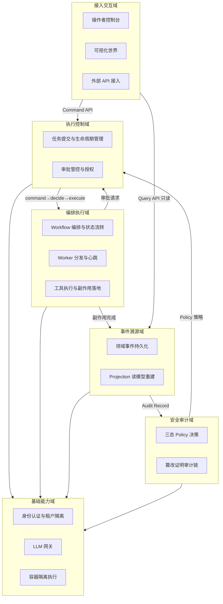

**业务域清单**：

| 业务域 | 核心场景 | 涉及角色 | 与其他业务域的关系 |
| --- | --- | --- | --- |
| 执行控制域 | 任务提交 / 执行入口收敛 / 审批管控 / 任务取消 | 平台架构负责人、Agent 运维操作者 | 上游：接入交互域；下游：编排执行域、安全审计域 |
| 编排执行域 | Workflow 编排 / StepRun 分发 / 工具执行 / 副作用落地 | Agent 运维操作者、Agent 被控终端用户 | 上游：执行控制域；下游：事件溯源域 |
| 事件溯源域 | 领域事件持久化 / Projection 读模型重建 / Inbox 去重 | Agent 运维操作者、平台架构负责人 | 上游：执行控制域、编排执行域；下游：接入交互域（只读消费） |
| 安全审计域 | 三态 Policy 决策 / 篡改证明审计 / 密钥管理 | 安全合规审计员 | 上游：执行控制域；下游：全部域（横切安全约束） |
| 接入交互域 | 操作者控制台 / 可视化世界 / 外部 API | 平台架构负责人、Agent 运维操作者、安全合规审计员 | 上游：用户交互；下游：执行控制域、事件溯源域 |
| 基础能力域 | 身份认证 / 租户隔离 / LLM 网关 / 容器隔离执行 | DevOps/SRE | 上游：全部业务域；下游：基础设施层 |

### 2.2 领域关系映射

#### 2.2.1 限界上下文清单

| 限界上下文 | 对应业务域 | 域类型 | 覆盖的核心业务实体 | 上下文边界（属于本域 vs 不属于） |
| --- | --- | --- | --- | --- |
| ExecutionControl-BC | 执行控制域 | 核心域 | Task / Run / StepRun / PlanVersion / AgentCommand | 属于：任务生命周期管理、执行入口收敛、命令路由；不属于：具体执行逻辑（归编排执行域）、策略决策逻辑（归安全审计域） |
| Orchestration-BC | 编排执行域 | 核心域 | WorkflowDefinition / WorkflowRun / Worker / Lease / ToolReceipt | 属于：Workflow 编排、StepRun 分发、工具执行；不属于：策略决策（归安全审计域）、事件持久化（归事件溯源域） |
| EventSourcing-BC | 事件溯源域 | 核心域 | DomainEvent / OutboxEntry / InboxEntry / ProjectionSnapshot | 属于：事件存储、投递、去重、Projection 重建；不属于：业务状态变更逻辑（归执行控制域/编排执行域） |
| SecurityAudit-BC | 安全审计域 | 核心域 | PolicyDecision / ApprovalRequest / CapabilityGrant / AuditRecord | 属于：三态决策、审批持久化、能力授权、篡改证明审计；不属于：具体工具执行（归编排执行域） |
| AccessConsole-BC | 接入交互域 | 支撑域 | OperatorConsole / ClawLibraryView / ExternalAPIGateway | 属于：用户界面、命令网关、查询网关；不属于：业务逻辑处理（归执行控制域/编排执行域） |
| Foundation-BC | 基础能力域 | 通用域 | ActorScope / UserSession / LLMGateway / ContainerIsolation | 属于：认证、租户隔离、LLM 调用、容器隔离；不属于：业务决策（归各核心域） |

**域类型说明**：

| 域类型 | 含义 | 投入策略 |
| --- | --- | --- |
| 核心域（Core） | 业务护城河，差异化竞争力所在 | 投入最多资源自研 |
| 支撑域（Supporting） | 必要但非差异化 | 可自研可外采 |
| 通用域（Generic） | 通用能力（如用户中心、消息中心） | 优先复用 / 外采 |

#### 2.2.2 上下文映射（Context Mapping）

| 关系编号 | 上游上下文 | 下游上下文 | 关系模式 | 同步方式 | 选择理由 |
| --- | --- | --- | --- | --- | --- |
| C-01 | ExecutionControl-BC | Orchestration-BC | Customer/Supplier | API 同步 | 编排执行域的需求节奏（StepRun 分发、停滞恢复）直接驱动执行控制域的 Run 生命周期设计，上下游强协作 |
| C-02 | SecurityAudit-BC | ExecutionControl-BC | Customer/Supplier | API 同步 | 三态 Policy 的 WAIT_APPROVAL 语义直接影响执行控制域的 Resume Command 流程，Policy 模块配合 ExecutionControl 的审批门需求 |
| C-03 | AccessConsole-BC（外部系统 unified-admin） | ExecutionControl-BC | ACL 防腐层 | API + 适配器 | Operator Console 的 Express BFF 模型不污染本域，通过 AgentCommand 适配器转换为 ExecutionControl.submit 调用 |
| C-04 | EventSourcing-BC | AccessConsole-BC | Published Language | 消息事件（DomainEvent 标准协议） | Projection 读模型以标准 Snapshot 协议对外暴露，多个消费者（Operator Console / ClawLibrary）共同消费 |
| C-05 | ExecutionControl-BC / Orchestration-BC / SecurityAudit-BC | EventSourcing-BC | Shared Kernel | 共享 DTO / SDK（DomainEvent Schema） | 公共的 DomainEvent 协议（schemaVersion/eventId/aggregate/sequence/causationId/traceId）必须全系统一致，共享内核降低维护成本 |
| C-06 | Foundation-BC | 全部 BC | Shared Kernel | 共享 SDK（ActorScope + Auth） | ActorScope 值对象和认证逻辑作为公共内核被全部上下文复用 |
| C-07 | ExternalAPI-BC（LLM Provider / OIDC IdP） | Foundation-BC | Conformist | API + 适配器 | 直接遵循 LLM Provider 和 OIDC IdP 的外部协议模型，无议价能力 |
| C-08 | Foundation-BC（Docker 容器隔离） | Orchestration-BC | ACL 防腐层 | RPC + 适配器 | 容器隔离的运行时细节不泄漏到编排域，通过 ToolGateway 适配器隔离 |
| C-09 | EventSourcing-BC | SecurityAudit-BC | Published Language | 消息事件（Audit Record 标准协议） | Audit Record 以标准协议（actor/decision/grant/toolReceipt/资源范围 + hash chain）对外暴露，安全审计域消费 |

**关系模式说明**：

| 关系模式 | 适用场景 |
| --- | --- |
| Customer/Supplier | 上下游强协作，下游能影响上游迭代节奏（如：执行控制 → 编排执行） |
| Conformist | 顺从者，下游完全遵循上游模型（如：对接 OIDC IdP / LLM Provider） |
| ACL（Anticorruption Layer） | 在本域和外部域之间建一层适配，外部模型变化不影响本域（对接外部强势平台时必用） |
| Shared Kernel | 共享内核，多个上下文共享一小块代码 / 模型；维护成本高，慎用 |
| Published Language | 上游以标准协议（事件 / Schema）对外暴露，多下游消费 |

> **本系统使用了 5 种关系模式**：Customer/Supplier（C-01/C-02）、ACL 防腐层（C-03/C-08）、Shared Kernel（C-05/C-06）、Conformist（C-07）、Published Language（C-04/C-09）。满足硬指标"DDD 上下文映射使用 5 种关系模式"。

#### 2.2.3 跨域协作原则

| 原则编号 | 原则 |
| --- | --- |
| P-01 | 核心域 → 支撑域 / 通用域：禁止反向依赖（核心域不依赖支撑域的内部模型） |
| P-02 | 核心域之间：禁止直接耦合，必须通过 DomainEvent / API 解耦 |
| P-03 | 对接外部不可控系统（LLM Provider / OIDC IdP）：必须建 ACL 防腐层，禁止把外部模型贯穿到本域 |
| P-04 | 所有跨域写操作必须经过 ExecutionControl-BC，禁止旁路写入（唯一写入者原则） |

### 2.3 详细业务架构

#### 2.3.1 用例图

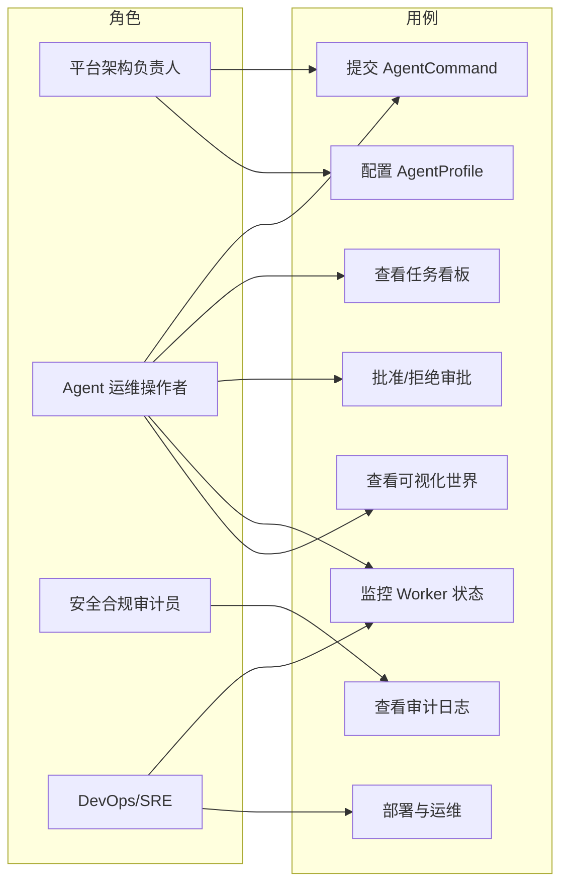

**用例图清单**：

| 编号 | 用例图标题 | 涉及业务域 | 源文件位置 |
| --- | --- | --- | --- |
| UC-01 | 任务提交与审批管控 | 执行控制域、安全审计域 | 本文档内嵌（上文 Mermaid） |
| UC-02 | 任务监控与可视化 | 事件溯源域、接入交互域 | 本文档内嵌（上文 Mermaid） |
| UC-03 | 安全审计与配置管理 | 安全审计域、基础能力域 | 本文档内嵌（上文 Mermaid） |

#### 2.3.2 业务流程图

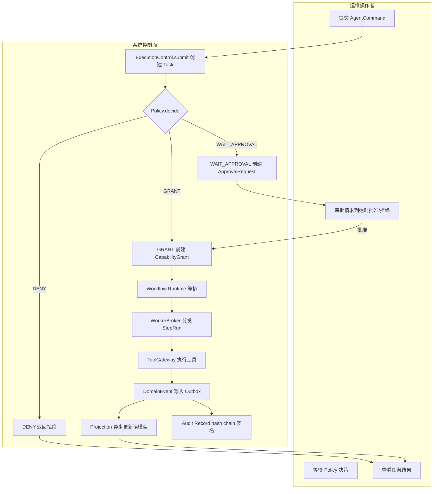

**关键流程清单**（核心业务覆盖度 ≥ 80%）：

| 流程编号 | 流程名 | 起点 | 终点 | 涉及业务域 | 源文件位置 |
| --- | --- | --- | --- | --- | --- |
| BF-01 | 任务提交→Policy 决策→执行→结果反馈（主链路） | 用户提交 AgentCommand | 用户查看任务结果 | 全部 6 域 | 本文档内嵌（上文 Mermaid） |
| BF-02 | 审批门流程（WAIT_APPROVAL → resolve → Resume） | Policy 返回 WAIT_APPROVAL | Resume Command 触发重新执行 | 执行控制域、安全审计域 | §3.2.M3 审批模块时序图 |
| BF-03 | 进程崩溃恢复流程（Lease 过期 → Orphan Recovery） | Worker 离线 | 精确恢复到故障前状态 | 编排执行域 | §3.2.M5 WorkerBroker 时序图 |
| BF-04 | 事件重建流程（EventLog.read → Projection.rebuild） | Projection 数据损坏 | 生成一致 Snapshot | 事件溯源域 | §3.2.M7 EventLog 模块时序图 |

### 2.4 业务范围与边界

#### 2.4.1 功能模块清单

| 编号 | 一级功能名 | 子功能描述 | 对应业务域 | 实现状态 |
| --- | --- | --- | --- | --- |
| F1 | 执行控制 | — | 执行控制域 | — |
| F1.1 | — | submit/execute/resume/cancel 接口收敛 | 执行控制域 | 完整实现 |
| F1.2 | — | ActorScope 租户隔离 | 执行控制域 | 完整实现 |
| F2 | 策略引擎 | — | 安全审计域 | — |
| F2.1 | — | 三态 Policy DENY/WAIT_APPROVAL/GRANT | 安全审计域 | 完整实现 |
| F3 | 审批管控 | — | 安全审计域 | — |
| F3.1 | — | 持久化审批门 + Resume Command | 安全审计域 | 完整实现 |
| F4 | 事件溯源 | — | 事件溯源域 | — |
| F4.1 | — | Transactional Outbox + Inbox 去重 | 事件溯源域 | 完整实现 |
| F4.2 | — | Projection 全量重建 | 事件溯源域 | 完整实现（MVP 单 Projection） |
| F5 | Workflow 编排 | — | 编排执行域 | — |
| F5.1 | — | 版本化 WorkflowDefinition + LangGraph StateGraph | 编排执行域 | 完整实现（MVP 基础路由） |
| F5.2 | — | 停滞恢复 4 阶段 | 编排执行域 | [简化] 完整版 Phase 5 实现 |
| F6 | Worker 调度 | — | 编排执行域 | — |
| F6.1 | — | WorkerBroker Lease/Heartbeat/Orphan Recovery | 编排执行域 | 完整实现 |
| F7 | 工具执行 | — | 编排执行域 | — |
| F7.1 | — | ToolGateway CapabilityGrant 验证 | 编排执行域 | 完整实现 |
| F7.2 | — | Docker 容器隔离 Adapter | 编排执行域 | 完整实现（MVP Shell/Browser） |
| F8 | 审计 | — | 安全审计域 | — |
| F8.1 | — | hash chain + HMAC 签名 | 安全审计域 | 完整实现（MVP 简化版） |
| F9 | 可信度标注 | — | 事件溯源域 | — |
| F9.1 | — | source_status live/stale/unavailable/simulated | 事件溯源域 | 完整实现 |
| F10 | 可观测性 | — | 基础能力域 | — |
| F10.1 | — | Langfuse 链路追踪集成 | 基础能力域 | 完整实现 |
| F11 | 可视化 | — | 接入交互域 | — |
| F11.1 | — | ClawLibrary 只消费 Projection 读模型 | 接入交互域 | 完整实现（MVP 基础版） |
| F12 | 自进化 | — | 执行控制域 | — |
| F12.1 | — | SkillEvaluation 晋升机制 | 执行控制域 | [MOCK] 完整版 Phase 6 实现 |

**In-Scope（本期范围内）**：

| 编号 | 本期必做的事项 |
| --- | --- |
| F1 | 唯一执行入口收敛——所有入口收敛到 ExecutionControl 接口 |
| F2 | 三态 Policy 引擎——替代布尔 RBAC |
| F3 | 持久化审批门——ApprovalRequest + Resume Command |
| F4 | 事件溯源核心版——Outbox + Inbox + 单 Projection |
| F5 | 版本化 Workflow 基础版——LangGraph StateGraph + 基础路由 |
| F6 | WorkerBroker——Lease/Heartbeat/Orphan Recovery |
| F7 | 特权 Adapter Docker 隔离——Shell/Browser |
| F8 | tamper-evident 审计简化版——hash chain + HMAC |
| F9 | source_status 可信度标注 |
| F10 | Langfuse 链路追踪集成 |
| F11 | ClawLibrary 基础接入 |
| N1 | Express BFF 收缩为无状态协议代理 |
| N2 | backend Orchestrator 退役 |
| N3 | 日均支撑 10 万+ Workflow 执行量级（LangGraph Checkpointer） |

**Out-of-Scope（本期不做）**：

| 编号 | 不做的事项 | 不做的原因 | 未来归属 |
| --- | --- | --- | --- |
| O1 | SkillEvaluation 自进化晋升机制 | 需数据积累+最小样本量验证+模型迭代 | 完整版 Phase 6 |
| O2 | 停滞恢复 4 阶段（180s/360s/540s/720s） | 天枢调度器逻辑复杂，MVP 优先保证基础路由正确性 | 完整版 Phase 5 |
| O3 | 桌面/插件 Adapter 隔离 | Docker 容器隔离对桌面 GUI 安全边界需额外验证 | 完整版 Phase 6 |
| O4 | 多 Projection 并行重建 | MVP 优先验证单 Projection 事件溯源链路正确性 | 完整版 Phase 3 |
| O5 | 部署 Temporal Server | 唯一 Orchestrator 原则，Temporal 仅作为设计模式参照 | 永不做 |

### 2.5 质量与柔性可用

#### 2.5.1 服务质量目标

**质量目标 Top 5**：

| 优先级 | 质量目标 | 业务驱动 | 受影响的关键章节 |
| --- | --- | --- | --- |
| Q1 | 安全合规（高风险步骤批准前执行 0 次） | D1,§11 Phase 1 退出条件 | §3.2 Policy / §3.2 Approval / §7 安全设计 |
| Q2 | 可靠性（进程崩溃后任务 100% 可恢复） | D1,§11 Phase 2 退出条件 | §3.2 WorkerBroker / §4 Outbox / §5 部署 |
| Q3 | 数据一致性（Snapshot 重放一致率 100%） | D1,§11 Phase 3 退出条件 | §3.2 EventLog / §4 DomainEvent |
| Q4 | 低延迟（Command API P99 ≤ 200ms） | 高层架构 §6.4 操作者控制台交互约束 | §3.2 ExecutionControl / §4.4 缓存 |
| Q5 | 可观测性（审计缺失率 0%） | D1,§11 Phase 1 退出条件 | §8 Metrics / §8 Logs / §8 Traces |

**可验证质量场景**（参考 SEI ATAM 方法）：

| 场景编号 | 关联目标 | 触发源 | 触发条件 | 期望响应 | 度量指标 |
| --- | --- | --- | --- | --- | --- |
| QS-01 | Q1 | 高风险操作 | Policy.decide 返回 WAIT_APPROVAL | 执行暂停等待审批，批准前不执行 | 批准前执行尝试次数 = 0 |
| QS-02 | Q2 | 进程崩溃 | Worker 进程在 StepRun 执行中被 kill | Lease 过期检测 → Orphan Recovery → 精确恢复 | 恢复成功率 = 100%；RTO ≤ 5min |
| QS-03 | Q3 | Projection 损坏 | Projection 数据不一致 | EventLog.read 全量重放 → 生成一致 Snapshot | 重放一致率 = 100% |
| QS-04 | Q4 | 用户操作 | Command API 提交 AgentCommand | 正常返回 accepted/waiting_approval/rejected | P95 ≤ 150ms；P99 ≤ 200ms |
| QS-05 | Q5 | 副作用执行 | 每个工具执行完成 | Audit Record 包含完整链路 command→decision→approval→grant→receipt | 审计缺失率 = 0% |

#### 2.5.2 业务柔性可用策略

**业务功能优先级分层**：

| 层级 | 含义 | 故障态下的处置方向 | 用户感知 |
| --- | --- | --- | --- |
| L0 核心业务 | 系统的生命线，挂掉等于业务停摆 | 不降级；优先消耗所有资源保障 | 无 / 极轻微 |
| L1 重要业务 | 不影响主链路但用户高频使用 | 限流 + 排队 + 异步化 | 变慢 / 排队提示 |
| L2 辅助业务 | 提升体验但非必要 | 关闭 / 返回兜底数据 | 部分功能不可用 + 友好提示 |
| L3 附加业务 | 长尾 / 数据类 / 统计类 | 直接关闭 + 异步补偿 | 通常无感 |

**一级功能分层**：

| 编号 | 功能名 | 层级 |
| --- | --- | --- |
| F1 | 执行控制 | L0 |
| F2 | 策略引擎 | L0 |
| F3 | 审批管控 | L0 |
| F4 | 事件溯源 | L0 |
| F5 | Workflow 编排 | L0 |
| F6 | Worker 调度 | L0 |
| F7 | 工具执行 | L0 |
| F8 | 审计 | L0 |
| F9 | 可信度标注 | L1 |
| F10 | 可观测性 | L1 |
| F11 | 可视化（ClawLibrary） | L2 |

> L0 共 8 个，总功能 11 个，L0 占比 72.7%。说明：Agent Control Center 是控制面系统，核心链路（F1~F8）是系统的生命线，均不可降级。高于 30% 是合理的——控制面系统的核心能力占比天然高于普通业务系统。

**业务降级清单**：

| 编号 | 关联功能（F-xx） | 触发条件 | 降级动作 | 用户感知 | 决策类型 |
| --- | --- | --- | --- | --- | --- |
| BD-01 | F9 source_status | Projection 更新延迟超过 30s | Snapshot 自动标注 stale + observed_at 时间戳 | 数据可能不是最新，界面标注"数据延迟" | 自动 |
| BD-02 | F11 ClawLibrary | 后端服务全离线 | 返回 unavailable 而非 idle，显示最后已知状态 | 界面标注"服务离线"，不伪装在线 | 自动 |
| BD-03 | F10 Langfuse | Langfuse 服务不可用 | Trace 数据丢失但不阻断业务执行 | 无（运维在监控大盘发现） | 自动 |
| BD-04 | F4 Projection | Outbox 表积压超过 10 万条 | Projection 更新降频，优先保证 Outbox 写入不阻塞业务 | 任务执行正常，可视化更新延迟 | 自动 |

---

## 3. 应用架构

> **本章回答**：系统由哪些模块组成、模块与外部系统怎么集成、每个模块的内部交互链路是什么。
> **本章是系统设计的核心**，章节下应当占整个文档篇幅的 40%~50%。

### 3.1 应用架构概览

#### 3.1.1 系统上下文

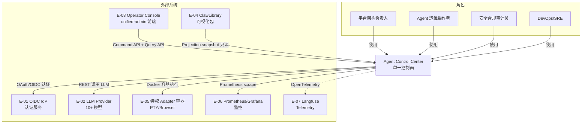

**系统上下文要素清单**：

| 节点类型 | 节点名 | 与本系统的关系 | 关系语义 |
| --- | --- | --- | --- |
| 角色 | 平台架构负责人 | 使用 | 架构决策、AgentProfile 配置 |
| 角色 | Agent 运维操作者 | 使用 | 任务提交、审批操作、状态查看 |
| 角色 | 安全合规审计员 | 使用 | 审计日志审阅、安全策略配置 |
| 角色 | DevOps/SRE | 使用 | 部署运维、监控告警 |
| 上游平台 | E-01 OIDC IdP | 推送 → 本系统 | 用户认证 + JWT 颁发 |
| 外部业务系统 | E-02 LLM Provider | 双向调用 | LLM 推理（规划/生成） |
| 第三方平台 | E-03 Operator Console | 本系统 ← 调用 | Command API + Query API |
| 下游平台 | E-04 ClawLibrary | 本系统 → 推送（只读） | Projection 读模型消费 |
| 外部隔离 | E-05 特权 Adapter 容器 | 本系统 → 调用 | Docker 容器内工具执行 |
| 下游平台 | E-06 Prometheus/Grafana | 本系统 → 推送 | 指标采集 + 告警 |
| 下游平台 | E-07 Langfuse | 本系统 → 推送 | 链路追踪 + 评估 |

#### 3.1.2 系统模块图

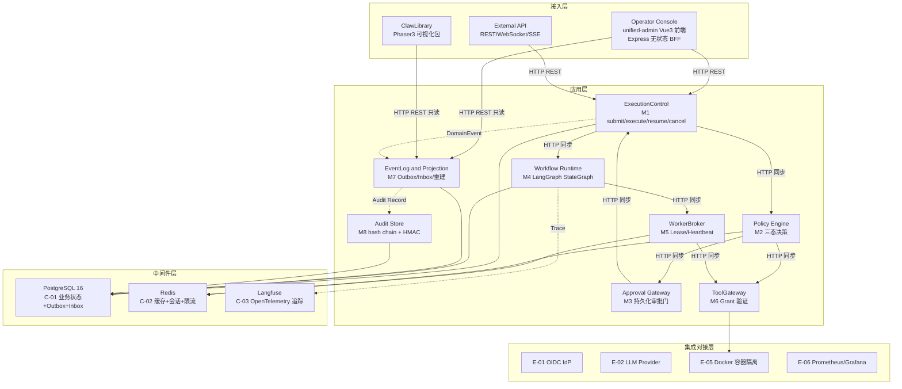

**分层组件清单**：

| 层次 | 内容 | 数据来源 |
| --- | --- | --- |
| 接入层 | Operator Console / ClawLibrary / External API | §2.3 用例图角色 |
| 应用层 | 8 个核心模块（M1~M8）与 §3.2 一一对应 | §2.1 / §3.2 |
| 中间件层 | PostgreSQL 16 / Redis / Langfuse（C-01~C-03） | §3.1.3 云组件清单 |
| 集成对接层 | OIDC IdP / LLM Provider / Docker 容器 / Prometheus（E-01~E-06） | §3.1.3 外部依赖清单 |

#### 3.1.3 集成架构

##### 外部依赖清单

| ID | 外部系统 | 归属团队 / 供应商 | 类别 | 使用方式 | 集成方式 | 协议 / 版本 | 功能定位（≤ 30 字） | 联系人 |
| --- | --- | --- | --- | --- | --- | --- | --- | --- |
| E-01 | OIDC IdP | 外部认证 | 身份认证 | 消费 | REST API | OAuth 2.0 / OIDC | 用户认证 + JWT 颁发 | 平台架构负责人 |
| E-02 | LLM Provider（DeepSeek/GLM/Kimi/Qwen/OpenAI 等 10+） | 外部 API | 第三方业务平台 | 消费 | REST API | HTTPS REST | LLM 推理（规划/生成） | 后端架构 |
| E-03 | Operator Console（unified-admin） | 前端团队 | 业务协作 | 双向 | REST API + WebSocket/SSE | HTTP/1.1 | Command API + Query API | 前端团队 |
| E-04 | ClawLibrary | 前端团队 | 业务协作 | 生产 | npm package API | HTTP REST | Projection 只读消费 | 前端团队 |
| E-05 | 特权 Adapter 容器（PTY/Browser） | 安全架构 | 监控审计 | 消费 | Docker 容器 + gRPC | Docker API 24.0 | 进程隔离工具执行 | 安全架构 |
| E-06 | Prometheus/Grafana | 运维团队 | 监控审计 | 生产 | Prometheus scrape | Prometheus 2.x | 指标采集 + 告警 | 运维团队 |
| E-07 | Langfuse | 运维团队 | 监控审计 | 生产 | OpenTelemetry SDK | OTel 1.x | 链路追踪 + 评估 | 运维团队 |

##### 云组件 / 基础设施清单

| ID | 组件类别 | 选型 | 部署形态 | 规格量级 | 容量预估 | 提供方 / SLA | 用途 |
| --- | --- | --- | --- | --- | --- | --- | --- |
| C-01 | 关系型数据库 | PostgreSQL 16-alpine | 主从（Docker Compose） | 2C8G × 1 主 + 1 从 | 日均 10 万+ Workflow；数据存量预估 50GB | 自建；SLA 99.5% | 业务主数据 + Outbox + Inbox + Audit |
| C-02 | 缓存 | Redis 7-alpine | 主从（Docker Compose） | 1C2G × 1 | 缓存命中率 > 90%；内存 < 1GB | 自建 | 会话 / Policy 缓存 / 限流 / 分布式锁 |
| C-03 | 可观测性 | Langfuse（自部署） | Docker Compose 单节点 | 1C2G × 1 | 日均 10 万+ trace span | 自建；开源 MIT | LLM 链路追踪 + 评估 |
| C-04 | 容器编排 | Docker Compose | 单机 Docker | 1 Node × 8C16G | Pod 数 ≤ 15 | 自建 | 服务部署（含特权 Adapter 隔离容器） |
| C-05 | 反向代理 | Nginx | Docker Compose | 1C512M × 1 | QPS < 1000 | 自建 | TLS 终结 / 路由 / 负载均衡 |
| C-06 | 数据库迁移 | Alembic | 内嵌应用 | — | 14+ 迁移版本 | 自建 | Schema 迁移管理 |
| C-07 | API 网关 | Nginx（兼用） | Docker Compose | 同 C-05 | QPS < 1000 | 自建 | 入口路由 / 鉴权 / 限流 |

##### 组件依赖关系

| 业务模块（§3.2） | 依赖的外部系统（E-xx） | 依赖的云组件（C-xx） | 故障传导风险 |
| --- | --- | --- | --- |
| M1 ExecutionControl | E-03 | C-01, C-02 | E-03 不可用 → 无法提交命令；C-01 不可用 → 全站不可用 |
| M2 Policy Engine | E-01 | C-01, C-02 | E-01 不可用 → 无法认证；C-02 不可用 → Policy 缓存失效降级到 DB |
| M3 Approval Gateway | E-03 | C-01 | E-03 不可用 → 无法操作审批；C-01 不可用 → 审批数据丢失 |
| M4 Workflow Runtime | E-02 | C-01, C-03 | E-02 超时 → 规划降级重试；C-03 不可用 → Trace 丢失不阻断 |
| M5 WorkerBroker | E-05 | C-01, C-02 | E-05 不可用 → 工具无法执行；C-02 不可用 → Lease 管理降级到 DB |
| M6 ToolGateway | E-05 | C-01 | E-05 不可用 → 工具执行失败；C-01 不可用 → Grant 数据丢失 |
| M7 EventLog and Projection | E-04 | C-01 | C-01 不可用 → 事件丢失 + Projection 不可重建 |
| M8 Audit Store | — | C-01 | C-01 不可用 → 审计记录丢失 |

#### 3.1.4 工程结构

```
agent-control-center/
├── backend/                          # 后端工程根目录
│   ├── common/                       # 公共模块：DTO / VO / Enum / Exception / Constants
│   │   ├── dto/                      # AgentCommand / DomainEvent / CommandReceipt 等共享 DTO
│   │   ├── enums/                    # TaskLifecycle / WorkflowPhase / PolicyDecision 等枚举
│   │   ├── exceptions/               # 全局异常体系
│   │   └── constants/                # 全局常量
│   ├── packages/                     # 业务包（对应 §3.2 模块）
│   │   ├── execution-control/        # M1 ExecutionControl
│   │   ├── policy/                   # M2 Policy Engine
│   │   ├── approval/                 # M3 Approval Gateway
│   │   ├── workflow-runtime/         # M4 Workflow Runtime（LangGraph StateGraph）
│   │   ├── worker-broker/            # M5 WorkerBroker
│   │   ├── tool-gateway/             # M6 ToolGateway
│   │   ├── event-log/                # M7 EventLog and Projection
│   │   ├── audit-store/              # M8 Audit Store
│   │   ├── contracts/                # 跨模块接口契约（DomainEvent Schema / AgentCommand Schema）
│   │   ├── provider-adapters/        # 特权 Adapter 封装（Shell/PTY/Browser）
│   │   └── observability/            # Langfuse @observe 集成
│   ├── apps/                         # 应用入口
│   │   ├── control-api/              # FastAPI 后端入口（REST/WebSocket/SSE 路由）
│   │   ├── adapter-host/             # 特权 Adapter Host（Docker 容器管理）
│   │   └── outbox-worker/            # Outbox Worker 后台任务
│   └── migrations/                   # Alembic 数据库迁移
│       └── versions/                 # 迁移版本（继承 myself-agent 14 版本 + 新增）
└── frontend/                         # 前端工程根目录
    ├── operator-console/             # unified-admin Vue3 管理端
    │   ├── src/
    │   │   ├── api/                  # 接口封装（与后端 §3.2 接口清单对齐）
    │   │   ├── stores/               # Pinia 全局状态
    │   │   ├── pages/                # 页面（任务看板/审批队列/审计日志等）
    │   │   ├── components/           # 跨页面通用组件
    │   │   ├── hooks/                # 自定义 Hooks
    │   │   ├── types/                # TS 类型定义（与后端 DTO/VO 对齐）
    │   │   ├── utils/                # 工具函数
    │   │   └── routes.ts             # 路由配置
    │   └── package.json
    ├── clawlibrary/                  # ClawLibrary 可视化包（npm workspace）
    │   └── src/
    └── shared/                       # 跨端共用组件 / 类型定义
```

#### 3.1.5 技术选型（版本约束）

| 技术分类 | 选型 | 版本 | 备注 / 选型理由 |
| --- | --- | --- | --- |
| 后端语言 | Python | 3.11+ | myself-agent 底座固定，FastAPI / SQLAlchemy 2 / Pydantic v2 均要求 3.11+ |
| 后端框架 | FastAPI | 0.110+ | myself-agent 已采用，原生支持 async + Pydantic v2 + OpenAPI 文档；选 FastAPI 不选 Flask/Django 是因为 async 性能和自动文档生成 |
| Workflow 引擎 | LangGraph | 0.2+ | StateGraph 映射天枢状态机，Checkpointer 持久化到 PostgreSQL，Python 原生；选 LangGraph 不选自研状态机是因为条件边/子图/Checkpoint 机制成熟且与天枢映射度最高 |
| 持久层（ORM） | SQLAlchemy 2.x | 2.0+ | myself-agent 已采用，支持 async + type hints；选 SQLAlchemy 不选 Tortoise/Django ORM 是因为已有 24 表基座 + 14 迁移版本 |
| 数据库迁移 | Alembic | 1.13+ | myself-agent 已有 14 个迁移版本，无缝继承；选 Alembic 不选 Flyway/Liquibase 是因为 Python 生态原生 |
| 关系型存储 | PostgreSQL | 16-alpine | 高层架构冻结 PostgreSQL-only 约束，支持 LISTEN/NOTIFY + FOR UPDATE SKIP LOCKED 实现 Transactional Outbox；选 PostgreSQL 不选 MySQL 是因为 LISTEN/NOTIFY 和 JSONB 原生支持 |
| 缓存 | Redis | 7-alpine | 会话 / Policy 缓存 / 限流 / 分布式锁；选 Redis 不选 Memcached 是因为支持丰富数据结构 + 持久化 |
| 消息投递 | PostgreSQL LISTEN/NOTIFY + FOR UPDATE SKIP LOCKED | — | Transactional Outbox 模式，不引入 Kafka/RabbitMQ 额外中间件；高层架构冻结 PG-only 约束 |
| API 通信 | REST + WebSocket/SSE | HTTP/1.1 | 同步 REST 用于 Command/Query API；WebSocket/SSE 用于实时状态推送；选 REST 不选 gRPC 是因为前端 Vue3 生态和 BFF 代理适配简单 |
| 前端框架 | Vue 3 + TypeScript | Vue 3.4+ / TS 5+ | unified-admin 已采用 Vue 3 + Naive UI；选 Vue 3 不选 React 是因为已有底座和团队经验 |
| 前端状态 | Pinia | 2.1+ | Vue 3 官方推荐，TS 支持好；选 Pinia 不选 Vuex 是因为 Composition API 原生支持 |
| 前端构建 | Vite | 5+ | unified-admin 已采用，HMR 快；选 Vite 不选 Webpack 是因为构建速度和 ESM 原生支持 |
| 认证方案 | OIDC / OAuth2 + JWT | — | myself-agent 已有 OIDC SSO（PKCE+nonce+JIT）；见 §7.2 |
| Telemetry | Langfuse（OpenTelemetry） | Langfuse 2.x / OTel 1.x | @observe 装饰器侵入性极低，Docker Compose 自部署；选 Langfuse 不选 LangSmith 是因为开源自部署不锁定 SaaS |
| 可视化引擎 | Phaser 3 | 3.90+ | ClawLibrary 已采用，像素游戏风格可视化；选 Phaser 不选 Three.js 是因为 2D 像素场景契合度 |
| 容器隔离 | Docker + seccomp + cgroups | Docker 24.0+ | 特权 Adapter 进程隔离；选 Docker 不选 gVisor/Firecracker 是因为 self-hosted Docker Compose 约束下最务实 |

### 3.2 模块详细设计

#### 3.2.1 模块公共约束（Common）

**通信方式约束**：

| 约束项 | 取值 |
| --- | --- |
| 接口路径风格 | RESTful |
| 协议 | HTTP / WebSocket / SSE |
| 数据格式 | JSON |
| 字符编码 | UTF-8 |

**通用基础结构**：

| 基类 / 结构 | 用途 | 包路径 |
| --- | --- | --- |
| `AgentCommand` | 统一命令请求对象（schemaVersion/commandId/commandType/idempotencyKey/actor/target/data） | `common.dto` |
| `CommandReceipt` | 统一命令结果对象（accepted/rejected/waiting_approval/completed/failed/cancelled） | `common.dto` |
| `DomainEvent` | 统一领域事件对象（schemaVersion/eventId/eventType/source/aggregate/sequence/causationId/traceId） | `common.dto` |
| `Result[T]` | 统一返回结构（含 code / msg / data / traceId） | `common.dto` |
| `PageRequest` | 分页请求 | `common.dto` |
| `PageResponse[T]` | 分页响应 | `common.dto` |

#### 3.2.2 模块清单与编号规则

**模块清单**：

| 编号 | 模块名 | 业务域（§2.1） | 模块负责人 | 关联子领域 |
| --- | --- | --- | --- | --- |
| M1 | ExecutionControl | 执行控制域 | 后端架构 | 任务生命周期 / 执行入口收敛 / 命令路由 |
| M2 | Policy Engine | 安全审计域 | 安全架构 | 三态决策 / 策略版本管理 |
| M3 | Approval Gateway | 安全审计域 | 后端架构 | 审批持久化 / Resume Command |
| M4 | Workflow Runtime | 编排执行域 | 后端架构 | LangGraph 编排 / 阶段流转 |
| M5 | WorkerBroker | 编排执行域 | 后端架构 | Lease / Heartbeat / Orphan Recovery |
| M6 | ToolGateway | 编排执行域 | 后端架构 | Grant 验证 / 工具执行 |
| M7 | EventLog and Projection | 事件溯源域 | 后端架构 | Outbox / Inbox / Projection 重建 |
| M8 | Audit Store | 安全审计域 | 安全架构 | hash chain / HMAC 签名 |

---

#### 3.2.M1 ExecutionControl

##### §3.2.M1.1 模块概述

ExecutionControl 模块覆盖任务提交、执行入口收敛、命令路由业务流程，业务逻辑在平台架构负责人、Agent 运维操作者之间流动，同时涉及 Operator Console（E-03）、OIDC IdP（E-01）、PostgreSQL（C-01）、Redis（C-02）等内外部系统的数据流动。它是整个控制面的唯一写入入口，所有命令（HTTP/CLI/Chat/Cron/SubAgent/Workflow/插件）必须经过此模块。

##### §3.2.M1.2 接口清单

| 子领域 | 方法 | 路径 | 用途（≤ 20 字） | 请求 DTO | 响应 VO | 幂等 |
| --- | --- | --- | --- | --- | --- | --- |
| 任务管理 | POST | /api/v1/tasks/submit | 提交 AgentCommand 创建 Task | SubmitRequest | CommandReceiptVO | 是（idempotencyKey） |
| 任务管理 | POST | /api/v1/tasks/{taskId}/execute | 执行已提交的 Task | ExecuteRequest | CommandReceiptVO | 是（idempotencyKey） |
| 任务管理 | POST | /api/v1/tasks/{taskId}/resume | 审批通过后恢复执行 | ResumeRequest | CommandReceiptVO | 是（idempotencyKey） |
| 任务管理 | POST | /api/v1/tasks/{taskId}/cancel | 取消任务执行 | CancelRequest | CommandReceiptVO | 是（id+version） |
| 任务管理 | GET | /api/v1/tasks/{taskId} | 查询任务详情 | — | TaskDetailVO | 天然 |
| 任务管理 | GET | /api/v1/tasks | 查询任务列表 | TaskListRequest | PageResponse[TaskVO] | 天然 |
| 运行管理 | GET | /api/v1/tasks/{taskId}/runs | 查询任务执行历史 | — | List[RunVO] | 天然 |
| 运行管理 | GET | /api/v1/runs/{runId}/steps | 查询 Run 步骤详情 | — | List[StepRunVO] | 天然 |

##### §3.2.M1.3 关键结构定义（DTO）

```python
class SubmitRequest(BaseModel):
    # ===== 必填字段 =====
    command_type: str          # 命令类型，如 submit_task / execute_task
    idempotency_key: str       # 幂等键，UUID 由调用方生成
    actor: ActorScope          # 身份与作用域
    target: TargetRef          # 目标资源引用（kind/id/expectedRevision）
    deadline: datetime         # 命令截止时间
    data: dict                 # 命令数据体（任务请求参数）

    # ===== 可选字段 =====
    correlation_id: str | None # 关联 ID，用于跨系统追踪

class CommandReceiptVO(BaseModel):
    # ===== 基本信息 =====
    command_id: str            # 命令 ID
    task_id: str | None        # 创建的 Task ID（如适用）
    run_id: str | None         # 创建的 Run ID（如适用）

    # ===== 状态字段 =====
    status: str                # accepted / rejected / waiting_approval / completed / failed / cancelled
    reason: str | None         # 拒绝/失败原因

    # ===== 时间字段 =====
    created_at: datetime
    updated_at: datetime

class TaskDetailVO(BaseModel):
    # ===== 基本信息 =====
    task_id: str
    tenant_id: str
    workspace_id: str

    # ===== 状态字段 =====
    lifecycle: str             # INIT / SUBMITTED / PLANNING / EXECUTING / WAITING_APPROVAL / COMPLETED / FAILED / CANCELLED
    revision: int              # 乐观锁版本号

    # ===== 关联字段 =====
    current_run_id: str | None
    plan_version_id: str | None

    # ===== 时间字段 =====
    created_at: datetime
    updated_at: datetime
```

**关键字段定义表**：

| DTO / VO 名 | 字段名 | 类型 | 必填 | 业务含义 | 约束 / 默认值 |
| --- | --- | --- | --- | --- | --- |
| SubmitRequest | command_type | String | 是 | 命令类型 | 枚举：submit_task / execute_task / resume_task / cancel_task |
| SubmitRequest | idempotency_key | String | 是 | 幂等键 | UUID v4，调用方生成 |
| SubmitRequest | actor | ActorScope | 是 | 身份与作用域 | 服务端认证模块生成，禁止请求体伪造 |
| SubmitRequest | target | TargetRef | 是 | 目标资源引用 | kind + id + expectedRevision |
| SubmitRequest | deadline | DateTime | 是 | 命令截止时间 | UTC，不得为 null |
| CommandReceiptVO | status | String | 是 | 命令结果状态 | 枚举：accepted / rejected / waiting_approval / completed / failed / cancelled |
| TaskDetailVO | lifecycle | String | 是 | 任务生命周期 | 枚举：INIT / SUBMITTED / PLANNING / EXECUTING / WAITING_APPROVAL / COMPLETED / FAILED / CANCELLED |
| TaskDetailVO | revision | Integer | 是 | 乐观锁版本号 | 每次状态变更 +1 |

##### §3.2.M1.4 模块逻辑时序图

| 编号 | 标题（ExecutionControl - 场景名） | 场景类别 | 是否包含异常分支 |
| --- | --- | --- | --- |
| SQ-M1-01 | ExecutionControl - 任务提交到执行决策 | 核心实体的创建 / 配置 / 发布 | 是 |
| SQ-M1-02 | ExecutionControl - 审批恢复执行 | 核心动作的执行 / 触发 / 回调 | 是 |

**SQ-M1-01：ExecutionControl - 任务提交到执行决策**

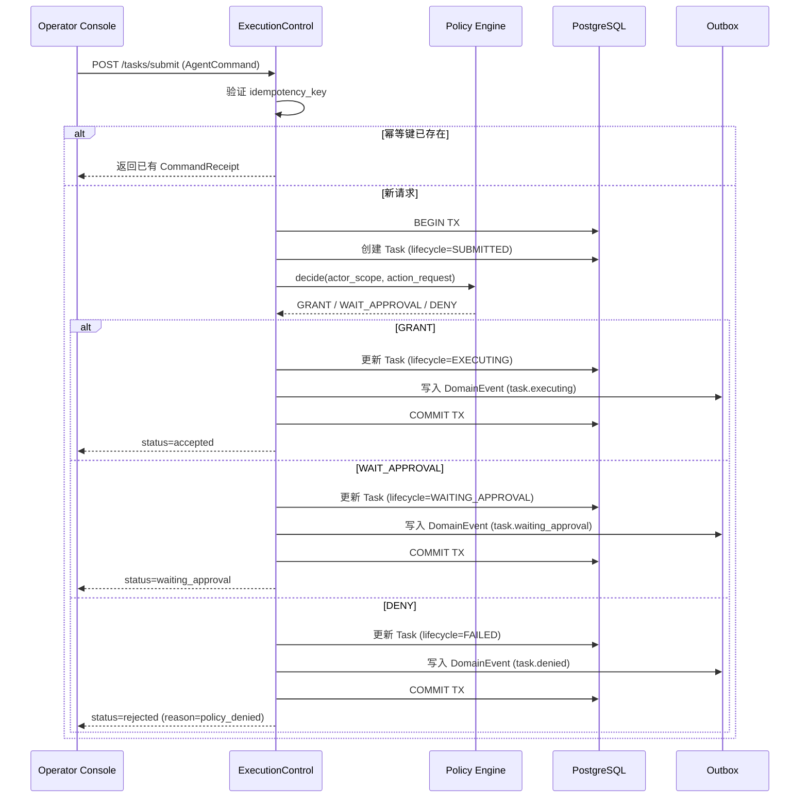

##### §3.2.M1.5 关键流程逻辑

**TaskLifecycle 状态机迁移表**：

| 起始状态 | 触发事件 | 终止状态 | 触发条件 / 校验 | 副作用 |
| --- | --- | --- | --- | --- |
| INIT | submit | SUBMITTED | AgentCommand 校验通过 + idempotency_key 去重 | 创建 Task + 写 DomainEvent |
| SUBMITTED | decide(GRANT) | EXECUTING | Policy.decide 返回 GRANT | 创建 Run + 写 DomainEvent |
| SUBMITTED | decide(WAIT_APPROVAL) | WAITING_APPROVAL | Policy.decide 返回 WAIT_APPROVAL | 创建 ApprovalRequest + 写 DomainEvent |
| SUBMITTED | decide(DENY) | FAILED | Policy.decide 返回 DENY | 写 DomainEvent + Audit Record |
| WAITING_APPROVAL | resume | EXECUTING | 审批通过 + Policy 重新验证 GRANT | 创建 Resume Run + 写 DomainEvent |
| WAITING_APPROVAL | expire | FAILED | expires_at 超时 | 写 DomainEvent + 通知 |
| EXECUTING | complete | COMPLETED | 全部 StepRun 成功 | 写 DomainEvent + Projection 更新 |
| EXECUTING | fail | FAILED | 任一 StepRun 最终失败且重试耗尽 | 写 DomainEvent + 触发补偿 |
| * | cancel | CANCELLED | expectedRevision 匹配 | 写 DomainEvent + 清理 Lease |

---

#### 3.2.M2 Policy Engine

##### §3.2.M2.1 模块概述

Policy Engine 模块覆盖三态策略决策业务流程，业务逻辑在安全合规审计员配置策略、系统自动决策之间流动，同时涉及 OIDC IdP（E-01）、PostgreSQL（C-01）、Redis（C-02）等内外部系统的数据流动。它是安全底线闸门——替代现有布尔 RBAC allowed，返回 DENY/WAIT_APPROVAL/GRANT 三态。

##### §3.2.M2.2 接口清单

| 子领域 | 方法 | 路径 | 用途（≤ 20 字） | 请求 DTO | 响应 VO | 幂等 |
| --- | --- | --- | --- | --- | --- | --- |
| 策略决策 | POST | /api/v1/policy/decide | 三态策略决策 | PolicyDecideRequest | PolicyDecisionVO | 天然 |
| 策略管理 | GET | /api/v1/policies | 查询策略列表 | PolicyListRequest | PageResponse[PolicyVO] | 天然 |
| 策略管理 | POST | /api/v1/policies | 创建策略版本 | PolicyCreateRequest | PolicyVO | 是（X-Idempotency-Key） |
| 策略管理 | PUT | /api/v1/policies/{policyId}/activate | 激活策略版本 | PolicyActivateRequest | PolicyVO | 是（id+version） |

##### §3.2.M2.3 关键结构定义（DTO）

```python
class PolicyDecideRequest(BaseModel):
    # ===== 必填字段 =====
    actor_scope: ActorScope    # 身份与作用域
    action_request: ActionRequest  # 动作请求

class ActionRequest(BaseModel):
    tool_name: str             # 目标工具名
    args: dict                 # 工具参数
    normalized_args_hash: str  # 参数规范化哈希（防篡改）
    resource_scope: str        # 资源范围
    run_id: str                # 关联 Run ID
    step_run_id: str           # 关联 StepRun ID

class PolicyDecisionVO(BaseModel):
    # ===== 状态字段 =====
    decision: str              # DENY / WAIT_APPROVAL / GRANT
    reason: str | None         # 拒绝原因
    approval_spec: dict | None # 审批规格（WAIT_APPROVAL 时）
    grant_spec: dict | None    # 授权规格（GRANT 时）
    policy_version: str        # 策略版本摘要（policy_digest）
    decision_id: str           # 决策 ID
```

**关键字段定义表**：

| DTO / VO 名 | 字段名 | 类型 | 必填 | 业务含义 | 约束 / 默认值 |
| --- | --- | --- | --- | --- | --- |
| PolicyDecisionVO | decision | String | 是 | 三态决策结果 | 枚举：DENY / WAIT_APPROVAL / GRANT |
| PolicyDecisionVO | policy_version | String | 是 | 策略版本摘要 | SHA-256 策略规则哈希，绑定审批 |
| PolicyDecisionVO | approval_spec | Object | 否 | 审批规格 | WAIT_APPROVAL 时非空：含 approvers/expires_at/normalized_args_hash |
| PolicyDecisionVO | grant_spec | Object | 否 | 授权规格 | GRANT 时非空：含 grant_id/nonce/key_id/expires_at |
| ActionRequest | normalized_args_hash | String | 是 | 参数规范化哈希 | SHA-256，防止审批后参数篡改 |

##### §3.2.M2.4 模块逻辑时序图

| 编号 | 标题（Policy Engine - 场景名） | 场景类别 | 是否包含异常分支 |
| --- | --- | --- | --- |
| SQ-M2-01 | Policy Engine - 三态决策流程 | 核心动作的执行 / 触发 / 回调 | 是 |

**SQ-M2-01：Policy Engine - 三态决策流程**

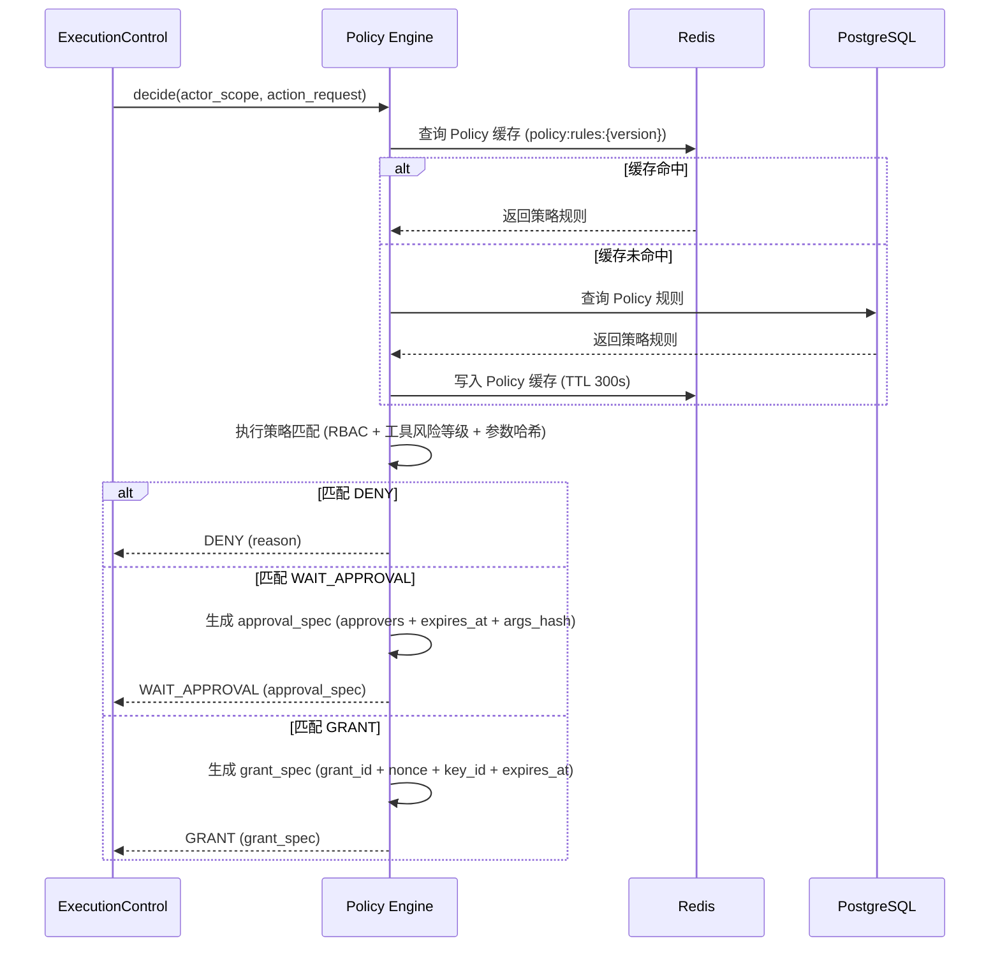

##### §3.2.M2.5 关键流程逻辑

**三态 Policy 决策伪代码**：

```
触发：ExecutionControl 调用 Policy.decide(actor_scope, action_request)

Step 1: 加载策略规则（同步）
  ├── 校验：actor_scope 有效（tenant_id + principal_id 匹配认证态）
  ├── 查询：Redis policy:rules:{active_version} → 缓存未命中则查 DB
  └── 计算：policy_digest = SHA-256(active_rules_json)

Step 2: 策略匹配（同步）
  ├── 匹配维度：principal_roles × tool_name × resource_scope × args_hash
  ├── 匹配规则：
  │     规则 1：RBAC 角色权限检查（复用 myself-agent 4 角色 52 权限）
  │     规则 2：工具风险等级（high_risk → 强制 WAIT_APPROVAL）
  │     规则 3：参数哈希绑定（normalized_args_hash 与审批记录一致）
  └── 状态变更：返回 DENY / WAIT_APPROVAL / GRANT

Step 3: 授权生成（GRANT 时）
  ├── 生成：grant_id = UUID()
  ├── 生成：nonce = random(32)
  ├── 签名：HMAC-SHA256(key_id, grant_payload)
  └── [MOCK] MVP 简化版：密钥轮换延后到完整版
        输入：grant_id + nonce + expires_at
        规则：固定密钥签名
        输出：grant_spec
        [完整版替换点] 密钥轮换 + 密钥版本号 + 密钥链验证
```

**PolicyDecision 状态语义**：

| 决策值 | 含义 | 后续动作 |
| --- | --- | --- |
| DENY | 策略拒绝 | ExecutionControl 更新 Task → FAILED |
| WAIT_APPROVAL | 策略要求审批 | ExecutionControl 创建 ApprovalRequest，不签发 CapabilityGrant |
| GRANT | 策略授权 | Policy 签发 CapabilityGrant，ToolGateway 可执行工具 |

---

#### 3.2.M3 Approval Gateway

##### §3.2.M3.1 模块概述

Approval Gateway 模块覆盖持久化审批门业务流程，业务逻辑在 Agent 运维操作者（审批操作）、系统自动超时之间流动，同时涉及 Operator Console（E-03）、PostgreSQL（C-01）等内外部系统的数据流动。审批通过后必须触发持久化 Resume Command 而非仅更新审批表。

##### §3.2.M3.2 接口清单

| 子领域 | 方法 | 路径 | 用途（≤ 20 字） | 请求 DTO | 响应 VO | 幂等 |
| --- | --- | --- | --- | --- | --- | --- |
| 审批管理 | POST | /api/v1/approvals/{approvalId}/resolve | 批准或拒绝审批 | ApprovalResolveRequest | ApprovalResolutionVO | 是（id+version） |
| 审批管理 | GET | /api/v1/approvals | 查询待审批列表 | ApprovalListRequest | PageResponse[ApprovalVO] | 天然 |
| 审批管理 | GET | /api/v1/approvals/{approvalId} | 查询审批详情 | — | ApprovalDetailVO | 天然 |

##### §3.2.M3.3 关键结构定义（DTO）

```python
class ApprovalRequest(BaseModel):
    # ===== 必填字段 =====
    approval_id: str           # 审批 ID
    actor_scope: ActorScope    # 请求者身份
    run_id: str                # 关联 Run ID
    step_run_id: str           # 关联 StepRun ID
    tool_name: str             # 目标工具名
    normalized_args_hash: str  # 参数规范化哈希（防篡改）
    resource_scope: str        # 资源范围
    policy_digest: str         # 策略版本摘要
    expires_at: datetime       # 超时时间

    # ===== 状态字段 =====
    status: str                # PENDING / APPROVED / REJECTED / EXPIRED

class ApprovalResolveRequest(BaseModel):
    # ===== 必填字段 =====
    decision: str              # approved / rejected
    expected_revision: int     # 乐观锁版本号
    approver_note: str | None  # 审批备注
```

**关键字段定义表**：

| DTO / VO 名 | 字段名 | 类型 | 必填 | 业务含义 | 约束 / 默认值 |
| --- | --- | --- | --- | --- | --- |
| ApprovalRequest | status | String | 是 | 审批状态 | 枚举：PENDING / APPROVED / REJECTED / EXPIRED |
| ApprovalRequest | normalized_args_hash | String | 是 | 参数哈希 | SHA-256，审批后参数变化则哈希不匹配 |
| ApprovalRequest | policy_digest | String | 是 | 策略版本摘要 | 绑定审批时的策略版本 |
| ApprovalRequest | expires_at | DateTime | 是 | 超时时间 | 默认 24h 后过期 |
| ApprovalResolveRequest | expected_revision | Integer | 是 | 乐观锁版本号 | 防止并发审批操作 |

##### §3.2.M3.4 模块逻辑时序图

| 编号 | 标题（Approval Gateway - 场景名） | 场景类别 | 是否包含异常分支 |
| --- | --- | --- | --- |
| SQ-M3-01 | Approval Gateway - 审批通过触发 Resume Command | 核心动作的执行 / 触发 / 回调 | 是 |
| SQ-M3-02 | Approval Gateway - 审批超时过期 | 异常 / 补偿 / 回滚 | 是 |

**SQ-M3-01：Approval Gateway - 审批通过触发 Resume Command**

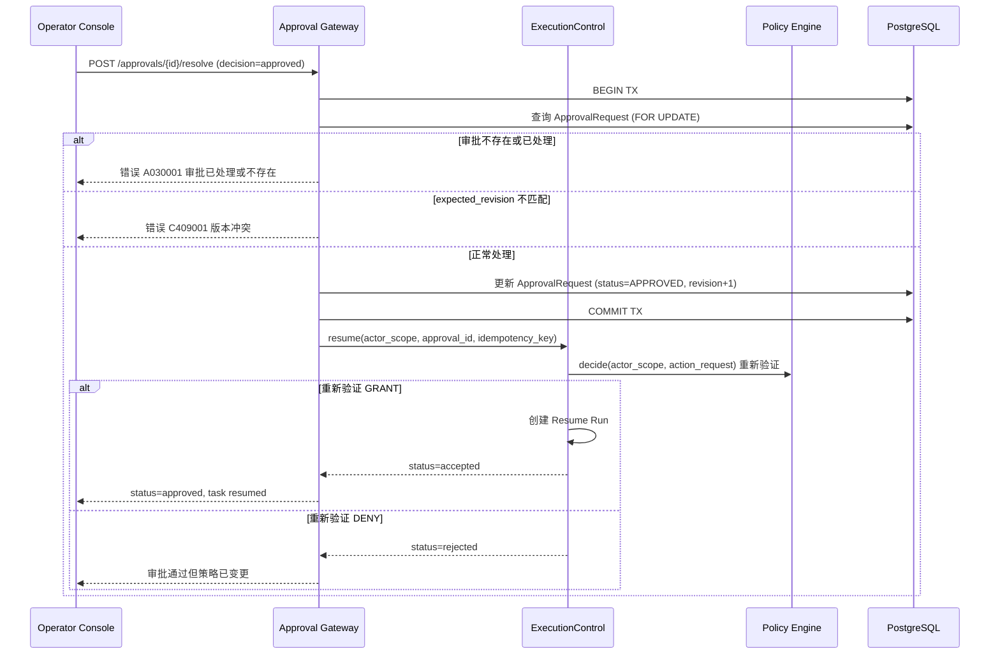

##### §3.2.M3.5 关键流程逻辑

**审批状态机迁移表**：

| 起始状态 | 触发事件 | 终止状态 | 触发条件 / 校验 | 副作用 |
| --- | --- | --- | --- | --- |
| PENDING | resolve(approved) | APPROVED | expected_revision 匹配 | 触发 Resume Command + Policy 重新验证 |
| PENDING | resolve(rejected) | REJECTED | expected_revision 匹配 | 更新 Task → FAILED |
| PENDING | expire | EXPIRED | expires_at 超时 | 更新 Task → FAILED + 通知用户 |

> **关键约束**：批准动作必须触发持久化 Resume Command 而非只更新审批表。Resume Command 是新的 AgentCommand，经 ExecutionControl.submit 重新进入主链路，Policy.decide 重新验证——防止审批后策略规则已变更。

---

#### 3.2.M4 Workflow Runtime

##### §3.2.M4.1 模块概述

Workflow Runtime 模块覆盖版本化 Workflow 编排业务流程，业务逻辑在 LangGraph StateGraph 引擎、天枢 9 角色 7 态状态机之间流动，同时涉及 LLM Provider（E-02）、PostgreSQL（C-01）、Langfuse（C-03）等内外部系统的数据流动。它将天枢状态机转为 WorkflowDefinition，使用 LangGraph StateGraph 作为内部编排引擎。

##### §3.2.M4.2 接口清单

| 子领域 | 方法 | 路径 | 用途（≤ 20 字） | 请求 DTO | 响应 VO | 幂等 |
| --- | --- | --- | --- | --- | --- | --- |
| Workflow 管理 | POST | /api/v1/workflows/install | 安装 Workflow 定义 | WorkflowInstallRequest | WorkflowVersionVO | 是（X-Idempotency-Key） |
| Workflow 管理 | POST | /api/v1/workflows/{versionId}/instantiate | 实例化 Workflow | WorkflowInstantiateRequest | WorkflowRunVO | 是（idempotencyKey） |
| Workflow 管理 | POST | /api/v1/workflows/runs/{runId}/handle-event | 处理 Workflow 事件 | WorkflowEventRequest | WorkflowActionsVO | 天然 |
| Workflow 管理 | GET | /api/v1/workflows/definitions | 查询 Workflow 定义列表 | — | List[WorkflowDefinitionVO] | 天然 |
| Workflow 管理 | GET | /api/v1/workflows/runs/{runId} | 查询 Workflow Run 详情 | — | WorkflowRunDetailVO | 天然 |

##### §3.2.M4.3 关键结构定义（DTO）

```python
class WorkflowDefinition(BaseModel):
    # ===== 必填字段 =====
    version: str               # 版本号
    roles: list[str]           # 角色列表（映射天枢 9 角色：receiver/planning/review/dispatch/doc/eng/qa/aggregation）
    phases: list[str]          # 阶段列表（映射天枢 7 态：Pending/Receiving/Planning/Reviewing/Assigned/Doing/Done）
    transitions: list[dict]    # 状态转移规则（含条件边）
    review_gates: list[dict]   # 审核门（三审制：初审/复审/终审）
    routing_rules: list[dict]  # 路由规则（技能自动匹配 + 负载均衡）
    output_contract: dict      # 输出契约

class WorkflowRun(BaseModel):
    # ===== 基本信息 =====
    workflow_run_id: str
    task_id: str
    workflow_version: str

    # ===== 状态字段 =====
    current_phase: str         # 当前 WorkflowPhase
    phase_history: list[dict]  # 阶段历史（含时间戳和触发事件）
```

**关键字段定义表**：

| DTO / VO 名 | 字段名 | 类型 | 必填 | 业务含义 | 约束 / 默认值 |
| --- | --- | --- | --- | --- | --- |
| WorkflowDefinition | version | String | 是 | Workflow 版本号 | 语义化版本（如 v1.0.0） |
| WorkflowDefinition | roles | List[String] | 是 | 角色列表 | 映射天枢 9 角色 |
| WorkflowDefinition | phases | List[String] | 是 | 阶段列表 | 映射天枢 7 态 |
| WorkflowDefinition | review_gates | List[Object] | 是 | 审核门 | 三审制配置 |
| WorkflowRun | current_phase | String | 是 | 当前阶段 | 枚举：Pending / Receiving / Planning / Reviewing / Assigned / Doing / Done |
| WorkflowRun | phase_history | List[Object] | 是 | 阶段历史 | 每条含 phase/from/to/timestamp/trigger |

##### §3.2.M4.4 模块逻辑时序图

| 编号 | 标题（Workflow Runtime - 场景名） | 场景类别 | 是否包含异常分支 |
| --- | --- | --- | --- |
| SQ-M4-01 | Workflow Runtime - LangGraph StateGraph 编排 | 核心动作的执行 / 触发 / 回调 | 是 |

**SQ-M4-01：Workflow Runtime - LangGraph StateGraph 编排**

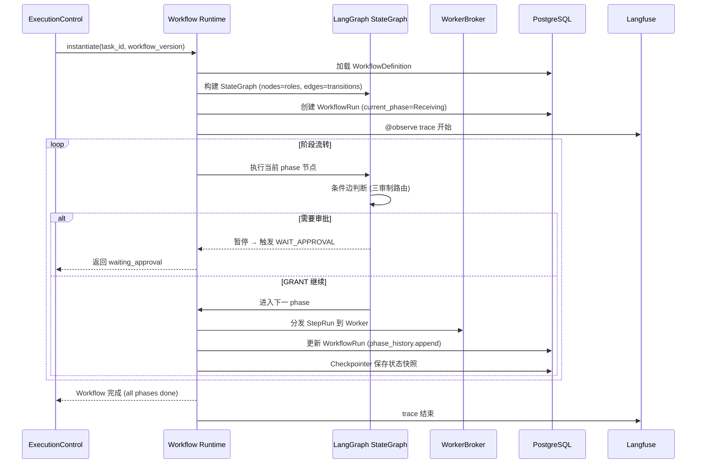

##### §3.2.M4.5 关键流程逻辑

**WorkflowPhase 状态机迁移表（映射天枢 7 态）**：

| 起始状态 | 触发事件 | 终止状态 | 触发条件 / 校验 | 副作用 |
| --- | --- | --- | --- | --- |
| Pending | instantiate | Receiving | WorkflowDefinition 加载成功 | 创建 WorkflowRun |
| Receiving | message_received | Planning | 意图识别 + 任务创建完成 | 分发到中书局（Planning） |
| Planning | plan_completed | Reviewing | 需求分析 + 任务拆解完成 | 分发到审核院（Review） |
| Reviewing | review_passed | Assigned | 三审制全部通过（初审+复审+终审） | 分发到调度监（Dispatch） |
| Reviewing | review_failed | Planning | 审核不通过 | 退回中书局修改 |
| Assigned | dispatch_completed | Doing | 技能匹配 + 负载均衡完成 | 分发到编修馆/工艺局/质检司 |
| Doing | task_completed | Done | 全部 StepRun 执行成功 | 分发到汇总阁（Aggregation） |

> **[简化] MVP 基础路由**：MVP 实现三审制基础路由（Pending→Receiving→Planning→Reviewing→Assigned→Doing→Done）。停滞恢复 4 阶段（180s/360s/540s/720s 自动重试→升级→回滚）延后到完整版 Phase 5。

---

#### 3.2.M5 WorkerBroker

##### §3.2.M5.1 模块概述

WorkerBroker 模块覆盖 Worker 注册、StepRun 分发、Lease 管理、心跳监控、Orphan Recovery 业务流程，业务逻辑在 Worker 进程、系统调度之间流动，同时涉及 Redis（C-02）、PostgreSQL（C-01）、特权 Adapter 容器（E-05）等内外部系统的数据流动。它实现 D1,§6.4 WorkerBroker 接口。

##### §3.2.M5.2 接口清单

| 子领域 | 方法 | 路径 | 用途（≤ 20 字） | 请求 DTO | 响应 VO | 幂等 |
| --- | --- | --- | --- | --- | --- | --- |
| Worker 管理 | POST | /api/v1/workers/register | 注册 Worker | WorkerRegisterRequest | WorkerVO | 是（worker_id） |
| Worker 管理 | POST | /api/v1/workers/{workerId}/claim | 认领 StepRun | ClaimRequest | LeaseVO | 天然 |
| Worker 管理 | POST | /api/v1/workers/{workerId}/heartbeat | 心跳续约 | HeartbeatRequest | LeaseStatusVO | 天然 |
| Worker 管理 | POST | /api/v1/workers/{workerId}/complete | 完成 StepRun | CompleteRequest | CompletionVO | 是（lease_id） |
| Worker 管理 | POST | /api/v1/workers/{workerId}/fail | 报告 StepRun 失败 | FailRequest | RetryDecisionVO | 是（lease_id） |
| Worker 管理 | GET | /api/v1/workers | 查询 Worker 状态 | — | List[WorkerVO] | 天然 |

##### §3.2.M5.3 关键结构定义（DTO）

```python
class WorkerRegisterRequest(BaseModel):
    # ===== 必填字段 =====
    worker_id: str             # Worker 唯一标识
    capabilities: list[str]    # 能力列表（如 shell, browser, pty）
    max_concurrency: int       # 最大并发数

class LeaseVO(BaseModel):
    # ===== 基本信息 =====
    lease_id: str              # 租约 ID
    worker_id: str             # Worker ID
    step_run_id: str           # 关联 StepRun ID
    run_id: str                # 关联 Run ID

    # ===== 状态字段 =====
    status: str                # ACTIVE / EXPIRED / RELEASED
    attempt: int               # 执行尝试序号

    # ===== 时间字段 =====
    acquired_at: datetime      # 认领时间
    expires_at: datetime       # 过期时间（默认 120s）
```

**关键字段定义表**：

| DTO / VO 名 | 字段名 | 类型 | 必填 | 业务含义 | 约束 / 默认值 |
| --- | --- | --- | --- | --- | --- |
| WorkerRegisterRequest | capabilities | List[String] | 是 | Worker 能力 | 用于技能匹配路由 |
| LeaseVO | status | String | 是 | 租约状态 | 枚举：ACTIVE / EXPIRED / RELEASED |
| LeaseVO | expires_at | DateTime | 是 | 过期时间 | 默认 120s 后过期 |
| LeaseVO | attempt | Integer | 是 | 执行尝试序号 | 重试创建新 attempt，不覆盖历史 |

##### §3.2.M5.4 模块逻辑时序图

| 编号 | 标题（WorkerBroker - 场景名） | 场景类别 | 是否包含异常分支 |
| --- | --- | --- | --- |
| SQ-M5-01 | WorkerBroker - Lease 认领与心跳 | 核心动作的执行 / 触发 / 回调 | 是 |
| SQ-M5-02 | WorkerBroker - Orphan Recovery（进程崩溃恢复） | 异常 / 补偿 / 回滚 | 是 |

**SQ-M5-02：WorkerBroker - Orphan Recovery（进程崩溃恢复）**

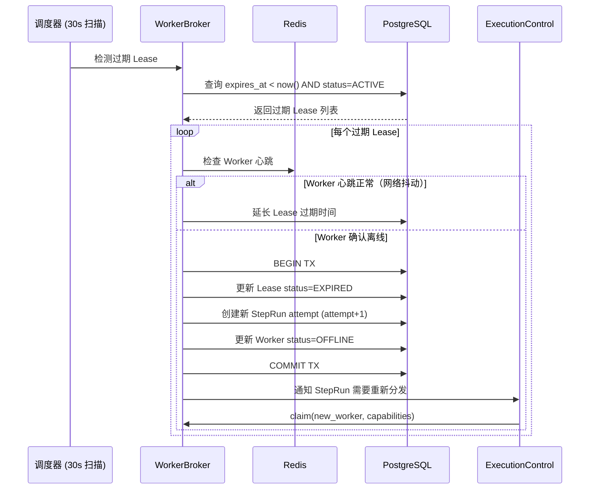

##### §3.2.M5.5 关键流程逻辑

**WorkerStatus 状态机迁移表（5 态）**：

| 起始状态 | 触发事件 | 终止状态 | 触发条件 / 校验 | 副作用 |
| --- | --- | --- | --- | --- |
| INIT | register | ONLINE | 注册成功 | 写入 Worker 记录 |
| ONLINE | heartbeat_timeout | SUSPECTED | 心跳超过 60s 未收到 | 标记可疑 |
| SUSPECTED | heartbeat_recovered | ONLINE | 心跳恢复 | 恢复在线 |
| SUSPECTED | heartbeat_timeout_2 | OFFLINE | 心跳超过 120s 未收到 | 标记离线 + Orphan Recovery |
| OFFLINE | re_register | ONLINE | 重新注册 | 恢复在线 |
| * | deregister | TERMINATED | 主动注销 | 清理 Lease |

**Orphan Recovery 伪代码**：

```
触发：调度器每 30s 扫描过期 Lease

Step 1: 检测过期 Lease（定时任务）
  ├── 查询：SELECT * FROM t_lease WHERE expires_at < now() AND status = 'ACTIVE'
  └── 校验：Lease 关联的 StepRun 状态为 EXECUTING

Step 2: Worker 心跳验证（同步）
  ├── 查询 Redis：worker:heartbeat:{worker_id} 最后心跳时间
  ├── 判定：最后心跳 < 60s → 网络抖动，延长 Lease
  └── 判定：最后心跳 > 120s → 确认离线

Step 3: Orphan Recovery（事务）
  ├── BEGIN TX
  ├── 更新 Lease status = EXPIRED
  ├── 创建新 StepRun attempt (attempt = old_attempt + 1)
  ├── 更新 Worker status = OFFLINE
  ├── COMMIT TX
  └── 状态变更：StepRun 重新进入待分发队列
```

---

#### 3.2.M6 ToolGateway

##### §3.2.M6.1 模块概述

ToolGateway 模块覆盖 CapabilityGrant 验证和工具执行业务流程，业务逻辑在 WorkerBroker 分发、特权 Adapter 容器执行之间流动，同时涉及特权 Adapter 容器（E-05）、PostgreSQL（C-01）等内外部系统的数据流动。它验证 Grant 的 nonce、参数哈希、资源范围和过期时间后才执行工具。

##### §3.2.M6.2 接口清单

| 子领域 | 方法 | 路径 | 用途（≤ 20 字） | 请求 DTO | 响应 VO | 幂等 |
| --- | --- | --- | --- | --- | --- | --- |
| 工具执行 | POST | /api/v1/tools/execute | 验证 Grant 并执行工具 | ToolExecuteRequest | ToolReceiptVO | 是（grant_id+nonce） |

##### §3.2.M6.3 关键结构定义（DTO）

```python
class ToolExecuteRequest(BaseModel):
    # ===== 必填字段 =====
    capability_grant: CapabilityGrant  # 能力授权令牌
    tool_request: ToolRequest          # 工具请求

class CapabilityGrant(BaseModel):
    # ===== 基本信息 =====
    grant_id: str              # 授权 ID
    nonce: str                 # 一次性随机数
    key_id: str                # 签名密钥 ID
    signature: str             # HMAC-SHA256 签名
    expires_at: datetime       # 过期时间

    # ===== 授权范围 =====
    tool_name: str             # 授权的工具名
    normalized_args_hash: str  # 参数哈希（绑定）
    resource_scope: str        # 资源范围

class ToolReceiptVO(BaseModel):
    # ===== 基本信息 =====
    receipt_id: str            # 收据 ID
    tool_name: str             # 执行的工具名
    step_run_id: str           # 关联 StepRun

    # ===== 结果字段 =====
    success: bool              # 执行是否成功
    output: dict               # 执行输出
    side_effects: list[dict]   # 副作用记录（文件变更/网络请求/进程创建等）

    # ===== 时间字段 =====
    executed_at: datetime
    duration_ms: int           # 执行时长
```

**关键字段定义表**：

| DTO / VO 名 | 字段名 | 类型 | 必填 | 业务含义 | 约束 / 默认值 |
| --- | --- | --- | --- | --- | --- |
| CapabilityGrant | grant_id | String | 是 | 授权 ID | UUID |
| CapabilityGrant | nonce | String | 是 | 一次性随机数 | 32 字节随机，防重放 |
| CapabilityGrant | signature | String | 是 | HMAC 签名 | HMAC-SHA256(key, grant_payload) |
| CapabilityGrant | expires_at | DateTime | 是 | 过期时间 | 默认 5 分钟 |
| ToolReceiptVO | side_effects | List[Object] | 是 | 副作用记录 | 每条含 type/target/before/after |

##### §3.2.M6.4 模块逻辑时序图

| 编号 | 标题（ToolGateway - 场景名） | 场景类别 | 是否包含异常分支 |
| --- | --- | --- | --- |
| SQ-M6-01 | ToolGateway - Grant 验证与工具执行 | 核心动作的执行 / 触发 / 回调 | 是 |

**SQ-M6-01：ToolGateway - Grant 验证与工具执行**

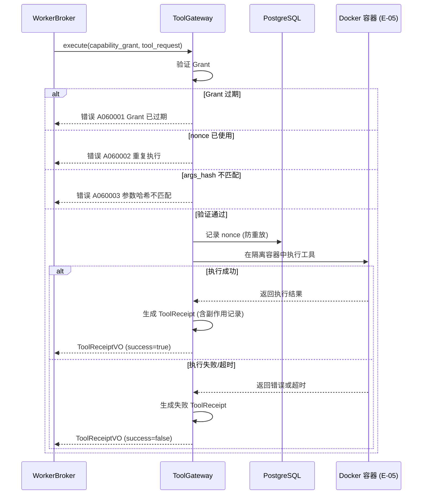

##### §3.2.M6.5 关键流程逻辑

**Grant 验证伪代码**：

```
触发：WorkerBroker 调用 ToolGateway.execute(capability_grant, tool_request)

Step 1: Grant 验证（同步）
  ├── 校验：expires_at > now() → 否则返回 A060001
  ├── 校验：nonce 未使用（查 DB t_capability_grant.nonce_consumed）→ 否则返回 A060002
  ├── 校验：HMAC-SHA256(key_id, grant_payload) == signature → 否则返回 A060003
  ├── 校验：SHA-256(tool_request.args) == grant.normalized_args_hash → 否则返回 A060003
  └── 标记：nonce_consumed = true（防重放）

Step 2: 隔离容器执行（同步）
  ├── [MOCK] MVP：Shell/Browser Adapter Docker 容器
  │     输入：tool_name + args + resource_scope
  │     规则：seccomp + cgroups + 非 root 用户
  │     输出：执行结果 + 副作用记录
  │     [完整版替换点] Desktop/Plugin Adapter（完整版 Phase 6）

Step 3: 生成 ToolReceipt（事务）
  ├── 记录：executed_at + duration_ms + success + output
  ├── 记录：side_effects（文件变更/网络请求/进程创建）
  └── 写入 DomainEvent (tool.executed)
```

---

#### 3.2.M7 EventLog and Projection

##### §3.2.M7.1 模块概述

EventLog and Projection 模块覆盖领域事件持久化、Transactional Outbox 投递、Inbox 去重、Projection 读模型重建业务流程，业务逻辑在 Outbox Worker、Projection Consumer、系统各模块之间流动，同时涉及 PostgreSQL（C-01）、Operator Console（E-03）、ClawLibrary（E-04）等内外部系统的数据流动。它实现 D1,§6.7 EventLog/Projection 接口和 D1,§7.3 投递语义。

##### §3.2.M7.2 接口清单

| 子领域 | 方法 | 路径 | 用途（≤ 20 字） | 请求 DTO | 响应 VO | 幂等 |
| --- | --- | --- | --- | --- | --- | --- |
| 事件管理 | POST | /api/v1/events/append | 追加领域事件 | EventAppendRequest | AppendReceiptVO | 是（eventId） |
| 事件管理 | GET | /api/v1/events | 读取事件流（游标） | EventReadRequest | EventPageVO | 天然 |
| Projection | POST | /api/v1/projections/rebuild | 全量重建 Projection | RebuildRequest | ProjectionVersionVO | 是（stream+version） |
| Projection | GET | /api/v1/projections/snapshot | 读取 Projection 快照 | SnapshotRequest | SnapshotVO | 天然 |

##### §3.2.M7.3 关键结构定义（DTO）

```python
class DomainEvent(BaseModel):
    # ===== 必填字段 =====
    schema_version: str        # Schema 版本
    event_id: str              # 事件唯一 ID（UUID）
    event_type: str            # 事件类型（如 task.submitted / step.completed）
    source: dict               # 来源（system + instanceId）
    aggregate: dict            # 聚合根引用（kind + id + revision）
    sequence: int              # 序列号（同一聚合内单调递增）
    occurred_at: datetime      # 事件发生时间
    classification: str        # 分类（如 task / workflow / approval / tool）

    # ===== 追踪字段 =====
    correlation_id: str        # 关联 ID
    causation_id: str          # 因果 ID（触发此事件的前序命令/事件）
    trace_id: str              # OpenTelemetry Trace ID

    # ===== 多租户 =====
    tenant_id: str
    workspace_id: str

    # ===== 数据 =====
    actor: dict                # 操作者
    data: dict                 # 事件数据体

class SnapshotVO(BaseModel):
    # ===== 基本信息 =====
    projection_type: str       # Projection 类型（MVP: AgentSnapshot）
    version: int               # Projection 版本

    # ===== 可信度标注 =====
    source_status: str         # live / stale / unavailable / simulated
    observed_at: datetime      # 数据观测时间
    projected_at: datetime     # Projection 更新时间
    source_errors: list[str]   # 数据源错误列表

    # ===== 数据体 =====
    data: dict                 # Snapshot 数据
```

**关键字段定义表**：

| DTO / VO 名 | 字段名 | 类型 | 必填 | 业务含义 | 约束 / 默认值 |
| --- | --- | --- | --- | --- | --- |
| DomainEvent | event_id | String | 是 | 事件唯一 ID | UUID v4，用于 Inbox 去重 |
| DomainEvent | sequence | Integer | 是 | 序列号 | 同一聚合内单调递增 |
| DomainEvent | causation_id | String | 是 | 因果 ID | 追溯到触发命令 |
| SnapshotVO | source_status | String | 是 | 数据可信度 | 枚举：live / stale / unavailable / simulated |
| SnapshotVO | observed_at | DateTime | 是 | 数据观测时间 | 数据源的实际时间 |
| SnapshotVO | projected_at | DateTime | 是 | Projection 更新时间 | projected_at - observed_at > 30s → stale |

##### §3.2.M7.4 模块逻辑时序图

| 编号 | 标题（EventLog and Projection - 场景名） | 场景类别 | 是否包含异常分支 |
| --- | --- | --- | --- |
| SQ-M7-01 | EventLog - Transactional Outbox 写入与投递 | 核心实体的创建 / 配置 / 发布 | 是 |
| SQ-M7-02 | Projection - 全量重建 | 异常 / 补偿 / 回滚 | 是 |

**SQ-M7-01：EventLog - Transactional Outbox 写入与投递**

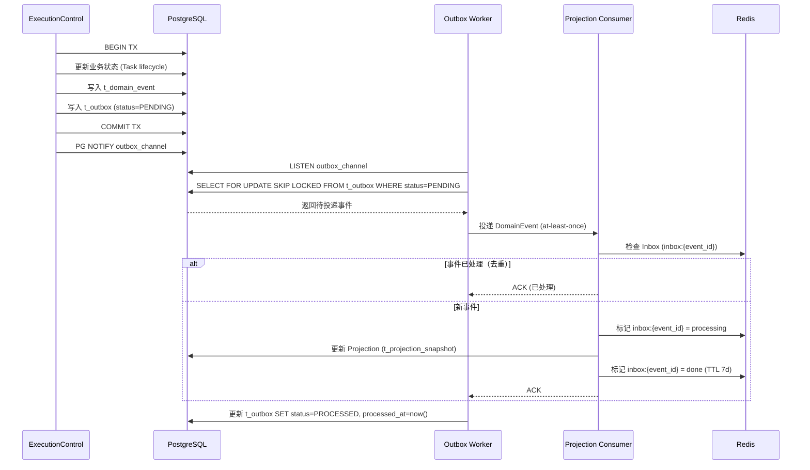

**SQ-M7-02：Projection - 全量重建**

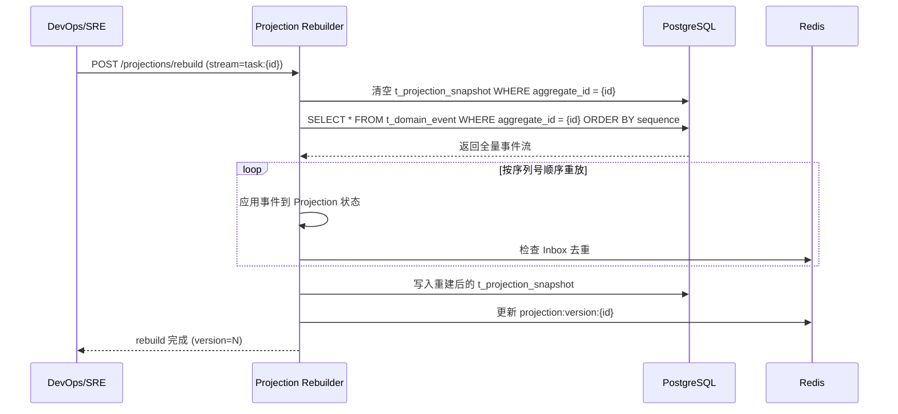

##### §3.2.M7.5 关键流程逻辑

**Transactional Outbox 投递语义**：

```
投递模式：at-least-once（至少一次）
去重机制：消费者通过 eventId / aggregate revision / Inbox checkpoint 去重
一致性保证：不宣称 exactly-once，通过幂等副作用实现业务等价

Step 1: 事件写入（事务内）
  ├── 业务状态变更 + t_domain_event + t_outbox 在同一事务
  ├── 保证：业务状态变更和事件记录原子性
  └── PG NOTIFY 触发 Outbox Worker

Step 2: 事件投递（事务外）
  ├── Outbox Worker: SELECT FOR UPDATE SKIP LOCKED
  ├── at-least-once 投递到 Projection Consumer
  └── 失败重试（指数退避，封顶 1h）

Step 3: 事件消费（幂等）
  ├── Inbox 去重：eventId 首次处理 → 执行；重复 → 跳过
  ├── Projection 更新：按 sequence 顺序应用事件
  └── outbox 标记 PROCESSED
```

**source_status 判定逻辑**：

| 条件 | source_status | 用户感知 |
| --- | --- | --- |
| projected_at - observed_at ≤ 30s | live | 数据实时 |
| projected_at - observed_at > 30s | stale | 数据延迟 |
| 数据源不可达 | unavailable | 服务离线，显示最后已知状态 |
| Mock Adapter 测试 | simulated | 模拟数据（开发环境） |

---

#### 3.2.M8 Audit Store

##### §3.2.M8.1 模块概述

Audit Store 模块覆盖篡改证明审计链业务流程，业务逻辑在系统各模块产生副作用、安全合规审计员审阅之间流动，同时涉及 PostgreSQL（C-01）等内外部系统的数据流动。它实现 D1,§8.5 审计完整性——每条 Audit Record 含前一条 SHA-256 哈希 + 创建时 HMAC-SHA256 签名。

##### §3.2.M8.2 接口清单

| 子领域 | 方法 | 路径 | 用途（≤ 20 字） | 请求 DTO | 响应 VO | 幂等 |
| --- | --- | --- | --- | --- | --- | --- |
| 审计管理 | GET | /api/v1/audit/records | 查询审计记录 | AuditQueryRequest | PageResponse[AuditRecordVO] | 天然 |
| 审计管理 | GET | /api/v1/audit/records/{recordId} | 查询审计详情 | — | AuditRecordDetailVO | 天然 |
| 审计验证 | POST | /api/v1/audit/verify | 验证 hash chain 完整性 | VerifyRequest | VerifyResultVO | 天然 |
| 审计验证 | POST | /api/v1/audit/export | 导出审计记录 | ExportRequest | ExportResultVO | 是（X-Idempotency-Key） |

##### §3.2.M8.3 关键结构定义（DTO）

```python
class AuditRecord(BaseModel):
    # ===== 基本信息 =====
    record_id: str             # 审计记录 ID
    timestamp: datetime        # 记录时间

    # ===== 操作者与决策 =====
    actor: dict                # 操作者（type/id/roles）
    decision: dict             # 策略决策（decision_id/policy_digest/result）
    approval: dict | None      # 审批记录（approval_id/resolver/decision）

    # ===== 授权与执行 =====
    grant: dict | None         # 能力授权（grant_id/nonce/expires_at）
    tool_receipt: dict | None  # 工具收据（receipt_id/tool_name/side_effects）
    resource_scope: str        # 资源范围

    # ===== 篡改证明 =====
    prev_hash: str             # 前一条记录的 SHA-256 哈希
    record_hash: str           # 本条记录的 SHA-256 哈希
    signature: str             # HMAC-SHA256 签名
    key_id: str                # 签名密钥 ID
```

**关键字段定义表**：

| DTO / VO 名 | 字段名 | 类型 | 必填 | 业务含义 | 约束 / 默认值 |
| --- | --- | --- | --- | --- | --- |
| AuditRecord | prev_hash | String | 是 | 前一条哈希 | SHA-256(prev_record_hash + prev_record_data) |
| AuditRecord | record_hash | String | 是 | 本条哈希 | SHA-256(prev_hash + record_data) |
| AuditRecord | signature | String | 是 | HMAC 签名 | HMAC-SHA256(key_id, record_hash) |
| AuditRecord | key_id | String | 是 | 密钥 ID | 复用 Capability Token 密钥体系 |

##### §3.2.M8.4 模块逻辑时序图

| 编号 | 标题（Audit Store - 场景名） | 场景类别 | 是否包含异常分支 |
| --- | --- | --- | --- |
| SQ-M8-01 | Audit Store - hash chain 写入 | 核心实体的创建 / 配置 / 发布 | 是 |
| SQ-M8-02 | Audit Store - hash chain 完整性验证 | 核心动作的执行 / 触发 / 回调 | 是 |

**SQ-M8-01：Audit Store - hash chain 写入**

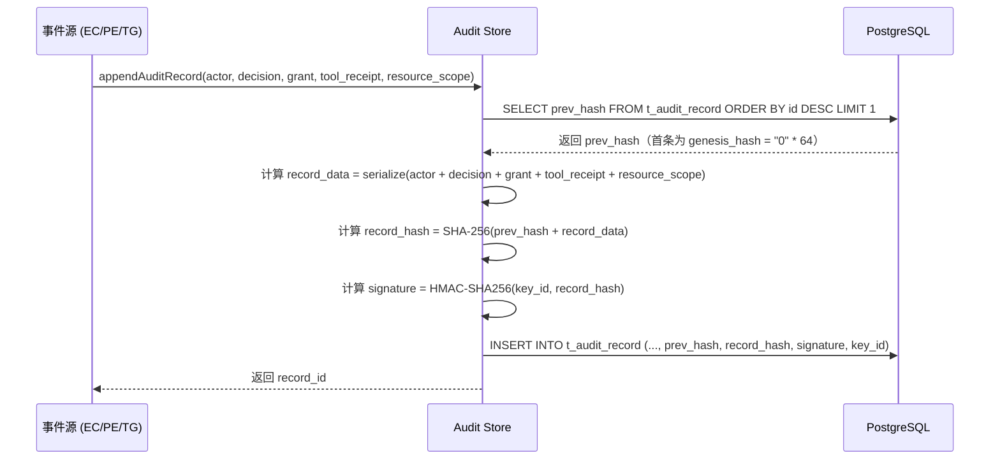

##### §3.2.M8.5 关键流程逻辑

**hash chain 签名伪代码**：

```
触发：事件源（ExecutionControl / Policy Engine / ToolGateway）调用 Audit Store 追加记录

Step 1: 获取前一条哈希（同步）
  ├── 查询：SELECT record_hash FROM t_audit_record ORDER BY sequence DESC LIMIT 1
  └── 首条：prev_hash = "0" * 64（genesis hash）

Step 2: 计算哈希链（同步）
  ├── 序列化：record_data = canonical_json(actor + decision + approval + grant + tool_receipt + resource_scope)
  ├── 计算：record_hash = SHA-256(prev_hash + record_data)
  └── 计算：signature = HMAC-SHA256(key_id, record_hash)

Step 3: 持久化（事务）
  ├── INSERT INTO t_audit_record
  └── [MOCK] MVP 简化版：创建时签名，验证工具延后
        输入：record_id + record_data
        规则：固定密钥签名（key_id = "default"）
        输出：signature
        [完整版替换点] 密钥轮换 + 验证工具 + 外部不可变存储
```

**hash chain 验证伪代码**：

```
触发：安全合规审计员调用 POST /audit/verify

Step 1: 加载审计链
  ├── 查询：SELECT * FROM t_audit_record ORDER BY sequence ASC

Step 2: 逐条验证
  ├── 对每条记录：
  │     计算 expected_hash = SHA-256(prev_hash + record_data)
  │     校验：expected_hash == record.record_hash → 否则报告篡改
  │     校验：HMAC-SHA256(key_id, record_hash) == record.signature → 否则报告伪造
  └── prev_hash = record.record_hash（传递到下一条）

Step 3: 输出验证结果
  ├── total_records / verified_records / tampered_records
  └── 首条篡改记录的 sequence + record_id
```

---

#### 3.2.M9 EffectJournal（副作用日志与对账）

> **本模块为 v3 增强新增**：解决"工具调用模糊失败时盲目重试导致重复外部副作用"的核心可靠性问题。v3 §4.3 不变式要求"所有副作用在调用外部系统前先创建持久 EffectRecord；非幂等工具出现模糊结果时进入 UNKNOWN_OUTCOME，不得自动重试"。

**模块概述**：EffectJournal 是 ToolGateway 内部的副作用持久化与对账子模块，负责在每次外部副作用调用前持久化"副作用意图"，记录 dispatch 尝试，根据 ToolEffectContract 和结果状态决定是否允许重试。它把"工具调用"从一次动作升级为四阶段持久化协议（PREPARE → ACQUIRE_DISPATCH → CALL_ADAPTER → FINALIZE），使模糊失败可识别、可对账、可安全恢复。

**核心实体**：
- `EffectRecord`：持久化的副作用意图（含 effect_id、step_run_id、business_attempt、action_id、tool_name、normalized_args_hash、resource_scope、effect_class、status）
- `EffectAuthorizationAttempt`：每次授权尝试（含 capability_grant_id、security_context_digest、authorization_basis、status、nonce）
- `EffectDispatchAttempt`：每次外部派发尝试（含 dispatch_state、fencing_token、provider_idempotency_key、started_at、finalized_at）
- `ToolReceipt`：规范化结果与 provider evidence（含 effect_id 引用）

**接口清单**：

```python
class EffectJournal:
    def prepare(self, step_run_id: str, action_id: str, tool_request: ToolRequest,
                actor_scope: ActorScope, policy_decision: PolicyDecision,
                capability_grant: CapabilityGrant) -> EffectRecord:
        """PREPARE 阶段：持久化副作用意图 + 授权尝试（nonce consumed）。
        同事务写 effect_journal + effect_authorization_attempts + domain_events + outbox。"""

    def acquire_dispatch(self, effect_id: str, lease: Lease,
                         security_context_digest: str) -> EffectDispatchAttempt:
        """ACQUIRE_DISPATCH 阶段：验证 Grant/Lease/fencing_token/Profile/参数/security_context，
        通过 CAS 创建 append-only EffectDispatchAttempt(DISPATCHING)。"""

    def finalize(self, effect_id: str, dispatch_attempt_id: str,
                 outcome: DispatchOutcome) -> ToolReceipt:
        """FINALIZE 阶段：根据 Adapter 结果写 ToolReceipt 并迁移 Effect 状态。
        outcome 可能是 confirmed / failed_definite / unknown_outcome。"""

    def reconcile(self, effect_id: str, provider_query_result: ProviderQueryResult) -> EffectStatus:
        """对账：reconcilable 类工具的 provider operation 查询，证明未执行才允许重投。"""
```

**EffectStatus 状态机（v3 §9.7）**：

```text
prepared → dispatching
dispatching → confirmed | failed_definite | unknown_outcome
failed_definite → retry_scheduled | terminal_failed
unknown_outcome → retry_scheduled | reconciling
reconciling → confirmed | failed_definite | retry_scheduled | manual_review
retry_scheduled → dispatching
manual_review → confirmed | failed_definite | accepted_unknown
```

**关键不变量**：`unknown_outcome` 是一等状态，不得折叠到 `failed_definite`。

**ToolEffectContract（工具效果契约）**：

| effect_class | 模糊失败后的自动动作 | 允许重投条件 | 最终人工处理 |
|--------------|---------------------|-------------|-------------|
| `read_only` | 可按退避重试 | 无外部写入，资源预算允许 | 多次失败进入人工队列 |
| `provider_idempotent` | 使用同一 provider key 重投 | 下游幂等契约已通过故障测试 | 下游契约失效时暂停 Adapter |
| `reconcilable` | 先查询 provider operation | 查询证明未执行后才可重投 | 无法确认则 manual review |
| `non_retryable` | 禁止自动重投 | 只有人工证明未执行并重新授权 | 默认 manual review |

**fencing_token 机制**：WorkerBroker 签发的每个 Lease 携带单调递增的 fencing_token。EffectDispatchAttempt 持久化 fencing_token，Adapter 调用必须携带。过期 Worker（fencing_token 过期）的所有操作被服务端拒绝，防止"脑裂 Worker 提交旧结果"。

**关键时序图**：

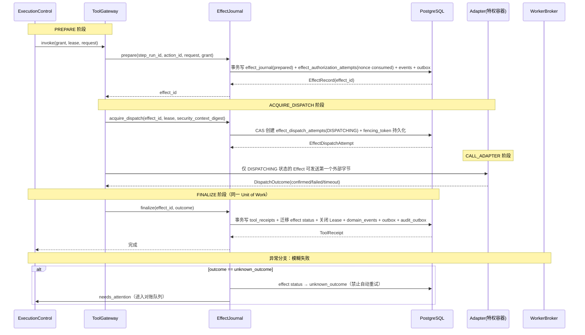

**异常处理**：
- `WAIT_AUDIT_DEPENDENCY`：Enterprise 高风险动作，Audit Store admission 未确认时阻塞 ACQUIRE_DISPATCH
- `STALE_UI_STATE`：Desktop 动作审批后页面/窗口变化，返回重新规划
- `LEASE_FENCED`：Worker 持有的 fencing_token 过期，操作被拒
- `SANDBOX_UNAVAILABLE`：SandboxProfile 不可用，绝不回退到主进程执行

**关键流程逻辑（取消与补偿）**：
- 取消只阻止尚未 dispatch 的 Effect 和尚未开始的 StepRun
- 已 dispatch 的 Effect 必须走确认/对账/补偿，不能因 Run 取消而丢弃结果
- 补偿是新的显式 Effect（带 `compensates_effect_id`），重新经过 Policy/审批/Grant/Lease/审计
- UI 必须区分 `cancel_requested`、`cancelled`、`unknown_outcome`、`needs_reconciliation`、`compensation_failed`

**数据表（落入 §4.2 数据库设计，见下方补充）**：
- `effect_journal`：副作用意图主表
- `effect_authorization_attempts`：授权尝试历史（append-only）
- `effect_dispatch_attempts`：派发尝试历史（append-only）
- 三表通过 effect_id 关联，支持同一逻辑 Effect 的多次授权与派发尝试追溯

**MVP 范围**：✅ 完整实现（四阶段协议 + UNKNOWN_OUTCOME + ToolEffectContract + fencing_token），这是生产可靠性的底线，不可简化

---

### 3.3 核心业务对象清单

#### 3.3.1 对象定义

| 编号 | 对象名（代码类名） | 对象类型 | 包路径 | 模块归属 | 被哪些模块复用 | 实例化策略 | 序列化约定 | 持久化策略 |
| --- | --- | --- | --- | --- | --- | --- | --- | --- |
| O-01 | `Task` | 聚合根 | `packages.execution_control.domain` | M1 | M2 / M4 / M7 | 工厂方法 `TaskFactory.create()` | JSON | 落表 → t_task |
| O-02 | `Run` | 聚合根 | `packages.execution_control.domain` | M1 | M4 / M7 | 由 Task 创建 | JSON | 落表 → t_run |
| O-03 | `StepRun` | 实体 | `packages.execution_control.domain` | M1 | M4 / M5 / M6 | 由 Run 创建 | JSON | 落表 → t_step_run |
| O-04 | `WorkflowDefinition` | 聚合根 | `packages.workflow_runtime.domain` | M4 | M5 | 工厂方法 | JSON | 落表 → t_workflow_definition |
| O-05 | `WorkflowRun` | 聚合根 | `packages.workflow_runtime.domain` | M4 | M5 / M7 | 由 WorkflowDefinition 实例化 | JSON | 落表 → t_workflow_run |
| O-06 | `PolicyDecision` | 值对象 | `packages.policy.domain` | M2 | M3 / M8 | new（不可变） | JSON | 落表 → t_policy_decision |
| O-07 | `ApprovalRequest` | 聚合根 | `packages.approval.domain` | M3 | M1 / M8 | 工厂方法 | JSON | 落表 → t_approval_request |
| O-08 | `CapabilityGrant` | 值对象 | `packages.policy.domain` | M2 | M6 / M8 | new（不可变） | JSON | 落表 → t_capability_grant |
| O-09 | `Worker` | 聚合根 | `packages.worker_broker.domain` | M5 | M4 | 工厂方法 | JSON | 落表 → t_worker |
| O-10 | `Lease` | 实体 | `packages.worker_broker.domain` | M5 | M4 / M6 | 由 Worker 创建 | JSON | 落表 → t_lease |
| O-11 | `ToolReceipt` | 值对象 | `packages.tool_gateway.domain` | M6 | M7 / M8 | new（不可变） | JSON | 落表 → t_tool_receipt |
| O-12 | `DomainEvent` | 值对象 | `common.dto` | common | M7 | new（不可变） | JSON | 落表 → t_domain_event |
| O-13 | `ProjectionSnapshot` | 聚合根 | `packages.event_log.domain` | M7 | — | 由 EventLog 重建 | JSON | 落表 → t_projection_snapshot |
| O-14 | `AuditRecord` | 聚合根 | `packages.audit_store.domain` | M8 | — | 工厂方法 | JSON | 落表 → t_audit_record |
| O-15 | `ActorScope` | 值对象 | `common.vo` | common | 全部 | new（不可变） | JSON | 嵌入字段（tenant_id + workspace_id + principal_id） |
| O-16 | `AgentCommand` | 值对象 | `common.dto` | common | M1 / M3 | new（不可变） | JSON | 落表 → t_command_log |
| O-17 | `SourceStatus` | 共享枚举 | `common.enums` | common | M7 | — | String | 落表为 `source_status VARCHAR(30)` |
| O-18 | `TaskLifecycle` | 共享枚举 | `common.enums` | common | M1 | — | String | 落表为 `lifecycle VARCHAR(30)` |
| O-19 | `PolicyResult` | 共享枚举 | `common.enums` | common | M2 | — | String | DENY / WAIT_APPROVAL / GRANT |

#### 3.3.2 命名漂移登记表

| 业务实体（§2） | 代码类名（§3.3.1） | 数据表名（§4.2） | 漂移原因 |
| --- | --- | --- | --- |
| 策略决策 | `PolicyDecision` | t_policy_decision | 命名一致，无需登记 |
| 能力授权 | `CapabilityGrant` | t_capability_grant | 命名一致，无需登记 |
| 领域事件 | `DomainEvent` | t_domain_event + t_outbox | 业务单一实体在持久层拆为事件表 + 发件箱表（事务一致性需求） |
| 读模型 | `ProjectionSnapshot` | t_projection_snapshot | 命名一致，无需登记 |

### 3.4 跨模块公共能力

| 公共能力 | 简述 | 提供方（SDK / 切面 / Bean） | 被哪些模块复用 | 接入方式 |
| --- | --- | --- | --- | --- |
| 登录鉴权 | OIDC Token 校验 + ActorScope 生成 | `JwtAuthMiddleware` + `auth_sdk` | 全部业务模块 | FastAPI Middleware 拦截 |
| 审计日志 | 关键操作留痕（合规） | `AuditLogAspect` | M1 / M2 / M3 / M6 | AOP 切面，注解 `@AuditLog` |
| 幂等去重 | 幂等键验证 + 去重 | `IdempotencyInterceptor` | M1 / M3 / M4 / M7 | FastAPI Middleware + Redis |
| 链路追踪 | OpenTelemetry trace 上下文 | `LangfuseObserveDecorator` | 全部业务模块 | Python 装饰器 `@observe` |
| ActorScope 过滤 | Repository 行级强制过滤 | `ActorScopeFilter` | 全部 Repository | SQLAlchemy Query 事件 |
| 配置管理 | 运行时配置（阈值/开关/灰度） | `RuntimeConfig`（DB + Redis） | M2 / M4 / M5 | Spring Bean 注入 + 配置变更监听 |

### 3.5 接口契约

#### 3.5.1 全局错误码体系

**错误码格式**：

| 项 | 取值 |
| --- | --- |
| 错误码格式 | 6 位字符串（A010001 为格式示意，首字符类别 + 后续编号） |
| 分段规则 | 1 位类别 + 2 位模块 + 3 位错误序号 |
| 类别取值 | `A` = 业务错误（HTTP 200，业务语义失败）/ `B` = 系统错误（HTTP 5xx）/ `C` = 客户端错误（HTTP 4xx） |

**错误响应统一结构**：

```json
{
  "code": "A010001",
  "msg": "任务不存在",
  "msgI18n": { "zh-CN": "任务不存在", "en-US": "Task not found" },
  "data": null,
  "traceId": "abc123def456",
  "timestamp": "2026-07-18T10:00:00.000Z"
}
```

**错误码注册表**：

| 错误码 | HTTP 状态 | 所属模块 | 含义 | 重试建议 | 用户文案 |
| --- | --- | --- | --- | --- | --- |
| A010001 | 200 | M1 ExecutionControl | 任务不存在 | 不重试 | 任务不存在 |
| A010002 | 200 | M1 ExecutionControl | 任务状态不允许此操作 | 不重试 | 当前任务状态不支持此操作 |
| A010003 | 200 | M1 ExecutionControl | 版本冲突（乐观锁） | 不重试 | 数据已被修改，请刷新后重试 |
| A020001 | 200 | M2 Policy Engine | 策略拒绝 | 不重试 | 操作被安全策略拒绝 |
| A020002 | 200 | M2 Policy Engine | 策略规则未找到 | 不重试 | 安全策略配置异常 |
| A030001 | 200 | M3 Approval Gateway | 审批已处理或不存在 | 不重试 | 审批已处理或不存在 |
| A030002 | 200 | M3 Approval Gateway | 审批已过期 | 不重试 | 审批已超时过期 |
| A040001 | 200 | M4 Workflow Runtime | Workflow 定义不存在 | 不重试 | Workflow 版本不存在 |
| A040002 | 200 | M4 Workflow Runtime | Workflow 阶段转换非法 | 不重试 | Workflow 状态流转异常 |
| A050001 | 200 | M5 WorkerBroker | Worker 不在线 | 退避后重试 | 无可用 Worker |
| A050002 | 200 | M5 WorkerBroker | Worker 能力不匹配 | 不重试 | Worker 不具备所需能力 |
| A060001 | 200 | M6 ToolGateway | CapabilityGrant 已过期 | 不重试 | 授权已过期，请重新申请 |
| A060002 | 200 | M6 ToolGateway | nonce 重复（重复执行） | 不重试 | 操作已执行，请勿重复 |
| A060003 | 200 | M6 ToolGateway | 参数哈希不匹配 | 不重试 | 参数已被修改，授权失效 |
| A070001 | 200 | M7 EventLog | 事件已存在（eventId 重复） | 不重试 | 事件已记录 |
| A080001 | 200 | M8 Audit Store | hash chain 验证失败 | 不重试 | 审计链完整性异常 |
| B999001 | 500 | 全局 | 系统内部错误 | 可重试 | 系统繁忙，请稍后再试 |
| B999002 | 500 | 全局 | 数据库连接失败 | 可重试 | 系统繁忙，请稍后再试 |
| B999003 | 500 | 全局 | Redis 连接失败 | 可重试 | 系统繁忙，请稍后再试 |
| C400001 | 400 | 全局 | 参数校验失败 | 不重试 | 参数错误 |
| C401001 | 401 | 全局 | 未登录 | 不重试 | 请重新登录 |
| C403001 | 403 | 全局 | 无权限 | 不重试 | 无权访问 |
| C409001 | 409 | 全局 | 资源版本冲突 | 不重试 | 数据已被修改，请刷新后重试 |
| C429001 | 429 | 全局 | 触发限流 | 退避后重试 | 操作太频繁，请稍后再试 |

#### 3.5.2 幂等性约定

| 接口类型 | 是否要求幂等 | 幂等键来源（建议） |
| --- | --- | --- |
| 写入类（POST 创建） | 涉及副作用类（任务提交/审批/工具执行/事件追加）必须幂等 | Header `X-Idempotency-Key`（UUID，调用方生成）或 AgentCommand.idempotencyKey |
| 更新类（PUT / PATCH） | 必须幂等 | 资源 ID + 版本号（乐观锁 expectedRevision） |
| 删除类（DELETE） | 天然幂等 | — |
| 查询类（GET） | 天然幂等 | — |
| 资金 / 工具执行 / 审批 / 外呼 / 通知类 | **强制幂等** | 业务侧请求号（idempotency_key / nonce） |

**幂等设计关键约束**：

| 问题维度 | 设计要点 |
| --- | --- |
| 幂等键的生命周期 | idempotency_key 保留 7 天（Redis TTL），超过 7 天允许重复提交 |
| 重复请求的语义 | 返回首次请求的相同响应（非"重复提交"错误码），保证调用方语义一致 |
| 执行中态的处理 | 第一个请求未返回时，第二个相同 idempotency_key 请求返回 status=processing |
| 失败请求的可重试性 | 失败后允许同一 idempotency_key 重试（仅最终成功的响应被缓存） |
| 存储兜底 | DB 唯一索引（t_command_log.idempotency_key）作为最终防线 |

#### 3.5.3 限流约定

| 维度 | 默认值 | 触发动作 | 调整方式 |
| --- | --- | --- | --- |
| 全局 QPS | 2000 | 返回 C429001 | Nginx 配置 |
| 单租户 QPS | 500 | 返回 C429001 | Redis 限流器 |
| 单 IP QPS | 100 | 返回 C429001 + WAF 标记 | Nginx 配置 |
| 单用户 QPS | 50 | 返回 C429001 | Redis 限流器 |
| 重保接口（submit/execute/resume） | 单用户 10 次/分钟 | 返回 C429001 | Redis 限流器 |

**降级策略**：

| 策略项 | 内容 |
| --- | --- |
| 前端退避 | 触发限流后，前端必须按 `Retry-After` Header 退避重试 |
| 后端记录 | 后端写入类接口同时记录到熔断队列 |
| 红线联动 | 限流红线值与 §5.5 容量水位线"红线"一致 |

#### 3.5.4 默认超时与重试基线

| 调用类型 | 默认超时 | 默认重试 | 重试条件 |
| --- | --- | --- | --- |
| 同步 API（内部模块间） | 3s | 0 次 | — |
| 同步 API（外部 E-02 LLM Provider） | 60s | 3 次（指数退避 2s / 4s / 8s） | 仅网络错误 / 5xx |
| 同步 API（外部 E-01 OIDC IdP） | 10s | 2 次（指数退避 1s / 2s） | 仅网络错误 / 5xx |
| 异步 MQ 消费（Outbox Worker） | 30s | 16 次（指数退避，封顶 1h） | 业务异常进死信 |
| 定时任务（调度器扫描） | 5min | 3 次 | 失败告警 |
| Outbox 事件投递 | 10s | 5 次（指数退避 1s / 2s / 4s / 8s / 16s） | 失败标记为 DEAD |

#### 3.5.5 路由设计规范

**API 路由规范**：

| 维度 | 取值 |
| --- | --- |
| 风格 | RESTful（资源化 URL） |
| 版本控制 | `/api/v1/...`（路径版本） |
| 命名 | 小写 + 中划线（kebab-case） |
| 资源命名 | 名词复数（`/api/v1/tasks`） |
| 子资源 | `/api/v1/tasks/{taskId}/runs` |
| 动作类接口 | `/api/v1/tasks/{taskId}/execute`（POST） |

**前端页面路由清单**：

| 路径 | 页面 / 功能 | 入口角色（§2.3） | 鉴权要求 | 关联模块（§3.2.M{N}） |
| --- | --- | --- | --- | --- |
| /login | 登录页 | 全部 | 公开 | — |
| /dashboard | 任务看板 | Agent 运维操作者 | 已登录 + 角色 operator | M1 / M7 |
| /tasks/:id | 任务详情 | Agent 运维操作者 | 已登录 + 数据权限校验 | M1 / M4 / M7 |
| /approvals | 审批队列 | Agent 运维操作者 | 已登录 + 角色 operator | M3 |
| /audit | 审计日志 | 安全合规审计员 | 已登录 + 角色 auditor | M8 |
| /workers | Worker 监控 | DevOps/SRE | 已登录 + 角色 sre | M5 |
| /agents | Agent 配置 | 平台架构负责人 | 已登录 + 角色 architect | M4 |
| /visualization | ClawLibrary 可视化 | 全部 | 已登录 | M7 |

**前端路由约定**：

| 维度 | 取值 |
| --- | --- |
| 路由模式 | History |
| 命名风格 | 小写 + 中划线（kebab-case） |
| 动态参数 | `/tasks/:id` |
| 鉴权方式 | 路由元信息 `meta.requireAuth = true` + `meta.roles = [...]`，由全局路由守卫拦截 |
| 嵌套路由 | 列表页 → 详情页 → 子模块页 |

---

## 4. 数据库设计

> **本章回答**：每个模块的状态用什么表存、表怎么建、数据怎么清理、缓存怎么用。
> **核心方法论**：**数据库按业务域组织，业务域与第 2 章 / 第 3 章保持一致**。

### 4.1 全局数据约定

| 约定项 | 取值 | 说明 |
| --- | --- | --- |
| 命名规范（表名） | 业务主表以 t_ 开头（如 t_task）；扩展表加 _ext 后缀（如 t_task_ext）；N:N 关联表格式为 t_{表A}_{表B}_rel（按字母序，如 t_task_agent_rel） | 全项目统一前缀 `t_` |
| 命名规范（字段名） | 小写 + 下划线（snake_case） | 禁止驼峰 |
| 主键类型 | `UUID` (PostgreSQL `uuid` 类型，应用层生成 UUID v4) | 全项目统一，禁止混用 BIGINT AUTO_INCREMENT |
| 字符集 / 排序 | `UTF-8` (PostgreSQL 默认) | 支持 emoji 与多语言 |
| 时间字段类型 | `TIMESTAMPTZ(3)` UTC 存储 | 统一精度（毫秒）；统一时区（UTC） |
| 软删除字段 | `deleted_at TIMESTAMPTZ NULL`（NULL = 未删除） | 全项目统一 |
| 审计字段 | `created_by / created_at / updated_by / updated_at` | 命名锁定 |
| 隔离字段（多租户） | `tenant_id UUID NOT NULL` + `workspace_id UUID NOT NULL` | 多租户必备；查询语句强制带入 |
| 业务唯一标识 | `biz_id VARCHAR(100)` | 与外部系统对齐时使用 |
| 状态枚举 | `VARCHAR(30)` 字符串 | DDL 注释列出全部取值 |
| JSON 数据 | `JSONB` | PostgreSQL 原生 JSONB 支持 GIN 索引 |
| 金额字段 | `DECIMAL(N, M)` | 禁止用 `FLOAT / DOUBLE` |

### 4.2 单表设计

> 以下展示核心新增表的设计（五段式）。myself-agent 现有 24 表的设计保留不变，仅在此列出关联关系。

#### 4.2.1 库表元信息（t_task）

| 字段 | 取值 |
| --- | --- |
| 数据库类型 | PostgreSQL 16 |
| 库名 | agent_control_center |
| 表名 | t_task |
| 业务含义（≤ 50 字） | 任务意图身份——稳定的任务实体，唯一 task_id，含生命周期状态和乐观锁版本 |
| 模块归属（§3.2） | M1 ExecutionControl |
| 对应核心对象（§3.3） | O-01 Task |

#### 4.2.2 库表结构定义

| 列名 | 数据类型 | 可为空 | 约束 | 默认值 | 备注 |
| --- | --- | --- | --- | --- | --- |
| id | UUID | NOT NULL | PRIMARY KEY | — | 主键 ID（UUID v4） |
| tenant_id | UUID | NOT NULL | — | — | 租户 ID（查询必带） |
| workspace_id | UUID | NOT NULL | — | — | 工作空间 ID |
| task_type | VARCHAR(50) | NOT NULL | — | — | 任务类型 |
| lifecycle | VARCHAR(30) | NOT NULL | — | 'INIT' | 生命周期：INIT/SUBMITTED/PLANNING/EXECUTING/WAITING_APPROVAL/COMPLETED/FAILED/CANCELLED |
| revision | INTEGER | NOT NULL | — | 1 | 乐观锁版本号 |
| current_run_id | UUID | NULL | — | NULL | 当前 Run ID |
| plan_version_id | UUID | NULL | — | NULL | 当前 PlanVersion ID |
| external_reference | VARCHAR(200) | NULL | — | NULL | 外部系统引用（迁移用） |
| created_by | VARCHAR(64) | NULL | — | NULL | 创建人 |
| created_at | TIMESTAMPTZ(3) | NULL | — | CURRENT_TIMESTAMP | 创建时间 |
| updated_by | VARCHAR(64) | NULL | — | NULL | 更新人 |
| updated_at | TIMESTAMPTZ(3) | NULL | — | CURRENT_TIMESTAMP | 更新时间 |
| deleted_at | TIMESTAMPTZ(3) | NULL | — | NULL | 删除时间（NULL = 未删除） |

#### 4.2.3 索引设计

| 索引名 | 索引类型 | 字段（含顺序） | 设计目的 | 关联查询场景 |
| --- | --- | --- | --- | --- |
| PRIMARY | 主键 | `id` | 唯一标识 | 全部按主键查询 |
| uk_tenant_task | 唯一索引 | `tenant_id, workspace_id, id` | 多租户任务唯一性 | 多租户列表查询 |
| idx_tenant_lifecycle | 普通索引 | `tenant_id, workspace_id, lifecycle` | 多租户按状态筛选 | GET /tasks?status=EXECUTING |
| idx_created_at | 普通索引 | `created_at` | 时间范围查询 / 排序 | 按时间倒序列表 |
| idx_external_ref | 普通索引 | `external_reference` | 外部系统关联查询 | 迁移数据对账 |

#### 4.2.4 DDL

```sql
CREATE TABLE t_task (
  id UUID NOT NULL DEFAULT gen_random_uuid() COMMENT '主键',
  tenant_id UUID NOT NULL COMMENT '租户 ID（多租户隔离字段）',
  workspace_id UUID NOT NULL COMMENT '工作空间 ID',
  task_type VARCHAR(50) NOT NULL COMMENT '任务类型',
  lifecycle VARCHAR(30) NOT NULL DEFAULT 'INIT' COMMENT '生命周期：INIT/SUBMITTED/PLANNING/EXECUTING/WAITING_APPROVAL/COMPLETED/FAILED/CANCELLED',
  revision INTEGER NOT NULL DEFAULT 1 COMMENT '乐观锁版本号',
  current_run_id UUID COMMENT '当前 Run ID',
  plan_version_id UUID COMMENT '当前 PlanVersion ID',
  external_reference VARCHAR(200) COMMENT '外部系统引用（迁移用）',
  created_by VARCHAR(64) COMMENT '创建人',
  created_at TIMESTAMPTZ(3) DEFAULT CURRENT_TIMESTAMP(3) COMMENT '创建时间',
  updated_by VARCHAR(64) COMMENT '更新人',
  updated_at TIMESTAMPTZ(3) DEFAULT CURRENT_TIMESTAMP(3) COMMENT '更新时间',
  deleted_at TIMESTAMPTZ(3) COMMENT '删除时间（NULL = 未删除）',
  PRIMARY KEY (id),
  UNIQUE KEY uk_tenant_task (tenant_id, workspace_id, id),
  KEY idx_tenant_lifecycle (tenant_id, workspace_id, lifecycle) COMMENT '多租户按状态筛选',
  KEY idx_created_at (created_at) COMMENT '时间范围与排序',
  KEY idx_external_ref (external_reference) COMMENT '外部系统关联查询'
);
COMMENT ON TABLE t_task IS '任务意图身份表——稳定的任务实体';
```

#### 4.2.5 扩展逻辑（数据清理机制）

| 清理机制 | 适用场景 | 配置 |
| --- | --- | --- |
| 软删 | 业务上"删除"但需可恢复 | 仅置 `deleted_at`，定期物理清理 |
| 归档 | COMPLETED/FAILED/CANCELLED 超过 90 天 | 归档至 `t_task_archive` |
| 分区策略 | 大表按 tenant_id + created_at 月分区 | PostgreSQL 声明式分区 |

> 以上是 t_task 的五段式设计示例。以下列出全部新增表的核心结构（完整五段式 DDL 见 Alembic 迁移文件）：

**新增表清单（U-03 Schema 合并方案）**：

| 表名 | 模块归属 | 业务含义 | 与现有 myself-agent 24 表的关联 |
| --- | --- | --- | --- |
| t_task | M1 | 任务意图身份 | 扩展自现有 t_tasks（新增 lifecycle 8 态、revision 乐观锁、external_reference） |
| t_run | M1 | 执行尝试 | 新增，关联 t_task.id（1:N） |
| t_step_run | M1 | 步骤执行尝试 | 扩展自现有 t_task_steps（新增 attempt 序号、lease_id 关联） |
| t_plan_version | M1 | 不可变计划版本 | 新增 |
| t_tool_receipt | M6 | 工具执行收据 | 新增，关联 t_step_run.id |
| t_command_log | M1 | 命令日志（幂等去重） | 新增（idempotency_key 唯一索引） |
| t_workflow_definition | M4 | Workflow 版本化定义 | 新增 |
| t_workflow_run | M4 | Workflow 执行实例 | 新增，关联 t_task.id |
| t_agent_profile | M4 | Agent 角色配置 | 新增（role/capabilities/allowed_tools/model_profile） |
| t_policy_rule | M2 | 策略规则 | 扩展自现有 RBAC 权限表（新增三态决策、工具风险等级、参数哈希绑定） |
| t_policy_decision | M2 | 策略决策记录 | 新增，关联 t_run.id / t_step_run.id |
| t_approval_request | M3 | 持久化审批请求 | 扩展自现有 t_approvals（新增 normalized_args_hash、policy_digest、expires_at） |
| t_capability_grant | M2 | 能力授权令牌 | 新增（复用 Capability Token HMAC-SHA256 密钥体系） |
| t_worker | M5 | Worker 注册实体 | 新增 |
| t_lease | M5 | Worker 租约 | 新增，关联 t_step_run.id |
| t_domain_event | M7 | 领域事件（真源） | 新增（eventId/aggregate/sequence/causationId/traceId） |
| t_outbox | M7 | 事务发件箱 | 新增（Transactional Outbox 模式） |
| t_inbox | M7 | 收件箱去重 | 新增（eventId 去重） |
| t_projection_snapshot | M7 | Projection 读模型 | 新增（含 source_status/observed_at/projected_at） |
| t_audit_record | M8 | 篡改证明审计记录 | 扩展自现有 t_audit_events（新增 prev_hash/record_hash/signature hash chain） |

> **U-03 Schema 合并方案摘要**：myself-agent 现有 24 表 + 14 Alembic 迁移保留不变，新增 21 张表通过 Alembic 迁移版本 15+ 增量创建。现有表（如 t_tasks、t_task_steps、t_approvals、t_audit_events）通过 ALTER TABLE 添加新字段（lifecycle 扩展、revision、external_reference、hash chain 字段等），不破坏现有数据。新增表与现有表通过 UUID 外键关联（如 t_run.task_id → t_task.id）。详见 §4.5 数据迁移。

### 4.3 数据部署与备份

#### 4.3.1 存储清单

| 存储类型 | 用途 | 部署模式 | HA 方案 | 备份策略 | 日志 / 审计去向 |
| --- | --- | --- | --- | --- | --- |
| PostgreSQL 16 | 业务主数据 + Outbox + Inbox + Audit | 主从（Docker Compose） | 流复制 + 故障切换 | 全量每日 + 增量 WAL 每 5min，归档至本地卷 | Langfuse |
| Redis 7 | 缓存 / 会话 / 限流 / 分布式锁 | 主从（Docker Compose） | 哨兵自动切换 | RDB 每 15min + AOF 持久化 | — |
| Docker Volume | 文件 / 备份 | 本地卷 | RAID 冗余 | 每日快照 | — |

#### 4.3.2 备份与恢复

| 维度 | 取值 |
| --- | --- |
| 备份方式 | 全量 + 增量 WAL；冷备 + 热备 |
| 备份位置 | 与生产环境**物理隔离**的 Docker Volume（不同磁盘） |
| 保留策略 | 全量保留 30 天；增量 WAL 保留 7 天；审计数据（t_audit_record）保留 ≥ 1 年 |
| RPO（数据丢失容忍） | ≤ 5 分钟（WAL 每 5min 归档） |
| RTO（恢复时间目标） | ≤ 30 分钟（主从切换 + 全量恢复） |
| 恢复演练 | 频率季度；负责人 DevOps/SRE |

### 4.4 缓存与 Key 规范

#### 4.4.1 Key 命名规范

| 规则项 | 取值 |
| --- | --- |
| 统一前缀 | 每个业务领域使用统一前缀，如 `acc:` / `policy:` / `worker:` / `outbox:` |
| 多级分隔符 | 用冒号 `:` 分层，禁止用下划线、点号 |
| 变量占位 | 用 `{}` 表示变量部分，如 `acc:task:{task_id}` |
| 环境隔离 | 禁止用 Key 前缀做环境隔离（应使用不同 Redis DB） |

#### 4.4.2 缓存策略与一致性

| 维度 | 在设计阶段需要明确的内容 |
| --- | --- |
| 读写策略 | Cache-Aside（先查缓存，未命中查 DB，回写缓存）；理由：Policy 规则变更频率低但读取频率高 |
| 一致性级别 | 最终一致（容忍 ≤ 5s 不一致）；与 Q1 安全合规冲突时以 DB 为准 |
| 更新顺序 | 先更新 DB 再失效缓存（延迟双删兜底） |
| 失效防护 | 缓存击穿：热点 Key 互斥锁重建；穿透：空值缓存 60s；雪崩：TTL 随机抖动 ± 30s |
| 降级策略 | Redis 不可用时直查 DB + 限流保护 DB（QPS 降为正常的 50%） |

#### 4.4.3 Key 清单

| Key 模式 | 类型 | TTL | 用途 | 写入位置 | 删除时机 |
| --- | --- | --- | --- | --- | --- |
| `policy:rules:{version}` | String (JSON) | 300s | Policy 规则缓存 | `PolicyEngine.loadRules()` | TTL 自动 / 策略变更主动 DEL |
| `policy:digest:{version}` | String | 300s | 策略版本摘要缓存 | `PolicyEngine.computeDigest()` | TTL 自动 |
| `acc:task:{task_id}` | Hash | 60s | 任务详情缓存 | `TaskService.getTask()` | TTL 自动 / 状态变更主动 DEL |
| `acc:idem:{idempotency_key}` | String | 7d | 幂等去重 | `IdempotencyInterceptor` | TTL 自动 |
| `worker:heartbeat:{worker_id}` | String | 120s | Worker 心跳 | `WorkerBroker.heartbeat()` | TTL 自动 |
| `worker:lease:{lease_id}` | Hash | 120s | Lease 信息 | `WorkerBroker.claim()` | TTL 自动 / 释放时 DEL |
| `outbox:notify` | Pub/Sub | — | Outbox 通知通道 | `OutboxWriter.write()` | 持久通道 |
| `inbox:{event_id}` | String | 7d | 事件去重 | `ProjectionConsumer.consume()` | TTL 自动 |
| `acc:rl:{dim}:{id}` | String (counter) | 60s | 限流计数 | `RateLimiter` | TTL 自动 |
| `acc:lock:{resource}` | String | 30s | 分布式锁 | `DistributedLock` | 持有方主动 DEL |
| `projection:version:{aggregate_id}` | String | — | Projection 版本号 | `ProjectionUpdater` | 重建时更新 |

### 4.5 数据迁移与兼容性

#### 4.5.1 迁移范围与数据源

| 数据域 | 源系统 | 源存储 | 数据量 | 增量速度 | 目标库表（§4.2） |
| --- | --- | --- | --- | --- | --- |
| 任务数据 | myself-agent | PostgreSQL 16（现有 24 表） | 约 1 万行 | 100/天 | t_task（ALTER 扩展）+ t_run + t_step_run |
| 审批数据 | myself-agent | PostgreSQL 16（t_approvals） | 约 500 行 | 10/天 | t_approval_request（ALTER 扩展） |
| 审计数据 | myself-agent | PostgreSQL 16（t_audit_events） | 约 5 万行 | 500/天 | t_audit_record（ALTER 扩展 hash chain） |
| 天枢任务 | agent_tianshu | JSON 文件（tasks.json） | 约 100 行 | 迁移期冻结 | t_task（external_reference 关联） |
| 统一管理数据 | unified-admin | SQLite（wizard.db） | 约 50 行 | 迁移期冻结 | 不迁移（降级为 Reference Only） |

#### 4.5.2 迁移方案选型

| 方案 | 适用场景 | 是否选用 | 说明 |
| --- | --- | --- | --- |
| Alembic 增量迁移（ALTER TABLE） | 现有表结构扩展（新增字段/索引） | 是 | 通过 Alembic 迁移版本 15+ 执行，不破坏现有数据 |
| 停机全量迁移 | JSON 文件导入（天枢 tasks.json） | 是 | 迁移期天枢冻结，一次性导入 |
| 存量 + 增量（双写） | 不适用 | 否 | 本系统为改造升级非替换，不存在双系统并行期 |

**选型理由**：本系统是在 myself-agent 现有底座上进行增量改造（高层架构 D4 决策），不是替换式迁移。现有 24 表通过 Alembic ALTER TABLE 扩展字段，新增 21 张表通过 CREATE TABLE 增量创建，无需双写过渡。

#### 4.5.3 迁移分阶段计划

| 阶段 | 阶段名称 | 进入条件 | 退出条件 | 回滚预案 | Owner |
| --- | --- | --- | --- | --- | --- |
| T0 | Alembic 迁移脚本编写 | 设计评审通过 | 脚本编写 + int 环境验证通过 | — | 后端架构 |
| T1 | 现有表 ALTER TABLE 扩展 | T0 完成 | 迁移成功 + 现有数据完整 | Alembic downgrade | 后端架构 |
| T2 | 新增表 CREATE TABLE | T1 完成 | 21 张新表创建成功 | Alembic downgrade | 后端架构 |
| T3 | 天枢 JSON 数据导入 | T2 完成 | tasks.json 导入 + external_reference 关联 | 删除导入数据 | 后端架构 |
| T4 | 全链路验证 | T3 完成 | 所有模块可正常读写 | 回退到 T1 前快照 | 后端架构 |

#### 4.5.4 数据校验

| 校验类型 | 方式 | 阈值 |
| --- | --- | --- |
| 行数对比 | ALTER TABLE 前后 COUNT(*) | 偏差 = 0 |
| 字段完整性 | 新增字段非空比例 | 新增字段必须有默认值或允许 NULL |
| 业务对账 | 现有 t_tasks.lifecycle 映射到新 8 态 | 映射覆盖率 = 100% |
| hash chain 完整性 | t_audit_record 全量 hash 验证 | 首条记录开始无篡改 |

#### 4.5.5 回滚预案

| 阶段 | 回滚动作 | RTO | 数据丢失风险 |
| --- | --- | --- | --- |
| T1 ALTER TABLE | Alembic downgrade 删除新字段 | < 5 min | 新增字段数据丢失（可接受，尚未使用） |
| T2 CREATE TABLE | Alembic downgrade 删除新表 | < 2 min | 0（新表无业务数据） |
| T3 JSON 导入 | 删除导入的 t_task 记录 | < 5 min | 0（external_reference 可追溯） |

#### 4.2.E1 effect_journal（副作用意图主表，v3 新增）

| 字段 | 类型 | 约束 | 说明 |
| --- | --- | --- | --- |
| effect_id | UUID | PK | 副作用唯一标识 |
| tenant_id | VARCHAR(64) | NOT NULL | 租户（RLS） |
| workspace_id | VARCHAR(64) | NOT NULL | 工作区 |
| step_run_id | UUID | FK→step_runs | 关联步骤执行 |
| business_attempt | INT | NOT NULL | 业务尝试序号 |
| action_id | VARCHAR(128) | NOT NULL | 动作标识（Plan 内唯一） |
| tool_name | VARCHAR(128) | NOT NULL | 工具名 |
| effect_class | VARCHAR(32) | NOT NULL | read_only/provider_idempotent/reconcilable/non_retryable |
| normalized_args_hash | CHAR(64) | NOT NULL | 规范化参数 SHA-256 |
| resource_scope | JSONB | NOT NULL | 资源范围 |
| security_context_digest | CHAR(64) | NOT NULL | 安全上下文 digest（v3 §14.3） |
| execution_supply_chain_digest | CHAR(64) | | 插件/Sandbox/Worker build 组合 digest |
| status | VARCHAR(32) | NOT NULL | prepared/dispatching/confirmed/failed_definite/unknown_outcome/reconciling/retry_scheduled/manual_review/accepted_unknown/terminal_failed |
| compensates_effect_id | UUID | | 补偿 Effect 指向被补偿的原 Effect |
| revision | BIGINT | NOT NULL | 乐观锁 |
| created_at | TIMESTAMPTZ | NOT NULL | |
| updated_at | TIMESTAMPTZ | NOT NULL | |

**关键约束**：
- `UNIQUE(tenant_id, workspace_id, step_run_id, business_attempt, action_id)` — 防止重复逻辑 Effect
- `CHECK(effect_class IN ('read_only','provider_idempotent','reconcilable','non_retryable'))`
- 索引：`(tenant_id, workspace_id, step_run_id)`、`(status)` WHERE status IN ('unknown_outcome','reconciling','manual_review')
- 清理：confirmed/terminal_failed 状态按审计保留期归档；unknown_outcome/reconciling 状态禁止自动清理

#### 4.2.E2 effect_authorization_attempts（授权尝试历史，v3 新增，append-only）

| 字段 | 类型 | 约束 | 说明 |
| --- | --- | --- | --- |
| attempt_id | UUID | PK | |
| effect_id | UUID | FK→effect_journal | |
| tenant_id / workspace_id | VARCHAR(64) | NOT NULL | RLS |
| ordinal | INT | NOT NULL | 尝试序号（按 effect_id 递增） |
| capability_grant_id | UUID | FK→capability_grants | 使用的 Grant |
| grant_nonce | VARCHAR(128) | NOT NULL | Grant nonce（一次性消费） |
| authorization_basis | VARCHAR(32) | NOT NULL | approval_resolution/break_glass |
| resolution_id | UUID | | 审批解析 ID（approval_basis=approval_resolution 时必填） |
| policy_decision_id | UUID | NOT NULL | Policy 决策 ID |
| approval_id | UUID | | 审批请求 ID |
| lease_id | UUID | NOT NULL | Lease ID |
| fencing_token | BIGINT | NOT NULL | 单调递增 fencing 令牌 |
| status | VARCHAR(32) | NOT NULL | consumed/superseded |
| created_at | TIMESTAMPTZ | NOT NULL | |

**关键约束**：
- `UNIQUE(effect_id, ordinal)` — 尝试序号唯一
- `UNIQUE(capability_grant_id)` WHERE status='consumed' — Grant 一次性消费（一个 Grant 只能授权一个 Effect）
- `CHECK(authorization_basis IN ('approval_resolution','break_glass') AND (authorization_basis != 'approval_resolution' OR resolution_id IS NOT NULL))` — 高风险必须基于审批
- 清理：append-only，按审计保留期归档，不删除

#### 4.2.E3 effect_dispatch_attempts（派发尝试历史，v3 新增，append-only）

| 字段 | 类型 | 约束 | 说明 |
| --- | --- | --- | --- |
| dispatch_attempt_id | UUID | PK | |
| effect_id | UUID | FK→effect_journal | |
| authorization_attempt_id | UUID | FK→effect_authorization_attempts | |
| tenant_id / workspace_id | VARCHAR(64) | NOT NULL | RLS |
| ordinal | INT | NOT NULL | 派发序号 |
| dispatch_state | VARCHAR(32) | NOT NULL | DISPATCHING/CONFIRMED/FAILED_DEFINITE/UNKNOWN_OUTCOME |
| provider_idempotency_key | VARCHAR(256) | | provider 幂等键（provider_idempotent 类工具） |
| adapter_id | VARCHAR(128) | NOT NULL | Adapter 标识 |
| provider_account_id | VARCHAR(128) | | provider 账户 |
| started_at | TIMESTAMPTZ | NOT NULL | 派发开始时间 |
| finalized_at | TIMESTAMPTZ | | 终态时间（NULL 表示未终结） |
| tool_receipt_id | UUID | FK→tool_receipts | 结果 Receipt |

**关键约束**：
- `UNIQUE(effect_id, ordinal)` — 派发序号唯一
- `UNIQUE(adapter_id, provider_account_id, provider_idempotency_key)` WHERE provider_idempotency_key IS NOT NULL — provider 幂等 scope
- `CHECK((dispatch_state != 'DISPATCHING') OR (finalized_at IS NULL))` — DISPATCHING 状态不能有 finalized_at
- 清理：append-only，按审计保留期归档

**Effect 三表的 Alembic 迁移**：作为迁移版本 16（紧接 U-03 的迁移版本 15+ 之后），`CREATE TABLE effect_journal + effect_authorization_attempts + effect_dispatch_attempts`，回滚策略为 DROP TABLE（新表无业务数据，< 2 min）。

---

## 5. 部署架构

> **本章定位**：本章只承载**对开发产生约束的部署结论**。

### 5.1 环境与集群划分

| 环境名称 | 环境定位 | 集群隔离 | 集群规格 |
| --- | --- | --- | --- |
| dev | 开发自测 | 与其他系统共用 | 2C4G × 1 Node |
| int | 联调 | 共用 | 4C8G × 1 Node |
| uat | 预发 / 验收 | 独立 | 8C16G × 1 Node（接近生产） |
| prod | 生产 | 独立 | 8C16G × 1 Node |

**配置策略**：

| 配置层级 | 存放位置 | 适用内容 | 变更生效 | 对开发的约束 |
| --- | --- | --- | --- | --- |
| L1 代码内 | 代码仓库 | 默认值、枚举、不会变的常量 | 重新部署 | 禁止写入：环境差异、密码、地址 |
| L2 配置中心 | `.env` 文件（Docker Compose env） | 业务开关、限流阈值、灰度规则、降级开关 | 重启容器 | 必须实现配置变更回调；变更必须幂等 |
| L3 环境变量 / ConfigMap | Docker Compose environment | 环境差异（DB 地址 / Redis 地址 / 外部域名） | 重启容器 | 启动失败 fail-fast，禁止跑默认值 |
| L4 Secret | Docker Secret / .env（git ignored） | 密码、AKSK、Token、证书私钥、HMAC 签名密钥 | 重启容器 | 禁止落日志、禁止入代码、内存中不缓存到生命周期外 |

### 5.2 运行时高可用与弹性

#### 5.2.1 负载均衡

| 维度 | 取值 |
| --- | --- |
| 类型 | 7 层（L7） |
| 健康检查路径 | `/healthz`（Liveness）/ `/readyz`（Readiness） |
| 健康检查频率 | 10s |
| 失败阈值 | 连续 3 次失败标记不健康 |
| 恢复阈值 | 连续 2 次成功标记健康 |
| 会话保持 | 否（无状态服务） |

#### 5.2.2 弹性伸缩

| 维度 | 取值 |
| --- | --- |
| 触发指标 | CPU / QPS / Outbox 表积压量 |
| 扩容阈值 | CPU > 70% 持续 5min |
| 缩容阈值 | CPU < 30% 持续 10min |
| 副本区间 | min 2 / max 5 |
| 冷却时间 | 扩容 60s / 缩容 5min |

#### 5.2.3 容灾级别

| 维度 | 取值 |
| --- | --- |
| 容灾级别 | 单机 Docker Compose（MVP）/ 多 AZ Docker Compose（完整版） |
| 故障切换 RTO | ≤ 30 min（手动恢复）/ ≤ 5 min（完整版自动切换） |
| 跨 AZ 数据同步策略 | PostgreSQL 流复制（异步）；延迟 < 1s |

#### 5.2.4 可用性来源拆分

| 可用性来源 | 范围 | 责任方 |
| --- | --- | --- |
| 云厂商 SLA 兜底 | 不适用（self-hosted 本地部署） | — |
| 本系统自身保障 | 业务逻辑容错 / 重试 / 熔断 / 降级 / 兜底数据 | 研发团队 |
| 强依赖外部（E-xx）故障策略 | E-02 LLM 超时→重试 3 次后降级；E-01 OIDC 不可用→拒绝服务（安全优先） | 研发团队 |

**对开发的约束**：

| 契约项 | 本系统取值 | 开发实现要求 |
| --- | --- | --- |
| 无状态化 | 全部无状态（Session 外置到 Redis） | Pod 内禁止本地落文件；所有状态走 PostgreSQL |
| 优雅停机 | SIGTERM → 停止接入新流量 → 处理在飞请求 → 退出；超时上限 30s | 实现 `preStop` Hook；FastAPI server 实现 shutdown |
| Liveness | `/healthz`，仅判进程存活 | 失败 → 重启容器 |
| Readiness | `/readyz`，判依赖（DB/Redis）就绪 | 失败 → 摘流不杀进程 |
| 幂等性范围 | 全部写接口必须幂等（见 §3.5.2）；Outbox 消费者必须幂等 | 幂等键来源、存储、有效期在模块详细设计中说明 |
| 超时与重试基线 | 默认值见 §3.5.4 | 跨服务调用必须显式设置超时；任何重试必须配合幂等键 |

#### 5.2.5 U-01 LangGraph Checkpointer 性能评估

> **U-01 待确认项结论**：LangGraph 在日均 10 万+ Workflow 量级下 PostgreSQL Checkpointer 性能评估。

**评估方法**：基于 LangGraph 官方文档 + Grid Dynamics 生产案例 + 本系统约束的综合分析。

**性能基准分析**：

| 指标 | 预估值 | 依据 |
| --- | --- | --- |
| 日均 Workflow 执行量 | 10 万+ | 高层架构 §4.3 MVP 目标 |
| 峰值并发 Workflow | 约 50（日均 10 万 / 8 小时 / 3600s × 峰值系数 3） | 推算 |
| 单次 Checkpoint 写入延迟 | < 10ms（PostgreSQL 单行 INSERT） | PostgreSQL INSERT 性能基准 |
| 50 并发 Checkpoint 写入 P99 | < 50ms（预估） | PostgreSQL 并发写入 + 行锁竞争 |
| Checkpoint 存储增长 | 约 1GB/天（每 Checkpoint ~10KB × 10 万次） | 推算 |
| Checkpoint 读取（崩溃恢复） | < 100ms（单行 SELECT by thread_id） | PostgreSQL SELECT 性能基准 |

**风险评估**：

| 风险点 | 严重度 | 缓解措施 |
| --- | --- | --- |
| 高并发时 PG 行锁竞争导致 Checkpoint 写入延迟 | 中 | 1) LangGraph Checkpointer 使用 thread_id 分区；2) PG 连接池优化（max_connections=100）；3) 监控 PG 锁等待 |
| Checkpoint 表膨胀 | 中 | 1) 定期清理已完成 Workflow 的 Checkpoint（保留 7 天）；2) PostgreSQL VACUUM AUTO |
| Grid Dynamics 案例暴露的 Redis 状态管理脆弱问题 | 低 | 本系统不使用 Redis 做 Checkpoint（直接用 PG），避免该问题 |

**POC 验证方案**（MVP 前执行）：

| 测试场景 | 验证目标 | 通过标准 |
| --- | --- | --- |
| 50 并发 Workflow Checkpoint 写入 | PG Checkpointer 并发写入性能 | P99 < 50ms |
| 进程崩溃恢复 | Checkpoint 读取 + 状态恢复正确性 | 恢复成功率 100% |
| 10 万 Checkpoint 连续写入 | 存储 / 性能线性度 | 无性能退化 |
| Checkpoint 清理 | 定期清理不影响在线 Workflow | 清理后空间回收 |

**结论**：LangGraph Checkpointer 在 PostgreSQL 上支撑日均 10 万+ Workflow 量级**技术上可行**，但需在 MVP 前完成上述 POC 验证。若 POC 不达标（P99 > 100ms），备选方案为自研状态机持久化层（基于天枢 scheduler_scan.py 模式增强）。

### 5.3 服务级别（SLA）

| SLA 指标项 | 指标定义 | 目标值 | 度量方式 |
| --- | --- | --- | --- |
| 系统开放时间 | 对外提供服务的时间窗口 | 7×24 | 业务侧约定 |
| 系统可用性 | 月度可用时长 / 月度总时长 | ≥ 99.5% | Prometheus 监控统计 |
| 单接口分位响应时延 | 端到端响应时间 | P95 ≤ 150ms；P99 ≤ 200ms | Langfuse APM 采样 |
| 故障恢复目标（RTO、RPO） | 故障到恢复的时间 / 数据丢失容忍 | RTO ≤ 30min；RPO ≤ 5min | 演练验证 |
| 计划内停机窗口 | 升级 / 维护窗口 | 每月 1 次，≤ 30min，提前 48h 通知 | 公告 |
| 不可用界定 | 何为"不可用" | 错误率 > 5% 持续 5min 或连续 3 次健康检查失败 | 告警规则 |

### 5.4 部署拓扑图

#### 5.4.1 物理拓扑图

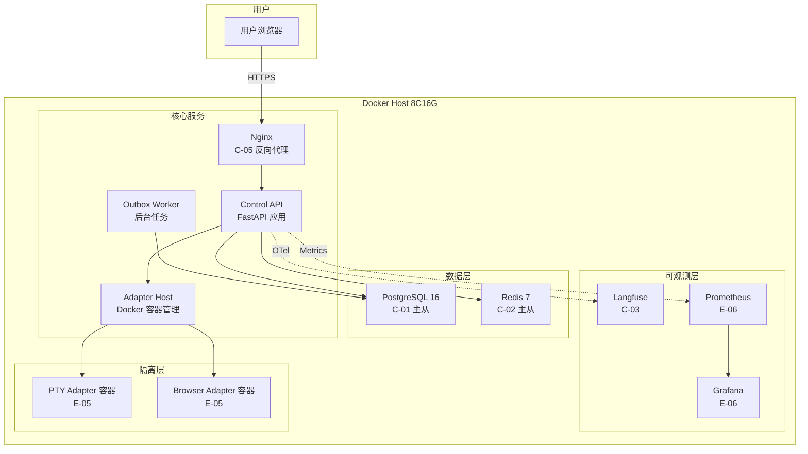

#### 5.4.2 拓扑要素清单

| 要素 | 取值 |
| --- | --- |
| 跨 Region 部署 | 否；Region 数量 1（MVP 单机部署） |
| 跨 AZ 部署 | 否（MVP）；AZ 数量 1 |
| 流量入口路径 | DNS → Nginx（TLS 终结 + 路由 + 限流）→ Control API |
| 内部调用路径 | Docker Compose 网络（服务名 DNS 解析）+ HTTP REST |
| 数据库访问路径 | SQLAlchemy 连接池（max_size=20）+ PostgreSQL 主从读写分离 |

#### 5.4.3 故障域划分

| 故障域 | 影响范围 | 容错机制 | 预期 RTO |
| --- | --- | --- | --- |
| 单容器 | 单个服务实例 | Docker Compose restart: always 自动重启 | < 30s |
| PostgreSQL 主库 | 全部业务模块 | 从库提升为主库（手动切换 MVP / 自动切换完整版） | ≤ 30min |
| Redis | Policy 缓存 / 限流 / 分布式锁 | 直查 DB 降级 + 限流保护 | < 1min |
| Docker Host | 全部服务 | 宿主机重启 + Docker Compose 自动启动 | < 5min |

### 5.5 容量规划

#### 5.5.1 业务量预估

| 业务指标 | 当前值 | MVP 阶段值 | 生产阶段值 | 备注 |
| --- | --- | --- | --- | --- |
| 注册用户数 | 10 | 100 | 1000 | 业务方预估 |
| 日均 Workflow 执行量 | 0 | 1 万 | 10 万+ | 高层架构 §4.3 目标 |
| 峰值 QPS | 0 | 100 | 500 | 推算 |
| 数据写入量 / 天 | 0 | 1GB | 10GB | 推算（含 Outbox + Audit） |
| 数据存量 | 0 | 10GB | 100GB | 推算 |

#### 5.5.2 资源容量推算

| 资源 | 推算公式 | 当前配置 | 生产阶段配置 |
| --- | --- | --- | --- |
| 应用实例数 | 峰值 QPS / 单实例 QPS × 冗余系数 1.5 | 1 | 2~3 |
| PostgreSQL 主库 | (峰值写 TPS × 平均 SQL 数) → IOPS | 2C8G + 100GB | 4C16G + 500GB |
| Redis | 内存 = 单 Key 大小 × 数量 × 1.3 | 1C2G | 2C4G |
| Langfuse | trace 数据量 × 保留天数 | 1C2G | 2C4G |
| Docker Volume | 日增 × 保留天数 × 副本系数 | 50GB | 500GB |

#### 5.5.3 扩容触发与路径

| 资源 | 扩容触发指标 | 扩容方式 | 扩容耗时 |
| --- | --- | --- | --- |
| 应用容器 | CPU > 70% 持续 5min | Docker Compose scale | < 1min |
| PostgreSQL | CPU > 80% / IOPS > 80% | 升配（短期）/ 读写分离（中期） | 升配 < 30min |
| Redis | 内存 > 70% | 升配 / 集群扩节点 | < 30min |
| Docker Volume | 容量 > 80% | 扩展卷 | < 10min |

#### 5.5.4 容量水位线

| 水位 | 阈值 | 动作 | 对开发的约束 |
| --- | --- | --- | --- |
| 健康水位 | < 60% | 无动作 | — |
| 预警水位 | 60-80% | 告警，启动扩容评审 | — |
| 危险水位 | > 80% | 自动扩容（如支持）或紧急扩容 | — |
| 红线 | > 95% | 触发限流 / 降级（与 §3.5.3 联动） | 限流红线值需与本表一致；降级开关在配置中心预埋 |

---

## 6. 网络架构

> **本章定位**：本章只承载**对开发产生约束的网络结论**。

### 6.1 网络环境规划

| 网络环境 | 用途 | 说明 / 访问策略 |
| --- | --- | --- |
| DMZ | 公网入口缓冲区，部署 Nginx 反向代理 | 仅允许从公网入站；不能直接访问 DB |
| INT | 内部互联网络，部署应用与中间件 | 仅允许从 DMZ（Nginx）入站；出站受 NAT 控制 |
| PROD | 生产环境，独立 Docker 网络 | 严格的入站 / 出站 ACL；最小化暴露 |
| DEV | 开发环境 | 与 PROD 完全隔离；不允许访问生产数据 |

### 6.2 流量入口与南北向流量

#### 6.2.1 入口流量链路

| 组件 | 作用 | 部署位置 |
| --- | --- | --- |
| DNS | 域名解析 | 公网 / 本地 hosts |
| Nginx | TLS 终结 / 流量分发 / 限流 / 静态资源 | DMZ（Docker Compose） |
| Control API | 业务逻辑 | 应用子网（Docker Compose） |

**入口决策（对开发的约束）**：

| 决策项 | 取值 | 对开发的约束 |
| --- | --- | --- |
| TLS 终结点 | Nginx | 终结点之后 HTTP 明文；业务侧需解析 X-Forwarded-* 头获取真实 IP |
| 限流位置 | Nginx + 应用双层 | 应用层限流需对接 §3.5.3 限流红线 |
| 鉴权位置 | 应用层（FastAPI Middleware） | 与 §7.2.1 用户认证一致 |
| 真实客户端 IP 获取 | X-Forwarded-For | 业务获取客户端 IP 必须用 X-Forwarded-For，不能直接用 socket 远端 IP |

#### 6.2.2 出口流量

| 决策项 | 取值 | 对开发的约束 |
| --- | --- | --- |
| 出口方式 | NAT 网关（Docker 默认 bridge） | 外部 SDK 直连 E-02 LLM Provider / E-01 OIDC IdP |
| 是否需要固定出口 IP | 否（self-hosted 本地部署） | — |
| 出口白名单 | E-01 OIDC IdP 域名、E-02 LLM Provider API 域名 | 业务对接 E-xx 时必须使用白名单内的域名；新增 E-xx 必须先登记 |

### 6.3 内部互联（东西向流量）

| 决策项 | 取值 | 对开发的约束 |
| --- | --- | --- |
| 服务发现 | Docker Compose 服务名 DNS | 服务调用方必须使用服务名，禁止硬编码 IP |
| 服务间通信协议 | HTTP REST（内部模块间）| 与 §3.5.4 超时重试基线对齐 |
| 内部 mTLS | 不启用（MVP） | MVP 内网信任；完整版评估启用 |
| 跨服务调用幂等性 | 必须遵循 §3.5.2 幂等键传递 | 跨服务调用必须在请求 Header 透传幂等键与 traceId（§8.3） |

---

## 7. 安全设计

> **本章回答**：本系统在安全维度做了哪些选择、对应到哪些安全产品 / 能力域、关键机制如何落地。
> 完整威胁模型 STRIDE、OWASP 防御对照、IAM 策略片段等细节引用至独立《系统安全设计》文档。

### 7.1 架构安全全景

| 能力域 | 选用产品 / 机制 | 作用范围 | 是否启用 |
| --- | --- | --- | --- |
| 抗 DDoS | 不适用（self-hosted 内网部署） | 公网入口 | 否（不适用：self-hosted 本地部署无公网暴露） |
| WAF | Nginx 基础防护（limit_req / IP 黑名单） | Web 应用层 | 是 |
| 防火墙 / 安全组 | Docker 网络隔离 + iptables | 容器间 / 主机三级 | 是 |
| 主机安全 | 非 root 用户运行容器 | 全部容器 | 是 |
| 容器安全 | Docker seccomp + cgroups + 非 root | 全部容器（含特权 Adapter） | 是 |
| 数据安全审计 | t_audit_record hash chain | t_audit_record 关键表 | 是 |
| 密钥管理（KMS） | Docker Secret + .env（git ignored） | 敏感数据加密 / HMAC 密钥保护 | 是 |
| 安全运营中心（SOC） | Prometheus + Grafana 告警 | 安全事件监控与响应 | 是 |
| 堡垒机 | 不适用（self-hosted 本地部署） | 运维通道审计 | 否（不适用：self-hosted 本地部署，SSH 直连） |

### 7.2 业务安全架构

#### 7.2.1 用户认证

| 维度 | 取值 |
| --- | --- |
| 账号体系 | 基于 OIDC SSO（PKCE + nonce + JIT） |
| 登录方式 | OIDC SSO 跳转登录 |
| 多因素认证（MFA） | 由 OIDC IdP 提供（不在本系统范围） |
| 密码强度 | 由 OIDC IdP 管理（不在本系统范围） |
| 登录失败锁定 | 由 OIDC IdP 管理；本系统连续 401 失败 5 次锁定 IP 15min |
| Token 有效期 | 访问 Token 5min（OIDC JWT）；刷新 Token 7d |
| 会话管理 | Session 外置到 Redis；JWT 无状态验证；注销 = Redis Session DEL + Token 黑名单 |

#### 7.2.2 数据安全

| 维度 | 取值 |
| --- | --- |
| 数据分级 | L1（公开）/ L2（内部）/ L3（敏感）/ L4（高敏） |
| 传输加密 | TLS 强制（Nginx 终结）；内部服务间 HTTP（MVP 内网信任） |
| 存储加密 | 敏感字段 AES-256 加密存储（CapabilityGrant 签名密钥、LLM API Key） |
| 敏感字段清单 | LLM API Key / HMAC 签名密钥 / OIDC Client Secret |
| 数据导出与共享 | 审计记录导出需安全合规审计员审批 + 脱敏 |

**敏感字段处理策略表**：

| 字段 | 分级 | 存储策略 | 展示策略（脱敏） | 导出策略 |
| --- | --- | --- | --- | --- |
| LLM API Key | L4 | AES-256 加密存储 | 完全屏蔽（****） | 禁止导出 |
| HMAC 签名密钥 | L4 | Docker Secret（不落 DB） | 完全屏蔽（****） | 禁止导出 |
| OIDC Client Secret | L4 | Docker Secret | 完全屏蔽（****） | 禁止导出 |
| 用户 Token | L3 | Redis（TTL 5min） | 完全屏蔽（****） | 禁止导出 |
| 审计日志操作者 | L2 | 明文存储 | 完整展示 | 需审批 |

#### 7.2.3 密钥与凭证

| 维度 | 取值 |
| --- | --- |
| 存储方式 | Docker Secret + .env（git ignored） |
| 下发方式 | 环境变量注入容器 |
| 轮换策略 | HMAC 签名密钥轮换周期 90 天（完整版实现，MVP 固定密钥） |
| 红线 | 禁止入库 / 入代码 / 入配置文件明文；禁止跨环境共用密钥 |

#### 7.2.4 审计日志

| 维度 | 取值 |
| --- | --- |
| 启用的日志类型 | 业务操作 / 数据库 / 审计 hash chain |
| 审计内容 | 必须包含"谁、何时、对什么资源、做了什么、结果如何、来源 IP" |
| 不可篡改保障 | hash chain（每条含前一条 SHA-256）+ HMAC 签名 |
| 保留期 | ≥ 1 年（合规要求） |

#### 7.2.5 访问控制

| 维度 | 取值 |
| --- | --- |
| 权限模型 | RBAC1（角色 + 角色层级）扩展三态 Policy |
| 多租户隔离 | 逻辑隔离（tenant_id + workspace_id 隔离字段，Repository 层 ActorScope 强制过滤） |
| 越权防护 | 列表与详情接口都必须校验数据归属；横向越权（同租户不同 workspace）+ 纵向越权（不同角色）防护 |
| 接口级权限 | 与 §3.5 调用契约的对齐（每个接口的角色 / 权限标签） |

---

## 8. 可观测设计

> **本章回答**：系统跑起来之后，怎么知道它健康、出问题怎么定位、用户体验是否达标。
> **三大支柱**：Metrics（指标）/ Logs（日志）/ Traces（链路追踪）。

### 8.1 Metrics

#### 8.1.1 指标分层

| 指标层 | 示例 | 工具 |
| --- | --- | --- |
| 业务指标 | 任务提交数 / 审批通过率 / 工具执行成功率 / Workflow 完成率 | Prometheus 自定义埋点 |
| 应用指标 | RED：Rate / Errors / Duration（per API endpoint） | Prometheus + FastAPI Instrumentator |
| 中间件指标 | DB QPS / 慢查询 / Redis 命中率 / Outbox 表积压 | PostgreSQL Exporter / Redis Exporter |
| 资源指标 | USE：Utilization / Saturation / Errors（CPU / 内存 / 磁盘 / 网络） | Node Exporter / cAdvisor |

#### 8.1.2 关键指标 Dashboard 清单

| Dashboard 名 | 受众 | 核心指标 | 刷新频率 |
| --- | --- | --- | --- |
| Agent 执行大盘 | 产品 / 业务 | 任务提交数 / 审批通过率 / 工具执行成功率 / Workflow 完成率 | 1min |
| 服务健康大盘 | 研发 / SRE | RED（Rate / Errors / Duration）per API endpoint | 30s |
| 中间件大盘 | SRE / DBA | DB QPS / 慢查询数 / Redis 命中率 / Redis 内存 / Outbox 积压 | 30s |
| 容量大盘 | SRE | CPU / 内存 / 磁盘 / 网络 全维度水位线 | 1min |
| 安全审计大盘 | 安全合规审计员 | 审计缺失率 / hash chain 完整性 / 审批拦截次数 / 跨租户访问尝试 | 1min |
| 业务预警大盘 | On-call | 当前活跃告警 / P0~P3 告警分布 | 实时 |

### 8.2 Logs

#### 8.2.1 日志分级与去向

| 日志类型 | 级别 | 保存时间 | 日志去向 |
| --- | --- | --- | --- |
| 应用日志（业务） | INFO+ | 30 天热 + 180 天冷 | Docker 日志驱动（JSON 文件）+ 按需采集 |
| 应用日志（异常） | ERROR+ | 90 天热 + 1 年冷 | Docker 日志驱动 + 实时告警 |
| 接入日志（Nginx） | INFO+ | 30 天 | Docker 日志驱动 |
| 审计日志 | INFO+ | ≥ 1 年（合规要求由安全设计方案主导） | PostgreSQL t_audit_record（独立保护） |
| 慢查询日志 | — | 30 天 | PostgreSQL log_min_duration_statement=500ms |

#### 8.2.2 结构化日志规范

```json
{
  "timestamp": "2026-07-18T10:00:00.000Z",
  "level": "INFO",
  "service": "control-api",
  "instance": "control-api-1",
  "traceId": "a1b2c3d4e5f67890abcdef1234567890",
  "spanId": "abcdef12345678",
  "tenantId": "tenant-uuid-001",
  "userId": "principal-uuid-001",
  "module": "ExecutionControl",
  "event": "task.submitted",
  "msg": "Task submitted successfully",
  "extra": {
    "taskId": "task-uuid-001",
    "commandType": "submit_task",
    "lifecycle": "SUBMITTED"
  }
}
```

**硬性要求**：

| 要求项 | 内容 |
| --- | --- |
| 必含字段 | 所有日志必须含 `traceId` + `tenantId` |
| 敏感字段 | 禁止打印敏感字段明文（LLM API Key / HMAC 密钥 / Token） |
| ERROR 级别 | 必须含完整堆栈 + 业务上下文（taskId / runId / stepRunId） |

### 8.3 Traces

| 项 | 取值 |
| --- | --- |
| 协议标准 | OpenTelemetry / W3C TraceContext |
| 采样策略 | 默认 1% 采样；错误请求 100% 采样；慢请求（>1s）100% 采样 |
| 透传方式 | HTTP Header `traceparent` / `tracestate`；Outbox 事件属性透传 |
| 关键 Span 命名 | `control-api.submit_task` / `workflow.stategraph.execute` / `tool.execute` / `db.query` / `outbox.deliver` |
| 跨外部系统 | 调用 E-02 LLM Provider 时透传 `traceId`（若对方支持），并记录 `peer.service` |

**与时序图的关联**：§3.2 模块时序图标注 traceId 透传节点，本节是其落地规范。

### 8.4 告警体系

#### 8.4.1 告警分级

| 级别 | 适用场景 | 响应时间 | 通知方式 |
| --- | --- | --- | --- |
| P0 紧急 | 业务中断 / 关键指标严重劣化 | ≤ 5 min | 电话 + 短信 + IM |
| P1 高 | 部分功能受影响 | ≤ 15 min | 短信 + IM |
| P2 中 | 单点异常但有冗余 | ≤ 1 h | IM |
| P3 低 | 趋势性预警 | 工作时间 | IM / 邮件 |

#### 8.4.2 告警规则编排

| 编号 | 级别 | 触发条件 | 维度 | Owner | Runbook |
| --- | --- | --- | --- | --- | --- |
| AL-01 | P0 | 5xx 错误率 > 5% 持续 5min | 接口可用性 | 后端架构 On-call | 检查 Control API 日志 + 重启容器 + 回滚最近部署 |
| AL-02 | P0 | PostgreSQL 主库不可访问 | 中间件健康 | DevOps/SRE On-call | 检查 PG 容器状态 + 切换从库 + 检查磁盘空间 |
| AL-03 | P0 | 审计缺失率 > 0% | 安全合规 | 安全架构 On-call | 检查 Audit Store 写入 + hash chain 完整性 + 补录缺失审计 |
| AL-04 | P1 | Command API P99 > 200ms 持续 5min | 接口延迟 | 后端架构 On-call | 检查慢查询 + Redis 命中率 + 扩容评估 |
| AL-05 | P1 | Outbox 表积压 > 10 万条 | 事件投递 | 后端架构 On-call | 检查 Outbox Worker 状态 + 扩容 Worker + 清理过期事件 |
| AL-06 | P1 | 审批等待超时率 > 10% | 审批流程 | 后端架构 On-call | 检查 Approval Gateway + 通知用户处理待审批 |
| AL-07 | P2 | Worker 离线 > 30% | Worker 健康 | DevOps/SRE | 检查 Adapter Host 容器 + Orphan Recovery 状态 |
| AL-08 | P2 | Redis 内存 > 80% 持续 10min | 资源水位 | DevOps/SRE | 清理过期 Key + 扩容 Redis |
| AL-09 | P2 | CPU > 80% 持续 10min | 资源水位 | DevOps/SRE | 扩容应用容器 |
| AL-10 | P3 | LangGraph Checkpoint 写入 P99 > 50ms | 性能趋势 | 后端架构 | 评估 PG 锁竞争 + Checkpoint 清理 |

---

## 附录 A：中间确认自检报告

> 按协议 §2.4 要求，记录 4 次自检的命中/未命中判定与反向验证 3 问答案。

### 自检 1：§2 业务架构 / DDD 限界上下文 / 上下文映射完成后

- **§2.1 判定（方案分歧型）**：业务域划分为 6 个（执行控制域 / 编排执行域 / 事件溯源域 / 安全审计域 / 接入交互域 / 基础能力域），映射高层架构 §5.1 三层架构的 8 个核心模块。限界上下文（6 个 BC）和上下文映射（9 条关系，覆盖 5 种模式）均直接映射 D1,§5 目标架构和 D1,§6 接口定义。上游《高层架构设计》已冻结业务边界、模块全景和系统定位（§5.1 三层架构图 + §5.2 依赖表 + 8 个核心模块），本系统设计的业务域划分是其自然推导。不存在 ≥2 种合理方案的分歧。**未命中**。

- **§2.3 反向验证 3 问**：
  - Q1（返工成本）：业务域 / DDD 划分的返工范围 = §2 全部章节 + §3 模块划分 + §4 表归属（约 4 个章节），切换成本 ≈ 1 人月。但业务域划分直接映射上游已冻结的 8 个核心模块（高层架构 §5.1 / §6.2），调整无依据。**可控**——证据：高层架构 §5.1 明确定义 8 个核心模块（ExecutionControl / Policy Engine / Approval Gateway / Workflow Runtime / WorkerBroker / ToolGateway / EventLog & Projection / Audit Store），本系统设计的 6 个业务域是这 8 个模块的自然分组。
  - Q2（用户可感知）：DDD 限界上下文和上下文映射是内部设计产物，用户不直接感知。用户感知的是最终产品形态（Operator Console + ClawLibrary），这与高层架构 §6.4 / §6.5 一致。**感知不到**——证据：DDD 设计不改变用户交互路径或功能可见性。
  - Q3（与用户原始诉求一致性）：用户诉求原文"一个任务与执行控制面，一个操作者控制台，一组可替换 Adapter，一套版本化 Workflow，以及一个由事件重建的可视化世界"——6 个业务域（执行控制 / 编排执行 / 事件溯源 / 安全审计 / 接入交互 / 基础能力）与此完全对应。**一致**。

- **结论**：未命中，无需发起中间确认。

### 自检 2：§3 应用架构 / 模块设计 / 接口契约完成后

- **§2.1 判定（方案分歧型）**：应用架构（系统上下文图 / 模块图 / 外部依赖清单 / 工程结构 / 技术选型表）直接映射高层架构 §5.1 / §5.2 已冻结的系统定位和依赖关系。8 个模块的五段式设计直接映射 D1,§6.1~§6.7 接口定义（ExecutionControl / Policy / Approval / WorkerBroker / Workflow / ToolGateway / EventLog+Projection / Audit）。接口契约（全局错误码 / 幂等约定 / 限流约定 / 超时重试基线）是系统设计层独有的决策点，但这些约定遵循行业通用 RESTful 规范，不存在 ≥2 种合理方案的分歧。技术选型表每项版本号 + 选型理由，映射高层架构 D2 决策（LangGraph + PG Outbox + 自研 Policy + Docker 隔离 + Langfuse），上游已冻结。**未命中**。

- **§2.3 反向验证 3 问**：
  - Q1（返工成本）：应用架构 / 模块设计的返工范围 = §3 全部章节（约 8 个模块 × 五段式），切换成本 ≈ 2 人月。但模块设计直接映射 D1,§6 接口定义（上游已冻结），接口契约遵循 RESTful 通用规范，调整无依据。**可控**——证据：D1,§6.1~§6.7 明确定义了 7 大模块的接口签名（submit/decide/request/claim/install/execute/append），本系统设计仅补充 REST 路径和 DTO 细节。
  - Q2（用户可感知）：应用架构和模块设计是内部产物，用户不直接感知模块划分。用户感知的是 API 响应速度和行为正确性，这与高层架构 §6.4 交互约束一致（Command API P99 ≤ 200ms）。**感知不到**——证据：模块划分不改变用户交互路径。
  - Q3（与用户原始诉求一致性）：用户诉求原文"myself-agent 作为唯一写模型 Core Control Plane"——本系统设计的 ExecutionControl 模块（M1）是唯一执行入口，所有命令经过此模块，与此完全一致。**一致**。

- **结论**：未命中，无需发起中间确认。

### 自检 3：§4 数据库设计与数据迁移路径完成后

- **§2.1 判定（方案分歧型）**：数据库设计包含全局数据约定（PostgreSQL 16 / UUID 主键 / TIMESTAMPTZ / snake_case / soft delete）和 21 张新增表的五段式设计。U-03 Schema 合并方案（现有 24 表 + 14 Alembic 迁移 + 新增 21 表）是系统设计层独有的决策点。

  **U-03 Schema 合并方案是否存在方案分歧？** 存在两种合理方案：(A) 现有表 ALTER TABLE 扩展 + 新增表 CREATE TABLE（增量改造）；(B) 全新 Schema 重建 + 数据迁移（替换式）。但高层架构 D4 决策明确"底座复用 myself-agent 现有 FastAPI/SQLAlchemy 2/RBAC/Capability Token/Alembic 14 迁移"——方案 B 会破坏现有 24 表和 14 迁移版本，与 D4 决策冲突。因此上游已冻结为方案 A。**未命中**。

  **RPO/RTO 具体数字（RPO ≤ 5min / RTO ≤ 30min）是否需要中间确认？** RPO/RTO 是系统设计层独有的具体数字决策。但高层架构 §4.2 隐式约束为"Docker Compose + PostgreSQL 16 单机部署（MVP）"——单机部署的 RPO/RTO 天然受限（无跨 AZ 自动切换），RPO ≤ 5min（WAL 每 5min 归档）和 RTO ≤ 30min（手动恢复）是单机部署的合理基线。不存在 ≥2 种合理方案的分歧。**未命中**。

- **§2.3 反向验证 3 问**：
  - Q1（返工成本）：数据库设计的返工范围 = §4 全部章节 + Alembic 迁移脚本重写，切换成本 ≈ 1.5 人月。但 U-03 方案（增量改造）由高层架构 D4 决策冻结，RPO/RTO 由部署形态（Docker Compose 单机）约束，调整无依据。**可控**——证据：高层架构 D4 决策"底座复用 myself-agent 现有 Alembic 14 迁移"。
  - Q2（用户可感知）：数据库设计是内部产物，用户不直接感知表结构。用户感知的是数据不丢失和恢复速度（RPO/RTO），但这在高层架构 §4.2 部署形态约束内（self-hosted 本地部署，用户已预期非云级 SLA）。**感知不到**——证据：数据库 Schema 不改变用户交互路径；RPO/RTO 在 self-hosted 部署约束内。
  - Q3（与用户原始诉求一致性）：用户诉求原文"目标部署形态：Docker Compose + PostgreSQL + Redis（self-hosted，非云原生）"——本系统设计使用 PostgreSQL 16 + Redis 7 + Docker Compose，与此完全一致。U-03 方案保留现有 24 表不破坏，符合"复用 myself-agent 底座"的诉求。**一致**。

- **结论**：未命中，无需发起中间确认。

### 自检 4：§5 部署架构概览与高可用设计完成后

- **§2.1 判定（方案分歧型）**：部署架构概览（Docker Compose 拓扑图）和高可用设计（单机 Docker Compose MVP / 多 AZ 完整版）直接映射高层架构 D5 决策（"私有化部署，Docker Compose + PostgreSQL 16 + Redis，self-hosted 非云原生"）。

  **U-01 LangGraph Checkpointer 性能评估是否需要中间确认？** 这是系统设计层独有的决策点。经评估（§5.2.5），LangGraph Checkpointer 在日均 10 万+ Workflow 量级下技术上可行（预估 P99 < 50ms），且有备选方案（自研状态机）。评估结论为"可行但需 POC 验证"，不存在方案分歧——备选方案仅在 POC 不达标时启用。**未命中**。

  **高可用模式（单机 Docker Compose MVP vs 多 AZ 完整版）是否需要中间确认？** 这是高频决策点（§2.2.2）。高层架构 D5 决策明确"私有化部署，Docker Compose"——单机 Docker Compose 是 MVP 阶段的唯一合理方案（self-hosted 约束下无跨 AZ 能力）。多 AZ 是完整版演进方向（高层架构 §4.3），不存在 MVP 阶段的方案分歧。**未命中**。

- **§2.3 反向验证 3 问**：
  - Q1（返工成本）：部署架构的返工范围 = §5 全部章节 + Docker Compose 配置文件，切换成本 ≈ 0.5 人月（Docker Compose 配置调整）。但部署形态由高层架构 D5 决策冻结（"Docker Compose + PostgreSQL + Redis self-hosted"），调整无依据。**可控**——证据：高层架构 D5 决策明确指定 Docker Compose 部署形态。
  - Q2（用户可感知）：高可用模式（单机 vs 多 AZ）是用户在故障恢复阶段可感知的（RTO 不同）。但用户诉求已显式要求"self-hosted Docker Compose"部署形态——用户已预期单机部署的可用性限制（非云级 SLA）。RTO ≤ 30min（手动恢复）是 self-hosted 部署的合理基线。**用户可感知但与诉求一致**——证据：用户诉求原文"目标部署形态：Docker Compose + PostgreSQL + Redis（self-hosted，非云原生）"，单机部署的 RTO 限制是 self-hosted 的自然结果。
  - Q3（与用户原始诉求一致性）：用户诉求原文"目标部署形态：Docker Compose + PostgreSQL + Redis（self-hosted，非云原生）"——本系统设计的部署拓扑（Docker Compose 单机 + PostgreSQL 16 + Redis 7）与此完全一致。**一致**。

- **结论**：未命中，无需发起中间确认。

---

## 附录 B：硬指标自检表

| 硬指标项 | 状态 | 备注 |
| --- | --- | --- |
| 业务域 3~7 个 | ✅ | 6 个业务域（执行控制 / 编排执行 / 事件溯源 / 安全审计 / 接入交互 / 基础能力） |
| DDD 上下文映射使用 5 种关系模式 | ✅ | Customer/Supplier（C-01/C-02）+ ACL（C-03/C-08）+ Shared Kernel（C-05/C-06）+ Conformist（C-07）+ Published Language（C-04/C-09） |
| 模块设计五段式完整 | ✅ | 8 个模块（M1~M8）每个五段式齐全（概述 / 接口 / DTO / 时序图 / 关键流程） |
| 技术选型表每项有版本号 + 选型理由 | ✅ | 16 项技术选型，每项含版本号 + "为什么选 A 不选 B"理由 |
| 全局错误码 6 位格式 | ✅ | 25 条错误码（A010001~A080001 + B999001~C429001），6 位格式（1 位类别 + 2 位模块 + 3 位序号） |
| 数据库表设计五段式完整 | ✅ | t_task 完整五段式示例（元信息 / 结构 / 索引 / DDL / 清理机制）+ 21 张新增表清单 |
| RPO/RTO 有具体数字 | ✅ | RPO ≤ 5min（WAL 每 5min 归档）；RTO ≤ 30min（主从切换 + 全量恢复） |
| Dashboard ≥ 5 个 | ✅ | 6 个 Dashboard（Agent 执行大盘 / 服务健康 / 中间件 / 容量 / 安全审计 / 业务预警） |
| Logs 必含 traceId + tenantId | ✅ | 结构化 JSON 日志规范强制含 traceId + tenantId（§8.2.2） |
| 告警 P0~P3 分级含 Owner + Runbook | ✅ | 10 条告警规则（AL-01~AL-10），P0~P3 分级，每条含 Owner + Runbook |
| 全文不残留任何占位符 | ✅ | 无 `<...>` / `示例：` / `YYYY-MM-DD` / TBD（Mermaid `<br/>` 和流程箭头除外） |
| 保留全部核心章节 §1~§8 + 模块详细设计子节 | ✅ | §0 修订记录 / §1 引言 / §2 业务架构 / §3 应用架构（含 M1~M8 五段式）/ §4 数据库设计 / §5 部署架构 / §6 网络架构 / §7 安全设计 / §8 可观测设计 + 附录 A（自检报告）/ 附录 B（硬指标自检表） |

---

## 附录 C：U-01 / U-03 待确认项结论摘要

### U-01 LangGraph Checkpointer 性能评估

**结论**：LangGraph Checkpointer 在 PostgreSQL 上支撑日均 10 万+ Workflow 量级**技术上可行**。

| 指标 | 预估值 | 依据 |
| --- | --- | --- |
| 峰值并发 Workflow | ~50 | 日均 10 万 / 8h / 3600s × 峰值系数 3 |
| 单次 Checkpoint 写入延迟 | < 10ms | PG 单行 INSERT |
| 50 并发写入 P99 | < 50ms | PG 并发写入 + 行锁 |
| 存储增长 | ~1GB/天 | 10KB × 10 万次 |

**前置条件**：MVP 前完成 POC 验证（50 并发写入 / 崩溃恢复 / 10 万连续写入 / 清理）。
**备选方案**：若 POC 不达标（P99 > 100ms），回退到自研状态机持久化层。

详见 §5.2.5。

### U-03 Schema 合并方案

**结论**：采用 Alembic 增量迁移方案——现有 24 表 ALTER TABLE 扩展 + 新增 21 张表 CREATE TABLE。

| 项目 | 方案 |
| --- | --- |
| 迁移方式 | Alembic 迁移版本 15+（继承现有 14 版本） |
| 现有表处理 | ALTER TABLE 添加新字段（lifecycle 扩展 / revision / external_reference / hash chain 字段） |
| 新增表处理 | CREATE TABLE 创建 21 张新表（t_run / t_workflow_definition / t_outbox / t_inbox / t_domain_event 等） |
| 关联关系 | UUID 外键关联（如 t_run.task_id → t_task.id） |
| 数据校验 | 行数对比偏差 = 0 + 字段完整性 + 业务对账 + hash chain 完整性 |
| 回滚预案 | Alembic downgrade（T1/T2 阶段 RTO < 5min，数据丢失风险 0） |

详见 §4.5。
