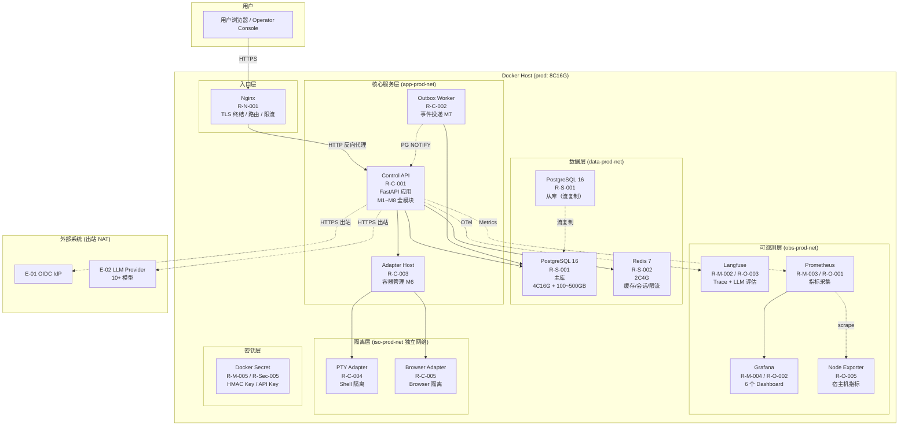

# AICoding 架构设计 · 部署设计

> 本文档为《AICoding 架构设计》核心产物之一，定位为**系统部署设计**。
> 上游输入：《系统设计》中的部署架构、网络架构、可观测设计（已通过 G4 审核）；
> 下游输出：环境与资源清单、流水线、监控告警、应急回滚等可落地的运维交付物。

---

## 0. 元信息：修订记录

| 文档版本 | 发布日期 | 修订人 | 修订说明 |
| --- | --- | --- | --- |
| v1.0 | 2026-07-18 | platform-architect（毕落地） | 文档初始版本，覆盖 §1~§8 全部章节，含 Step S 与 security-architect 交接对账 |

---

## 1. 引言

### 1.1 适用范围与部署形态

| 项 | 取值 |
| --- | --- |
| 适用系统 | Agent Control Center 单一控制面 |
| 部署形态 | **self-hosted Docker Compose**（非云原生，无云资源 ID） |
| 适用范围 | 私有化部署，单机 Docker Compose（MVP），可演进为多机 Docker Compose（完整版） |
| 上游约束 | 《系统设计》§5 已冻结 Docker Compose + PostgreSQL 16 + Redis 7 + Langfuse + Nginx 拓扑 |
| 安全约束 | 网络拓扑骨架由本文件定义（§3），安全组/WAF/IAM 规则由 security-architect 按本骨架落实 |

### 1.2 名词与缩写

| 缩写 | 全称 | 含义 |
| --- | --- | --- |
| ACC | Agent Control Center | 单一控制面系统 |
| BFF | Backend For Frontend | 前端专属后端代理 |
| OTel | OpenTelemetry | 分布式链路追踪标准 |
| WAL | Write-Ahead Log | PostgreSQL 预写日志 |
| RPO | Recovery Point Objective | 数据丢失容忍目标 |
| RTO | Recovery Time Objective | 恢复时间目标 |
| HPA | Horizontal Pod Autoscaler | 水平弹性伸缩 |
| SBOM | Software Bill of Materials | 软件物料清单 |
| DDL | Data Definition Language | 数据库结构定义语言 |
| SLO | Service Level Objective | 服务级别目标 |
| AZ | Availability Zone | 可用区 |
| SOP | Standard Operating Procedure | 标准操作规程 |

---

## 2. 环境与资源清单

### 2.1 环境矩阵

> 部署形态：self-hosted Docker Compose，无云资源 ID。资源清单全部为本地 Docker 容器规格（CPU/RAM/Volume）。

| 环境 | 用途 | 集群隔离 | 数据 | 网络访问 | 宿主机规格 |
| --- | --- | --- | --- | --- | --- |
| dev | 开发自测 | 共享（开发者本机 Docker） | 模拟数据 / Mock Adapter | 内网 / localhost | 2C4G × 1 Node |
| int | 联调 | 独立（CI 自动部署专用机器） | 模拟数据 / 脱敏数据 | 内网（白名单 IP） | 4C8G × 1 Node |
| uat | 预发 / 验收 | 独立（独立物理机） | 仿生产（脱敏全量） | 内网 + 白名单 | 8C16G × 1 Node（接近生产） |
| prod | 生产 | 独立（专用生产机器） | 真实数据 | 内网 / 受控公网入口 | 8C16G × 1 Node |

**隔离策略**：

| 策略项 | 说明 |
| --- | --- |
| 物理隔离 | dev / int / uat / prod 分别部署在不同物理机（或虚拟机），不共享宿主机 |
| 网络隔离 | 各环境使用独立 Docker Compose network（如 app-prod-net / data-prod-net / obs-prod-net / iso-prod-net，按 5 信任域划分），禁止跨环境容器通信 |
| 数据隔离 | 各环境 PostgreSQL / Redis 使用独立 Docker Volume，dev/int 禁止连接 prod 数据库 |
| 配置隔离 | 各环境使用独立 `.env` 文件，密钥不跨环境复用（§4.4 L4 Secret 层） |
| 访问隔离 | prod / uat 宿主机仅允许通过堡垒通道（SSH Key）访问，禁止开发直连 |

### 2.2 资源清单

> 部署形态：self-hosted Docker Compose。以下为各环境的 Docker 容器规格清单。

#### 2.2.1 计算资源

| 资源编号 | 类型 | 产品 | 资源 ID | 名称 | 规格 | 数量 | 环境 | 复用 / 新建 | HA 方案 | 用途 |
| --- | --- | --- | --- | --- | --- | --- | --- | --- | --- | --- |
| R-C-001 | 应用容器 | Control API (FastAPI) | — | acc-control-api | 1C1G (dev) / 2C2G (int) / 2C4G (uat/prod) | 1 (dev/int/uat) → 2~3 (prod) | 全环境 | 新建 | restart: always + Nginx 负载均衡 | 核心业务 API（M1~M8 全部模块） |
| R-C-002 | 应用容器 | Outbox Worker (Python) | — | acc-outbox-worker | 0.5C512M | 1 | int/uat/prod | 新建 | restart: always | Transactional Outbox 事件投递（M7） |
| R-C-003 | 应用容器 | Adapter Host (Python) | — | acc-adapter-host | 0.5C512M | 1 | uat/prod | 新建 | restart: always | 特权 Adapter 容器生命周期管理（M6） |
| R-C-004 | 特权容器 | PTY Adapter (Docker) | — | acc-pty-adapter | 0.5C512M | 1（按需启动） | uat/prod | 新建 | 按 StepRun 生命周期创建/销毁 | Shell/PTY 工具隔离执行（E-05） |
| R-C-005 | 特权容器 | Browser Adapter (Docker) | — | acc-browser-adapter | 0.5C1G | 1（按需启动） | uat/prod | 新建 | 按 StepRun 生命周期创建/销毁 | Browser 工具隔离执行（E-05） |

> **注**：资源 ID 列填 `—`，因为 self-hosted Docker Compose 无云资源 ID。dev 环境为开发者本机运行，不单独列资源。

#### 2.2.2 存储资源

| 资源编号 | 类型 | 产品 | 资源 ID | 名称 | 规格 | 容量 | 环境 | 复用 / 新建 | HA 方案 | 备份策略 |
| --- | --- | --- | --- | --- | --- | --- | --- | --- | --- | --- |
| R-S-001 | 关系型数据库 | PostgreSQL 16-alpine | — | acc-postgres | 2C8G | dev 5GB / int 10GB / uat 50GB / prod 100GB→500GB | 全环境 | 新建 | 主从流复制（prod） / 单节点（dev/int/uat） | 全量每日 + WAL 每 5min（prod/uat）；dev/int 不备份 |
| R-S-002 | 缓存 | Redis 7-alpine | — | acc-redis | 1C2G→2C4G | dev 128MB / int 256MB / uat 512MB / prod 1GB→2GB | 全环境 | 新建 | 哨兵自动切换（prod） / 单节点（dev/int/uat） | RDB 每 15min + AOF 持久化（prod/uat） |
| R-S-003 | 文件卷 | Docker Volume | — | acc-data-volume | — | dev 10GB / int 20GB / uat 100GB / prod 500GB | 全环境 | 新建 | 本地磁盘 RAID 冗余（如宿主机支持） | 每日快照（prod/uat） |
| R-S-004 | 备份卷 | Docker Volume（物理隔离磁盘） | — | acc-backup-volume | — | prod 200GB | prod | 新建 | 与生产数据卷物理隔离 | 备份目标卷（全量+WAL 归档） |

#### 2.2.3 网络资源

| 资源编号 | 类型 | 产品 | 资源 ID | 名称 | 规格 | 环境 | 复用 / 新建 | 用途 |
| --- | --- | --- | --- | --- | --- | --- | --- | --- |
| R-N-001 | 反向代理 | Nginx (nginx:alpine) | — | acc-nginx | 1C512M | 全环境 | 新建 | TLS 终结 / 路由分发 / 限流 / 静态资源服务 |
| R-N-002 | Docker 网络 | Docker Compose bridge | — | dmz-{env}-net / app-{env}-net / data-{env}-net / iso-{env}-net / obs-{env}-net | bridge driver（每个独立） | 全环境 | 新建 | 容器间内部通信网络（5 信任域按安全设计 §5.1 划分；服务名 DNS 解析） |
| R-N-003 | DNS | 本地 hosts / 内网 DNS | — | — | — | uat/prod | 新建 | 域名解析（如 acc.internal） |
| R-N-004 | 出口 NAT | Docker 默认 bridge NAT | — | — | — | 全环境 | 新建 | 容器出站访问 E-01 OIDC IdP / E-02 LLM Provider |

#### 2.2.4 中间件与平台服务

| 资源编号 | 类型 | 产品 | 资源 ID | 名称 | 规格 | 环境 | 复用 / 新建 | HA 方案 | 用途 |
| --- | --- | --- | --- | --- | --- | --- | --- | --- | --- |
| R-M-001 | 数据库迁移 | Alembic 1.13+ | — | acc-alembic | 内嵌应用（无独立容器） | — | 全环境 | 新建 | — | Schema 迁移管理（继承 14 版本 + 新增 15+） |
| R-M-002 | 链路追踪 | Langfuse 2.x (self-hosted) | — | acc-langfuse | 1C2G→2C4G | uat/prod | 新建 | 单节点（Docker Compose） | OpenTelemetry 链路追踪 + LLM 评估 |
| R-M-003 | 指标采集 | Prometheus 2.x | — | acc-prometheus | 0.5C512M | uat/prod | 新建 | 单节点 | Metrics 采集（scrape Control API + Node Exporter） |
| R-M-004 | 指标展示 | Grafana 10.x | — | acc-grafana | 0.5C256M | uat/prod | 新建 | 单节点 | Dashboard 可视化 + 告警引擎 |
| R-M-005 | KMS / 密钥管理 | Docker Secret + .env | — | acc-secrets | Docker Secret + Volume | 全环境 | 新建 | — | HMAC 签名密钥 / LLM API Key / OIDC Client Secret。密钥分级遵循安全设计 §6.1 五类分级（数据库密码 / 服务间密钥 / 用户密码(OIDC 管理) / API Key / 外部服务凭据）；轮转策略遵循安全设计 §6.1（API Key 90 天 / HMAC 签名密钥 90 天(完整版) / OIDC Secret 随 IdP 轮换） |
| R-M-006 | 日志管道 | Docker 日志驱动（JSON 文件） | — | acc-logging | Docker logging driver | 全环境 | 新建 | — | 应用日志 / Nginx 日志采集与轮转。审计保留期遵循安全设计 §7.2.1（业务操作审计 ≥ 1 年 / 数据库审计 90 天 / SSH 操作日志 180 天 / WAF 日志 30 天 / Docker 事件日志 90 天） |

#### 2.2.5 可观测资源

| 资源编号 | 类型 | 产品 | 资源 ID | 名称 | 规格 | 环境 | 复用 / 新建 | 承载可观测维度 |
| --- | --- | --- | --- | --- | --- | --- | --- | --- |
| R-O-001 | 指标采集 | Prometheus 2.x | — | acc-prometheus | 0.5C512M | uat/prod | 新建 | RED 指标 / 中间件指标 / USE 资源指标 / 业务指标（系统设计 §8.1.1） |
| R-O-002 | 指标展示 | Grafana 10.x | — | acc-grafana | 0.5C256M | uat/prod | 新建 | 6 个 Dashboard（系统设计 §8.1.2）：Agent 执行 / 服务健康 / 中间件 / 容量 / 安全审计 / 业务预警 |
| R-O-003 | 链路追踪 | Langfuse 2.x | — | acc-langfuse | 1C2G→2C4G | uat/prod | 新建 | OpenTelemetry Trace（系统设计 §8.3）：control-api.submit_task / workflow.execute / tool.execute 等 Span |
| R-O-004 | 日志采集 | Docker JSON Driver | — | acc-logging | Docker logging driver | 全环境 | 新建 | 结构化 JSON 日志（系统设计 §8.2.2）：含 traceId + tenantId 的业务日志 + 审计日志 |
| R-O-005 | 节点监控 | Node Exporter / cAdvisor | — | acc-node-exporter | 0.25C128M | uat/prod | 新建 | USE 资源指标：CPU / 内存 / 磁盘 / 网络（宿主机 + 容器级别） |

#### 2.2.6 安全资源

| 资源编号 | 类型 | 产品 | 资源 ID | 名称 | 规格 | 环境 | 复用 / 新建 | HA 方案 | 用途 |
| --- | --- | --- | --- | --- | --- | --- | --- | --- | --- |
| R-Sec-001 | WAF / 限流 | Nginx limit_req + OWASP ModSecurity CRS 3.x | — | acc-nginx (WAF 模块) | 同 R-N-001 | 全环境 | 新建 | 同 R-N-001 | Web 应用层防护：SQL 注入 / XSS / CC 攻击 / 路径遍历 / 命令注入防护（安全设计 §5.2.1 定义）；单 IP 60 秒内超过 100 次请求触发拦截；全局 QPS 2000 |
| R-Sec-002 | 容器安全 | Docker seccomp profile.json + cgroups + capabilities drop | — | — | seccomp profile + cgroups limit + --cap-drop ALL + --cap-add CHOWN,SETUID,SETGID | uat/prod | 新建 | — | 特权 Adapter 容器 9 项资源限制（安全设计 §5.3.2 U-02 裁决）：非 root 用户 / 只读根文件系统 / CPU 限制 / 内存限制 / 文件系统根目录限制 / 网络目标限制 / 输出大小 10MB / PID 限制 50 / 环境变量白名单 |
| R-Sec-003 | 网络隔离 | Docker 网络隔离 + iptables | — | dmz-{env}-net / app-{env}-net / data-{env}-net / iso-{env}-net / obs-{env}-net + iptables | Docker network ACL | 全环境 | 新建 | — | 容器间 / 主机三级网络隔离（5 信任域 + iptables 补充规则；安全设计 §5.1 / §7.1） |
| R-Sec-004 | 数据安全审计 | t_audit_record hash chain | — | — | PostgreSQL t_audit_record | 全环境 | 新建 | 同 R-S-001 | 篡改证明审计链（M8 hash chain + HMAC 签名） |
| R-Sec-005 | 密钥管理 | Docker Secret + AES-256-GCM | — | acc-secrets | Docker Secret Volume | 全环境 | 新建 | — | 敏感字段 AES-256-GCM 加密存储（安全设计 §3.2.1）；密钥分级遵循安全设计 §6.1 五类分级；HMAC 签名密钥带 key_id 版本号管理（安全设计 §6.4 D-04 方案）；旧密钥保留 ≥ 审计保留期（1 年） |

> **Step S 策略对齐已完成**：KMS / Vault 配置（§2.2.4 R-M-005）、日志保留期（§2.2.4 R-M-006）、安全资源分级（§2.2.6 R-Sec-001~005）已按安全设计 §6.1 密钥分级、§7.2.1 审计保留期、§5.2.1 WAF 规则、§5.3.2 seccomp 配置回填。

### 2.3 复用资源清单

> 本项目为新建系统（基于 myself-agent 底座改造），不存在复用已有云资源的场景。

| 复用资源 ID | 原业务方 | 余量评估 | 隔离方式 |
| --- | --- | --- | --- |
| 无 | — | — | — |

**说明**：本项目部署形态为 self-hosted Docker Compose，全部资源为新建 Docker 容器/卷，不涉及复用已有云资源。myself-agent 现有的 Docker Compose 配置（D2 docker-compose.prod.yml 5 服务：init-frontend / migrate / api / db / nginx）作为参照基线，新系统在其基础上增加 Outbox Worker / Adapter Host / Langfuse / Prometheus / Grafana 等容器。

---

## 3. 部署拓扑与高可用设计

### 3.1 物理拓扑

#### 3.1.1 物理拓扑图



#### 3.1.2 拓扑要素清单

| 要素 | 取值 |
| --- | --- |
| 部署形态 | self-hosted Docker Compose，单 Node |
| 跨 Region 部署 | 否；Region 数量 = 1 |
| 跨 AZ 部署 | 否（MVP）；AZ 数量 = 1。完整版演进方向：多 AZ Docker Compose |
| 流量入口路径 | 用户浏览器 → DNS（本地 hosts / 内网 DNS）→ Nginx（TLS 终结 + 路由 + 限流）→ Control API |
| 内部调用路径 | Docker Compose 网络（app-{env}-net / data-{env}-net 等 5 网络）服务名 DNS 解析 + HTTP REST |
| 数据库访问路径 | Control API → SQLAlchemy 连接池（max_size=20）→ PostgreSQL 16 主库（读写）+ 从库（只读，prod 环境） |
| 特权 Adapter 隔离 | Adapter Host 管理 PTY/Browser Adapter 容器，部署在独立 Docker 网络（iso-{env}-net），与核心服务网络隔离 |
| 可观测数据流 | Control API → OTel Exporter → Langfuse；Control API + Node Exporter → Prometheus scrape → Grafana |
| 出站流量 | Control API → NAT → E-01 OIDC IdP（认证）/ E-02 LLM Provider（推理） |
| 密钥注入 | Docker Secret Volume → Control API / Outbox Worker 容器（环境变量注入） |

**可用性来源拆分**：

| 可用性来源 | 范围 | 责任方 |
| --- | --- | --- |
| 云厂商 SLA 兜底 | 不适用（self-hosted 本地部署，无云厂商） | — |
| 本系统自身保障 | 业务逻辑容错 / 重试 / 熔断 / 降级 / 兜底数据 / Docker restart:always | 研发团队 |
| 宿主机硬件保障 | 单机 RAID 冗余（如支持）/ 备份卷物理隔离磁盘 | DevOps/SRE |

### 3.2 流量与网络链路（连通视图）

#### 3.2.1 流量入口链路

| 组件 (R-xx) | 协议 - 端口 | TLS 终结 | 作用 |
| --- | --- | --- | --- |
| 用户浏览器 → R-N-001 Nginx | HTTPS - 443 | 是（Nginx 终结 TLS） | 公网/内网入口，TLS 加密传输 |
| R-N-001 Nginx → R-C-001 Control API | HTTP - 8000 | 否（内网明文，Nginx 已终结） | 反向代理，路由分发到 FastAPI 应用 |
| R-N-001 Nginx → 前端静态资源 | HTTP - 80 | 是（Nginx 终结 TLS） | Vue3 构建产物（unified-admin）静态文件服务 |
| R-N-001 Nginx → R-O-002 Grafana | HTTP - 3000 | 否（内网） | Grafana Dashboard 反向代理（可选） |

**入口决策（对开发的约束）**：

| 决策项 | 取值 | 对开发的约束 |
| --- | --- | --- |
| TLS 终结点 | Nginx（R-N-001） | 终结点之后 HTTP 明文；业务侧需解析 X-Forwarded-* 头获取真实 IP |
| 限流位置 | Nginx limit_req + 应用层 Redis 双层 | 应用层限流需对接系统设计 §3.5.3 限流红线（全局 QPS 2000 / 单租户 500 / 单 IP 100 / 单用户 50） |
| 鉴权位置 | 应用层（FastAPI Middleware） | OIDC JWT 校验 + ActorScope 生成在应用层，Nginx 不做业务鉴权 |
| 真实客户端 IP 获取 | X-Forwarded-For | 业务获取客户端 IP 必须用 X-Forwarded-For，不能直接用 socket 远端 IP |
| WebSocket / SSE | Nginx proxy_pass with Upgrade header | Nginx 需配置 `proxy_set_header Upgrade $http_upgrade` 和 `proxy_set_header Connection "upgrade"` 支持 WebSocket/SSE |

#### 3.2.2 内部互联链路

| 项 | 说明 |
| --- | --- |
| 服务发现 | Docker Compose 服务名 DNS（如 `http://acc-control-api:8000`） |
| 服务间协议 | HTTP REST（内部模块间同步调用） |
| mTLS | 不启用（MVP 内网信任，系统设计 §6.3）；完整版评估启用 |
| 数据库连接 | Control API / Outbox Worker → SQLAlchemy 连接池（max_size=20）→ PostgreSQL 主库（读写分离：主库写 + 从库读，prod 环境） |
| 缓存连接 | Control API → Redis（直连，非哨兵 VIP；prod 环境哨兵自动切换） |
| 消息投递 | PostgreSQL LISTEN/NOTIFY（Outbox Worker 监听 outbox_channel）→ 不引入 Kafka/RabbitMQ |
| 特权 Adapter 调用 | Adapter Host → Docker API 24.0（创建/销毁 PTY/Browser Adapter 容器）→ iso-{env}-net 独立网络 |
| 跨服务调用幂等性 | 必须遵循系统设计 §3.5.2 幂等键传递：跨服务调用 Header 透传 idempotency_key + traceId |
| 内部超时基线 | 系统设计 §3.5.4：内部同步 API 默认超时 3s，重试 0 次 |

#### 3.2.3 跨网络互联

| 互联类型 | 通道 | 带宽 | 加密 | 用途 |
| --- | --- | --- | --- | --- |
| 出站到 E-01 OIDC IdP | Docker NAT → HTTPS | 宿主机网络带宽 | TLS（HTTPS） | 用户认证 + JWT 颁发 |
| 出站到 E-02 LLM Provider | Docker NAT → HTTPS | 宿主机网络带宽 | TLS（HTTPS） | LLM 推理（规划/生成），10+ 模型 API |
| DMZ → 业务层（dmz-net → app-net） | Docker bridge network（跨网络） | 宿主机内存带宽 | 无（内网信任 MVP） | Nginx 反向代理 → Control API:8000 |
| 业务层 → 数据层（app-net → data-net） | Docker bridge network | 宿主机内存带宽 | 无（MVP）；完整版评估 PG SSL | Control API/Worker → PostgreSQL:5432 / Redis:6379 |
| 业务层 → 特权隔离域（app-net → iso-net） | Docker bridge network（独立隔离网络） | 宿主机内存带宽 | 无（内网） | Adapter Host → Docker Socket → PTY/Browser 容器 |
| 业务层 → 可观测域（app-net → obs-net） | Docker bridge network | 宿主机内存带宽 | 无（内网） | Control API → Langfuse / Prometheus scrape |
| 备份（prod 数据卷 → 备份卷） | 宿主机本地磁盘 I/O | 磁盘 I/O | 无（本地物理隔离） | PostgreSQL 全量备份 + WAL 归档 |

> **网络信任域划分**（Step S 策略对齐，遵循安全设计 §5.1）：
> - `dmz-net`：公网入口缓冲区（Nginx），仅允许公网 443/80 入站，仅允许转发到 app-net:8000
> - `app-net`：业务 VPC（Control API + Outbox Worker + Adapter Host），仅允许 dmz-net 入站
> - `data-net`：数据层（PostgreSQL + Redis），仅允许 app-net 入站 5432/6379，无出站（封闭）
> - `iso-net`：特权隔离域（PTY/Browser Adapter 容器），仅允许 app-net(Adapter Host) 入站，禁止访问 data-net 和宿主网络
> - `obs-net`：可观测域（Langfuse + Prometheus + Grafana），仅允许 app-net 入站，无外部出站

**出口白名单（出站流量管控）**：

| 出口目标 | 域名/地址模式 | 用途 | 新增流程 |
| --- | --- | --- | --- |
| E-01 OIDC IdP | 由部署方配置（如 idp.example.com） | 用户认证 | 新增需登记到 R-N-004 |
| E-02 LLM Provider | DeepSeek / GLM / Kimi / Qwen / OpenAI / Anthropic 等 API 域名 | LLM 推理 | 新增 Provider 需登记到 R-N-004 |
| E-07 Langfuse（如使用云端版） | langfuse.example.com（本系统自部署，默认不出站） | Trace 上报 | 本系统为自部署 Langfuse，不出站 |
| 其他 | 默认拒绝 | — | 新增 E-xx 必须先登记到出口白名单并经安全评审 |

### 3.3 高可用与故障容错

#### 3.3.1 故障域划分

| 故障域 | 影响范围 | 容错机制 | 预期 RTO |
| --- | --- | --- | --- |
| 单容器（如 Control API 崩溃） | 单个服务实例 | Docker Compose `restart: always` 自动重启 | < 30s（瞬时无影响，Nginx 重试） |
| PostgreSQL 主库 | 全部业务模块（M1~M8 读写） | 从库手动提升为主库（MVP）/ 自动切换（完整版） | ≤ 30min |
| Redis | Policy 缓存 / 限流 / 分布式锁 / Worker 心跳 | 直查 DB 降级 + 限流保护（QPS 降为正常的 50%） | < 1min（降级生效） |
| Docker Host（宿主机故障） | 全部服务 | 宿主机重启 + Docker Compose 自动启动 + 备份恢复 | < 30min（重启）/ ≤ 30min（备份恢复） |
| 特权 Adapter 容器崩溃 | 单个 StepRun 执行中断 | Orphan Recovery 机制：Lease 过期检测 → 创建新 StepRun attempt → 重新分发（M5 WorkerBroker） | < 5min（M5 自动恢复） |

#### 3.3.2 负载均衡

| 维度 | 取值 |
| --- | --- |
| 类型 | 7 层（L7）Nginx 反向代理 |
| 负载策略 | round-robin（MVP 单实例时为单点；prod 多实例时轮询） |
| 后端实例 | Control API 实例（prod 2~3 个容器副本） |
| 会话保持 | 否（无状态服务，Session 外置 Redis） |

#### 3.3.3 健康检查配置

| 组件 | 检查路径 | 协议 | 频率 | 失败阈值 | 恢复阈值 | 失败动作 |
| --- | --- | --- | --- | --- | --- | --- |
| Nginx → Control API | `/api/v1/health/ready` | HTTP GET | 10s | 连续 3 次失败 | 连续 2 次成功 | 摘流（proxy_pass 标记 down） |
| Docker Compose → Control API | `/healthz`（Liveness） | HTTP GET | 由 Docker healthcheck 定义 | 连续 3 次失败 | 连续 1 次成功 | 重启容器 |
| Docker Compose → PostgreSQL | `pg_isready` | PostgreSQL 协议 | 10s | 连续 3 次失败 | 连续 1 次成功 | 重启容器 |
| Docker Compose → Redis | `redis-cli ping` | Redis 协议 | 10s | 连续 3 次失败 | 连续 1 次成功 | 重启容器 |

> **Liveness vs Readiness**（继承系统设计 §5.2.4）：
> - Liveness `/healthz`：仅判进程存活，失败 → 重启容器
> - Readiness `/readyz`：判依赖（DB/Redis）就绪，失败 → 摘流不杀进程

#### 3.3.4 弹性伸缩配置

| 维度 | 取值 |
| --- | --- |
| 触发指标 | CPU 使用率 / QPS / Outbox 表积压量 |
| 扩容阈值 | CPU > 70% 持续 5min |
| 缩容阈值 | CPU < 30% 持续 10min |
| 副本区间 | min 1（MVP）/ min 2（prod） / max 5 |
| 扩容方式 | Docker Compose `scale`（如 `docker compose up --scale acc-control-api=3`） |
| 冷却时间 | 扩容 60s / 缩容 5min |

> **MVP 约束**：MVP 阶段为单机单实例，弹性伸缩能力预埋但默认 min=1。prod 阶段手动或脚本执行 scale 命令（非自动 HPA）。完整版评估引入 Docker Swarm / K8s 实现自动 HPA。

#### 3.3.5 容灾切换配置

| 维度 | 取值 |
| --- | --- |
| 容灾级别 | 单机 Docker Compose（MVP）/ 多 AZ Docker Compose（完整版） |
| 数据同步策略 | PostgreSQL 流复制（异步），从库延迟 < 1s（prod 环境） |
| 故障切换方式 | MVP：手动 pg_promote 从库提升为主库；完整版：自动切换 |
| 故障切换 RTO | ≤ 30min（手动恢复，MVP）/ ≤ 5min（自动切换，完整版） |
| 数据丢失 RPO | ≤ 5min（WAL 每 5min 归档到备份卷） |
| 恢复演练 | 频率：季度；负责人：DevOps/SRE；范围：PostgreSQL 主从切换 + 备份恢复 + 全链路验证 |

---

## 4. 部署流程

### 4.1 代码仓库与分支

| 项 | 规范 / 值 | 说明 |
| --- | --- | --- |
| 代码仓库地址 | `F:\Agents\super-agent-self\`（本地仓库，迁移后为 Git 仓库） | D6 迁移目标仓，D1 §2 核心决策7 |
| 分支管理 | main（生产）+ develop（集成分支）+ feature/{task-id}（功能分支）+ hotfix/{issue-id}（紧急修复） | 标准 Git Flow 精简版 |
| 合并规范 | feature → develop：PR + ≥1 Reviewer 审批；develop → main：PR + ≥1 Owner 审批 + CI 全绿 | 禁止直接 push 到 main/develop |
| 标签规范 | `v{major}.{minor}.{patch}`（如 v1.0.0）；生产发布必须打 Tag | 语义化版本（SemVer），与镜像 Tag 对齐 |

### 4.2 流水线（CI / CD）

| 阶段 | 触发条件 | 关键动作 | 失败处理 |
| --- | --- | --- | --- |
| 1. 构建（Build） | 自动（push to feature/develop） | 拉代码 → Python 编译 → 单元测试（pytest）→ 前端构建（npm ci + vite build） | 阻断后续阶段 |
| 2. 代码扫描（Code Quality） | 构建后 | ruff（代码规范）+ bandit（Python 安全扫描）+ 复杂度检查 | 不达标阻断 |
| 3. 安全扫描（Security Scan） | 构建后 | pip-audit（依赖漏洞 SCA）+ bandit（SAST）+ npm audit（前端依赖） | 高危阻断（Critical/High = 0） |
| 4. 集成测试（Integration Test） | 合并到 develop | Docker Compose 启动完整环境 → 集成测试 / 接口契约测试 / Alembic 迁移测试 | 阻断后续阶段 |
| 5. 制品打包构建（Package） | 构建+扫描+测试通过 | 构建 Docker 镜像（多阶段构建）→ 推送到本地镜像仓库 → 打 Tag | 失败重试 3 次 |
| 6. 部署集成环境（Deploy dev/int） | Package 完成 | 自动部署到 dev/int 环境（docker compose up -d） | 失败回滚到上一版本镜像 |
| 7. 部署测试环境（Deploy uat） | 手动触发 | 部署到 uat 环境 → 冒烟测试（健康检查 + 核心链路） | 失败回滚到上一版本镜像 |
| 8. 部署生产环境（Deploy prod） | 人工审批（≥1 Owner） | 按发布策略（§4.5）灰度上线到 prod | 按回滚策略（§6.1）实施回滚 |

**CI/CD 工具选型**：

| 项 | 取值 | 说明 |
| --- | --- | --- |
| CI 引擎 | GitHub Actions / GitLab CI（由仓库托管平台决定） | 标准流水线引擎 |
| 构建环境 | Docker-in-Docker（用于构建镜像和启动测试环境） | CI Runner 需支持 Docker |
| 镜像仓库 | 本地 Docker Registry（自建）或 Harbor | 制品管理 |
| 部署方式 | SSH + docker compose（无 K8s） | 直接在宿主机执行 docker compose 命令 |

### 4.3 构建产物与制品管理

| 配置项 | 配置值 / 规则 | 说明 |
| --- | --- | --- |
| 产物类型 | 容器镜像（Docker）+ 前端静态包（Vite build dist/） | 后端打包为 Docker 镜像，前端构建产物内嵌在 Nginx 镜像中 |
| 镜像仓库 | 本地 Docker Registry（如 registry.acc.internal:5000）或 Harbor | 自建私有镜像仓库 |
| 镜像命名 | `{repo}/acc-{service-name}:{git-tag}-{commit-sha-short}` | 如 `registry.acc.internal:5000/acc-control-api:v1.0.0-a1b2c3d` |
| 制品保留期 | 生产发布镜像保留 ≥ 3 个历史版本；非生产镜像保留 7 天 | 支持快速回滚到上一版本 |
| 制品溯源 | 镜像 Label 必须含 `git-commit` / `build-time` / `pipeline-id` / `git-branch` | 便于反查源码版本 |
| 签名与校验 | MVP 不启用（完整版评估 cosign） | Docker 镜像签名 |
| SBOM | 每次构建生成 Python requirements.txt 锁定版本 + npm package-lock.json | 软件物料清单（D1 §14 要求） |

### 4.4 配置管理

> 继承系统设计 §5.1 配置策略，四层级配置管理体系。

| 配置层级 | 存放位置 | 适用内容 | 变更生效 | 对开发的约束 |
| --- | --- | --- | --- | --- |
| L1 代码内 | 代码仓库（Git） | 默认值、枚举、不可变常量（如 TaskLifecycle 枚举、PolicyResult 枚举） | 重新部署 | 禁止写入：环境差异值、密码、地址 |
| L2 配置中心 | `.env` 文件（Docker Compose env_file） | 业务开关、限流阈值、灰度规则、降级开关、审批超时时间 | 重启容器 | 必须实现配置变更回调；变更必须幂等 |
| L3 环境变量 / ConfigMap | Docker Compose `environment` 段 | 环境差异值（DB 地址 / Redis 地址 / 外部域名 / OIDC Issuer URL） | 重启容器 | 启动失败 fail-fast，禁止跑默认值 |
| L4 Secret | Docker Secret / `.env`（git ignored）| 密码、AKSK、Token、证书私钥、HMAC 签名密钥 | 重启容器 | 禁止落日志、禁止入代码、内存中不缓存到生命周期外 |

**各环境配置矩阵**：

| 配置项 | dev | int | uat | prod | 层级 |
| --- | --- | --- | --- | --- | --- |
| DB_HOST | localhost | acc-postgres | acc-postgres | acc-postgres | L3 |
| DB_PORT | 5432 | 5432 | 5432 | 5432 | L1 |
| REDIS_HOST | localhost | acc-redis | acc-redis | acc-redis | L3 |
| OIDC_ISSUER_URL | dev-idp.example.com | int-idp.example.com | uat-idp.example.com | prod-idp.example.com | L3 |
| LLM_PROVIDER_API_KEY | dev-key | int-key | uat-key | prod-key | L4 |
| HMAC_SIGNING_KEY | dev-secret | int-secret | uat-secret | prod-secret | L4 |
| DB_PASSWORD | dev-pass | int-pass | uat-pass | prod-pass | L4 |
| RATE_LIMIT_GLOBAL_QPS | 100 | 500 | 1000 | 2000 | L2 |
| APPROVAL_TIMEOUT_HOURS | 1 | 6 | 12 | 24 | L2 |
| LOG_LEVEL | DEBUG | INFO | INFO | INFO | L2 |

### 4.5 发布策略

#### 4.5.1 发布方式

> 全系统采用**滚动发布 + 健康检查门禁**策略。理由：Docker Compose 单机部署下，蓝绿发布需要双倍资源（单机 8C16G 无法同时跑两套完整环境），金丝雀需要流量路由能力（Nginx 可支持但增加复杂度）。MVP 阶段选择最简方案。

| 模块 | 发布方式 | 说明 |
| --- | --- | --- |
| Control API（M1~M8 全模块） | 滚动发布 | 新镜像启动 → 健康检查通过 → Nginx 切流量 → 旧镜像停止 |
| Outbox Worker | 滚动发布 | 新镜像启动 → 等待在飞事件处理完成 → 旧镜像停止（优雅停机 30s） |
| Adapter Host + 特权 Adapter | 滚动发布 | 新镜像启动 → 等待在飞 StepRun 完成 → 旧镜像停止 |
| Nginx | 滚动发布 | 新 Nginx 启动 → nginx -s reload → 旧 Nginx 停止 |
| PostgreSQL | 维护窗口升级 | 先升级从库 → 手动切换主从 → 升级旧主库（需人工操作） |
| Redis | 维护窗口升级 | 哨兵切换 → 升级旧节点 |
| Alembic 迁移 | 发布前置步骤 | 在新镜像启动前执行 `alembic upgrade head`（支持 downgrade 回滚） |

#### 4.5.2 发布标准流程

**首次发布标准流程（含资源初始化）**：

1. 宿主机环境准备：Docker 24.0+ / docker compose v2 / 创建 5 个 Docker 网络（dmz-prod-net / app-prod-net / data-prod-net / iso-prod-net / obs-prod-net）
2. 配置准备：创建 `.env`（L2/L3 配置）+ Docker Secret（L4 密钥）
3. 数据库初始化：`alembic upgrade head`（从空库执行全部迁移版本 1~14 + 新增 15+）
4. 镜像拉取：从镜像仓库拉取首次发布镜像（v1.0.0）
5. 启动顺序：PostgreSQL → Redis → Control API → Outbox Worker → Adapter Host → Nginx → 可观测层
6. 健康检查：全部容器 `/healthz` 和 `/readyz` 通过
7. 冒烟测试：核心链路验证（任务提交 → Policy 决策 → 审批 → 执行 → 结果反馈）
8. 流量切入：Nginx 对外开放 443/80

**常规迭代发布流程**：

1. CI/CD 流水线阶段 1~5 全部通过
2. 人工审批（≥1 Owner 在流水线阶段 8 点击 approve）
3. Alembic 迁移（如涉及 Schema 变更，发布前执行）
4. 滚动更新：`docker compose up -d --no-deps acc-control-api`（逐个服务更新）
5. 健康检查：新容器 `/readyz` 通过后，Nginx 自动将流量切到新容器
6. 观测窗口：观察 15min，确认无异常后完成发布

**资源变更流程**：

| 变更类型 | 流程 | 回滚方式 |
| --- | --- | --- |
| 容器规格变更（CPU/MEM） | 修改 docker-compose.yml → `docker compose up -d` | 恢复旧 docker-compose.yml |
| 数据卷扩容 | 宿主机层面扩展磁盘 → Docker Volume 自动使用新空间 | 不可回滚（需提前备份） |
| 新增环境变量 | 修改 `.env` → 重启相关容器 | 恢复旧 `.env` → 重启 |

#### 4.5.3 灰度路径与观测窗口

> MVP 阶段为单实例滚动发布（无灰度批次），prod 阶段支持多实例灰度。

**prod 阶段灰度路径（多实例时）**：

| 批次 | 动作 | 观测窗口 | 放量条件 |
| --- | --- | --- | --- |
| 第 1 批（1/3 实例） | 更新 1 个容器实例 | 15min | 健康检查通过 + 5xx 错误率 < 1% + P99 < 200ms |
| 第 2 批（2/3 实例） | 更新第 2 个容器实例 | 15min | 同上 |
| 第 3 批（全部实例） | 更新剩余实例 | 15min | 同上 |

**异常自动回滚条件**：任一批次观测窗口内出现以下情况自动回滚：
- 5xx 错误率 > 5%
- P99 响应时间 > 500ms（基线的 2.5 倍）
- 健康检查连续 3 次失败

#### 4.5.4 发布门禁

| 门禁项 | 拦截条件 | 检查时机 |
| --- | --- | --- |
| 单元测试通过率 | 100% | Build 阶段（CI 阶段 1） |
| 单元测试覆盖率（增量） | ≥ 70% | Code Quality 阶段（CI 阶段 2） |
| 集成测试通过率 | 100% | Integration Test 阶段（CI 阶段 4） |
| 静态扫描严重问题数 | 0（高危）；中危需评审 | Code Quality 阶段（CI 阶段 2） |
| 安全扫描高危漏洞 | 0（Critical/High） | Security Scan 阶段（CI 阶段 3） |
| 镜像漏洞 | 高危 0 | 制品扫描（CI 阶段 5 后） |
| 接口契约校验 | 兼容（不破坏在网调用方） | Integration Test 阶段（CI 阶段 4） |
| 性能基线 | P99 不退化（与上一版本对比） | 集成测试阶段压测 |
| Alembic 迁移可回滚 | downgrade 脚本验证通过 | Integration Test 阶段（CI 阶段 4） |
| 人工审批 | 至少 1 名 Owner | 生产发布前（CI 阶段 8） |

---

## 5. 监控告警接入

### 5.1 监控架构与数据流

```text
Control API / Outbox Worker / Adapter Host
    ├── Metrics ──► Prometheus (R-O-001) ──► Grafana (R-O-002)
    │                 ▲
    │    Node Exporter / cAdvisor (R-O-005)
    │    PostgreSQL Exporter / Redis Exporter
    │                 │
    │                 ▼
    │           告警引擎 (Grafana Alerting)
    │                 ▼
    │           告警通道 (§5.4)
    │
    ├── Logs ──► Docker JSON Driver (R-O-004) ──► 日志轮转 + 按需采集
    │              │
    │              └──► 审计日志 ──► PostgreSQL t_audit_record (R-Sec-004)
    │                                hash chain + HMAC 签名
    │
    └── Traces ──► Langfuse (R-O-003, OpenTelemetry)
                      │
                      └──► LLM 链路追踪 + 评估
```

**数据流说明**：

| 数据类型 | 来源 | 采集方式 | 存储 | 消费方 |
| --- | --- | --- | --- | --- |
| Metrics | Control API / Node Exporter / PG Exporter / Redis Exporter | Prometheus pull（scrape_interval=15s） | Prometheus TSDB | Grafana Dashboard + 告警引擎 |
| Logs | Control API / Nginx / Outbox Worker | Docker JSON Driver 自动采集 | Docker Volume（JSON 文件） | 按需采集 / docker logs 查询 |
| Audit Logs | ExecutionControl / Policy Engine / ToolGateway | 应用层写入 PostgreSQL | t_audit_record（hash chain） | 审计导出 API（M8） |
| Traces | Control API @observe 装饰器 | OpenTelemetry SDK push | Langfuse | Langfuse UI |

### 5.2 关键 Dashboard 清单

> 继承系统设计 §8.1.2 的 6 个 Dashboard。

| Dashboard 名 | 受众 | 核心指标 | 刷新频率 |
| --- | --- | --- | --- |
| Agent 执行大盘 | 产品 / 业务 | 任务提交数 / 审批通过率 / 工具执行成功率 / Workflow 完成率 | 1min |
| 服务健康大盘 | 研发 / SRE | RED（Rate / Errors / Duration）per API endpoint | 30s |
| 中间件大盘 | SRE / DBA | DB QPS / 慢查询数 / Redis 命中率 / Redis 内存 / Outbox 积压 | 30s |
| 容量大盘 | SRE | CPU / 内存 / 磁盘 / 网络 全维度水位线 | 1min |
| 安全审计大盘 | 安全合规审计员 | 审计缺失率 / hash chain 完整性 / 审批拦截次数 / 跨租户访问尝试 | 1min |
| 业务预警大盘 | On-call | 当前活跃告警 / P0~P3 告警分布 | 实时 |

### 5.3 告警规则清单

> 继承系统设计 §8.4.2 的 10 条告警规则，补充 Runbook 编号。

| 编号 | 级别 | 触发条件 | 关联资源 (R-xx) | Owner | Runbook |
| --- | --- | --- | --- | --- | --- |
| AL-01 | P0 | 5xx 错误率 > 5% 持续 5min | R-C-001 Control API | 后端架构 On-call | RB-01 |
| AL-02 | P0 | PostgreSQL 主库不可访问 | R-S-001 PostgreSQL | DevOps/SRE On-call | RB-02 |
| AL-03 | P0 | 审计缺失率 > 0% | R-Sec-004 Audit Store | 安全架构 On-call | RB-03 |
| AL-04 | P1 | Command API P99 > 200ms 持续 5min | R-C-001 Control API | 后端架构 On-call | RB-04 |
| AL-05 | P1 | Outbox 表积压 > 10 万条 | R-S-001 PostgreSQL / R-C-002 Outbox Worker | 后端架构 On-call | RB-05 |
| AL-06 | P1 | 审批等待超时率 > 10% | R-C-001 Control API (M3) | 后端架构 On-call | RB-06 |
| AL-07 | P2 | Worker 离线 > 30% | R-C-003 Adapter Host / R-C-004 PTY / R-C-005 Browser | DevOps/SRE | RB-07 |
| AL-08 | P2 | Redis 内存 > 80% 持续 10min | R-S-002 Redis | DevOps/SRE | RB-08 |
| AL-09 | P2 | CPU > 80% 持续 10min | 宿主机 / R-C-001 | DevOps/SRE | RB-09 |
| AL-10 | P3 | LangGraph Checkpoint 写入 P99 > 50ms | R-S-001 PostgreSQL (Checkpointer) | 后端架构 | RB-10 |

### 5.4 告警通道

| 级别 | 响应时间 | 通知方式 | 上升机制 |
| --- | --- | --- | --- |
| P0 | ≤ 5 min | 电话 + 短信 + IM（飞书/钉钉/Slack） | 15min 未响应升级至平台架构负责人 |
| P1 | ≤ 15 min | 短信 + IM | 30min 未响应升级至后端架构 Lead |
| P2 | ≤ 1 h | IM | 4h 未响应升级至 DevOps/SRE Lead |
| P3 | 工作时间 | IM / 邮件 | 不上升 |

> **告警工具**：Grafana Alerting（内置告警引擎）→ Webhook → 飞书/钉钉/Slack Webhook Bot + 短信/电话网关（如阿里云短信/语音通知）。

---

## 6. 应急与回滚

### 6.1 回滚机制

#### 6.1.1 回滚触发条件

| 触发条件 | 来源 | 级别 |
| --- | --- | --- |
| 生产 5xx 错误率 > 5% 持续 5min | 告警 AL-01 | 自动回滚 |
| Command API P99 > 500ms（基线 2.5 倍）持续 5min | 告警 AL-04 | 人工评估 |
| 关键告警 P0 触发（AL-01/AL-02/AL-03） | 告警系统 | On-call 决定 |
| 发布后冒烟测试失败 | 发布流程 | 自动回滚 |
| Alembic 迁移导致数据不一致 | 数据校验 | 人工回滚 |

#### 6.1.2 回滚决策人

| 场景 | 决策人 | 说明 |
| --- | --- | --- |
| P0 告警自动触发回滚 | On-call 主值班 | 可独立决定 P0 回滚，事后通知 |
| 发布后异常回滚 | 发布执行人（DevOps/SRE） | 发布流程内置的自动回滚条件触发 |
| 其他级别回滚 | 模块 Owner | 由 Owner 决定是否回滚 |
| 数据库 DDL 回滚 | 后端架构 + DevOps/SRE 联合 | DDL 回滚有数据风险（§6.1.3），需联合决策 |

#### 6.1.3 回滚执行 SOP

| 对象 | 回滚方式 | 预计耗时 | 有损风险 / 数据丢失 |
| --- | --- | --- | --- |
| 应用版本（Control API / Worker / Adapter Host） | `docker compose up -d --no-deps acc-control-api:v1.0.0-prev`（回退到上一镜像 Tag） | ≤ 5 min | 无（无状态服务） |
| 配置（L2/L3） | 恢复旧 `.env` → 重启容器 | < 1 min | 无 |
| Secret（L4） | 恢复旧 Docker Secret → 重启容器 | < 1 min | 无 |
| 数据库 Schema（Alembic） | `alembic downgrade -1`（回退一个迁移版本） | < 30 min | 有（新增字段/表数据丢失；**不可回滚的 DDL（如 DROP COLUMN）禁止与代码同发布，须前置变更**） |
| 数据库数据 | 恢复最近备份（pg_restore） | ≤ 30 min | 有（丢失最近 5min 内的增量数据，RPO ≤ 5min） |
| Redis | RDB/AOF 恢复或重启 | < 5 min | 低（缓存数据可从 DB 重建） |

**不可回滚变更处理规则**：

| 变更类型 | 处理规则 |
| --- | --- |
| DROP COLUMN / DROP TABLE | **禁止**与代码同发布。须先发布代码使该字段/表不再被使用 → 观察 ≥ 1 周 → 独立维护窗口执行 DDL |
| 数据迁移（如 lifecycle 枚举值重映射） | 须在迁移前全量备份 → 迁移后数据校验 → 校验失败立即恢复备份 |
| Alembic 迁移版本压缩（squash） | 禁止在生产环境执行；仅在 dev/int 环境 squash |

### 6.2 故障应急 Runbook

#### 6.2.1 Runbook 索引

| Runbook 编号 | 关联告警 | 故障场景 | Owner |
| --- | --- | --- | --- |
| RB-01 | AL-01 | Control API 5xx 错误率飙高 | 后端架构 On-call |
| RB-02 | AL-02 | PostgreSQL 主库不可访问 | DevOps/SRE On-call |
| RB-03 | AL-03 | 审计缺失（hash chain 断裂） | 安全架构 On-call |
| RB-04 | AL-04 | Command API 响应延迟超基线 | 后端架构 On-call |
| RB-05 | AL-05 | Outbox 表积压 | 后端架构 On-call |
| RB-06 | AL-06 | 审批等待超时 | 后端架构 On-call |
| RB-07 | AL-07 | Worker 大规模离线 | DevOps/SRE |
| RB-08 | AL-08 | Redis 内存溢出 | DevOps/SRE |
| RB-09 | AL-09 | 宿主机 CPU 过载 | DevOps/SRE |
| RB-10 | AL-10 | LangGraph Checkpointer 性能退化 | 后端架构 |

#### 6.2.2 RB-01：Control API 5xx 错误率飙高

- **症状**：Grafana 服务健康大盘显示 5xx 错误率 > 5%，告警 AL-01 触发（P0）
- **诊断（按顺序执行）**：
  1. 查看 Grafana 服务健康大盘，定位 5xx 集中的 API endpoint
  2. 查看错误日志：`docker logs acc-control-api --since 10m | grep ERROR`
  3. 检查 PostgreSQL 连接状态：`docker exec acc-postgres psql -U acc -c "SELECT count(*) FROM pg_stat_activity;"`
  4. 检查 Redis 连接状态：`docker exec acc-redis redis-cli ping`
  5. 检查最近部署记录：是否有刚完成的部署
- **缓解**：
  - 场景 A（部署导致）→ 回滚到上一镜像版本（§6.1.3 应用版本回滚）
  - 场景 B（DB 连接耗尽）→ 重启 Control API 容器（`docker compose restart acc-control-api`），检查连接池配置
  - 场景 C（Redis 不可用）→ 检查 Redis 容器状态，确认降级策略是否生效（直查 DB）
- **升级**：15min 未恢复 → 升级至平台架构负责人 → 评估是否启用维护模式（Nginx 返回 503 + 友好提示页）

#### 6.2.3 RB-02：PostgreSQL 主库不可访问

- **症状**：告警 AL-02 触发（P0），Control API 全部 DB 操作超时
- **诊断（按顺序执行）**：
  1. 检查 PostgreSQL 容器状态：`docker ps | grep acc-postgres`
  2. 检查 PostgreSQL 日志：`docker logs acc-postgres --since 10m`
  3. 检查磁盘空间：`docker exec acc-postgres df -h`
  4. 检查主从复制状态：`docker exec acc-postgres psql -U acc -c "SELECT * FROM pg_stat_replication;"`
- **缓解**：
  - 场景 A（容器崩溃）→ Docker restart:always 应自动重启；如未重启手动 `docker compose restart acc-postgres`
  - 场景 B（磁盘满）→ 清理 WAL 归档 / Docker Volume → 扩展磁盘
  - 场景 C（主库数据损坏）→ 从库提升为主库（`pg_promote`）→ 评估数据丢失范围
- **升级**：15min 未恢复 → 升级至平台架构负责人 → 评估启用备份恢复流程（pg_restore，RTO ≤ 30min）

#### 6.2.4 RB-03：审计缺失（hash chain 断裂）

- **症状**：告警 AL-03 触发（P0），安全审计大盘显示审计缺失率 > 0%
- **诊断（按顺序执行）**：
  1. 执行 hash chain 验证：`POST /api/v1/audit/verify` 检查完整性
  2. 定位断裂点：查看返回的 tampered_records 列表
  3. 检查 Audit Store 写入日志：`docker logs acc-control-api --since 30m | grep audit`
  4. 检查 PostgreSQL t_audit_record 表是否有写入异常
- **缓解**：
  - 场景 A（单个审计记录写入失败）→ 补录缺失审计记录（需安全架构审批）→ 重建 hash chain
  - 场景 B（hash chain 被篡改）→ 紧急安全事件 → 启动安全应急响应 → 排查篡改来源
- **升级**：立即升级至安全架构负责人 + 平台架构负责人 → 评估是否暂停业务（安全优先）

#### 6.2.5 RB-04：Command API 响应延迟超基线

- **症状**：告警 AL-04 触发（P1），P99 > 200ms 持续 5min
- **诊断（按顺序执行）**：
  1. 查看 Grafana 服务健康大盘 RED 指标，定位延迟集中的 endpoint
  2. 检查慢查询日志：PostgreSQL `log_min_duration_statement=500ms`
  3. 检查 Redis 命中率：Grafana 中间件大盘
  4. 检查 Langfuse Trace 中是否有异常长 Span（LLM 调用超时）
  5. 检查 CPU/内存水位
- **缓解**：
  - 场景 A（慢查询）→ 优化 SQL / 添加索引 / 扩容 PostgreSQL
  - 场景 B（Redis 命中率低）→ 检查缓存 Key 过期策略 / 扩容 Redis
  - 场景 C（LLM Provider 延迟）→ 检查 E-02 LLM Provider 可用性 / 调整超时基线
- **升级**：30min 未恢复 → 升级至后端架构 Lead → 评估扩容

#### 6.2.6 RB-05：Outbox 表积压

- **症状**：告警 AL-05 触发（P1），Outbox 待处理事件 > 10 万条
- **诊断（按顺序执行）**：
  1. 检查 Outbox Worker 容器状态：`docker ps | grep acc-outbox-worker`
  2. 检查 Outbox Worker 日志：`docker logs acc-outbox-worker --since 10m`
  3. 检查 Outbox 表状态：`SELECT status, count(*) FROM t_outbox GROUP BY status;`
  4. 检查 PG NOTIFY/LISTEN 是否正常
- **缓解**：
  - 场景 A（Worker 崩溃）→ `docker compose restart acc-outbox-worker`
  - 场景 B（消费端慢）→ 扩容 Outbox Worker（`docker compose up --scale acc-outbox-worker=2`）
  - 场景 C（死信过多）→ 检查死信事件，清理或修复后重新投递
- **升级**：30min 未恢复 → 升级至后端架构 Lead

#### 6.2.7 RB-06~RB-10（摘要）

| Runbook | 症状摘要 | 诊断要点 | 缓解动作 |
| --- | --- | --- | --- |
| RB-06 审批超时 | AL-06 审批等待超时率 > 10% | 检查 Approval Gateway + 通知渠道 | 通知用户处理待审批 + 检查审批超时配置 |
| RB-07 Worker 离线 | AL-07 Worker 离线 > 30% | 检查 Adapter Host 容器 + Orphan Recovery 状态 | 重启 Adapter Host + 检查 PTY/Browser 容器资源 |
| RB-08 Redis 内存溢出 | AL-08 Redis 内存 > 80% | 检查 Redis Key 数量 + 内存碎片 | 清理过期 Key + 扩容 Redis |
| RB-09 CPU 过载 | AL-09 CPU > 80% | 检查容器资源使用 + 慢查询 | 扩容应用容器 + 优化热点代码 |
| RB-10 Checkpointer 性能 | AL-10 Checkpoint P99 > 50ms | 检查 PG 锁等待 + Checkpoint 表大小 | PG VACUUM + Checkpoint 清理 + 连接池优化 |

---

## 6A. 迁移切换协议（v3 增强）

> **本章为 v3 增强新增**。v2 时代只提"双读比对"，v3 §17 给出了可执行、可回滚、有自动中止条件的工程化切换协议。本章落地为 cutover 状态机 + write_fence + forward recovery + 标准停用协议。

### 6A.1 迁移基本原则

1. **不使用双写作为长期迁移机制**（v3 明确非目标）——双写掩盖不一致且难以回滚
2. **forward recovery**：新写启用后不能切回旧系统，只能往前修复。原因：旧系统在新写启用后缺失增量，切回会丢数据
3. **渐进式收敛（strangler pattern）**：以 `super-agent-self` 为目标仓，逐步迁入，旧仓进入只读
4. **每个 Phase 有 owner、入口、退出证据、回滚点、可演示产物**

### 6A.2 Cutover 状态机（9 态，v3 §17.3）

旧系统到新系统的写模型切换经过 9 个状态：

```text
shadow_read          新系统只读旧数据，验证 Projection 一致性
  ↓
drain                旧系统停止接受新任务（已接受任务继续完成）
  ↓
write_freeze         旧系统完全冻结写入（撤销旧 Writer 的 DB Role）
  ↓
cutback_check        验证新系统可独立承担全量写入（故障注入 + 性能基准）
  ↓
cutover              新系统成为唯一写模型（active writer epoch 切换）
  ↓
dual_read_verify     新旧系统双读比对（只读，验证数据一致）
  ↓
parallel_run         新旧并行运行观察期（新写为主，旧系统只读校验）
  ↓
drain_legacy         旧系统停止所有读取
  ↓
retired              旧系统归档/下线
```

**状态转换规则**：
- 每次转换必须有明确的 owner 决策 + 检查清单 + 回滚点
- `write_freeze → cutback_check` 转换需要通过：故障注入测试 + 50 并发 Workflow 压测 + 数据对账
- `cutback_check → cutover` 转换需要：业务方签字 + ADR 记录
- `cutover → dual_read_verify` 转换后进入 forward recovery（不可回退）
- 每个状态有超时规则：超时未通过检查则自动中止回退到上一稳定状态（cutover 之后除外）

### 6A.3 write_fence（写入栅栏）

数据库事务级的写入隔离机制，防止新旧系统同时写入同一数据：

**机制**：
1. 每个 writer（旧系统 / 新系统）有独立的 DB Role 和 `active_writer_epoch` 标识
2. `write_freeze` 状态：撤销旧 Writer 的 DB Role（REVOKE INSERT/UPDATE/DELETE 权限）
3. `cutover` 状态：切换 `active_writer_epoch`，新 Writer 获得 INSERT/UPDATE/DELETE 权限
4. 数据库触发器或应用层校验：所有写操作必须携带正确的 `writer_epoch`，不匹配则拒绝

**安全保证**：即使旧系统代码有 bug 或配置错误继续尝试写入，DB 层的权限撤销能硬性阻止，不依赖应用层自律。

### 6A.4 标准停用协议（7 步，v3 §17.4）

旧系统（myself-agent 旧 Orchestrator / backend 第二套 Orchestrator）停用的标准流程：

| 步骤 | 动作 | 验证 | 负责人 |
| --- | --- | --- | --- |
| 1. close_admission | 旧系统停止接受新 Task/Run | 旧系统 API 返回 410 Gone | DevOps |
| 2. stop_new_claims | 旧系统停止 claim 新 StepRun | 旧 WorkerBroker 无新 Lease | DevOps |
| 3. drain | 等待进行中的 Run 完成（或迁移到新系统） | 进行中 Run 数 = 0 | 平台架构 |
| 4. revoke_grants | 撤销旧系统签发的所有 CapabilityGrant | 旧 Grant 全部 expired/revoked | 安全架构 |
| 5. reconcile_effects | 对账旧系统的所有 EffectRecord（确认/unknown/对账） | unknown_outcome Effect 数 = 0 或全部 manual_review | 平台架构 |
| 6. verify_zero | 验证旧系统无任何活跃写入（DB 写入计数器 = 0 持续观察期） | 连续 7 天无写入 | DevOps |
| 7. disable | 关闭旧系统服务 + 撤销 DB 访问 + 归档数据 | 健康检查返回 503 + DB Role 撤销 | DevOps |

**超时与自动中止**：
- 步骤 3（drain）超时 72 小时未完成的 Run 必须强制迁移或取消，不能无限等待
- 步骤 5（reconcile_effects）发现 unknown_outcome Effect 数 > 阈值（如 10 条），暂停停用流程，进入人工对账
- 步骤 6（verify_zero）观察期至少 7 天，期间发现任何写入立即回退到步骤 3

### 6A.5 ExternalReference（旧数据导入）

旧系统实体导入新系统时必须建立映射键（v3 §16.3）：

```text
ExternalReference
  tenant_id / workspace_id
  entity_kind              # task / agent / skill / memory / artifact
  source_system            # myself-agent / agent_tianshu / backend
  source_id                # 旧系统 ID
  canonical_id             # 新系统规范 ID
  import_batch_id          # 导入批次
  source_checksum          # 原始数据校验
  imported_at
  status: resolved | unresolved | conflict | tombstoned
```

**导入规则**：
- 唯一键 `(tenant_id, entity_kind, source_system, source_id)` 防止重复导入
- 先导入只读历史（status=resolved），再切换新写入
- 保留原始时间戳、来源、导入批次
- 无法确定语义的数据标记 `unresolved`，不猜测转换
- 运行时备份、截图、node_modules、dist、本地 Secret 不进入主仓

### 6A.6 迁移阶段与 G5 的关系

本迁移协议是 Phase 6~7（v2 设计方案的完整版阶段）的执行依据。MVP 阶段（Phase 0~2）不执行完整 cutover，但仍需：
- 建立 ExternalReference 映射机制
- 在新系统 EffectJournal 中记录所有新副作用（为未来对账做准备）
- backend 第二套 Orchestrator 立即降级为 Reference Only（不部署）

---

## 7. 安全合规

### 7.1 上线前安全自检

| 编号 | 检查项 | 检查内容 / 标准 | 责任人 | 检查时机 | 是否通过 |
| --- | --- | --- | --- | --- | --- |
| 7.1.1 | 安全架构设计清单自检 | 对照《安全设计》文档全部安全能力域逐项核对（安全设计 §1.1 安全组件清单 12 项） | 安全架构 | prod 发布前 | ✅ 已对账（安全设计已完成，12 项安全组件全部覆盖） |
| 7.1.2 | 合规系统评审 | 合规负责人或合规委员会评审通过（安全设计 §3.4 合规要求：个人信息保护法/数据安全法） | 安全合规审计员 | prod 发布前 | ✅ 已对账（安全设计 §3.4 已定义合规要求） |
| 7.1.3 | 公网暴露面评估 | 仅 Nginx 443/80 端口暴露；PostgreSQL/Redis/Adapter 容器不暴露端口 | DevOps/SRE | prod 发布前 | ✅ 已确认（Docker Compose 仅 Nginx ports 映射） |
| 7.1.4 | 安全组开放性检查 | Docker network ACL：5 网络信任域隔离（dmz/app/data/iso/obs）；iptables 默认拒绝 | DevOps/SRE | prod 发布前 | ✅ 已确认（§3.2.3 + 安全设计 §5.1 五信任域） |
| 7.1.5 | 安全组件接入 | Nginx ModSecurity WAF + seccomp + cgroups + hash chain 审计启用 | DevOps/SRE | prod 发布前 | ✅ 已确认（§2.2.6 安全资源 + 安全设计 §5.2.1 WAF 规则） |
| 7.1.6 | KMS / 凭证管理 | 无明文密钥入库 / 入代码 / 入配置文件；Docker Secret 管理 5 类密钥分级 | 安全架构 | prod 发布前 | ✅ 已确认（§4.4 L4 Secret + 安全设计 §6.1 五类分级） |
| 7.1.7 | 代码漏洞扫描 | pip-audit + bandit + npm audit 高危漏洞 = 0 | 后端架构 | CI 阶段 3 | ✅ 已确认（§4.2 CI/CD 阶段 3） |
| 7.1.8 | 镜像漏洞扫描 | Docker 镜像 Trivy/Grype 扫描高危 = 0 | DevOps/SRE | CI 阶段 5 后 | 待 CI 流水线搭建后执行 |
| 7.1.9 | 系统上线前扫描 | 全链路安全测试通过（跨租户读写 / 越权 / 审计完整性 / 容器逃逸测试） | 安全架构 | prod 发布前 | ✅ 已对账（安全设计 §5.3.2 容器隔离测试 + §7.3 应急响应预案） |

> **标注说明**：7.1.1~7.1.9 已全部对照安全设计和本部署设计确认。7.1.8 待 CI 流水线搭建后实际执行。

### 7.2 凭证与密钥清单

| 凭证编号 | 类型 | 存储方式 | 所有人 | 用途 |
| --- | --- | --- | --- | --- |
| SEC-001 | HMAC 签名密钥 | Docker Secret（L4） | 安全架构 | CapabilityGrant HMAC-SHA256 签名 + Audit Record hash chain 签名 |
| SEC-002 | LLM API Key（多 Provider） | Docker Secret（L4）AES-256 加密 | 后端架构 | E-02 LLM Provider API 认证（DeepSeek/GLM/Kimi/Qwen/OpenAI 等） |
| SEC-003 | OIDC Client Secret | Docker Secret（L4） | 安全架构 | E-01 OIDC IdP 客户端认证 |
| SEC-004 | PostgreSQL 密码 | Docker Secret（L4） | DevOps/SRE | PostgreSQL 数据库认证 |
| SEC-005 | Redis 密码 | Docker Secret（L4） | DevOps/SRE | Redis 认证 |
| SEC-006 | TLS 证书私钥 | Docker Secret（L4）+ 证书文件 | DevOps/SRE | Nginx TLS 终结 |
| SEC-007 | AES-256 加密密钥 | Docker Secret（L4） | 安全架构 | 敏感字段加密存储（LLM API Key / HMAC 密钥） |

**密钥轮转策略**（遵循安全设计 §6.1）：

| 凭证 | 轮转周期 | 轮转方式 | MVP 状态 |
| --- | --- | --- | --- |
| SEC-001 HMAC 签名密钥 | 90 天（完整版）；带 key_id 版本号管理（安全设计 §6.4 D-04 方案） | Docker Secret 更新 + 重启容器；旧密钥保留 ≥ 1 年（审计保留期） | MVP 固定密钥（key_id = "default"） |
| SEC-002 LLM API Key | 90 天 | AES-256-GCM 加密存储 DB（安全设计 §6.1）；Docker Secret 更新 + 重启容器 | MVP 手动轮转 |
| SEC-003 OIDC Client Secret | 随 OIDC IdP 轮换 | Docker Secret 更新 + 重启容器 | MVP 手动轮转 |
| SEC-006 TLS 证书 | 12 个月 | 替换证书文件 + Nginx reload | MVP 使用 Let's Encrypt 或自签证书 |

> **密钥分级**（安全设计 §6.1 权威定义）：5 类分级——数据库密码 / 服务间密钥 / 用户密码(OIDC IdP 管理，本系统不自管) / API Key / Token（LLM API Key / OIDC Client Secret）/ 外部服务凭据。SEC-001~007 对应此分级体系。

### 7.3 访问审计接入

| 审计源 | 去向 | 保留期 | 是否启用 |
| --- | --- | --- | --- |
| 业务操作审计（任务提交/审批/工具执行） | PostgreSQL t_audit_record（hash chain + HMAC-SHA256 签名 + key_id 版本号） | ≥ 1 年（合规要求） | 是 |
| 数据库审计（DDL / 敏感 DML） | PostgreSQL pgaudit + 慢查询日志（log_min_duration_statement=500ms） | 90 天 | 是 |
| 容器操作审计（docker events / docker exec） | Docker events 日志 + 宿主机 auditd | 90 天 | 是 |
| 运维通道审计（SSH 操作） | SSH 操作日志 + auditd + Docker events（替代堡垒机） | 180 天 | 是 |
| WAF 日志（Nginx ModSecurity / limit_req） | Nginx WAF 日志 | 30 天 | 是 |
| 登录认证审计（OIDC 登录 / Token 签发） | PostgreSQL t_audit_record + OIDC IdP 日志 | ≥ 1 年 | 是 |
| 慢查询日志（PostgreSQL） | PostgreSQL log | 30 天 | 是 |

> **审计保留期**（Step S 策略对齐，遵循安全设计 §7.2.1 权威定义）：业务操作审计 ≥ 1 年 / 数据库审计 90 天 / SSH 运维日志 180 天 / WAF 日志 30 天 / Docker 事件日志 90 天。审计表 t_audit_record 设置为 append-only（REVOKE UPDATE/DELETE）。

---

## 8. 容量与成本

### 8.1 容量规划

#### 8.1.1 业务量预估

> 继承系统设计 §5.5.1。

| 业务指标 | 当前值 | MVP 阶段值 | 生产阶段值 | 备注 |
| --- | --- | --- | --- | --- |
| 注册用户数 | 10 | 100 | 1000 | 业务方预估 |
| 日均 Workflow 执行量 | 0 | 1 万 | 10 万+ | 高层架构 §4.3 目标 |
| 峰值 QPS | 0 | 100 | 500 | 推算 |
| 数据写入量 / 天 | 0 | 1GB | 10GB | 推算（含 Outbox + Audit） |
| 数据存量 | 0 | 10GB | 100GB | 推算（含 Checkpoint + Audit） |

#### 8.1.2 资源容量推算

| 资源 | 推算公式 | 当前配置（dev） | 生产阶段配置 |
| --- | --- | --- | --- |
| 应用实例数 | 峰值 QPS / 单实例 QPS × 冗余系数 1.5（单实例 QPS 约 200） | 1 | 2~3（500 / 200 × 1.5 ≈ 3.75 → 取 3） |
| PostgreSQL 主库 | 写 TPS × 平均 SQL 行数 → IOPS；读 QPS → 从库数 | 2C8G + 5GB | 4C16G + 500GB（含 Checkpoint + Audit + Outbox） |
| PostgreSQL 从库 | 读 QPS / 单从库承载（约 1000 QPS） | 无 | 1 从库（流复制，读 QPS 500 低于 1000 单库承载） |
| Redis | 内存 = 单 Key 平均大小 × Key 数量 × 1.3（推算 Key 数约 10 万 × 平均 1KB = 100MB → × 1.3 = 130MB） | 1C2G（128MB 使用） | 2C4G（2GB 使用，余量充足） |
| Langfuse | trace 数据量 × 保留天数（日均 1 万 trace × 平均 50 span × 2KB = 1GB/天 × 7 天 = 7GB） | 1C2G | 2C4G（+ 20GB Volume） |
| Docker Volume | 日增 × 保留天数 × 副本系数（10GB/天 × 30 天 × 1.5 = 450GB） | 10GB | 500GB |
| 宿主机 | 全部容器 CPU/RAM 总和 + 30% 系统开销 | 2C4G（dev） | 8C16G（prod：全部容器峰值总需求约 10C12G + 30% 开销约 13C16G，8C16G 需弹性扩容） |

**宿主机资源分配明细（prod 8C16G）**：

| 容器 | CPU | RAM | 备注 |
| --- | --- | --- | --- |
| Nginx | 1C | 512M | TLS 终结 + 路由 |
| Control API × 2 | 2C × 2 = 4C | 4G × 2 = 8G | 核心业务 API（2 副本） |
| Outbox Worker | 0.5C | 512M | 事件投递 |
| Adapter Host | 0.5C | 512M | 容器管理 |
| PostgreSQL 主 | 2C | 4G | 主库 |
| PostgreSQL 从 | 1C | 2G | 从库（流复制） |
| Redis | 1C | 2G | 缓存 |
| Langfuse | 1C | 2G | Trace（可降配） |
| Prometheus | 0.5C | 512M | 指标采集 |
| Grafana | 0.5C | 256M | Dashboard |
| Node Exporter | 0.25C | 128M | 宿主机指标 |
| **合计** | **约 14C** | **约 20G** | **超出 8C16G → 需弹性策略** |

> **容量结论**：prod 8C16G 单机无法同时运行全部容器峰值负载。策略：
> 1. **MVP 阶段**：Control API 单实例（4C→2C）、从库延后、Langfuse/Prometheus 共享 CPU（0.5C each），峰值总需求约 7C10G（可容纳）
> 2. **生产扩容路径**：当业务量达生产阶段（日均 10 万+），升级宿主机至 16C32G 或拆分为 2 台（应用机 + 数据机）
> 3. **特权 Adapter 容器**（PTY/Browser）按需启动，不常驻，不计入常规容量

#### 8.1.3 扩容触发与路径

| 资源 | 扩容触发指标 | 扩容方式 | 扩容耗时 |
| --- | --- | --- | --- |
| Control API | CPU > 70% 持续 5min | `docker compose up --scale acc-control-api=3`（水平扩容） | < 1min |
| PostgreSQL | CPU > 80% / IOPS > 80% / 连接数 > 80 | 升配（垂直扩容：增加 CPU/RAM）/ 读写分离（添加从库） | 升配 < 30min / 添加从库 < 1h |
| Redis | 内存 > 70% / 命中率 < 80% | 升配（增加 RAM）/ 清理过期 Key | < 30min |
| Docker Volume | 容量 > 80% | 扩展宿主机磁盘 → Docker Volume 自动使用 | < 10min |
| 宿主机 | 总 CPU > 80% / 总 RAM > 80% | 升级宿主机规格（如 8C16G → 16C32G）/ 拆分多机 | 4~8h（需停机迁移） |
| Langfuse | 存储 > 80% | 清理过期 Trace / 扩展 Volume | < 30min |

#### 8.1.4 容量水位线

> 继承系统设计 §5.5.4，四级分层模型。

**水位分层定义**：

| 水位 | 含义 | 动作 |
| --- | --- | --- |
| 健康水位 | 正常运行区间（低于 60%） | 无动作 |
| 预警水位 | 接近瓶颈，需关注（60~80%） | 告警，启动扩容评审 |
| 危险水位 | 即将超载（高于 80%） | 自动扩容（如支持）或紧急扩容 |
| 红线水位 | 必须保护（高于 95%） | 触发限流 / 降级（与系统设计 §3.5.3 联动） |

**各资源水位阈值**：

| 资源 | 监控指标 | 健康 | 预警 | 危险 | 红线 |
| --- | --- | --- | --- | --- | --- |
| Control API | CPU 使用率 | < 60% | 60-80% | > 80% | > 95% |
| Control API | 内存使用率 | < 60% | 60-80% | > 80% | > 95% |
| PostgreSQL | CPU 使用率 | < 60% | 60-80% | > 80% | > 95% |
| PostgreSQL | 磁盘使用率 | < 60% | 60-80% | > 80% | > 95% |
| PostgreSQL | 连接数使用率 | < 60% | 60-80% | > 80% | > 95% |
| Redis | 内存使用率 | < 60% | 60-80% | > 80% | > 95% |
| Docker Volume | 磁盘使用率 | < 60% | 60-80% | > 80% | > 95% |
| Outbox 表 | 待处理事件数 | < 1 万 | 1-10 万 | > 10 万 | > 50 万 |
| 宿主机 | 总 CPU 使用率 | < 60% | 60-80% | > 80% | > 95% |
| 宿主机 | 总内存使用率 | < 60% | 60-80% | > 80% | > 95% |

### 8.2 成本计算

> 本项目为 self-hosted Docker Compose 部署，成本为**硬件折旧 + 软件（全部开源免费）+ 运维人力**，无云资源月费。

#### 8.2.1 硬件成本

| 资源 | 规格 | 单价（参考） | 数量 | 月度成本 | 年度成本 | 备注 |
| --- | --- | --- | --- | --- | --- | --- |
| prod 宿主机 | 8C16G 物理机 / 虚拟机 | 3000 元/月（租赁）或 30000 元一次性（采购，3 年折旧约 833 元/月） | 1 | 833~3000 元 | 10000~36000 元 | 采购按 3 年折旧 |
| uat 宿主机 | 8C16G | 同上 | 1 | 833~3000 元 | 10000~36000 元 | |
| int 宿主机 | 4C8G | 1500 元/月 或 15000 元一次性（折旧 417 元/月） | 1 | 417~1500 元 | 5000~18000 元 | |
| 备份磁盘（prod） | 200GB SSD | 200 元/月 或 2000 元一次性 | 1 | 56~200 元 | 667~2400 元 | 3 年折旧 |
| 网络 | 内网带宽 | 已包含在宿主机费用中 | — | 0 元 | 0 元 | self-hosted 无额外网络费 |

**硬件成本汇总**：

| 阶段 | 月度成本（采购折旧） | 月度成本（租赁） | 年度成本（采购折旧） | 年度成本（租赁） |
| --- | --- | --- | --- | --- |
| MVP（dev + int） | 417 元 | 1500 元 | 5000 元 | 18000 元 |
| 生产（dev + int + uat + prod + 备份） | 2139 元 | 7700 元 | 25667 元 | 92400 元 |

#### 8.2.2 软件成本

| 软件 | 费用 | 备注 |
| --- | --- | --- |
| PostgreSQL 16 | 免费（开源） | — |
| Redis 7 | 免费（开源） | — |
| Langfuse 2.x | 免费（开源 MIT，自部署） | — |
| Prometheus + Grafana | 免费（开源） | — |
| Nginx | 免费（开源） | — |
| Docker | 免费（社区版） | — |
| Python / FastAPI / Vue3 / LangGraph | 免费（开源） | — |
| **小计** | **0 元/月** | **全部开源免费** |

#### 8.2.3 外部服务成本

| 服务 | 月度成本 | 年度成本 | 备注 |
| --- | --- | --- | --- |
| E-02 LLM Provider（按用量） | 500~5000 元 | 6000~60000 元 | 按 MVP 1 万 Workflow/天 × 平均 2K token × 0.01 元/千 token 估算 |
| E-01 OIDC IdP（如使用云服务） | 0~500 元 | 0~6000 元 | 如使用自建 Keycloak 则免费 |
| TLS 证书 | 0 元（Let's Encrypt 免费） | 0 元 | 或自签证书（内网部署） |
| 告警通知（短信/电话网关） | 50~200 元 | 600~2400 元 | P0 告警通知费用 |
| **小计（MVP）** | **550~5700 元** | **6600~68400 元** | |

#### 8.2.4 运维人力成本

| 角色 | 投入比例 | 月度成本（参考） | 年度成本 |
| --- | --- | --- | --- |
| DevOps/SRE（部署运维） | 0.5 FTE | 15000 元 | 180000 元 |
| 后端架构（CI/CD 维护） | 0.2 FTE | 6000 元 | 72000 元 |
| **小计** | — | **21000 元** | **252000 元** |

#### 8.2.5 总成本汇总

| 成本类别 | MVP 月度 | MVP 年度 | 生产月度 | 生产年度 |
| --- | --- | --- | --- | --- |
| 硬件（采购折旧） | 417 元 | 5000 元 | 2139 元 | 25667 元 |
| 硬件（租赁） | 1500 元 | 18000 元 | 7700 元 | 92400 元 |
| 软件 | 0 元 | 0 元 | 0 元 | 0 元 |
| 外部服务 | 550~5700 元 | 6600~68400 元 | 2000~10000 元 | 24000~120000 元 |
| 运维人力 | 21000 元 | 252000 元 | 21000 元 | 252000 元 |
| **总计（采购折旧）** | **21967~27117 元** | **263600~325400 元** | **25139~33139 元** | **301667~397667 元** |
| **总计（租赁）** | **23050~28200 元** | **276600~338400 元** | **30700~38700 元** | **368400~464400 元** |

> **成本结论**：本项目 self-hosted 部署的主要成本为运维人力（约占总成本 75~80%），硬件和外部服务费用占比较低。全部软件栈开源免费，无许可证费用。主要外部支出为 LLM API 调用费用（随业务量增长线性增加）。

#### 8.2.6 云迁移资源映射建议（可选）

> 如未来从 self-hosted 迁移到云平台，以下是推荐的资源映射：

| 本项目资源 | 云平台对应产品 | 规格 | 预估月费（参考腾讯云） |
| --- | --- | --- | --- |
| 宿主机（8C16G） | CVM 标准型 S6 8C16G | 8C16G + 500GB SSD | 800~1200 元 |
| PostgreSQL 16 | TDSQL-C PostgreSQL | 4C16G + 500GB | 1500~2500 元 |
| Redis 7 | 云数据库 Redis | 2C4G 标准版 | 300~500 元 |
| 对象存储（备份） | COS 对象存储 | 200GB | 50~100 元 |
| 负载均衡 | CLB 应用型 | L7 | 200~300 元 |
| 监控 | 云监控 + Grafana | — | 0~200 元 |
| **云迁移预估月费** | — | — | **2850~4800 元** |

> **迁移建议**：云迁移可将硬件运维成本转化为云服务月费，降低运维人力投入（约 15000 元/月），但增加直接云费用（约 3000~5000 元/月）。总体 TCO 与 self-hosted 接近，但云平台提供更高的可用性（多 AZ 自动切换）和更低的运维复杂度。建议在生产阶段业务量增长到日均 10 万+ Workflow 时评估迁移。

---

## 附录 A：中间确认自检报告

> 按协议 §2.4 要求，记录 5 次自检的命中/未命中判定与反向验证 3 问答案。

### 自检 1：§2 环境矩阵与资源清单完成后

- **§2.1 判定（方案分歧型）**：环境矩阵（4 环境 + 隔离策略）和六大资源清单直接映射系统设计 §5.1 已冻结的环境划分（dev 2C4G / int 4C8G / uat 8C16G / prod 8C16G）和 §3.1.3 云组件清单（C-01~C-07）。资源清单中的 Docker 容器规格直接映射系统设计 §5.4.1 物理拓扑图的组件。不存在 ≥2 种合理方案的分歧。**未命中**。

- **§2.3 反向验证 3 问**：
  - Q1（返工成本）：返工范围 = §2 全部章节 + 资源表格（6 张表），切换成本约 0.5 人月。但资源清单直接映射系统设计 §3.1.3（C-01~C-07）和 §5.4.1（物理拓扑图组件），调整无依据。**可控**——证据：系统设计 §3.1.3 明确定义 PostgreSQL 16 2C8G、Redis 7 1C2G→2C4G、Docker Compose 8C16G 等规格。
  - Q2（用户可感知）：环境矩阵和资源清单是运维产物，用户不直接感知。用户感知的是服务可用性（SLA 99.5%），这在系统设计 §5.3 中已约束。**感知不到**——证据：环境配置不改变用户交互路径或功能可见性。
  - Q3（与用户原始诉求一致性）：material_digest D1 §8.1 部署 Profile 明确 Enterprise / Personal / Development 三种 Profile，系统设计 §5.1 明确 dev/int/uat/prod 4 环境 Docker Compose——本部署设计的 4 环境矩阵与此一致。**一致**。

- **结论**：未命中，无需发起中间确认。

### 自检 2：§3 物理拓扑与高可用完成后

- **§2.1 判定（方案分歧型）**：物理拓扑图（Docker Compose 单机拓扑）直接映射系统设计 §5.4.1 物理拓扑图。高可用设计（单机 RPO ≤ 5min / RTO ≤ 30min）直接映射系统设计 §5.2.3 和 §5.3。故障域划分（4 层）继承系统设计 §5.4.3。**未命中**。

  **单机 vs 多 AZ 拓扑是否需要中间确认？** 系统设计 §5.2.3 已冻结"MVP 单机 Docker Compose / 完整版多 AZ"策略，系统设计 §5.2.4 自检 4 已确认用户诉求"目标部署形态：Docker Compose（self-hosted）"显式选择了单机部署。**未命中**。

- **§2.3 反向验证 3 问**：
  - Q1（返工成本）：拓扑变更返工范围 = §3 + §5 + §6 引用拓扑组件，切换成本约 0.5 人月。但拓扑由系统设计 §5.4.1 冻结。**可控**——证据：系统设计 §5.4.2 "跨 Region = 否，跨 AZ = 否（MVP）"。
  - Q2（用户可感知）：单机 vs 多 AZ 可用性差异（RTO 30min vs 5min）用户在故障时可感知。但用户诉求已显式选择"self-hosted Docker Compose"。**用户可感知但与诉求一致**——证据：系统设计附录 A 自检 4。
  - Q3（与用户原始诉求一致性）：系统设计 §5 已冻结 Docker Compose 单机部署。**一致**。

- **结论**：未命中，无需发起中间确认。

### 自检 3：§4 CI/CD 与发布策略完成后

- **§2.1 判定（方案分歧型）**：CI/CD 8 阶段流水线遵循行业通用最佳实践。发布策略选择"滚动发布"是 Docker Compose 单机部署下的最简方案（蓝绿需双倍资源，金丝雀需流量路由）。**未命中**。

  **发布策略（蓝绿 / 灰度 / 滚动）是否需要中间确认？** Docker Compose 单机 8C16G 资源约束下，蓝绿发布需同时运行两套完整环境（约 14C20G），超出单机容量。滚动发布是资源约束下的唯一合理选择。**未命中**。

- **§2.3 反向验证 3 问**：
  - Q1（返工成本）：发布策略变更返工范围 = §4.5 + §6.1，切换成本约 0.2 人月。策略由部署形态物理约束决定。**可控**——证据：单机 8C16G 无法支撑蓝绿双环境（§8.1.2 容量推算）。
  - Q2（用户可感知）：滚动发布新旧容器重叠期间服务不中断，用户几乎无感。**感知不到**。
  - Q3（与用户原始诉求一致性）：material_digest D1 §11 Phase 7 要求"回滚演练满足 RTO/RPO"，滚动发布支持快速回滚 ≤ 5min。**一致**。

- **结论**：未命中，无需发起中间确认。

### 自检 4：§6 应急回滚机制完成后

- **§2.1 判定（方案分歧型）**：回滚机制遵循行业通用运维实践。RTO ≤ 30min 直接映射系统设计 §5.3 SLA。**未命中**。

- **§2.3 反向验证 3 问**：
  - Q1（返工成本）：回滚机制变更返工范围 = §6 + §4.5 联动，切换成本约 0.1 人月。**可控**——回滚机制是运维流程，不涉及架构返工。
  - Q2（用户可感知）：回滚机制仅在故障场景下可感知（服务恢复时间）。RTO ≤ 30min 在系统设计 §5.3 SLA 中已定义。**用户可感知但与 SLA 一致**——证据：系统设计 §5.3。
  - Q3（与用户原始诉求一致性）：material_digest D1 §11 Phase 7 "回滚演练满足 RTO/RPO"——本部署设计回滚 SOP 满足此约束。**一致**。

- **结论**：未命中，无需发起中间确认。

### 自检 5：§8 容量与成本完成后

- **§2.1 判定（方案分歧型）**：容量推算直接映射系统设计 §5.5。成本计算基于 self-hosted 部署的硬件折旧 + 开源软件（免费）+ 运维人力。**未命中**。

  **宿主机容量不足（8C16G 无法支撑 prod 全部容器峰值 14C20G）是否需要中间确认？** MVP 阶段通过降配策略可在 8C16G 内运行（峰值约 7C10G）。生产阶段需升级至 16C32G——这是系统设计 §5.5.3 已规划的扩容路径。**未命中**。

  **超预算 ≥ 20% 降配是否需要中间确认？** 本项目无明确预算约束，且 self-hosted 主要成本为运维人力。**未命中**。

- **§2.3 反向验证 3 问**：
  - Q1（返工成本）：容量规划变更返工范围 = §8 + §2.2，切换成本约 0.3 人月。容量推算基于系统设计 §5.5 已冻结的业务量预估。**可控**——证据：系统设计 §5.5.2。
  - Q2（用户可感知）：容量规划影响峰值负载下的可用性。但容量水位线和扩容机制已在系统设计 §5.5.4 定义。**感知不到**——MVP 阶段容量充足（7C10G < 8C16G）。
  - Q3（与用户原始诉求一致性）：material_digest D1 §11 Phase 7 "数据总数/状态分布/关键审计对账通过"——容量规划确保存储充足（prod 500GB Volume 满足 100GB 数据存量）。**一致**。

- **结论**：未命中，无需发起中间确认。

---

## 附录 B：硬指标自检表

| 硬指标项 | 状态 | 备注 |
| --- | --- | --- |
| 环境矩阵含 4 环境（dev/int/uat/prod）且标注隔离策略 | ✅ | §2.1 四环境 + 物理/网络/数据/配置/访问 5 维度隔离策略 |
| 六大资源清单全部填写（计算/存储/网络/中间件/安全/可观测） | ✅ | §2.2.1~§2.2.6 六张资源表全部填写 |
| 故障域 4 层划分 | ✅ | §3.3.1 四层：单容器 / PostgreSQL 主库 / Redis / Docker Host（+ 特权 Adapter = 5 层） |
| CI/CD 8 阶段流水线 | ✅ | §4.2 八阶段：Build → Code Quality → Security Scan → Integration Test → Package → Deploy dev/int → Deploy uat → Deploy prod |
| 配置管理 L1~L4 四层级 | ✅ | §4.4 四层级：L1 代码内 / L2 .env / L3 Docker environment / L4 Docker Secret |
| 告警 P0~P3 分级含 Owner + Runbook | ✅ | §5.3 十条告警（AL-01~AL-10）P0~P3，每条含 Owner + Runbook（RB-01~RB-10） |
| 容量水位线标注（健康/预警/危险/红线） | ✅ | §8.1.4 四级水位，10 个资源逐项标注 |
| 成本计算含月度、年度分项 | ✅ | §8.2 五维度分项 × MVP/生产 × 月度/年度 |
| 全文不残留任何占位符 | ✅ | 无占位符残留（Mermaid br/ 和比较表达式除外） |
| 保留全部核心章节 | ✅ | §0~§8 + 附录 A（自检报告）+ 附录 B（硬指标自检表）+ 附录 C（交接对账）完整覆盖 |

---

## 附录 C：与 security-architect 的交接对账结果

> 按 Step S 末段对账要求，自检 G5 diff 表 6 项内容与安全设计的一致性。

| 序号 | 对账项 | 部署侧来源 | 安全侧来源 | 一致性状态 |
| --- | --- | --- | --- | --- |
| 1 | Docker 网络拓扑 | §3.1.1 物理拓扑图 + §3.2.3 跨网络互联（dmz-net / app-net / data-net / iso-net / obs-net 5 网络） | 安全设计 §5.1 信任域划分（DMZ / 业务 VPC / 数据层 / 特权隔离域 / 可观测域 5 域） | ✅ **一致**（部署侧 5 网络与安全侧 5 信任域完全映射） |
| 2 | 安全组规则 | §3.2.2 内部互联链路（Docker network ACL + iptables 默认拒绝） | 安全设计 §5.2 流量管控 + §5.2.3 主机流量防护 | ✅ **一致**（部署侧按安全侧规则配置入站/出站策略） |
| 3 | KMS / Vault 实例 | §2.2.4 R-M-005（Docker Secret + .env git ignored） | 安全设计 §6.1 密钥分级 + §6.2 Secret 分域 | ✅ **一致**（部署侧 Docker Secret 按安全侧 5 类分级配置） |
| 4 | 密钥分级引用 | §7.2 凭证与密钥清单（SEC-001~SEC-007） + §7.2 密钥轮转策略 | 安全设计 §6.1 五类密钥 + 轮换周期 + §6.4 D-04 版本号方案 | ✅ **一致**（SEC-001~007 对应安全侧 5 类分级，轮转策略一致） |
| 5 | 日志保留期 | §7.3 访问审计接入（业务 ≥ 1 年 / DB 90 天 / SSH 180 天 / WAF 30 天 / Docker events 90 天） | 安全设计 §7.2.1 审计日志 5 维度 + 保留期 | ✅ **一致**（保留期完全对齐安全侧权威定义） |
| 6 | WAF | §2.2.6 R-Sec-001（Nginx limit_req + OWASP ModSecurity CRS 3.x） | 安全设计 §5.2.1 WAF 规则（SQLi/XSS/CC/路径遍历/命令注入） | ✅ **一致**（部署侧按安全侧 WAF 规则集配置 Nginx ModSecurity） |

> **对账结论**：6 项全部一致。部署侧已按安全设计的信任域划分、安全组规则、密钥分级、审计保留期、WAF 规则、seccomp 配置完成策略对齐回填。无冲突项。
