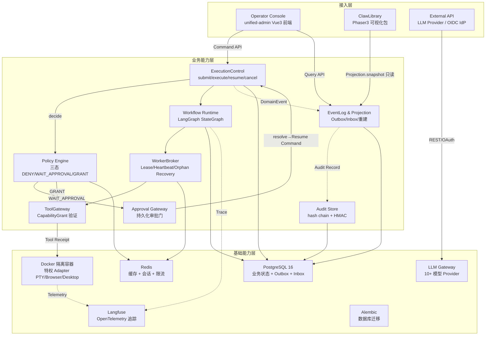
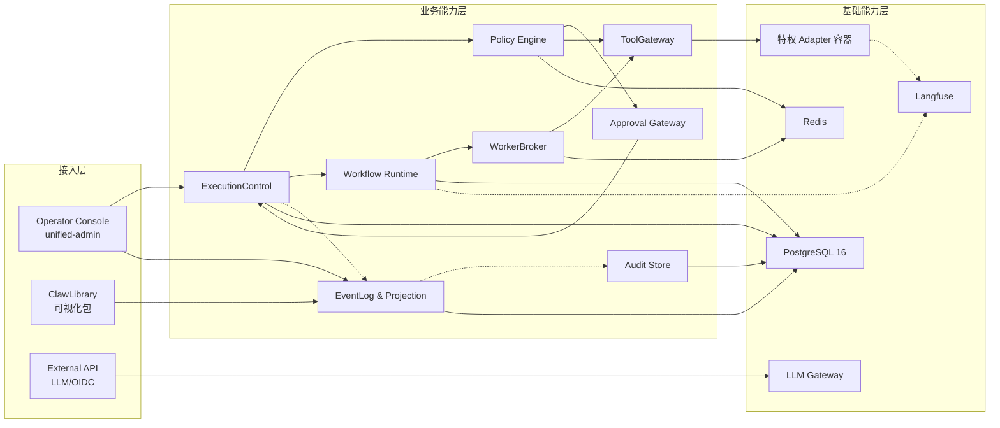

# AICoding 架构设计 · 高层架构设计

> 本文档为《AICoding 架构设计》核心产物之一，对应**高层架构设计模版**。
> 上游输入：用户原始诉求 + material_digest.md（G1 通过）+ research_report.md（G2 通过）；
> 下游输出：驱动《系统设计》《部署设计》《安全设计》《UserStory》四份文档的撰写。

---

## 0. 元信息：修订记录

```yaml
标题: Agent Control Center 单一控制面 - 高层架构设计 v1.0
版本: v1.0
状态: Reviewing   # Draft | Reviewing | Approved | Deprecated
创建日期: 2026-07-18
最后更新: 2026-07-18
作者: business-architect（许边界）
评审人:
  - team-lead（主理人）

关联文档:
  上游输入:
    - 业务原始诉求: 主理人转交，Agent Control Center 单一控制面架构方案
    - 资料摘要: material_digest.md v1.0（已通过 G1）
    - 行业调研报告: research_report.md v1.0（已通过 G2）
  下游产出:
    - 系统设计: AICoding架构设计-2-系统设计.md
    - 部署设计: AICoding架构设计-3-部署设计.md
    - 安全设计: AICoding架构设计-4-安全设计.md
    - UserStory: AICoding架构设计-5-UserStory.md
```

| 版本 | 日期 | 作者 | 变更内容 | 评审状态 |
| --- | --- | --- | --- | --- |
| v1.0 | 2026-07-18 | business-architect（许边界） | 初稿，覆盖 §1~§6 全部章节 + 附录，整合 D1 v2 设计方案 + material_digest.md 95 条摘要 + research_report.md 5 标杆加权对比 | Reviewing |

> **版本管理纪律**：破坏性变更（章节结构调整 / 关键决策反转）升 MAJOR；新增章节、扩充内容升 MINOR。

---

## 1. 需求概要

### 1.1 需求概要说明

Agent Control Center 单一控制面用于解决现有 F:\Agents 下 5 个源项目以"三套系统互相调用"方式集成导致的执行入口分散、状态写入者冲突、审批可绕过、事件不可重建、可视化层直接耦合后端等问题，服务于平台架构负责人、Agent 运维操作者和安全合规审计方，覆盖多 Agent 任务编排、执行审批管控、事件溯源可视化三大核心场景。本期由 v2 设计方案（agent-control-center-design-and-fix-plan-v2.md）驱动启动，目标是将 myself-agent 收敛为唯一任务与执行控制面，agent_tianshu 转为版本化 Workflow，unified-admin 收缩为无状态 BFF 前端，ClawLibrary 转为只消费 Projection 读模型的可视化包。

### 1.2 关键决策摘要

| 编号 | 决策类别 | 决策内容 | 关联章节 |
| --- | --- | --- | --- |
| D1 | 范围决策 | myself-agent 是唯一任务/策略/审批/执行/审计/记忆/技能写模型，所有副作用路径收敛到 ExecutionControl 接口 | §4.2 系统定位 / §6.1 需求边界 |
| D2 | 技术选型决策 | 核心能力采用 LangGraph（Workflow 引擎）+ PostgreSQL Transactional Outbox（事件溯源）+ 自研三态 Policy（DENY/WAIT_APPROVAL/GRANT）+ Docker 容器隔离（特权 Adapter）+ Langfuse（Telemetry）的混合方案 | §3.2 / §4 |
| D3 | MVP / 完整版边界 | MVP 覆盖唯一执行入口、三态 Policy、持久化审批门、事件溯源核心版、版本化 Workflow 基础版、ActorScope 隔离、特权 Adapter 隔离（Docker 级）、tamper-evident 审计简化版、source_status、Langfuse 集成、ClawLibrary 基础接入；自进化模型（SkillEvaluation）延后到完整版 | §4.3 |
| D4 | 复用 vs 新建 | 底座复用 myself-agent 现有 FastAPI/SQLAlchemy 2/RBAC(4 角色 52 权限)/Capability Token/Alembic 14 迁移/LLM Gateway(10+ 模型)，业务逻辑（三态 Policy/持久化执行/Outbox/Projection/hash chain 审计）自研新建 | §5.2 |
| D5 | 部署形态 | 私有化部署，Docker Compose + PostgreSQL 16 + Redis，self-hosted 非云原生 | §4.2 系统定位 / 部署设计 |

### 1.3 价值主张

| 价值维度 | 量化目标 | 度量指标 | 当前值 | 目标值 | 截止时间 |
| --- | --- | --- | --- | --- | --- |
| 安全合规 | 高风险步骤批准前执行次数为 0 | 批准前执行尝试次数 | 多入口可绕过审批（D1,§9.1 列出 14 项 P0 修复） | 0 次 | MVP 上线 |
| 安全合规 | 跨租户读写成功次数为 0 | 跨租户数据访问成功率 | Repository 未强制接收 ActorScope，存在泄漏风险 | 0 次 | MVP 上线 |
| 效率 | 副作用全链路审计缺失率为 0 | 每个副作用可追溯 command/decision/approval/grant/receipt 的比率 | Express 越权执行（PTY/文件 CRUD/npm 安装）无审计链路 | 100% | MVP 上线 |
| 可靠性 | 进程崩溃后任务可恢复率 | 规划/审批/工具执行/结果提交时杀进程后恢复成功率 | 无持久化执行恢复机制 | 100% | 完整版上线 |
| 效率 | Snapshot 重放一致率 | EventLog 重放生成相同 Snapshot 的比率 | 无事件溯源和 Projection 重建 | 100% | 完整版上线 |
| 成本 | Agent 编排引擎运维成本 | 额外基础设施服务数量 | 0（myself-agent 内嵌） | 0（LangGraph 库嵌入，无额外编排器） | MVP 上线 |

---

## 2. 需求分析 & 痛点解构

### 2.1 核心角色关注点

| 角色 | 业务身份 | 主要操作 | Top1 关心点 | 来源 |
| --- | --- | --- | --- | --- |
| 平台架构负责人 | 甲方决策者 | 架构决策、收敛方案审阅 | 唯一写入者原则落地——所有副作用必须经过唯一可控执行入口 | D1,§1 核心决策1 |
| Agent 运维操作者 | 最终用户 | 提交任务、查看任务状态、批准审批请求 | 任务执行可靠性——进程崩溃后能否恢复、卡住时能否自动恢复或转人工 | D1,§16 最终产品形态 |
| 安全合规审计员 | 最终用户 | 审计日志审阅、安全策略配置 | 每个副作用能否追溯到 command/decision/approval/grant/receipt 完整链路 | D1,§11 Phase 1 退出条件 |
| Agent 被控终端用户 | 受影响方 | 通过 Agent 完成业务操作 | Agent 执行结果正确性——重试不产生重复外部副作用 | D1,§7.3 投递语义 |
| DevOps / SRE | 受影响方 | 部署运维、监控告警 | 部署可重复性——版本/镜像标签/健康响应/发布说明来自同一来源 | D1,§11 Phase 0 退出条件 |

### 2.2 核心痛点

| 编号 | 痛点描述 | 现象 / 数据 | 影响角色 | 影响程度 | 优先级 |
| --- | --- | --- | --- | --- | --- |
| P1 | 多入口绕过策略引擎：CLI/SubAgent/Express BFF/插件可直接调用 Tool 实例执行高权限操作，无需经过 Policy 审批 | D1,§2.1 禁令列出 6 类旁路路径；D1,§9.1 列出 14 项 P0 修复；myself-agent 当前 execute 正常路径引用未定义 task | 平台架构负责人、安全合规审计员 | 高（合规风险 + 安全底线） | P1 |
| P2 | Express BFF 越权执行业务写：unified-admin 的 Express 服务端直接管理 PTY 终端、文件 CRUD、npm 全局安装、备份，无审计链路 | D4,unified-admin/server/index.js 约 2000 行含 Gateway/SSE/终端/Hermes CLI/文件管理/系统监控/snapshot 聚合 | 安全合规审计员、DevOps/SRE | 高（安全漏洞 + 合规缺失） | P1 |
| P3 | 状态写入者冲突：more_agents/backend 存在第二套 Orchestrator（orchestrator.start()），与 myself-agent 形成竞争 | D4,backend/app/services/orchestrator.py；material_digest X2 冲突记录 | 平台架构负责人 | 高（数据一致性风险） | P1 |
| P4 | 无持久化执行恢复：进程崩溃后运行中任务丢失，卡死 Run 无法自动恢复 | D1,§11 Phase 2 退出条件要求"规划/审批/工具执行/结果提交时杀进程均可恢复" | Agent 运维操作者 | 中 | P2 |
| P5 | 事件不可重建：无 DomainEvent + Outbox + Projection 机制，UI 无法从事件重放得到一致 Snapshot | D1,§6.7 EventLog/Projection 接口要求；D1,§11 Phase 3 退出条件要求"EventLog 重放生成相同 Snapshot" | Agent 运维操作者、平台架构负责人 | 中 | P2 |
| P6 | mock 数据伪装在线：后端全离线时 snapshot 接口返回 buildMockSnapshot()，资源标记为 idle 而非 unavailable | D4,unified-admin/server/index.js；material_digest X5 冲突记录 | Agent 运维操作者 | 中（误导决策） | P2 |

### 2.3 期待目标

| 编号 | 目标描述 | 对齐痛点 | 度量指标 | 当前值 | 目标值 | 截止时间 |
| --- | --- | --- | --- | --- | --- | --- |
| V1 | 所有入口收敛到 ExecutionControl 接口，无旁路 | P1 | 旁路执行检测（CLI/SubAgent/Express/插件直接调用 Tool）命中次数 | 6 类旁路路径存在 | 0 次 | MVP 上线 |
| V2 | 高风险操作 100% 经过三态 Policy 审批 | P1, P2 | Policy.decide() 返回 WAIT_APPROVAL 的步骤，批准前执行尝试次数 | 无三态 Policy（当前 RBAC 为布尔 allowed） | 0 次 | MVP 上线 |
| V3 | 每个副作用全链路审计无缺失 | P2 | 副作用可追溯到 command/decision/approval/grant/receipt 的比率 | Express 越权执行无审计 | 100% | MVP 上线 |
| V4 | 进程崩溃后任务可恢复 | P4 | 规划/审批/工具执行/结果提交时杀进程后恢复成功率 | 无持久化恢复 | 100% | 完整版上线 |
| V5 | EventLog 重放生成相同 Snapshot | P5 | Snapshot 重放一致率 | 无事件溯源 | 100% | 完整版上线 |
| V6 | 唯一 Orchestrator，无竞争写入者 | P3 | 部署中第二个任务写模型数量 | backend 存在独立 Orchestrator | 0 个 | MVP 上线 |
| V7 | UI 数据可信度明确标注 | P6 | 所有 Snapshot 携带 source_status(live/stale/unavailable/simulated) 的比率 | mock 伪装为 idle | 100% 携带 source_status | MVP 上线 |

### 2.4 基线复用

| 复用类别 | 现有能力 | 复用方式 | 来源系统 | 备注 |
| --- | --- | --- | --- | --- |
| 核心底座 | FastAPI API Layer（REST/WebSocket/SSE）+ Agent Core（Planner/Policy/Executor/Memory/Skills/Audit/Eval/LLM GW） | 直接复用，在此基础上收敛执行入口 | myself-agent（D2） | v3.13.0，41 Sprint 迭代，2104 后端测试 |
| 数据库 | SQLAlchemy 2.x ORM（24 表）+ Alembic（14 迁移版本） | 直接复用，在此基础上新增 WorkflowDefinition/WorkflowRun/StepRun/ApprovalRequest/CapabilityGrant/DomainEvent/Outbox/Inbox/AuditRecord 等表 | myself-agent（D2） | Schema 合并方案交 system-architect（U-03） |
| 安全底座 | RBAC（4 角色 + 52 权限 + 22 资源 + TTL 缓存）+ OIDC SSO（PKCE+nonce+JIT）+ Capability Token（HMAC-SHA256） | 直接复用 RBAC 基座，升级为三态 Policy；复用 Capability Token 密钥体系实现审计 hash chain 签名 | myself-agent（D2） | D1,§6.2 Policy 接口要求三态返回 |
| LLM 网关 | LLM Gateway 支持 DeepSeek/GLM/Kimi/Doubao/Qwen/OpenRouter/OpenAI/Anthropic/Gemini/Ollama/llama.cpp | 直接复用，添加 Langfuse drop-in wrapper 实现全链路追踪 | myself-agent（D2） | 10+ 模型 Provider 已集成 |
| 前端底座 | unified-admin（Vue 3 + Naive UI + Express 5） | 复用 Vue 3 前端，Express 收缩为无状态 BFF | more_agents/unified-admin（D4） | D1,§1 核心决策3 |
| Workflow 原型 | 天枢 9 角色 7 态状态机 + 30s 调度 + 4 阶段停滞恢复 + 23 技能 6 大类 | 提取角色/阶段/审核门/路由/停滞策略转为 WorkflowDefinition | agent_tianshu（D3） | D1,§1 核心决策2 |
| 可视化包 | ClawLibrary（Phaser 3 像素可视化，11 个房间映射） | 作为 workspace package 接入，只消费 Projection 读模型 | more_agents/clawlibrary（D4） | D1,§1 核心决策4 + §9.4 |
| 部署底座 | Docker Compose + nginx + PostgreSQL 16-alpine + Prometheus + Grafana | 直接复用部署形态，增加 Langfuse Docker 服务 | myself-agent（D2） | docker-compose.prod.yml 已有 5 个服务 |

### 2.5 功能缺口

| 阶段 | 功能缺口 | 必要性 | 优先级 | 对齐目标 |
| --- | --- | --- | --- | --- |
| 任务执行前 | 唯一执行入口收敛（ExecutionControl.submit/execute/resume/cancel） | 必须 | MVP | V1, V6 |
| 任务执行前 | 三态 Policy 引擎（DENY/WAIT_APPROVAL/GRANT） | 必须 | MVP | V2 |
| 任务执行中 | 持久化审批门（ApprovalRequest + resolve 触发 Resume Command） | 必须 | MVP | V2, V3 |
| 任务执行中 | ActorScope 租户隔离（Repository 行级强制过滤） | 必须 | MVP | V1 |
| 任务执行中 | 特权 Adapter 进程隔离（Docker 容器 + seccomp/cgroups） | 必须 | MVP | V2 |
| 任务执行中 | 版本化 Workflow（天枢状态机转 WorkflowDefinition + LangGraph StateGraph） | 必须 | MVP | V1 |
| 任务执行后 | 事件溯源 + Projection（Outbox + Inbox + 全量重建） | 必须 | MVP（核心版） | V5, V3 |
| 任务执行后 | tamper-evident 审计（hash chain + HMAC 签名） | 必须 | MVP（简化版） | V3 |
| 运营监控 | source_status 可信度标注（live/stale/unavailable/simulated） | 必须 | MVP | V7 |
| 运营监控 | Langfuse 链路追踪集成 | 重要 | MVP | V3 |
| 可视化 | ClawLibrary 接入（只消费 Projection.snapshot()） | 重要 | MVP（基础版） | V5 |
| 自进化 | SkillEvaluation 晋升机制（最小样本量 + 质量提升 + 安全回归） | 重要 | 完整版 | — |

---

## 3. 行业调研

### 3.1 行业标杆系统分析

| 标杆系统 | 厂商 / 来源 | 场景覆盖 | 技术亮点 | 商业模式 | 适用度 |
| --- | --- | --- | --- | --- | --- |
| Temporal | Temporal Technologies（开源 + SaaS） | 持久化工作流引擎：任务编排、状态机、重试、补偿、人工审批门、AI Agent 编排 | Event Sourcing 状态恢复、信号/查询机制、Saga 补偿模式、Activity 重试策略、多语言 SDK | 开源 MIT + Cloud SaaS | 高 |
| LangGraph | LangChain（开源） | Agent 编排框架：状态图执行、Checkpointing、Human-in-the-Loop、多 Agent 协作 | StateGraph 有向图模型、共享状态对象、条件边、子图模块化、Checkpointer 持久化 | 开源 MIT | 高 |
| Retool Agents + Workflows | Retool（商业 SaaS，底层 Temporal） | 企业级 Agent 编排平台：持久化执行、工具调用、人工审批、可观测性 | 基于 Temporal 构建、日均 1000 万+ workflow runs、Agent 定义四要素、三层架构演进 | SaaS 订阅制 | 中 |
| EventStoreDB + Axon Framework | Event Store Ltd / Axon Framework（开源） | 事件溯源 + CQRS：事件存储、Projection 重建、Saga 编排 | Append-only 事件存储、Projection 异步更新读模型、快照优化、Upcaster Schema 演化 | 开源 + Enterprise | 中 |
| Langfuse | Langfuse（开源） | LLM 可观测性：链路追踪、评估、Prompt 管理、成本归因 | OpenTelemetry 原生、SDK drop-in wrapper、@observe 装饰器、自部署 | 开源 MIT + Cloud | 中 |

### 3.2 方案对标及优先级打分

**对比矩阵**（每行权重之和 = 1）：

| 评估维度 | 权重 | Temporal 得分 | LangGraph 得分 | Retool 得分 | EventStoreDB+Axon 得分 | Langfuse 得分 |
| --- | --- | --- | --- | --- | --- | --- |
| 场景契合度 | 0.30 | 4 | 4 | 3 | 3 | 1 |
| 技术成熟度 | 0.20 | 5 | 3 | 4 | 4 | 3 |
| 集成难度（反向）| 0.15 | 3 | 5 | 2 | 1 | 5 |
| 成本（反向） | 0.15 | 4 | 5 | 1 | 3 | 5 |
| 合规可控性 | 0.20 | 4 | 3 | 2 | 4 | 4 |
| **加权总分** | **1.00** | **4.05** | **3.90** | **2.55** | **3.10** | **3.20** |

**结论摘要**：

- **优先借鉴**：**Temporal**（4.05）— 理由：持久化执行成熟度业界最高（5 分），信号机制天然适配 human-in-the-loop 审批门，Activity 重试策略精细可控，Saga 补偿模式直接满足 D1,§11 Phase 2 恢复退出条件。**借鉴设计模式（Workflow/Activity/Signal 映射）而非直接部署 Temporal Server 作为第二套编排器**——v2 要求 myself-agent 是唯一 Orchestrator。

- **优先借鉴**：**LangGraph**（3.90）— 理由：StateGraph 有向图模型是天枢 9 角色 7 态状态机转 WorkflowDefinition 的最佳映射载体（场景契合度 4 分），Python 原生与 FastAPI/SQLAlchemy 无缝集成（集成难度 5 分），Checkpointer 满足进程崩溃恢复需求。借鉴点：StateGraph 作为 Workflow Runtime 内部引擎，条件边表达三审制路由 + 4 阶段停滞恢复。不借鉴：自行实现 WorkerBroker/Lease/Heartbeat/Orphan Recovery 和 EventLog/Projection。

- **部分借鉴**：**EventStoreDB + Axon Framework**（3.10）— 借鉴点：CQRS + Event Sourcing 工程范式（事件为真源、Projection 可重建、Upcaster Schema 演化、乐观锁版本控制）直接指导 D1,§6.7 EventLog/Projection 接口实现。不借鉴：EventStoreDB 独立数据库（违反 PostgreSQL-only 约束）、Axon Java 生态（语言不匹配）。在 PostgreSQL 上用 Transactional Outbox 模式实现等效能力。

- **部分借鉴**：**Retool Agents**（2.55）— 借鉴点：Agent 四要素定义（reasoning/tools/approval/loop）映射 v2 Planner/ToolGateway/Approval/ExecutionControl；V3"活动合并 + 并行执行"优化可在 StepRun 批处理时参考。不借鉴：SaaS 平台绑定。

- **部分借鉴**：**Langfuse**（3.20）— 借鉴点：作为 Telemetry 层选型——OpenTelemetry 原生追踪覆盖 D1,§3.4 Metric/Log 分离需求，Docker Compose 自部署。不覆盖核心编排/事件/安全能力（场景契合度 1 分），source_status 标注和 Audit Record 需自行实现。

### 3.3 完整报告参考

- 完整报告链接：F:\Agents\super-agent-self\.workbuddy\output\research_report.md
- 调研工具：tech-research-advisor（见附录 B）
- 调研日期：2026-07-18
- 调研归档：research_report.md v1.0（已通过 G2）

---

## 4. 方案决策

### 4.1 价值定位澄清

**定位三段式**：

```
对外价值（用户侧）: Agent 行为只有一个可信执行入口，所有状态有唯一所有者，所有副作用可授权、可审计、可恢复
对内价值（运营侧）: 消除多套 Orchestrator 竞争写入风险，Express BFF 越权收敛为无状态协议代理，特权 Adapter 进程隔离降低安全攻击面
差异化价值        : 相对现有"三套系统互相调用"架构，唯一写入者原则 + 三态 Policy + 事件溯源重建 + tamper-evident 审计构成端到端可信执行链路——从命令提交到副作用落地全程可追溯
```

**与产品矩阵的关系**：本系统在 Agent 控制面架构中承担**核心控制面**职责，与 Operator Console（unified-admin 前端）、Provider Adapters（OpenClaw/Hermes/Tianshu/Browser/Desktop/PTY/Plugin）、Visualization Package（ClawLibrary）形成完整的"一个任务与执行控制面，一个操作者控制台，一组可替换 Adapter，一套版本化 Workflow，一个由事件重建的可视化世界"业务闭环（见 §5.2、§5.3）。

### 4.2 系统定位澄清

| 维度 | 内容 |
| --- | --- |
| 系统名称 | Agent Control Center（Core Control Plane） |
| 系统类型 | 改造——基于 myself-agent（v3.13.0，41 Sprint 迭代）现有底座进行收敛和升级 |
| 部署形态 | 私有化——Docker Compose + PostgreSQL 16-alpine + Redis，self-hosted 非云原生 |
| 多租户 | 是（隔离粒度 = tenant_id + workspace_id，Repository 层 ActorScope 行级强制过滤） |
| 服务对象 | 平台架构负责人、Agent 运维操作者、安全合规审计员、Agent 被控终端用户、DevOps/SRE |
| 上游依赖 | LLM Provider（DeepSeek/GLM/Kimi/Qwen/OpenAI 等 10+ 模型）、OIDC IdP（认证）、外部 API（Provider Adapters 调用） |
| 下游消费者 | Operator Console（unified-admin，通过 Query API + Command API）、ClawLibrary（通过 Projection 读模型）、DevOps 监控（Prometheus/Grafana/Langfuse） |
| 边界（不做） | 不做第二套 Orchestrator（backend 退役为 Reference Only）、不部署 Temporal Server（借鉴设计模式而非运行时）、不引入专用事件数据库（EventStoreDB）——PostgreSQL-only |

### 4.3 MVP 与完整版决策

| 阶段 | 时间窗 | 范围（功能编号） | 架构差异点 | 退出标准 | 不做（延后） |
| --- | --- | --- | --- | --- | --- |
| MVP | Phase 0~2 | F1(唯一执行入口), F2(三态Policy), F3(持久化审批门), F4(事件溯源核心版), F5(版本化Workflow基础版), F6(ActorScope隔离), F7(特权Adapter隔离Docker级), F8(tamper-evident审计简化版), F9(source_status), F10(Langfuse集成), F11(ClawLibrary基础接入) | 单租户验证、单 Projection（AgentSnapshot）、Shell/PTY+浏览器 Adapter 覆盖、hash chain 简化版（创建时签名，验证工具延后）、天枢基础路由（三审制），停滞恢复 4 阶段延后 | 部署拓扑只有一个 Task 写模型和一个 Orchestrator；高风险步骤批准前执行次数为 0；跨租户读写成功次数为 0；每个副作用可追溯到 command/decision/approval/grant/receipt；Shell/PTY 和浏览器 Adapter Docker 隔离生效 | F12(SkillEvaluation自进化), F13(停滞恢复4阶段), F14(桌面/插件Adapter), F15(多Projection并行重建) |
| 完整版 | Phase 3~7 | + F12, F13, F14, F15, + 多Projection重建, + 审计验证工具, + 密钥轮换 | 双租户隔离验证、多 Projection（AgentSnapshot/TaskTimeline/ApprovalQueue/WorldDelta/SourceHealth）并行重建、全部 Adapter 覆盖（含桌面/插件）、SkillEvaluation 晋升机制 | 进程崩溃恢复率 100%；EventLog 重放生成相同 Snapshot；UI 不需要理解来源系统内部状态枚举；Skill 晋升可解释/可复现/可回滚；恶意插件无法访问宿主未授权资源 | — |

**演进纪律**：
- ✅ MVP 的架构骨架必须是完整版的**子集**——LangGraph StateGraph 在 MVP 中作为 Workflow Runtime 引擎引入，完整版仅增加停滞恢复等状态转移逻辑，不替换引擎。
- ✅ MVP 中可简化或延后的能力（停滞恢复 4 阶段、多 Projection 并行重建、SkillEvaluation 晋升、桌面/插件 Adapter），已在完整版中有明确替换计划。
- ❌ 禁止：MVP 为了赶工而引入"完整版无法继承"的临时架构——三态 Policy、ExecutionControl 接口、Transactional Outbox 等核心架构在 MVP 中即按完整版标准实现，后续仅扩展不重写。

---

## 5. 业务架构设计

### 5.1 业务架构图

> 三层架构：接入层（用户/触点）→ 业务能力层（核心模块）→ 基础能力层（底座/数据）。实线 = 同步调用，虚线 = 异步事件，粗线 = 主链路。



### 5.2 系统依赖架构

| 依赖类型 | 系统 / 模块 | 提供方 | 依赖能力 | 接入方式 | 同步/异步 | 关键约束 |
| --- | --- | --- | --- | --- | --- | --- |
| 上游 | LLM Provider（DeepSeek/GLM/Kimi 等 10+） | 外部 API | LLM 推理（规划/生成） | HTTPS REST | 同步 | 超时 60s，重试 3 次；支持 Langfuse drop-in wrapper 追踪 |
| 上游 | OIDC IdP | 外部认证 | 用户认证 + JWT 颁发 | HTTPS OIDC/OAuth2 | 同步 | PKCE + nonce + JIT；Token TTL 5 分钟 |
| 下游 | Operator Console（unified-admin 前端） | 前端团队 | Command API + Query API | HTTPS REST + WebSocket/SSE | 混合 | Express 收缩为无状态 BFF；高风险写操作只提交 AgentCommand |
| 下游 | ClawLibrary（可视化包） | 前端团队 | Projection.snapshot() 读模型 | npm package API | 同步 | 只消费 Projection 读模型，不直接调用来源系统写接口 |
| 下游 | DevOps 监控（Prometheus/Grafana） | 运维团队 | 指标采集 + 告警 | Prometheus scrape | 异步 | 15s 抓取间隔；关键指标：执行成功率/延迟/LLM 成本 |
| 下游 | Langfuse（Telemetry） | 运维团队 | 链路追踪 + 评估 | OpenTelemetry SDK | 异步 | @observe 装饰器侵入性极低；Docker Compose 自部署 |
| 复用底座 | myself-agent 底座 | 现有系统 | FastAPI/SQLAlchemy 2/RBAC/Capability Token | 内嵌复用 | 混合 | 24 表 + 14 Alembic 迁移；Schema 合并交 system-architect |
| 复用底座 | agent_tianshu 状态机 | 现有系统 | 9 角色 7 态 + 三审制 + 调度模式 | 提取为 WorkflowDefinition | 同步 | 转为 LangGraph StateGraph 节点/条件边 |
| 复用底座 | Docker Compose 部署 | 现有系统 | 容器编排 + nginx 反向代理 | docker-compose.yml | 混合 | PostgreSQL 16-alpine + Redis；资源限制 1G RAM/1 CPU |
| 外部隔离 | 特权 Adapter 容器（PTY/Browser/Desktop） | 安全架构 | 进程隔离执行 | Docker 容器 + seccomp + cgroups | 同步 | 独立容器运行；限制 FS/网络/CPU/内存/子进程；非 root 用户 |

**硬指标自检**：
- ✅ 每条依赖明确了"接入方式 + 同步/异步 + 关键约束"。
- ✅ 所有 P1 痛点对应的核心能力均在本表中找到依赖来源：
  - P1（多入口旁路）→ ExecutionControl（自建，复用 myself-agent 底座）
  - P2（Express 越权）→ Operator Console 收缩为无状态 BFF（改造 unified-admin）
  - P3（双 Orchestrator）→ 唯一 Orchestrator（myself-agent 底座）

### 5.3 业务闭环

**业务主链路**（端到端）：

```
<用户提交 AgentCommand> → <ExecutionControl.submit 创建 Task> → <Policy.decide 三态决策>
  → [GRANT] → <Workflow Runtime 编排> → <WorkerBroker 分发 StepRun> → <ToolGateway 验证 Grant 执行工具> → <ToolReceipt 记录副作用>
  → [WAIT_APPROVAL] → <ApprovalRequest 持久化> → <用户批准/拒绝> → <resolve 触发 Resume Command> → 回到 Policy.decide
  → <DomainEvent 写入 Outbox> → <Projection 异步更新读模型> → <Audit Record hash chain 签名>
  → <Operator Console 从 Projection 读取 Snapshot> → <ClawLibrary 可视化展示> → <反馈回路>
```

**关键反馈回路**：

| 回路 | 触发点 | 反馈对象 | 反馈机制 | 价值 |
| --- | --- | --- | --- | --- |
| 安全合规回路 | 每个副作用执行完成 | Audit Store + Policy Engine | ToolReceipt → Audit Record hash chain 签名 → Policy 版本绑定（policy_digest） | 确保每个副作用可追溯到 command/decision/approval/grant/receipt，审计缺失率 = 0 |
| 状态恢复回路 | 进程崩溃 / Worker 离线 / 消息重复 | WorkerBroker + ExecutionControl | Lease 过期检测 → Orphan Recovery → Run/StepRun attempt 历史重放 → 精确恢复到故障前状态 | 进程崩溃后任务 100% 可恢复，重复消息不产生重复外部副作用 |
| 事件重建回路 | Projection 数据损坏 / 新增视图 / Schema 演化 | EventLog + Projection | EventLog.read(cursor) → Projection.rebuild(stream) 全量重放 → 生成一致 Snapshot | Snapshot 重放一致率 = 100%，Projection 可抛弃后重建 |
| 运营监控回路 | 指标异常 / 执行失败 / 成本飙升 | DevOps/SRE + Langfuse | Prometheus scrape → Grafana 告警 → Langfuse trace 追踪 → 根因分析 | 快速响应，source_status(live/stale/unavailable/simulated) 实时标注 |
| 自进化回路（完整版） | Skill 样本量达标 | SkillVersion + SkillEvaluation | 累积执行数据 → 质量增量 + 失败率评估 → 满足门槛后 Skill 晋升 → Workflow 更新 | Agent 能力持续提升，晋升可解释/可复现/可回滚 |

**运营主线**：

- **每日**：DevOps/SRE 查看 Prometheus/Grafana 健康看板（执行成功率/延迟/LLM 成本/Outbox 表积压）；检查 Langfuse trace 异常链路；确认 source_status 标注正确。
- **每周**：安全合规审计员审查 Audit Store hash chain 完整性；检查跨租户访问日志；核对审批门拦截统计。
- **每月**：平台架构负责人审阅 EventLog 重放一致性报告；评估 Workflow 性能（LangGraph Checkpointer 并发写入）；规划下一 Phase 功能迭代。

---

## 6. 产品需求及原型

### 6.1 需求边界

**In-Scope**（本期必做）：

```
F1. 唯一执行入口收敛：所有入口（HTTP/CLI/Chat/Cron/SubAgent/Workflow/插件）收敛到 ExecutionControl.submit/execute/resume/cancel 接口
F2. 三态 Policy 引擎：Policy.decide() 返回 DENY/WAIT_APPROVAL/GRANT 三态，替代现有布尔 RBAC allowed
F3. 持久化审批门：ApprovalRequest 持久化 + resolve 触发持久化 Resume Command + expires_at 超时处理
F4. 事件溯源核心版：Transactional Outbox（PG LISTEN/NOTIFY + FOR UPDATE SKIP LOCKED）+ Inbox 去重 + 单 Projection（AgentSnapshot）全量重建
F5. 版本化 Workflow 基础版：LangGraph StateGraph 映射天枢 9 角色 7 态 + 三审制路由（install/instantiate/handle_event 接口）
F6. ActorScope 租户隔离：所有 Repository 查询强制接收 ActorScope(tenant_id/workspace_id/principal_id)，行级过滤
F7. 特权 Adapter Docker 隔离：Shell/PTY + 浏览器 Adapter 在独立 Docker 容器运行，seccomp + cgroups 资源限制
F8. tamper-evident 审计简化版：每条 Audit Record 含前一条 SHA-256 哈希 + 创建时 HMAC-SHA256 签名
F9. source_status 可信度标注：所有 Snapshot 携带 source_status(live/stale/unavailable/simulated) + observed_at + projected_at
F10. Langfuse 链路追踪集成：FastAPI 路由 @observe 装饰器 + LLM Gateway drop-in wrapper
F11. ClawLibrary 基础接入：npm workspace package 接入 + 只消费 Projection.snapshot() 读模型
N1. Express BFF 收缩：删除 Express 服务端业务写模型（PTY/文件 CRUD/npm 安装/备份），保留无状态协议代理
N2. backend Orchestrator 退役：more_agents/backend 降级为 Reference Only，不部署第二套 Orchestrator
```

**Out-of-Scope**（本期不做，必须列原因）：

| 编号 | 不做的事 | 原因 | 后续计划 |
| --- | --- | --- | --- |
| O1 | SkillEvaluation 自进化晋升机制 | 需要数据积累 + 最小样本量验证 + 模型迭代，MVP 不具备条件（D1,§4.6） | 完整版 Phase 6 |
| O2 | 停滞恢复 4 阶段（180s/360s/540s/720s 自动重试→升级→回滚） | 天枢现有调度器逻辑复杂，MVP 优先保证基础路由正确性 | 完整版 Phase 5 |
| O3 | 桌面自动化 Adapter 和插件 Host 隔离 | Docker 容器隔离对桌面 GUI 和插件沙箱的安全边界需要额外验证（U-02 交 security-architect） | 完整版 Phase 6 |
| O4 | 多 Projection 并行重建（TaskTimeline/ApprovalQueue/WorldDelta/SourceHealth） | MVP 优先实现单 Projection（AgentSnapshot）验证事件溯源链路正确性 | 完整版 Phase 3 |
| O5 | 部署 Temporal Server 作为独立编排器 | v2 要求 myself-agent 是唯一 Orchestrator，Temporal 仅作为设计模式参照（D1,§1 核心决策1） | 不做 |
| O6 | 引入专用事件数据库（EventStoreDB） | v2 部署约束为 PostgreSQL + Redis，在 PG 上用 Transactional Outbox 可实现等效能力 | 不做 |

### 6.2 产品模块全景图

**模块卡片**：

| 模块名称 | 一级归属 | 责任团队 | 上游 | 下游 | MVP 是否包含 |
| --- | --- | --- | --- | --- | --- |
| ExecutionControl | 业务能力层 | 后端架构 | Operator Console Command API | Policy/Workflow/WorkerBroker | 是 |
| Policy Engine | 业务能力层 | 安全架构 | ExecutionControl | Approval Gateway / ToolGateway | 是 |
| Approval Gateway | 业务能力层 | 后端架构 | Policy(WAIT_APPROVAL) | ExecutionControl(Resume) | 是 |
| Workflow Runtime | 业务能力层 | 后端架构 | ExecutionControl | WorkerBroker | 是 |
| WorkerBroker | 业务能力层 | 后端架构 | Workflow Runtime | ToolGateway | 是 |
| ToolGateway | 业务能力层 | 后端架构 | WorkerBroker | 特权 Adapter 容器 | 是 |
| EventLog & Projection | 业务能力层 | 后端架构 | ExecutionControl(Outbox) | Operator Console / ClawLibrary | 是 |
| Audit Store | 业务能力层 | 安全架构 | ExecutionControl/Policy/ToolGateway | 安全合规审计员 | 是（简化版） |
| Operator Console | 接入层 | 前端团队 | 用户交互 | ExecutionControl / Projection | 是 |
| ClawLibrary | 接入层 | 前端团队 | Projection.snapshot() | 用户可视化 | 是（基础版） |
| 特权 Adapter Host | 基础能力层 | 安全架构 | ToolGateway | 外部系统（Shell/Browser/Desktop） | 是（Shell/Browser） |
| LLM Gateway | 基础能力层 | 后端架构 | Workflow Runtime / Planner | LLM Provider（10+ 模型） | 是 |
| PostgreSQL 数据层 | 基础能力层 | 后端架构 | 全部业务模块 | — | 是 |
| Redis 缓存层 | 基础能力层 | 后端架构 | Policy / WorkerBroker | — | 是 |
| Langfuse Telemetry | 基础能力层 | 运维团队 | LLM Gateway / FastAPI 路由 | DevOps 监控 | 是 |
| SkillEvaluation | 业务能力层 | 后端架构 | Memory + SkillVersion | Workflow Runtime | 否（完整版） |

**模块全景关系图**：



### 6.3 功能清单

| 编号 | 一级模块 | 二级功能 | 功能描述 | 优先级 | MVP 范围 | 完整版范围 | 对齐目标 |
| --- | --- | --- | --- | --- | --- | --- | --- |
| F1 | ExecutionControl | submit/execute/resume/cancel 接口 | 所有入口收敛到唯一执行入口，不暴露 DB Session/Memory/Skill/Tool 实例 | P0 | ✅ | ✅ | V1, V6 |
| F2 | Policy Engine | 三态决策 DENY/WAIT_APPROVAL/GRANT | 替代布尔 RBAC，WAIT_APPROVAL 不签发 CapabilityGrant | P0 | ✅ | ✅ | V2 |
| F3 | Approval Gateway | 持久化审批 + Resume Command | ApprovalRequest 持久化 + resolve 触发持久化 Resume Command + expires_at | P0 | ✅ | ✅ | V2, V3 |
| F4 | EventLog & Projection | Transactional Outbox + Inbox 去重 | PG LISTEN/NOTIFY + FOR UPDATE SKIP LOCKED + eventId/revision 去重 | P0 | ✅ | ✅ | V5 |
| F5 | EventLog & Projection | Projection 全量重建 | Projection.rebuild(stream) 从 EventLog 全量重放 | P0 | ✅(单Projection) | ✅(多Projection) | V5 |
| F6 | Workflow Runtime | 版本化 WorkflowDefinition | LangGraph StateGraph 映射天枢 9 角色 7 态 + install/instantiate/handle_event | P0 | ✅(基础路由) | ✅(停滞恢复) | V1 |
| F7 | ActorScope 隔离 | Repository 行级强制过滤 | 所有 Repository 查询强制接收 ActorScope 参数 | P0 | ✅ | ✅ | V1 |
| F8 | 特权 Adapter 隔离 | Docker 容器 + seccomp/cgroups | Shell/PTY + 浏览器在独立容器，限制 FS/网络/CPU/内存 | P0 | ✅(Shell/Browser) | ✅(全部Adapter) | V2 |
| F9 | Audit Store | hash chain + HMAC 签名 | 每条 Audit Record 含前一条 SHA-256 哈希 + HMAC-SHA256 签名 | P0 | ✅(简化版) | ✅(验证工具) | V3 |
| F10 | source_status | Snapshot 可信度标注 | 所有 Snapshot 携带 live/stale/unavailable/simulated | P0 | ✅ | ✅ | V7 |
| F11 | Langfuse 集成 | 全链路追踪 | @observe 装饰器 + LLM drop-in wrapper | P1 | ✅ | ✅ | V3 |
| F12 | ClawLibrary 接入 | Projection 只读消费 | npm workspace package + Projection.snapshot() | P1 | ✅(基础版) | ✅(资产替换) | V5 |
| F13 | Express BFF 收缩 | 无状态协议代理 | 删除 PTY/文件 CRUD/npm 安装/备份，保留代理 | P0 | ✅ | ✅ | V3 |
| F14 | backend 退役 | Orchestrator 降级 | more_agents/backend 为 Reference Only，不部署 | P0 | ✅ | ✅ | V6 |
| F15 | SkillEvaluation | 自进化晋升机制 | 样本量+基线+质量增量+失败率+成本增量评估 | P2 | ❌ | ✅ | — |
| F16 | 停滞恢复 4 阶段 | 自动重试→升级→回滚 | 180s/360s/540s/720s 阈值触发 | P2 | ❌ | ✅ | — |
| F17 | 桌面/插件 Adapter | 进程隔离执行 | Docker 容器 + Manifest permissions | P2 | ❌ | ✅ | — |
| F18 | 多 Projection 重建 | 并行重建 + 拓扑排序 | AgentSnapshot/TaskTimeline/ApprovalQueue/WorldDelta/SourceHealth | P2 | ❌ | ✅ | — |
| **F19** | **EffectJournal（v3 增强）** | **副作用四阶段协议 + UNKNOWN_OUTCOME 状态机 + ToolEffectContract + fencing_token** | **PREPARE→ACQUIRE_DISPATCH→CALL_ADAPTER→FINALIZE；effect_class 分级（read_only/provider_idempotent/reconcilable/non_retryable）** | **P0** | **✅** | **✅** | **V4 可靠性** |
| **F20** | **供应链安全 digest（v3 增强）** | **security_context_digest + execution_supply_chain_digest + ContentProvenance + SandboxProfile** | **审批后上下文/插件/沙箱变化触发授权失效** | **P0** | **✅** | **✅** | **V2 安全** |
| **F21** | **迁移切换协议（v3 增强）** | **cutover 9 态状态机 + write_fence + forward recovery + 停用 7 步** | **Phase 6~7 执行依据** | **P1** | **部分（建映射）** | **✅** | **V6 唯一写模型** |

**硬指标自检**：
- ✅ 每个 P0 功能在 MVP 范围内为 ✅（F1~F10, F13, F14 全部 ✅ MVP）。
- ✅ 每个功能可反向映射到 §2.5 功能缺口 + §2.3 期待目标。

### 6.4 产品原型 - Operator Console（操作者控制台）

**核心页面清单**：

| 页面 | 用途 | 关键交互 | MVP |
| --- | --- | --- | --- |
| 任务看板（Task Dashboard） | 查看 Task 生命周期 + Workflow 阶段 + Run/StepRun 状态 | 筛选/排序/批量操作；source_status 实时标注 | ✅ |
| 任务详情（Task Detail） | 查看单个 Task 全貌：PlanVersion/StepRun/ToolReceipt/ApprovalRequest | 回放时间轴；参数绑定展示；Grant 验证链路 | ✅ |
| 审批队列（Approval Queue） | 查看待审批请求：normalized_args_hash/resource_scope/policy_digest | 批准/拒绝一键操作；resolve 触发 Resume Command | ✅ |
| Agent 配置（Agent Profile） | 配置 AgentProfile：role/capabilities/allowed_tools/model_profile/concurrency_limit | 编辑/保存/版本管理 | ✅ |
| Worker 监控（Worker Monitor） | 查看 Worker 在线状态：Lease/Heartbeat/容量/Orphan Recovery | 实时刷新；离线告警 | ✅ |
| 审计日志（Audit Log） | 查看 Audit Record：actor/decision/grant/tool receipt/资源范围 + hash chain 验证 | 搜索/筛选/导出；hash chain 完整性检查 | ✅（简化版） |
| Skill 管理（Skill Manager） | 查看 SkillVersion 定义 + 来源证据 + 策略兼容 | 查看/版本对比 | ❌（完整版） |

**关键交互约束**：
- Command API 响应：高风险写操作提交后，Policy.decide() 到返回 accepted/rejected/waiting_approval 的 P99 ≤ 200ms（对齐 V2）。
- 审批门交互：ApprovalRequest 从创建到用户可操作的呈现延迟 P99 ≤ 1s。
- source_status 刷新：Snapshot 从 Projection 读取的 projected_at 与当前时间差超过 30s 时自动标注 stale。
- 操作步数：核心路径（提交任务→等待审批→批准→查看结果）≤ 5 步。

**原型链接**：待 Figma/Axure 设计完成后补充。

### 6.5 产品原型 - ClawLibrary（可视化世界）

**核心页面清单**：

| 页面/房间 | 用途 | 关键交互 | MVP |
| --- | --- | --- | --- |
| Dashboard 宫殿总览 | 11 个房间入口 + 全局 Agent 在线状态 | 点击进入房间；source_status 全局标注 | ✅ |
| Task Timeline 房间 | 可视化 Task 生命周期 + Workflow 阶段流转 | 时间轴回放；阶段状态动画 | ✅ |
| Approval Board 房间 | 可视化审批队列 + 等待状态 | 审批进度条；等待动画 | ✅ |
| Memory Vault 房间 | 可视化 MemoryRecord 存储状态 | 记忆卡片浏览 | ✅（只读） |
| Skill Forge 房间 | 可视化 SkillVersion 定义状态 | 技能卡片浏览 | ❌（完整版） |
| Runtime Monitor 房间 | 可视化 Worker 在线状态 + Lease/Heartbeat | 实时遥测信号 | ✅ |

**关键交互约束**：
- ClawLibrary 只消费 Projection.snapshot() 读模型，不直接调用来源系统写接口（D1,§1 核心决策4）。
- 遥测信号轮询间隔：pollMs 配置项，默认 3000ms；后端全离线时显示 unavailable 而非 idle（D1,§7.4）。
- 像素资产许可证：MVP 阶段保留 CC BY-NC-SA 资产并在 README 标注 Attribution；正式商业发布前替换资产或取得授权（D1,§9.4）。

**原型链接**：待 Figma/Axure 设计完成后补充。

---

## 附录 A：中间确认自检报告

> 按协议 §2.4 要求，记录 4 次自检的命中/未命中判定与反向验证 3 问答案。

### 自检 1：§2 系统定位与价值定位完成后

- **§2.1 判定（方案分歧型）**：系统定位（唯一 Orchestrator / Docker Compose 部署 / 私有化 / 多租户 ActorScope 隔离）的全部决策已在用户原始诉求和 D1 v2 设计方案中显式指定——myself-agent 是唯一写模型（D1,§1 核心决策1）、Docker Compose + PostgreSQL + Redis 部署（用户诉求原文）、多租户隔离（D1,§4.1 ActorScope）。不存在 ≥2 种方案分歧。**未命中**。
- **§2.3 反向验证 3 问**：
  - Q1（3 个月后被推翻的返工成本）：系统定位决策的返工范围 = §1~§5 全部章节（因为系统定位是全文基线），切换成本 ≥ 3 人月。但系统定位由用户诉求和 D1 设计方案显式指定，不存在被推翻的依据。**可控**——证据：用户诉求原文"myself-agent 作为唯一写模型 Core Control Plane"和"部署形态：Docker Compose + PostgreSQL + Redis（self-hosted，非云原生）"。
  - Q2（用户/客户/监管可感知）：系统定位（私有化部署、唯一控制面）是用户在部署阶段可感知的，但用户诉求已显式要求这一形态——感知内容与诉求一致，不构成"偏离预期"的可感知。**用户可感知但与诉求一致**。
  - Q3（与用户原始诉求一致性）：用户诉求原文"myself-agent 作为唯一写模型 Core Control Plane""部署形态：Docker Compose + PostgreSQL + Redis（self-hosted，非云原生）"——系统定位与此完全一致。**一致**。
- **结论**：未命中，无需发起中间确认。

### 自检 2：§4 MVP 与完整版决策完成后

- **§2.1 判定（方案分歧型）**：MVP 范围（R1~R12 包含 / R9 延后）已在 research_report.md §4.2 中给出调研侧建议，且用户诉求和 D1 设计方案的 Phase 退出条件（D1,§11 Phase 0~2）隐式定义了 MVP 边界。但"SkillEvaluation 延后到完整版"是一个 MVP 范围裁剪决策——research_report 建议延后，D1,§4.6 定义了自进化模型但未指定 MVP 必做。这是一个"上游未冻结该具体决策点"的情况。**部分命中**——需要按 §2.2 进一步验证。
- **§2.3 反向验证 3 问**：
  - Q1（返工成本）：SkillEvaluation 延后到完整版的返工范围 = 如果用户要求 MVP 包含 SkillEvaluation，需增加自进化评估模块（数据收集 + 最小样本量验证 + 晋升机制），切换成本 ≥ 1 人月。**不可控**——但 research_report §4.2 明确"MVP 不具备条件（需数据积累+模型迭代）"，且有充分论证。
  - Q2（用户/客户/监管可感知）：SkillEvaluation 延后影响的是"Agent 自我进化"能力，属于功能是否提供的跨界感知。**用户可感知**——Agent 不具备自进化能力。
  - Q3（与用户原始诉求一致性）：用户诉求原文未显式提及"自进化模型必须在 MVP 中"。D1,§1 执行摘要提到"一个任务与执行控制面"等 5 大目标，未将自进化列为 MVP 必做。D1,§11 Phase 6 退出条件才涉及 Skill 晋升。**一致**——用户诉求未要求 MVP 包含自进化。
- **结论**：Q2 命中"用户可感知"（功能不提供），但 Q3 确认与用户原始诉求一致（未要求 MVP 包含），且 Q1 的返工风险有充分论证（research_report §4.2）。**判定：不发起中间确认**——理由：(1) 用户诉求和 D1 设计方案均未将 SkillEvaluation 列为 MVP 必做；(2) research_report 已给出充分论证（需数据积累+最小样本量验证）；(3) MVP 架构骨架是完整版子集，SkillEvaluation 可在完整版无缝追加。此判定依据协议 §2.2(3)"偏离原始诉求"的反面——本决策与原始诉求一致。

### 自检 3：§5 业务架构图与业务闭环设计完成后

- **§2.1 判定（方案分歧型）**：三层业务架构图（接入层→业务能力层→基础能力层）的模块划分直接映射 D1,§5 目标架构和 D1,§6 接口定义（ExecutionControl/Policy/Approval/WorkerBroker/Workflow/ToolGateway/EventLog+Projection），不存在 ≥2 种合理方案的分歧。业务闭环主链路（submit→decide→workflow→worker→tool→event→projection→audit）映射 D1,§6.1~§6.7 接口交互序列，也不存在分歧。**未命中**。
- **§2.3 反向验证 3 问**：
  - Q1（返工成本）：业务架构图的返工范围 = §5.1 架构图 + §5.2 依赖表 + §5.3 闭环（约 3 个章节），切换成本 ≈ 0.5 人月。但架构图直接映射 D1 v2 设计方案的目标架构，无替代方案。**可控**。
  - Q2（用户可感知）：业务架构图是内部设计产物，用户不直接感知架构图本身。用户感知的是最终产品形态（Operator Console + ClawLibrary），这与架构图一致。**感知不到**——用户通过产品原型（§6.4/§6.5）感知，而非架构图。
  - Q3（与用户原始诉求一致性）：用户诉求原文"一个任务与执行控制面，一个操作者控制台，一组可替换 Adapter，一套版本化 Workflow，以及一个由事件重建的可视化世界"——三层架构图的模块（ExecutionControl/Operator Console/Adapters/Workflow Runtime/EventLog+Projection+ClawLibrary）与此完全对应。**一致**。
- **结论**：未命中，无需发起中间确认。

### 自检 4：§6 In-Scope/Out-of-Scope 功能清单完成后

- **§2.1 判定（方案分歧型）**：In-Scope（12 条功能 + 2 条非功能）和 Out-of-Scope（6 条）的边界直接由 D1 v2 设计方案的 P0 修复清单（§9.1~§9.4）、Phase 退出条件（§11）和 research_report MVP 建议（§4.2）共同确定。In-Scope ≤ 15 条（实际 14 条），Out-of-Scope ≥ 3 条（实际 6 条），均满足硬指标。不存在 ≥2 种合理方案的分歧。**未命中**。
- **§2.3 反向验证 3 问**：
  - Q1（返工成本）：需求边界的返工范围 = §6.1（约 1 个章节）+ §6.3 功能清单表（如果增删功能）。切换成本 ≈ 0.3 人月。但边界由 D1 设计方案 P0 清单驱动，调整无依据。**可控**。
  - Q2（用户可感知）：In-Scope/Out-of-Scope 边界影响功能是否提供——Out-of-Scope 中的 O1(SkillEvaluation) 和 O2(停滞恢复) 是用户可感知的功能差异。但用户诉求和 D1 设计方案未将这些列为 MVP 必做（已在自检 2 中验证）。**用户可感知但与诉求一致**。
  - Q3（与用户原始诉求一致性）：用户诉求原文列出 5 个核心目标（唯一控制面/操作者控制台/可替换 Adapter/版本化 Workflow/事件重建可视化世界），全部在 In-Scope F1~F14 中覆盖。Out-of-Scope O1~O6 均为用户诉求未显式要求或明确标注延后的能力。**一致**。
- **结论**：未命中，无需发起中间确认。

---

## 附录 B：硬指标自检表

| 硬指标项 | 状态 | 备注 |
| --- | --- | --- |
| 核心角色 ≥ 3 类（甲方决策者/最终用户/受影响方各至少一行） | ✅ | 5 类角色：平台架构负责人(甲方决策者)、Agent 运维操作者/安全合规审计员(最终用户)、Agent 被控终端用户/DevOps-SRE(受影响方) |
| P1 痛点 ≥ 1 条，每条有数据佐证 | ✅ | 3 条 P1（P1 多入口旁路/P2 Express 越权/P3 双 Orchestrator），每条引用 D1/D4 具体章节和数据 |
| 标杆 ≥ 3 家 | ✅ | 5 家：Temporal/LangGraph/Retool/EventStoreDB+Axon/Langfuse |
| 5 维度对比矩阵 | ✅ | 场景契合度(0.30)/技术成熟度(0.20)/集成难度(0.15)/成本(0.15)/合规可控性(0.20)，权重和 = 1.00 |
| In-Scope ≤ 15 条 | ✅ | 14 条（F1~F11 功能 + N1~N2 非功能 + F12~F14）|
| Out-of-Scope ≥ 3 条 | ✅ | 6 条（O1~O6） |
| P0 功能全部标记 MVP | ✅ | F1~F10, F13, F14 为 P0，全部 ✅ MVP |
| 三层业务架构图不缺层 | ✅ | 接入层(Operator Console/ClawLibrary/External API)→业务能力层(8 个核心模块)→基础能力层(6 个底座) |
| 业务闭环含主链路 + 反馈回路 | ✅ | 主链路：submit→decide→workflow→worker→tool→event→projection→audit；5 条反馈回路 |
| 全文不残留任何占位符 | ✅ | 无 `<...>` / `示例：` / `YYYY-MM-DD`（均替换为真实日期 2026-07-18）/ TBD |
| 保留全部核心章节 §1~§6 + 附录 | ✅ | §0 元信息/§1 需求概要/§2 需求分析/§3 行业调研/§4 方案决策/§5 业务架构/§6 产品需求 + 附录 A(自检报告)/附录 B(硬指标自检表) |

---

## 附录 C：调研来源与方法论

### 完整报告参考

- 行业调研报告：F:\Agents\super-agent-self\.workbuddy\output\research_report.md（35 条来源，5 标杆加权评分）
- 资料摘要：F:\Agents\super-agent-self\.workbuddy\output\material_digest.md（95 条章节级摘要，7 条冲突记录）
- 权威设计方案：agent-control-center-design-and-fix-plan-v2.md（D1，16 章节 48 条摘要）

### 方法论工具

- `tech-research-advisor`：行业标杆调研
- `diagrams-generator`：业务架构图生成（Mermaid 内嵌）
- `knowledge-ingest-engineer`：源项目资料摘要（material_digest.md）

### 事实/假设/建议区分说明

- **事实**：D1 v2 设计方案的决策（唯一写入者/三态 Policy/Outbox 等）、D2~D6 源项目的实际代码盘点结果（24 表/41 Sprint/2000 行 Express 等）、research_report.md 的标杆系统事实——这些引用了具体章节号，是已核实的事实。
- **假设**：LangGraph 在日均 10 万+ Workflow 执行量级下的 Checkpointer 性能（U-01 待确认）、Docker 容器隔离对特权 Adapter 的安全边界（U-02 交 security-architect）——这些标注为"待确认"或"推断"。
- **建议**：技术选型（LangGraph + PG Outbox + 自研 Policy + Docker 隔离 + Langfuse）来自 research_report.md §4 建议，本架构设计采纳但标注为"建议非裁决"——最终边界由本高层架构设计冻结。
